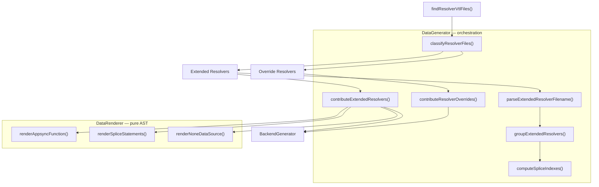

# Design Document: Extended Resolver Migration

## Overview

This design adds support for **extended resolvers** to the gen2-migration `generate` step. Extended resolvers are custom AppSync functions placed at specific slots within pipeline resolvers, identified by VTL files matching `{TypeName}.{fieldName}.{slot}.{order}.{req|res}.vtl`. The implementation follows the existing generator/renderer split: `DataGenerator` handles orchestration (file discovery, grouping, splice index computation, BackendGenerator contributions) and `DataRenderer` handles pure AST construction (AppsyncFunction nodes, splice calls, NoneDataSource declaration).

The feature integrates into the existing resolver flow — `findResolverVtlFiles()` already discovers all `.vtl` files. The new logic classifies each file as either an override resolver or an extended resolver, then generates the appropriate code for each type. Override resolvers continue to work unchanged.

## Architecture

The feature extends two existing components without introducing new layers or files:



**Design rationale:** No new files or layers are introduced. The coding guidelines warn against layers that don't justify their existence. The DataGenerator already owns resolver orchestration and the DataRenderer already owns AST construction — extending both is the natural path. The new functions are small, focused, and testable in isolation.

## Components and Interfaces

### Filename Parsing

A new pure function parses extended resolver filenames and extracts their components:

```typescript
/**
 * Valid pipeline resolver slots in execution order.
 */
const VALID_SLOTS = ['init', 'preAuth', 'auth', 'postAuth', 'preDataLoad', 'postDataLoad', 'preUpdate', 'postUpdate', 'finish'] as const;

type Slot = (typeof VALID_SLOTS)[number];

/**
 * Parsed components of an extended resolver VTL filename.
 */
interface ExtendedResolverDescriptor {
  readonly typeName: string;
  readonly fieldName: string;
  readonly slot: Slot;
  readonly order: number;
  readonly templateType: 'req' | 'res';
  readonly filename: string;
}
```

The parser splits the filename on `.` and checks the segment count: 4 segments before the `.vtl` suffix means an override resolver (`TypeName.fieldName.req.vtl`), 6 segments means an extended resolver (`TypeName.fieldName.slot.order.req.vtl`). Invalid slot values produce a descriptive error identifying the filename and the unrecognized slot.

### Classification

A function classifies a list of VTL filenames into override and extended resolver groups:

```typescript
interface ClassifiedResolvers {
  readonly overrideFiles: readonly string[];
  readonly extendedDescriptors: readonly ExtendedResolverDescriptor[];
}
```

This replaces the current approach where all VTL files are treated as override resolvers. The classification happens once in `plan()`, and the results drive both the override and extended code paths.

### Grouping and Pairing

Extended resolver descriptors are grouped by `(typeName, fieldName)` to identify which pipeline resolver they target, then within each group, sorted by slot order and numeric order. Request and response templates for the same `(typeName, fieldName, slot, order)` are paired into a single function entry:

```typescript
/**
 * A paired extended resolver function with request and/or response templates.
 */
interface ExtendedResolverFunction {
  readonly typeName: string;
  readonly fieldName: string;
  readonly slot: Slot;
  readonly order: number;
  readonly requestFile: string | undefined;
  readonly responseFile: string | undefined;
}

/**
 * Extended resolver functions grouped by pipeline resolver.
 */
interface PipelineResolverGroup {
  readonly typeName: string;
  readonly fieldName: string;
  readonly functions: readonly ExtendedResolverFunction[];
}
```

When a function has only a request template, the response defaults to `$util.toJson($ctx.prev.result)`. When it has only a response template, the request defaults to `$util.toJson({})`.

### Splice Index Computation

Each slot maps to a base index in the default 3-function pipeline:

| Slot         | Base Index | Position                               |
| ------------ | ---------- | -------------------------------------- |
| init         | 0          | Before auth0Function                   |
| preAuth      | 0          | Before auth0Function                   |
| auth         | 1          | After auth0, before postAuth0          |
| postAuth     | 2          | After postAuth0, before DataResolverFn |
| preDataLoad  | 2          | Before DataResolverFn                  |
| postDataLoad | 3          | After DataResolverFn                   |
| preUpdate    | 3          | After DataResolverFn                   |
| postUpdate   | 3          | After DataResolverFn                   |
| finish       | 3          | After DataResolverFn, at end           |

The computation processes functions in pipeline order (by slot, then by order within slot). Each insertion shifts subsequent indexes by 1, so a running offset accumulates as functions are inserted. The splice index for function `i` is `baseIndex(slot) + offset`, where `offset` is the count of functions inserted before position `baseIndex(slot)` in prior iterations.

This logic lives in `DataGenerator` (orchestration), not `DataRenderer` (pure AST). The renderer receives pre-computed splice indexes.

### DataRenderer Extensions

The renderer gains three new methods that accept typed options and return AST nodes:

```typescript
/**
 * Options for rendering extended resolver statements.
 */
interface RenderExtendedResolverOptions {
  readonly functions: readonly {
    readonly typeName: string;
    readonly fieldName: string;
    readonly slot: Slot;
    readonly order: number;
    readonly requestFile: string | undefined;
    readonly responseFile: string | undefined;
    readonly spliceIndex: number;
  }[];
}
```

1. **`renderNoneDataSource()`** — Returns a `const noneDataSource = backend.data.resources.graphqlApi.addNoneDataSource('none')` statement.

2. **`renderAppsyncFunction(fn)`** — Returns a `const` statement creating a `new aws_appsync.AppsyncFunction(...)` with the construct name derived from `{typeName}{fieldName}{slot}{order}`. Uses `MappingTemplate.fromFile(join(resolversDir, filename))` for present templates and `MappingTemplate.fromString(...)` for defaults.

3. **`renderSpliceStatements(typeName, fieldName, functions)`** — Returns statements that:
   - Access the resolver via `backend.data.resources.cfnResources.cfnResolvers['{TypeName}.{fieldName}']`
   - Cast to `CfnResolver` and extract `pipelineConfig.functions`
   - Generate `existingFunctions.splice(index, 0, fn.functionId)` for each function

### BackendGenerator Contributions

When extended resolvers exist, `DataGenerator` contributes to `BackendGenerator`:

- **Imports:** `aws_appsync` from `aws-cdk-lib`, `CfnResolver` from `aws-cdk-lib/aws-appsync`, `join` from `path`
- **Statements:** NoneDataSource declaration, AppsyncFunction declarations, resolver access + splice calls
- **Shared declarations:** `resolversDir` and `__dirname` are reused from the override resolver path when both types coexist

## Data Models

### ExtendedResolverDescriptor

Represents a single parsed VTL file:

| Field        | Type             | Description                       |
| ------------ | ---------------- | --------------------------------- |
| typeName     | `string`         | GraphQL type name (e.g., `Query`) |
| fieldName    | `string`         | Field name (e.g., `listProducts`) |
| slot         | `Slot`           | Pipeline slot (e.g., `postAuth`)  |
| order        | `number`         | Numeric order within the slot     |
| templateType | `'req' \| 'res'` | Request or response template      |
| filename     | `string`         | Original VTL filename             |

### ExtendedResolverFunction

Represents a paired function (req + res templates merged):

| Field        | Type                  | Description                                     |
| ------------ | --------------------- | ----------------------------------------------- |
| typeName     | `string`              | GraphQL type name                               |
| fieldName    | `string`              | Field name                                      |
| slot         | `Slot`                | Pipeline slot                                   |
| order        | `number`              | Numeric order within the slot                   |
| requestFile  | `string \| undefined` | Request VTL filename, or undefined for default  |
| responseFile | `string \| undefined` | Response VTL filename, or undefined for default |

### Slot-to-Base-Index Mapping

A constant `Record<Slot, number>` mapping each slot to its base insertion index in the default pipeline `[auth0Function, postAuth0Function, DataResolverFn]`.

## Correctness Properties

_A property is a characteristic or behavior that should hold true across all valid executions of a system — essentially, a formal statement about what the system should do. Properties serve as the bridge between human-readable specifications and machine-verifiable correctness guarantees._

### Property 1: Filename round-trip

_For any_ valid combination of (typeName, fieldName, slot, order, templateType), constructing an extended resolver filename and then parsing it back SHALL produce the original components.

**Validates: Requirements 1.3, 1.5**

### Property 2: Classification correctness

_For any_ VTL filename, the classifier SHALL categorize it as an extended resolver if and only if it has exactly 6 dot-separated segments (TypeName.fieldName.slot.order.templateType.vtl), and as an override resolver if and only if it has exactly 4 dot-separated segments (TypeName.fieldName.templateType.vtl).

**Validates: Requirements 1.1, 1.2**

### Property 3: Invalid slot rejection

_For any_ string that is not a member of the valid slots set, constructing a filename with that string as the slot and parsing it SHALL produce an error that contains both the filename and the invalid slot value.

**Validates: Requirements 1.4**

### Property 4: Grouping and sorting invariant

_For any_ set of extended resolver descriptors, after grouping by (typeName, fieldName) and sorting within each group, every group SHALL contain only descriptors with matching typeName and fieldName, and within each slot the descriptors SHALL be in ascending order by their numeric order value.

**Validates: Requirements 2.1, 2.2**

### Property 5: Template pairing completeness

_For any_ set of extended resolver descriptors, after pairing request and response templates, every resulting ExtendedResolverFunction SHALL have a non-undefined value for both requestFile and responseFile (where the value may be the original filename or a default string), and descriptors sharing the same (typeName, fieldName, slot, order) SHALL be merged into exactly one function entry.

**Validates: Requirements 2.3, 2.4**

### Property 6: NoneDataSource conditional uniqueness

_For any_ set of resolver files, the number of NoneDataSource declarations in the generated output SHALL equal 1 if at least one extended resolver exists, and 0 otherwise.

**Validates: Requirements 3.1, 3.2, 3.3**

### Property 7: Template loading correctness

_For any_ ExtendedResolverFunction, the generated AppsyncFunction SHALL use `MappingTemplate.fromFile()` for templates where a VTL file exists, and `MappingTemplate.fromString()` with the correct default for templates where no VTL file exists.

**Validates: Requirements 4.1, 4.2, 4.3**

### Property 8: Unique construct names

_For any_ set of ExtendedResolverFunctions, all generated AppsyncFunction construct names SHALL be unique, and each name SHALL contain the typeName, fieldName, slot, and order of its source function.

**Validates: Requirements 4.5**

### Property 9: Pipeline order preservation

_For any_ set of extended resolver functions targeting the same pipeline resolver, after simulating all splice operations on the default pipeline `[auth0, postAuth0, DataResolverFn]`, the three default functions SHALL remain in their original relative order, and each extended resolver function SHALL appear at a position consistent with its slot.

**Validates: Requirements 5.2, 5.4**

### Property 10: Splice statement ordering

_For any_ set of extended resolver functions targeting the same pipeline resolver, the generated splice statements SHALL be ordered by splice index (ascending), and there SHALL be exactly one splice statement per function.

**Validates: Requirements 6.1, 6.2**

### Property 11: Override and extended resolver coexistence

_For any_ set of VTL files containing both override and extended resolver files for the same (typeName, fieldName), the generated output SHALL contain both override resolver code (S3 template location overrides) and extended resolver code (AppsyncFunction + splice), and when only one type is present, only that type's code SHALL be generated.

**Validates: Requirements 7.1, 7.3**

## Error Handling

| Condition                                                  | Behavior                                                                                                                                                                |
| ---------------------------------------------------------- | ----------------------------------------------------------------------------------------------------------------------------------------------------------------------- |
| Unrecognized slot in filename                              | Throw with message identifying the filename and invalid slot value. List valid slots in the error message.                                                              |
| Non-numeric order in filename                              | Throw with message identifying the filename and the non-numeric order value.                                                                                            |
| Duplicate (typeName, fieldName, slot, order, templateType) | Throw with message identifying the conflicting filenames. Two files cannot provide the same template for the same function.                                             |
| No VTL files at all                                        | No extended resolver code generated. No override resolver code generated. Existing behavior preserved.                                                                  |
| Extended resolvers only (no overrides)                     | Extended resolver code generated. Override resolver loop not generated. `resolversDir` and `__dirname` still declared (needed by extended resolver `fromFile()` calls). |

Errors are thrown during `plan()` (at classification/parsing time), not during `execute()`. This follows the existing pattern where `plan()` validates inputs and `execute()` performs side effects.

## Testing Strategy

### Unit Tests (Jest, example-based)

Unit tests follow the existing patterns in `data.generator.test.ts` and `data.renderer.test.ts`:

**DataGenerator tests** (mock DataRenderer, verify orchestration):

- Classification of mixed VTL file sets (override + extended)
- Correct BackendGenerator contributions (imports, statements) when extended resolvers exist
- No extended resolver contributions when only override resolvers exist
- Error cases: invalid slot, non-numeric order, duplicate templates
- Copy operation includes both override and extended VTL files

**DataRenderer tests** (pure AST → snapshot comparison):

- `renderNoneDataSource()` output matches expected code
- `renderAppsyncFunction()` with both templates, request-only, response-only
- `renderSpliceStatements()` for single and multiple functions
- Inline snapshots verify exact generated TypeScript code

### Property-Based Tests (fast-check)

Property-based tests use `fast-check` (already a project dependency) with a minimum of 100 iterations per property. Each test references its design document property.

**Parsing properties (Properties 1–3):**

- Generators produce random valid (typeName, fieldName, slot, order, templateType) tuples
- Round-trip: construct filename → parse → verify components match
- Classification: generate random filenames of both types → verify correct classification
- Invalid slots: generate random non-slot strings → verify error thrown

**Grouping properties (Properties 4–5):**

- Generators produce random sets of ExtendedResolverDescriptor
- Verify grouping invariant and sort order
- Verify template pairing completeness

**Splice index properties (Properties 9–10):**

- Generators produce random sets of (slot, order) pairs
- Simulate splice operations on `[auth0, postAuth0, DataResolverFn]`
- Verify default function order preserved
- Verify splice statement ordering

**Tag format:** `Feature: extended-resolver-migration, Property {N}: {title}`

### Snapshot Tests

The existing E2E snapshot infrastructure (`amplify-migration-apps/`) will be extended with a test app that includes extended resolver VTL files. This validates the full pipeline from file discovery through code generation. Snapshot updates happen after E2E runs with `UPDATE_SNAPSHOTS=1`.
