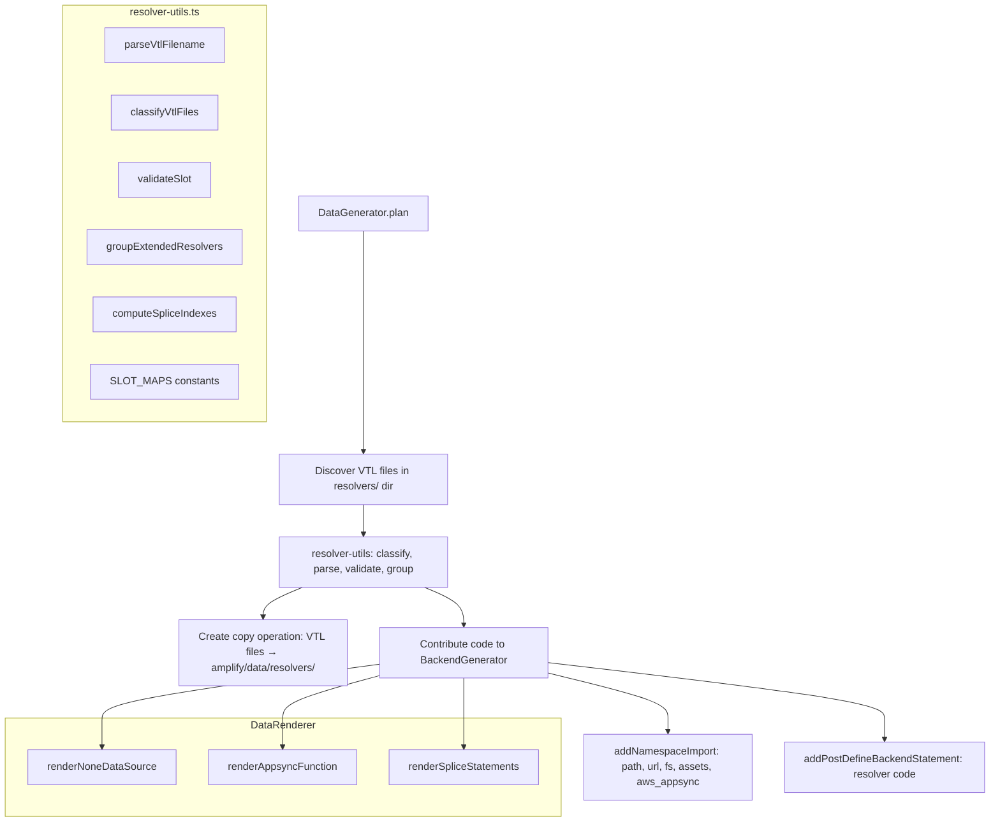

# Design Document: Override & Extended Resolvers

## Overview

This feature adds support for migrating Gen1 custom AppSync VTL resolver files to Gen2 CDK code during the `gen2-migration generate` step. Gen1 users customize resolvers in two ways:

1. **Override resolvers** — 4-segment VTL filenames (e.g., `Mutation.createTodo.req.vtl`) that replace the default `DataResolverFn` mapping template.
2. **Extended resolvers** — 6-segment VTL filenames (e.g., `Mutation.createBoard.init.2.req.vtl`) that add new pipeline functions at specific slots in the resolver pipeline.

The migration tool must discover these files, classify them, copy them to the Gen2 output, and generate the appropriate TypeScript code in `backend.ts` that uses CDK escape hatches and constructs to reproduce the Gen1 behavior.

### Design Rationale

The resolver code must live in `backend.ts` (not `data/resource.ts`) because it references `backend.data.resources.cfnResources` which is only available after `defineBackend()` runs. This aligns with the existing `addPostDefineBackendStatement()` API on `BackendGenerator`.

All pure logic — slot mapping constants, filename parsing, classification, grouping, and splice index computation — is extracted into a standalone `resolver-utils.ts` module with no dependencies on the generator/renderer infrastructure. This makes the core logic independently testable with property-based tests.

## Architecture



### Data Flow

1. `DataGenerator.plan()` reads the Gen1 `resolvers/` directory for `.vtl` files.
2. `resolver-utils.classifyVtlFiles()` splits files into override (4-segment) and extended (6-segment) lists, parsing and validating each.
3. For **overrides**: `DataGenerator` contributes a for-of loop to `backend.ts` that iterates override files, creates CDK Assets, and assigns `s3ObjectUrl` to the appropriate mapping template property on the `CfnFunctionConfiguration`.
4. For **extended resolvers**: `resolver-utils.groupExtendedResolvers()` groups by `typeName.fieldName`, pairs request/response templates, and `computeSpliceIndexes()` determines insertion positions. `DataRenderer` renders the `NoneDataSource`, `AppsyncFunction` constructs, and splice statements as TypeScript AST nodes. `DataGenerator` contributes these as post-define-backend statements.
5. A separate operation copies all VTL files to `amplify/data/resolvers/`.

## Components and Interfaces

### 1. `resolver-utils.ts` (NEW)

Pure utility module with no dependencies on generator/renderer infrastructure.

```typescript
/** Slot names valid for each operation type. */
export const QUERY_SLOTS: readonly string[];
export const MUTATION_SLOTS: readonly string[];
export const SUBSCRIPTION_SLOTS: readonly string[];
export const ALL_SLOTS: readonly string[];

/** Maps each slot to its base pipeline index for 3-function and 4-function pipelines. */
export const PIPELINE_3_SLOT_MAP: Readonly<Record<string, number>>;
export const PIPELINE_4_SLOT_MAP: Readonly<Record<string, number>>;

/** Parsed representation of a VTL filename. */
export interface ParsedOverride {
  readonly kind: 'override';
  readonly typeName: string;
  readonly fieldName: string;
  readonly templateType: 'req' | 'res';
  readonly filename: string;
}

export interface ParsedExtended {
  readonly kind: 'extended';
  readonly typeName: string;
  readonly fieldName: string;
  readonly slot: string;
  readonly order: number;
  readonly templateType: 'req' | 'res';
  readonly filename: string;
}

export type ParsedVtl = ParsedOverride | ParsedExtended;

/** Classification result. */
export interface ClassifiedVtlFiles {
  readonly overrides: readonly ParsedOverride[];
  readonly extended: readonly ParsedExtended[];
}

/** A grouped extended resolver pair (req + res for same slot/order). */
export interface ExtendedResolverGroup {
  readonly typeName: string;
  readonly fieldName: string;
  readonly slot: string;
  readonly order: number;
  readonly reqFile?: string;
  readonly resFile?: string;
}

/** A splice operation to insert a function at a pipeline index. */
export interface SpliceEntry {
  readonly group: ExtendedResolverGroup;
  readonly spliceIndex: number;
}

/** Pipeline splice result for a single typeName.fieldName. */
export interface PipelineSpliceResult {
  readonly typeName: string;
  readonly fieldName: string;
  readonly entries: readonly SpliceEntry[];
}

/** Parse a single VTL filename. Returns undefined for unrecognized formats. */
export function parseVtlFilename(filename: string): ParsedVtl | undefined;

/** Classify an array of VTL filenames into overrides and extended. Validates and throws on errors. */
export function classifyVtlFiles(filenames: string[]): ClassifiedVtlFiles;

/** Validate that a slot is valid for the given typeName. Throws on invalid slot. */
export function validateSlot(typeName: string, slot: string, filename: string): void;

/** Group extended resolvers by typeName.fieldName, pair req/res, sort by pipeline order then numeric order. */
export function groupExtendedResolvers(extended: readonly ParsedExtended[]): Map<string, ExtendedResolverGroup[]>;

/** Compute splice indexes for a set of grouped extended resolvers for a single field. */
export function computeSpliceIndexes(typeName: string, fieldName: string, groups: readonly ExtendedResolverGroup[]): PipelineSpliceResult;
```

**Key behaviors:**

- `parseVtlFilename`: Splits on `.`, checks segment count (4 → override, 6 → extended), returns `undefined` for other counts.
- `classifyVtlFiles`: Iterates filenames, calls `parseVtlFilename`, validates slots, checks for duplicates (same typeName+fieldName+slot+order+templateType), throws descriptive errors.
- `validateSlot`: Looks up valid slots by typeName (`Query` → `QUERY_SLOTS`, `Mutation` → `MUTATION_SLOTS`, `Subscription` → `SUBSCRIPTION_SLOTS`, other → `ALL_SLOTS`). Throws with the invalid slot name and valid list.
- `groupExtendedResolvers`: Groups by `${typeName}.${fieldName}`, within each group sorts by slot pipeline execution order then by numeric order, pairs req/res files for the same slot+order.
- `computeSpliceIndexes`: Selects the 3-function or 4-function pipeline map based on typeName/fieldName, then for each group computes `baseIndex[slot] + runningOffset`, incrementing `runningOffset` after each insertion.

### 2. `DataGenerator` Extensions

The existing `DataGenerator.plan()` method is extended to:

1. **Discover VTL files**: Read the `resolvers/` directory from the Gen1 cloud backend. If the directory doesn't exist or has no `.vtl` files, skip all resolver logic.
2. **Classify**: Call `classifyVtlFiles()` to get overrides and extended lists.
3. **Create copy operation**: Add a new `AmplifyMigrationOperation` that copies all VTL files to `amplify/data/resolvers/`.
4. **Contribute imports**: Add necessary imports to `BackendGenerator` (`path`, `url`, `fs`, `assets`, `aws_appsync`, `CfnResolver`).
5. **Contribute common declarations**: Add `__dirname` and `resolversDir` declarations via `addPostDefineBackendStatement()`.
6. **Contribute override code**: Generate the `resolverFiles` filter and for-of loop as post-define-backend statements.
7. **Contribute extended code**: Generate `noneDataSource`, `AppsyncFunction` constructs, and splice statements as post-define-backend statements.
8. **Ensure escape hatches**: Register the `applyEscapeHatches` call if not already registered (for cases where resolvers are the only reason escape hatches are needed).

### 3. `DataRenderer` Extensions

New methods on `DataRenderer` for rendering TypeScript AST nodes:

```typescript
/** Renders: const noneDataSource = backend.data.resources.graphqlApi.addNoneDataSource("none"); */
public renderNoneDataSource(): ts.Statement;

/** Renders an AppsyncFunction construct with MappingTemplate.fromFile() or fromString(). */
public renderAppsyncFunction(group: ExtendedResolverGroup, noneDataSourceVar: string): ts.Statement;

/** Renders splice statements and pipelineConfig reassignment for a pipeline. */
public renderSpliceStatements(spliceResult: PipelineSpliceResult): ts.Statement[];
```

These methods produce TypeScript AST nodes that `DataGenerator` serializes to strings and contributes to `BackendGenerator` via `addPostDefineBackendStatement()`.

### 4. `BackendGenerator` (No Changes)

The existing `BackendGenerator` API is sufficient. The feature uses:

- `addNamespaceImport()` for `assets` and `aws_appsync` namespace imports
- `addPostDefineBackendStatement()` for all resolver code (declarations, loops, constructs, splices)

No new methods are needed on `BackendGenerator`.

## Data Models

### VTL Filename Formats

**Override (4 segments):**

```
TypeName.fieldName.templateType.vtl
```

Example: `Mutation.createTodo.req.vtl`

**Extended (6 segments):**

```
TypeName.fieldName.slot.order.templateType.vtl
```

Example: `Mutation.createBoard.init.2.req.vtl`

### Slot Constants

**Query slots** (3-function pipeline: `auth0`, `postAuth0`, `DataResolverFn`):

- `init` → index 0 (before auth0)
- `preAuth` → index 0 (before auth0)
- `auth` → index 1 (after auth0)
- `postAuth` → index 2 (after postAuth0)
- `preDataLoad` → index 2 (after postAuth0)
- `postDataLoad` → index 3 (after DataResolverFn)
- `finish` → index 3 (after DataResolverFn)

**Mutation slots** (4-function pipeline: `init0`, `auth0`, `postAuth0`, `DataResolverFn`):

- `init` → index 1 (after init0)
- `preAuth` → index 1 (after init0)
- `auth` → index 2 (after auth0)
- `postAuth` → index 3 (after postAuth0)
- `preUpdate` → index 3 (after postAuth0)
- `postUpdate` → index 4 (after DataResolverFn)
- `finish` → index 4 (after DataResolverFn)

**Subscription slots** (3-function pipeline):

- `init` → index 0
- `preAuth` → index 0
- `auth` → index 1
- `postAuth` → index 2
- `preSubscribe` → index 2

**Delete mutations** use the 3-function pipeline (same as Query).

### Pipeline Shape Selection

```
if typeName is "Query" or "Subscription" or (typeName is "Mutation" and fieldName starts with "delete"):
    use 3-function pipeline (PIPELINE_3_SLOT_MAP)
else if typeName is "Mutation":
    use 4-function pipeline (PIPELINE_4_SLOT_MAP)
else:
    use 4-function pipeline (PIPELINE_4_SLOT_MAP) with ALL_SLOTS validation
```

### Splice Index Computation

For each `typeName.fieldName` group, sorted by pipeline execution order:

```
runningOffset = 0
for each group in sorted order:
    spliceIndex = baseSlotMap[group.slot] + runningOffset
    runningOffset += 1
```

The `runningOffset` accounts for previously inserted functions shifting subsequent indexes.

## Correctness Properties

_A property is a characteristic or behavior that should hold true across all valid executions of a system — essentially, a formal statement about what the system should do. Properties serve as the bridge between human-readable specifications and machine-verifiable correctness guarantees._

The core logic in `resolver-utils.ts` is pure and well-suited for property-based testing. The functions take structured inputs and produce deterministic outputs with clear invariants. The generator/renderer integration is better tested with example-based snapshot tests.

### Property 1: VTL Filename Classification

_For any_ VTL filename, `parseVtlFilename` SHALL return `kind: 'override'` when the filename has exactly 4 dot-separated segments, `kind: 'extended'` when it has exactly 6 dot-separated segments, and `undefined` when it has any other segment count.

**Validates: Requirements 2.1, 2.2, 2.3**

### Property 2: Extended Resolver Parse Round-Trip

_For any_ valid combination of (typeName, fieldName, slot, order, templateType), constructing the filename as `${typeName}.${fieldName}.${slot}.${order}.${templateType}.vtl` and parsing it with `parseVtlFilename` SHALL produce a `ParsedExtended` object whose `typeName`, `fieldName`, `slot`, `order`, and `templateType` fields match the original components.

**Validates: Requirements 2.4**

### Property 3: Slot Validation Correctness

_For any_ typeName and slot string, `validateSlot` SHALL accept the slot without throwing if and only if the slot is in the valid set for that typeName (`QUERY_SLOTS` for Query, `MUTATION_SLOTS` for Mutation, `SUBSCRIPTION_SLOTS` for Subscription, `ALL_SLOTS` for any other typeName).

**Validates: Requirements 2.5, 3.1, 3.2, 3.3, 3.4**

### Property 4: Non-Numeric Order Rejection

_For any_ 6-segment VTL filename where the order segment (4th segment) is not a valid non-negative integer string, `classifyVtlFiles` SHALL throw a descriptive error.

**Validates: Requirements 2.6**

### Property 5: Extended Resolver Grouping Invariants

_For any_ set of valid `ParsedExtended` entries, `groupExtendedResolvers` SHALL produce groups where: (a) all entries in a group share the same `typeName` and `fieldName`, (b) entries within each group are sorted by slot pipeline execution order then by numeric order, and (c) each group has at most one `reqFile` and one `resFile`.

**Validates: Requirements 7.7**

### Property 6: Splice Index Computation

_For any_ typeName, fieldName, and non-empty list of `ExtendedResolverGroup` entries (sorted by pipeline order), `computeSpliceIndexes` SHALL produce splice indexes where each entry's `spliceIndex` equals the base slot index from the correct pipeline map (3-function for Query/Subscription/delete-Mutation, 4-function for other Mutations) plus the count of entries that precede it in the result list.

**Validates: Requirements 8.1, 8.2, 8.3**

## Error Handling

### Classification Errors

| Error Condition                                                               | Behavior                                                                                            |
| ----------------------------------------------------------------------------- | --------------------------------------------------------------------------------------------------- |
| Invalid slot for typeName                                                     | Throw with message naming the invalid slot, the filename, and listing valid slots for that typeName |
| Non-numeric order segment                                                     | Throw with message naming the filename and the invalid order value                                  |
| Duplicate extended resolver (same typeName+fieldName+slot+order+templateType) | Throw with message naming both filenames                                                            |

### Discovery Errors

| Error Condition                         | Behavior                                             |
| --------------------------------------- | ---------------------------------------------------- |
| Resolvers directory does not exist      | Treat as empty list, proceed normally                |
| Resolvers directory has no `.vtl` files | Treat as empty list, proceed normally                |
| File read error during copy             | Propagate the filesystem error (no special handling) |

### Pipeline Errors

| Error Condition                    | Behavior                                                                 |
| ---------------------------------- | ------------------------------------------------------------------------ |
| Unknown slot in splice computation | Should not occur if validation ran first; defensive throw if encountered |

## Testing Strategy

### Property-Based Tests (`resolver-utils.test.ts`)

The pure functions in `resolver-utils.ts` are the primary target for property-based testing. Use [fast-check](https://github.com/dubzzz/fast-check) as the PBT library (already available in the project's test infrastructure).

**Configuration:**

- Minimum 100 iterations per property test
- Each test tagged with: `Feature: override-extended-resolvers, Property {N}: {title}`

**Properties to implement:**

1. VTL Filename Classification (Property 1)
2. Extended Resolver Parse Round-Trip (Property 2)
3. Slot Validation Correctness (Property 3)
4. Non-Numeric Order Rejection (Property 4)
5. Extended Resolver Grouping Invariants (Property 5)
6. Splice Index Computation (Property 6)

**Custom generators needed:**

- Valid typeName generator (alphabetic strings starting with uppercase)
- Valid fieldName generator (alphabetic strings starting with lowercase)
- Valid slot generator (drawn from known slot constants)
- Valid order generator (non-negative integers)
- Template type generator (`'req'` | `'res'`)
- Segment count generator (integers excluding 4 and 6 for the "ignored" case)

### Unit Tests (`data.generator.test.ts`)

Example-based tests for the `DataGenerator` integration:

1. **No resolvers directory** — verify no resolver operations are created
2. **Empty resolvers directory** — verify no resolver operations are created
3. **Override resolvers only** — verify:
   - VTL files are copied to `amplify/data/resolvers/`
   - Correct imports contributed (`fs`, `assets`, `path`, `url`)
   - Override loop code contributed as post-define-backend statements
   - `applyEscapeHatches` call registered
4. **Extended resolvers only** — verify:
   - VTL files are copied
   - Correct imports contributed (`aws_appsync`, `CfnResolver`)
   - `noneDataSource` declaration generated
   - `AppsyncFunction` constructs generated
   - Splice statements generated
5. **Mixed override and extended** — verify both code paths execute
6. **Extended resolver with only req file** — verify passthrough response template
7. **Extended resolver with only res file** — verify passthrough request template

### Snapshot Tests

The existing snapshot test infrastructure (`generate.test.ts`) will validate the complete output for migration apps that include custom resolvers. A new or modified migration app with VTL resolver files will produce a `_snapshot.post.generate/` that includes:

- `amplify/data/resolvers/*.vtl` files
- `amplify/backend.ts` with resolver code blocks
