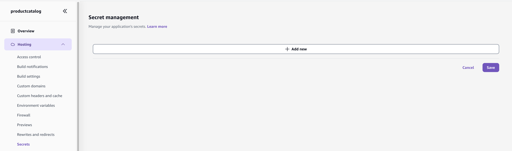
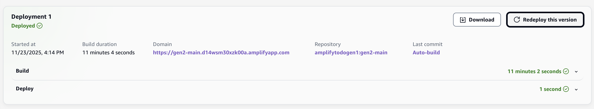

# Amplify Gen1 → Gen2 Migration Guide (Alpha)

Following document describes how to migrate your Gen1 environment to a new Gen2 application.

> [!CAUTION]
> The tools presented here are in early stages of development and **SHOULD NOT** be executed on 
> any production or mission critical environments.

## Overall Approach

Migration to Gen2 is done in a (partial) blue/green deployment approach.

1. Amplify CLI will code-generate the neccessary Gen2 definition files based on your deployed Gen1 environment.
2. These new files will be pushed to a new branch and deployed via the hosting service.
3. Amplify CLI will refactor your underlying CloudFormation stacks such that any Gen1 stateful resource (e.g `UserPool`) 
will be reused and managed by the new Gen2 deployment.

After completing this process you will have 2 functionally equivalent amplify applications that access the same data.

## Prerequisites 

- Your frontend code is located within the same repository as your backend application.
- Your Gen1 environment is deployed via the hosting service.
- You have a `default` AWS profile configured with an `AdministratorAccess` policy.

## Assumptions

These are a set of assumption the guide makes in order to provide more readable instructions. You should be 
able to adapt them to fit your setup.

- Your Gen1 environment is stored in the `main` branch of a `GitHub` repository.
- Your Gen1 environment is called `main`.

## Step By Step

> **Before you begin, determine if your app can be migrated by reviewing:**
>
> - [Feature Coverage](#feature-coverage)
> - [Limitations](#limitations)

First obtain a fresh and up-to-date local copy of your Amplify Gen1 environment and run the following:

```bash
npm install --no-save @aws-amplify/cli-internal-gen2-migration-alpha
```

This will install a flavor of the amplify Gen1 CLI that includes migration support.

> [!NOTE]  
> Migration is still in early development stages and is therefore versioned with a `0.x` and is not yet 
> integrated into the standard Gen1 CLI. 

### 1. Lock

During the migration period your Gen1 environment should not undergo any changes; otherwise we run 
the risk of code-generating an incomplete application and possibly encountering unexpected migration failures.

To ensure this, run the following:

```bash
npx amplify gen2-migration lock
```

This command will first perform a few validations to ensure your Gen1 environment is in a 
healthy state and proceed to lock your Gen1 environment by attaching a restrictive stack policy on the root stack. 

> [!TIP]
> It is also advisable to disable any automatic pipelines that deploy to your Gen1 environment.

### 2. Generate

Next, generate your Gen2 definition files by running the following:

```bash
git checkout -b gen2-main
npx amplify gen2-migration generate
```

This command will override your local `./amplify` directory with Gen2 definition files. Once successfull, 
perform the following manual edits:

**In `./src/main.tsx` (or equivalent):**

```diff
- import amplifyconfig from './amplifyconfiguration.json';
+ import amplifyconfig from '../amplify_outputs.json';
```

This is required because in Gen2 amplify generates an `amplify_outputs.json` file instead of the `amplifyconfiguration.json` file. 
Note that client side libraries support both files so no additional change is needed.

**In `./amplify/data/resource.ts`:**

```diff
- branchName: "main"
+ branchName: "gen2-main"
```

This is required in order to instruct the hosting service that DynamoDB tables 
should be reused (imported) instead of recreated.

#### 2.1 Post Generate | NodeJS Function ESM Compatibility

If you have a NodeJS Lambda function in your app, you need to port your code 
to ESM instead of CommonsJS. For example:

```diff
- exports.handler = async (event) => {
+ export async function handler(event) {
```

This is required because Gen2 adds lambda shims that conflict with CommonJS syntax. 
Otherwise, you will see the following error when invoking the function: 
_"Cannot determine intended module format because both require() and top-level await are present"_


> See [ESM/CJS Interoperability](https://www.typescriptlang.org/docs/handbook/modules/appendices/esm-cjs-interop.html)

#### 2.2 Post Generate | Api Function Access

If your function needs to access the AppSync API you need to explicitly provide it with the appropriate 
environment variables and give it the necessary permissions.

**Edit in `./amplify/backend.ts`:**

```diff
- import { Duration } from "aws-cdk-lib";
+ import { Duration, aws_iam } from "aws-cdk-lib";
```

```diff
+ backend.<function-friendly-name>.addEnvironment('API_PRODUCTCATALOG_GRAPHQLAPIKEYOUTPUT', backend.data.apiKey!)
+ backend.<function-friendly-name>.addEnvironment('API_PRODUCTCATALOG_GRAPHQLAPIENDPOINTOUTPUT', backend.data.graphqlUrl)
+ backend.<function-friendly-name>.addEnvironment('API_PRODUCTCATALOG_GRAPHQLAPIIDOUTPUT', backend.data.apiId)

+ backend.<function-friendly-name>.resources.lambda.addToRolePolicy(new aws_iam.PolicyStatement({
+     effect: aws_iam.Effect.ALLOW,
+     actions: ['appsync:GraphQL'],
+     resources: [`arn:aws:appsync:${backend.data.stack.region}:${backend.data.stack.account}:apis/${backend.data.apiId}/types/Query/*`]
+ }))
```

If your function accesses AppSync using IAM credentials, you also need to add:

```diff
+ backend.auth.resources.authenticatedUserIamRole.addToPrincipalPolicy(new aws_iam.PolicyStatement({
+     effect: aws_iam.Effect.ALLOW,
+     actions: ['appsync:GraphQL'],
+     resources: [`arn:aws:appsync:${backend.data.stack.region}:${backend.data.stack.account}:apis/<gen1-appsync-api-id>/*`]
+ }))
```

Navigate to the Amplify Console to find the `<gen1-appsync-api-id>` On the AppSync AWS Console. For example:


This is required in order for your Gen1 environment to keep functioning correctly after the `refactor` step.

> See [GraphQL types protected with the IAM provider](#graphql-types-protected-by-the-iam-auth-provider) for more details.

#### 2.3 Post Generate | Function Secrets

If your function was configured with a secret value, you must first recreate the secret using the amplify console.

_Hosting → Secrets → Manage Secrets → Add new_



Next, pass this secret in the function definition. For example, for a secret called `MY_SECRET`, 
**Edit in `./amplify/backend/<function-name>/resource.ts:**:

```diff
- import { defineFunction } from "@aws-amplify/backend";
+ import { defineFunction, secret } from "@aws-amplify/backend";

- MY_SECRET: "/amplify/<hash>/main/AMPLIFY_<function-name>_MY_SECRET"
+ MY_SECRET: secret("/amplify/<hash>/main/AMPLIFY_<function-name>_MY_SECRET")
```

**Then, in your function code, use `process.MY_SECRET` to obtain the secret value.**

> See [Secrets](https://docs.amplify.aws/react/build-a-backend/functions/environment-variables-and-secrets/#secrets) 
> for more information.

### 3. Deploy

To deploy the generated Gen2 application first push the code:

```bash
git add .
git commit -m "feat: migrate to gen2"
git push origin gen2-main
```

Next, login to the AWS Amplify console and connect your new branch to the existing application:

_App Settings → Branch Settings → Add Branch_


Once added the hosting service will start deploying this branch. Wait for it to complete.


Once completed you can login to your app via the newly dedicated amplify domain. At this point, 
the application has access only to the DynamoDB data from your Gen1 environment. **It does not 
however reuse other stateful resources such as user pools.** To grant it access to all 
stateful resources, a `refactor` is required.

### 4. Refactor

Refactoring is the process of updating the underlying CloudFormation stacks of both your Gen1 and 
Gen2 applications such that all stateful resources are reused across both apps. In order to refactor, 
we first need to find the name of the Gen2 root CloudFormation stack:

1. Login to the AWS CloudFormation console.
2. Find a root stack that has the following name pattern: `amplify-<appId>-gen2main-branch-<suffix>`


Then, run the following:

```bash
git checkout main
npx amplify gen2-migration refactor --to <gen2-root-stack-name>
```

Once the command succeeds, login to the AWS Amplify console and redeploy the Gen2 branch:



This is required in order to regenerate the `amplify_outputs.json` file that corresponds to the stack 
architecture that was updated during `refactor`.

#### 4.1 Post Refactor | S3 Storage

If your application contains an S3 bucket as part of the storage category, edit in `./amplify/backend.ts`:

```diff
- // s3Bucket.bucketName = '...';
+ s3Bucket.bucketName = '...';
```

> This is required in order to sync your local bucket name with the deployed template. 
Otherwise, pushing changes to the `gen2-main` branch will result in a bucket replacement.

And push the changes:

```console
git add .
git commit -m "fix: reuse gen1 storage bucket"
git push origin gen2-main
```

Wait for the deployment to finish successfully.

# Feature Coverage

Following provides an overview of the supported (and unsupported) features for migration.

> **Legend**
>
> - ❌ Unsupported
> - ✅ Fully automated
> - ⚠️ Requires manual code (provided by this guide)

## Auth

### `amplify add auth`

- ➤ **Default Configuration**

  - ❌ Username
  - ✅ Email
  - ❌ Phone Number
  - ❌ Email or Phone Number

- ❌ **Default configuration with Social Provider (Federation)**

- ❌ **Manual configuration**

## Api

### `amplify add api`

- ➤ **GraphQL**

  - ➤ **Default Authorization Type**

    - ✅ API Key
    - ❌ Amazon Cognito User Pool
    - ✅ IAM
    - ❌ OpenID Connect
    - ❌ Lambda

  - ➤ **Additional Authorization Type**

    - ✅ API Key
    - ✅ Amazon Cognito User Pool
    - ❌ OpenID Connect
    - ❌ Lambda

- ❌ **REST**

### GraphQL Schema

### Custom Resolvers

## Storage

### `amplify add storage`

- ➤ **Content (Images, audio, video, etc.)**

  - ➤ **Who should have access**

    - ➤ Auth and guest users

      - **What kind of access do you want for Authenticated users?**

        - ✅ create/update
        - ✅ read
        - ✅ delete

      - **What kind of access do you want for Guest users?**

        - ❌ create/update
        - ✅ read
        - ❌ delete

    - ➤ Auth users only

      - **What kind of access do you want for Authenticated users?**

        - ✅ create/update
        - ✅ read
        - ✅ delete

  - ✅ **Do you want to add a Lambda Trigger for your S3 Bucket?**

## Function

### `amplify add function`

- ➤ **Lambda function (serverless function)**

  - ➤ Runtime

    - ❌ .NET 8
    - ❌ Go
    - ❌ Java
    - ✅ NodeJS
    - ❌ Python

  - ➤ **Advanced Settings**

    - ➤ **Select the categories you want this function to have access to**

      - ➤ api

        - ➤ **Select the operations you want to permit**

          - ⚠️ Query
          - ⚠️ Mutation
          - ❌ Subscription

      - ❌ auth

      - ❌ function

      - ❌ storage

    - ❌ **Do you want to invoke this function on a recurring schedule**
    - ❌ **Do you want to enable Lambda layers for this function**
    - ✅ **Do you want to configure environment variables for this function**
    - ⚠️ **Do you want to configure secret values this function can access**
    - ➤ **Choose the package manager that you want to use**

      - ✅ NPM
      - ❌ Yarn
      - ❌ PNPM
      - ❌ Custom Build Command or Script Path

- ❌ **Lambda layer (shared code & resource used across functions)**

### Lambda Handler Code

## Custom 

### `amplify add custom`

## Overrides 

### `amplify override <category>`

## Limitations

### GraphQL types without an `@auth` directive

```graphql
type Todo @model {
  id: ID!
  name: String!
  description: String
}
```

In Gen1, types like these are considered _public_ and are assigned the `@aws_api_key` directive when transformed into an 
AppSync compatible schema. In Gen2, they are considered _private_ and are assinged the `@aws_iam` directive.

In order to preserve the same protections after migration, you must explicitly allow public access on 
the type by adding the `@auth` directive:

```graphql
type Todo @model @auth(rules: [{ allow: public }]) {
  id: ID!
  name: String!
  description: String
}
```

The same behavior applies to **non** `@model` types as well. For such types however, `@auth` cannot be 
applied on the type itself and therefore must be applied to each field. For example:

```graphql
type FunctionResponse {
  fieldA: String! @auth(rules: [{ allow: public }])
  fieldB: String! @auth(rules: [{ allow: public }])
}

type Query {
  invokeFunction: FunctionResponse @function(name: "myfunction-${env}") @auth(rules: [{ allow: public }])
}
```

### GraphQL types protected by the `iam` auth provider

```graphql
type Todo @model @auth(rules: [{ allow: private, provider: iam }]) {
  id: ID!
  name: String!
  description: String
}
```

Clients access such models using the `AuthRole` configured on the identity pool. 
After the refactor operation, the role is updated to point to the Gen2 role, which doesn't 
allow access to the Gen1 AppSync API. This means that after refactor your **Gen1** environment will 
loose IAM access to the API (but **Gen2** will work correctly).

To workaround this issue, you must pre allow the Gen2 `AuthRole` by [configuring a custom admin role](https://docs.amplify.aws/gen1/javascript/build-a-backend/graphqlapi/customize-authorization-rules/#use-iam-authorization-within-the-appsync-console) on the Gen1 API.

`+ ./amplify/backend/api/<api-name>/custom-roles.json`

```json
{
  "adminRoleNames": [ "amplify-${appId}" ]
}
```

> Where `${appId}` should be replaced with the value of the Gen1 applicaion id. This role name follows 
> the Gen2 `AuthRole` naming pattern and therefore allows access to **any** Gen2 environment (branch).

Once added, redeploy the app by running `amplify push`.
