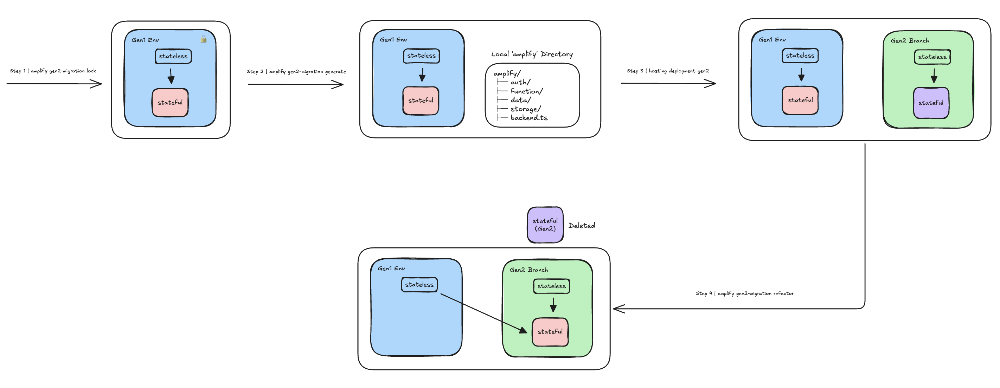
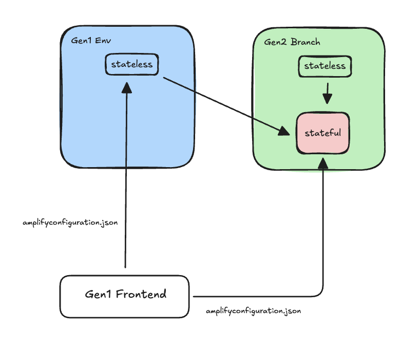
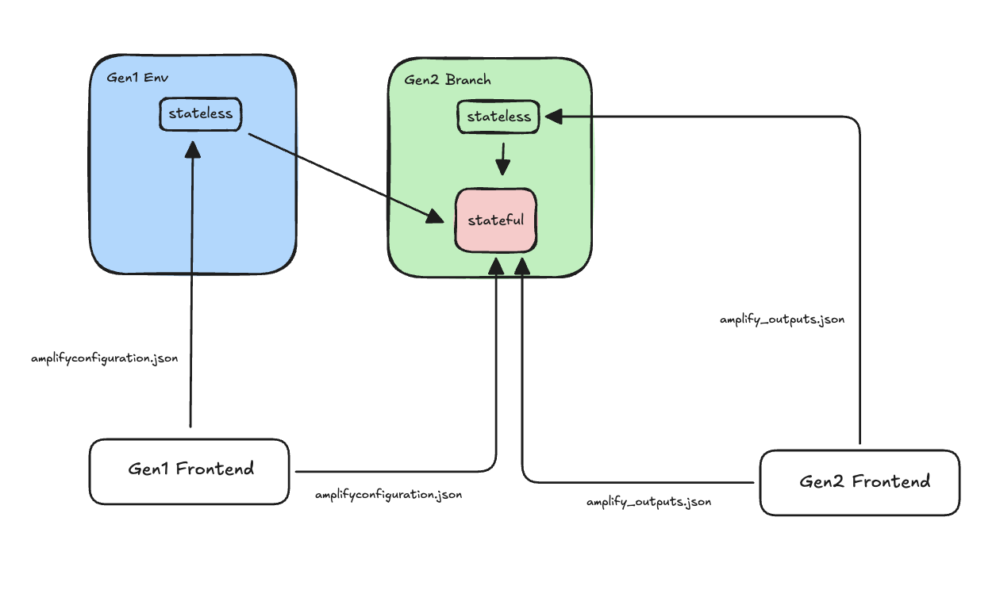
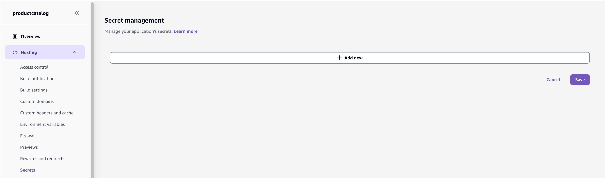
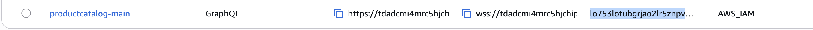
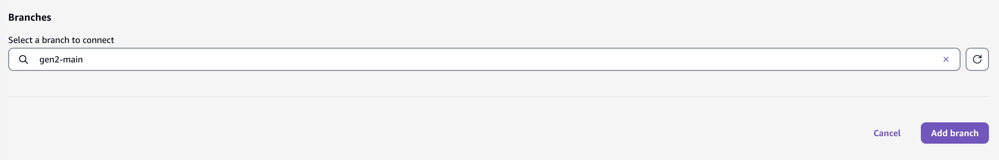
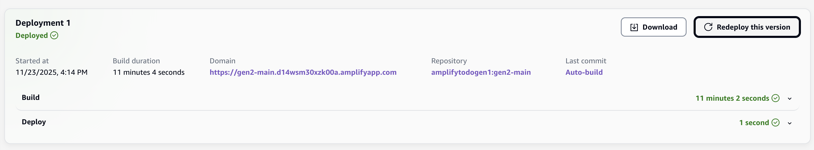

# Amplify Backend Gen1 → Gen2 Migration Guide (Beta)

Following document describes how to migrate your Gen1 backend environment to a new Gen2 backend application.

> [!CAUTION]
> The tools presented here are in early stages of development and **SHOULD NOT** be
> executed on any production or mission critical environments. Only run it for testing
> purposes on environments you can afford to delete.

> [!NOTE]
> Not all Gen1 apps are supported for migration. Refer to the rest of this document to determine if your app can be migrated.

## <!-- BEGIN TOC -->

- [Overall Approach](#overall-approach)
- [Frontend Migration](#frontend-migration)
- [Prerequisites](#prerequisites)
- [Modernization](#modernization)
- [Assumptions](#assumptions)
- [Step By Step](#step-by-step)
- [Feature Coverage](#feature-coverage)
- [Example Apps](#example-apps)
- [Feedback](#feedback)
- [Known Issues](https://github.com/aws-amplify/amplify-cli/issues?q=is%3Aissue%20state%3Aopen%20label%3Agen2-migration%20type%3ABug)

---

<!-- END TOC -->

## Overall Approach

Migration to Gen2 is done in a (partial) blue/green deployment approach:

1. Generate the necessary Gen2 definition files based on your deployed Gen1 environment.
2. Deploy the new Gen2 code to create a new environment (in Gen2 they are referred to as branches).
3. Refactor your underlying CloudFormation stacks such that any Gen1 stateful resource will be managed by the new Gen2 deployment.

> [!NOTE]
>
> - Not all Gen1 features are natively supported in Gen2; in those cases, the migration tool will generate AWS CDK code to
>   configure the appropriate resource settings.
> - Not everything can be codegenerated, you will need to perform some manual edits as well.

An amplify backend environment consists of collection of _Stateless_ and _Statefull_ resources. Each group undergoes
a different process during migration.

### Stateless Resources

Stateless resources are ones that don't store any user data. They include:

- AppSync GraphQL APIs & Resolvers
- API Gateway REST APIs
- Lambda Functions
- IAM Roles & Policies
- ...

Deploying the Gen2 code will create new instances of these resources, which will eventually be used instead of the Gen1 resources.
These resources are untouched during the refactoring step.

### Statefull Resources

Stateful resources are ones that store user data. They include:

- S3 Bucket
- DynamoDB Table
- Cognito User Pool
- Cognito Identity Pool
- ...

Deploying the Gen2 code will create new empty instances of these resources and connect them to the new stateless resources.
This allows you to test your Gen2 application functionality in isolation from the Gen1 environment. Once you are satisfied
the Gen2 application works correctly, the refactoring step will delete them and replace with your Gen1
stateful resources. Your Gen2 application will now share and access all the Gen1 data.

> [!NOTE]
> DynamoDB tables that host your models are not cloned as part of the Gen2 deployment and therefore do not participate in the
> refactoring step. **This means that your Gen2 application will have access to the Gen1 model data immediately after deployment.**

---

The following diagram describes the workflow and resource state in every step during migration.



After completing this process you will have 2 functionally equivalent amplify applications that access the same data. Note that
you will no longer be able to update your Gen1 environment. To continue evolving your application, push updates to the Gen2 code.

## Frontend Migration

Amplify Gen1 frontends communicate with backend resources via the language specific `amplifyconfiguration` file. For example:

```ts
import amplifyconfig from './amplifyconfiguration.json';
Amplify.configure(amplifyconfig);
```

All values in this file (e.g AppSync endpoint URLs, User Pool IDs, etc...) remain valid and active throughout the
entire migration process. This means that Gen1 frontends continue to work without any change. The following diagram
describes how existing frontend applications interact with your backend resources post migration:



Once you are satisfied the Gen2 application works correctly, you will publish a new version of
your frontend that connects to the Gen2 stateless resources. Note that in Gen2, the connecting file has a different
structure and is called `amplify_outputs.json`, you'll need to edit your code. For example:

```ts
import amplifyconfig from '../amplify_outputs.json';
Amplify.configure(amplifyconfig);
```

Amplify client libraries will detect the different structure and adjust itself accordingly; no other changes are required.



## Prerequisites

### AWS Credentials

The migration tool requires the following API actions in addition to the standard Amplify CLI permissions:

- `cloudformation:CreateStackRefactor`
- `cloudformation:DescribeStackRefactor`
- `cloudformation:ExecuteStackRefactor`
- `cloudformation:GetStackPolicy`
- `cloudformation:SetStackPolicy`
- `cloudformation:DeleteChangeSet`
- `dynamodb:UpdateTable`
- `s3:GetBucketVersioning`
- `s3:GetEncryptionConfiguration`

> [!NOTE]
> The managed `AdministratorAccess-Amplify` policy does not include these actions.

### CDK Readiness

Since Gen2 uses CDK under the hood, your account and region must be [bootstrapped with CDK](https://docs.aws.amazon.com/cdk/v2/guide/bootstrapping-env.html)
in order for the Gen2 deployment to succeed.

### GraphQL Types Protected by the `iam` Auth Provider

```graphql
type Todo @model @auth(rules: [{ allow: private, provider: iam }]) {
  id: ID!
  name: String!
  description: String
}
```

Clients access such models using the `AuthRole` configured on the identity pool. After refactor,
the identity pool's `AuthRole` is updated to point to the Gen2 role. Since this role is external
to the Gen1 AppSync API, it is denied access by default. Your **Gen2** environment will work
correctly, but your **Gen1** environment will lose IAM access to the API.

To workaround this, [configure a custom admin role](https://docs.amplify.aws/gen1/javascript/build-a-backend/graphqlapi/customize-authorization-rules/#use-iam-authorization-within-the-appsync-console)
on the Gen1 API that matches the Gen2 `AuthRole` naming pattern:

`+ ./amplify/api/<api-name>/custom-roles.json`

```json
{
  "adminRoleNames": ["amplify-${appId}"]
}
```

> Where `${appId}` is the amplify application id. Gen2 auth role names are prefixed with this,
> so the pattern allows access from **any** Gen2 environment (branch).

Once added, redeploy the app by running `amplify push`.

## Modernization

The migration tool assumes a modern Gen1 deployment. Outdated packages in your Gen1 app can also
cause peer dependency conflicts during `npm install` after `generate`. We recommend upgrading the
following before starting migration.

### Amplify CLI

Deploy your Gen1 environment with the latest Gen1 CLI major version (v14) before migrating.
The migration tool relies on CloudFormation template structures and metadata produced by
recent CLI versions.

```bash
npm install -g @aws-amplify/cli@14
amplify push
```

### Node.js

`aws-cdk-lib` requires Node.js >= 20. Ensure your local environment and your CI/CD pipeline
are running Node.js 20 or later.

### `aws-amplify`

Gen2 depends on `@aws-amplify/backend-cli`, which has a peer dependency on `@aws-sdk/types@^3.734.0`.
Versions of `aws-amplify` below `6.16.2` ship with an older `@aws-sdk/types` that does not satisfy
this requirement, causing peer dependency warnings.

Upgrade to `aws-amplify@^6.16.2` or later. If you are on v5, this is a breaking change — see the
[v5 to v6 migration guide](https://docs.amplify.aws/react/build-a-backend/troubleshooting/migrate-from-javascript-v5-to-v6/).

### `@aws-amplify/ui-react`

If your app uses `@aws-amplify/ui-react`, upgrade to `^6`. Recent versions require
`aws-amplify@^6.14.3` as a peer dependency.

### TypeScript

Gen2 generated code uses modern TypeScript features. If your project includes TypeScript,
upgrade to `^5.0.0`.

### Lambda Function `@aws-sdk` Dependencies

Gen1 Lambda functions may have their own `@aws-sdk/client-*` packages in their `package.json`.
During `generate`, these are merged into the root `package.json` and can conflict with the
newer `@aws-sdk` versions required by Gen2. Upgrade any `@aws-sdk` dependencies in your
function source directories to `^3.734.0` or later.

## Assumptions

These are a set of assumptions the guide makes in order to provide more readable instructions. You should be
able to adapt them to fit your setup.

- Your Gen1 environment is stored in the `main` branch of a `GitHub` repository.
- Your Gen1 environment is called `main`.

## Step By Step

> **Before you begin, determine if your app can be migrated by reviewing:**
>
> - [Feature Coverage](#feature-coverage)
> - [Limitations](#limitations)
> - [Prerequisites](#prerequisites)
> - [Modernization](#modernization)

First obtain a fresh and up-to-date local copy of your Amplify Gen1 environment and install the experimental CLI package:

```console
npm install --no-save @aws-amplify/cli-internal-gen2-migration-experimental-alpha
```

> [!NOTE]  
> Migration is still in early development stages and is therefore versioned with a `0.x` and is not yet
> integrated into the standard Gen1 CLI.

### 1. Assess

Before starting the migration, you can evaluate whether your Gen1 environment is ready by running:

```bash
npx amplify gen2-migration assess
```

This command is read-only and has no side effects. It discovers all resources in your Gen1 environment
and produces a report showing migration support for each resource across the `generate` and `refactor` steps.

The output contains two tables:

- **Resources** — lists each discovered resource (category, service, name) with its generate and refactor support status.
- **Features** — lists detected sub-features (e.g. `override.ts` files, custom IAM policies) that require manual attention.

#### Example Report

Running `assess` on an app with auth, a GraphQL API with an override, storage, and a Lambda function
with custom IAM policies produces a report like this:

```
Assessment for "my-app" (env: main)

Resources

┌───────────┬─────────────────────────┬──────────────┬──────────┬──────────┐
│ Category  │ Service                 │ Resource     │ Generate │ Refactor │
├───────────┼─────────────────────────┼──────────────┼──────────┼──────────┤
│ auth      │ Cognito                 │ myappAuth    │ ✔        │ ✔        │
│ auth      │ Cognito-UserPool-Groups │ userPoolGrps │ ✔        │ ✔        │
│ api       │ AppSync                 │ myappApi     │ ✔        │ —        │
│ storage   │ S3                      │ myappBucket  │ ✔        │ ✔        │
│ function  │ Lambda                  │ processOrder │ ✔        │ ✔        │
└───────────┴─────────────────────────┴──────────────┴──────────┴──────────┘

Features

┌─────────────────┬─────────────────────────────────────────────────┬─────────────────────────────────┬──────────┐
│ Name            │ Path                                            │ Generate                        │ Refactor │
├─────────────────┼─────────────────────────────────────────────────┼─────────────────────────────────┼──────────┤
│ overrides       │ api/myappApi/override.ts                        │ ✘ requires manual code changes  │ —        │
│ custom-policies │ function/processOrder/custom-policies.json      │ ✘ requires manual code changes  │ —        │
└─────────────────┴─────────────────────────────────────────────────┴─────────────────────────────────┴──────────┘
```

**Support indicators:**

| Symbol | Meaning                                      |
| ------ | -------------------------------------------- |
| ✔      | Supported                                    |
| ✘      | Unsupported (includes a note explaining why) |
| —      | Not applicable for this step                 |

In this example, all resources are supported, but two features are flagged:

- The GraphQL API has an `override.ts` file — the migration tool cannot automatically translate overrides, so you'll need to manually apply those customizations to the generated Gen2 CDK code.
- The Lambda function has custom IAM policies — these need to be manually added to the function's resource definition in the Gen2 code.

Both features show `—` for refactor because they only affect code generation.

> [!NOTE]
> The `generate` and `refactor` steps also run this assessment as part of their validation step
> and will fail if any entry is unsupported. Each step runs additional validations as well — see
> the validation tables in each step section. You can bypass validations with `--skip-validations`,
> or run only the validations without executing the step using `--validations-only`.
>
> When skipping a failed assessment, any unsupported resource or feature is simply skipped by the
> tool. You can still proceed with migration, but you will need to manually handle the skipped
> items to complete it.

### 2. Lock

During the migration period your Gen1 environment should not undergo any changes; otherwise we run
the risk of code-generating an incomplete application and possibly encountering unexpected migration failures.
To achieve this, run the following:

```bash
npx amplify gen2-migration lock
```

#### Validations

| Validation         | Description                                                                                           |
| ------------------ | ----------------------------------------------------------------------------------------------------- |
| Environment Status | Verifies the root CloudFormation stack is in a stable state (`UPDATE_COMPLETE` or `CREATE_COMPLETE`). |
| Drift              | Detects drift between your local project and the deployed CloudFormation stacks.                      |

This command will first perform the above validations to analyze if your Gen1 environment is in a
healthy state and proceed to lock your Gen1 environment by attaching a restrictive IAM policy on the root stack.

```json
{ "Statement": [{ "Effect": "Deny", "Action": "Update:*", "Principal": "*", "Resource": "*" }] }
```

You will need to remove this policy from the stack if you'd like to push updates to the Gen1 environment.
To do so, run:

```bash
npx amplify gen2-migration lock --rollback
```

> [!WARNING]
> Do not rollback the lock if the Gen1 stack has already been refactored (and not rolled back).
> Pushing Gen1 updates to a refactored stack can cause resource conflicts.

> [!TIP]
> It is also advisable to disable any automatic pipelines that deploy to your Gen1 environment.

### 3. Generate

Next, generate your Gen2 definition files by running the following:

```bash
git checkout -b gen2-main
npx amplify gen2-migration generate
```

#### Validations

| Validation        | Description                                                                                             |
| ----------------- | ------------------------------------------------------------------------------------------------------- |
| Lock Status       | Verifies the Gen1 environment is locked (deny-all stack policy is in place).                            |
| Working Directory | Verifies the git working directory has no uncommitted changes.                                          |
| Assessment        | Runs the resource and feature assessment for the `generate` step and fails if any entry is unsupported. |

This command will override your local `./amplify` directory with Gen2 definition files. Once successful,
delete `node_modules` and your lock file before installing dependencies:

```bash
rm -rf node_modules package-lock.json
npm install
npm install --package-lock-only
```

This avoids stale resolution artifacts from the Gen1 dependency tree that can cause
peer dependency conflicts. Then, perform the following manual edits:

#### Post Generate | Frontend Config

If your frontend is stored within the same repo and consumes the `amplifyconfiguration.json` file created during `amplify push`:

**Edit in `./src/main.tsx` (or equivalent):**

```diff
- import amplifyconfig from './amplifyconfiguration.json';
+ import amplifyconfig from '../amplify_outputs.json';
```

This is required because in Gen2 amplify generates an `amplify_outputs.json` file instead of the `amplifyconfiguration.json` file.
Amplify client side libraries support both files so no additional change is needed.

> Note: The `amplify_outputs.json` file **will not** exist on your local file system so you will see a compilation error.
> Thats ok - it is generated at deploy time in the hosting service.

#### Post Generate | Reuse Model Tables

**Edit in `./amplify/data/resource.ts`:**

```diff
- branchName: "main"
+ branchName: "gen2-main"
```

This is required in order to instruct the hosting service that the DynamoDB tables hosting your
models should be reused (imported) instead of recreated.

> [!TIP]
> If you want to test with [sandbox](#sandbox) and share Gen1 model data, set `branchName` to
> `"sandbox"` instead. Change it back to `"gen2-main"` before deploying the branch.

#### Post Generate | NodeJS Function ESM Compatibility

If you have a NodeJS Lambda function in your app, you need to port your code
to ESM instead of CommonsJS. For example:

```diff
- exports.handler = async (event) => {
+ export async function handler(event) {
```

This is required because Gen2 adds lambda shims that conflict with CommonJS syntax.
Otherwise, you will see the following error when invoking the function:
_"Cannot determine intended module format because both require() and top-level await are present"_

> See [ESM/CJS Interoperability](https://www.typescriptlang.org/docs/handbook/modules/appendices/esm-cjs-interop.html)

#### Post Generate | Function Secrets

If your function was configured with a secret value, you must first recreate the secret using the amplify console.

_Hosting → Secrets → Manage Secrets → Add new_



Next, pass this secret in the function definition. For example, for a secret called `MY_SECRET`,
**Edit in `./amplify/<function-name>/resource.ts:**:

```diff
- import { defineFunction } from "@aws-amplify/backend";
+ import { defineFunction, secret } from "@aws-amplify/backend";

- MY_SECRET: "/amplify/<hash>/main/AMPLIFY_<function-name>_MY_SECRET"
+ MY_SECRET: secret("/amplify/<hash>/main/AMPLIFY_<function-name>_MY_SECRET")
```

**Then, in your function code, use `process.MY_SECRET` to obtain the secret value.**

> See [Secrets](https://docs.amplify.aws/react/build-a-backend/functions/environment-variables-and-secrets/#secrets)
> for more information.

#### Post Generate | GraphQL IAM Access

If your frontend accesses AppSync using IAM credentials, you also need to add:

```diff
+ backend.auth.resources.authenticatedUserIamRole.addToPrincipalPolicy(new aws_iam.PolicyStatement({
+     effect: aws_iam.Effect.ALLOW,
+     actions: ['appsync:GraphQL'],
+     resources: [`arn:aws:appsync:${backend.data.stack.region}:${backend.data.stack.account}:apis/<gen1-appsync-api-id>/*`]
+ }))
```

Navigate to the Amplify Console to find the `<gen1-appsync-api-id>` On the AppSync AWS Console. For example:



This is required in order for your Gen1 environment to keep functioning correctly after the `refactor` step.

> See [GraphQL types protected with the IAM provider](#graphql-types-protected-by-the-iam-auth-provider) for more details.

#### Post Generate | REST API

The migration tool automatically generates the full REST API CDK construct, including the Gen1 API reference,
IAM policy, and policy attachment. No manual CDK setup is needed.

However, you will need to update your frontend code to point to the new Gen2 API name:

**Edit in `./src/App.tsx` (or equivalent)**:

```diff
- apiName: '<gen1-rest-api-name>',
+ apiName: '<gen2-rest-api-name>',
```

Both APIs are fully functional so your Gen1 app will continue to work and access the Gen1 API.

#### Post Generate | Functions with Dynamic Require

If you have a function that uses a dynamic require statement:

```console
const modules = moduleNames.map((name) => require(`./${name}`));
```

You may need to change it to use static requires instead:

```diff
- const modules = moduleNames.map((name) => require(`./${name}`));
+ const modules = [require('./email-filter-allowlist')]
```

Gen2 functions are bundled with `esbuild`; if `esbuild` is unable to properly analyze the code, it may cause
unnecessary bundling and exceed the lambda memory limit. If that is the case, you will see `Out Of Memory`
errors in your function execution logs.

#### Post Generate | Models without an `@auth` directive

```graphql
type Todo @model {
  id: ID!
  name: String!
  description: String
}
```

In Gen1, types like these are considered _public_ and are assigned the `@aws_api_key` directive when transformed into an
AppSync compatible schema. In Gen2, they are considered _private_ and are assigned the `@aws_iam` directive.

In order to preserve the same protections after migration, you must explicitly allow public access on
the type by adding the `@auth` directive:

```graphql
type Todo @model @auth(rules: [{ allow: public }]) {
  id: ID!
  name: String!
  description: String
}
```

The same behavior applies to **non** `@model` types as well. For such types however, `@auth` cannot be
applied on the type itself and therefore must be applied to each field. For example:

```graphql
type FunctionResponse {
  fieldA: String! @auth(rules: [{ allow: public }])
  fieldB: String! @auth(rules: [{ allow: public }])
}

type Query {
  invokeFunction: FunctionResponse @function(name: "myfunction-${env}") @auth(rules: [{ allow: public }])
}
```

Your schema is located in `./amplify/data/resource.ts`.

### 4. Deploy

Deploying the generated Gen2 application is done via [fullstack-branch-deployments](https://docs.amplify.aws/flutter/deploy-and-host/fullstack-branching/branch-deployments/).
First, push the code:

```bash
git add .
git commit -m "feat: migrate to gen2"
git push origin gen2-main
```

> [!NOTE]
> The migration tool generates an `amplify.yml` buildspec file that allows for
> branch deployments to deploy Gen2 backend applications even in the absence of a
> webapp published via amplify hosting. If you'd like to start using the hosting service to publish your Gen2 webapp, you'll
> need to manually add a `frontend` section to this file and provide the necessary configuration to build your webapp.
> See [Build specification reference](https://docs.aws.amazon.com/amplify/latest/userguide/yml-specification-syntax.html) for more details.

Next, login to the AWS Amplify console and connect your new branch to the existing application:

_App Settings → Branch Settings → Add Branch_



Once added the hosting service will start deploying this branch. Wait for it to complete.


Once completed you can login to your app via the newly dedicated amplify domain. At this point,
the application has access only to the DynamoDB data from your Gen1 environment. **It does not
however reuse other stateful resources such as user pools.** To grant it access to all
stateful resources, a `refactor` is required.

#### Sandbox

Alternatively, you can deploy using [sandbox](https://docs.amplify.aws/react/deploy-and-host/sandbox-environments/setup/)
to test the Gen2 application in full isolation from your Gen1 environment.

```bash
npx ampx sandbox --once
```

> [!NOTE]
> By default, sandbox creates its own DynamoDB tables and does not share Gen1 model data.
> To share them, set `branchName` to `"sandbox"` in `./amplify/data/resource.ts`
> (see [Post Generate | Reuse Model Tables](#post-generate--reuse-model-tables)).

### 5. Refactor

Refactoring is the process of updating the underlying CloudFormation stacks of both your Gen1 and
Gen2 applications such that all stateful resources are reused across both apps.

If the refactor operation fails or produces undesired results, you can roll it back by running:

```bash
npx amplify gen2-migration refactor --to <gen2-root-stack-name> --rollback
```

This moves stateful resources back to the Gen1 CloudFormation stacks. If refactor fails during
execution, auto-rollback is attempted automatically (disable with `--no-rollback`).

#### Validations

| Validation  | Description                                                                                             |
| ----------- | ------------------------------------------------------------------------------------------------------- |
| Lock Status | Verifies the Gen1 environment is locked (deny-all stack policy is in place).                            |
| Assessment  | Runs the resource and feature assessment for the `refactor` step and fails if any entry is unsupported. |

In order to refactor,
we first need to find the name of the Gen2 root CloudFormation stack:

1. Login to the AWS CloudFormation console.
2. Find a root stack that has the following name pattern: `amplify-<appId>-gen2main-branch-<suffix>`


Then, re-install the CLI package:

```console
npm install --no-save @aws-amplify/cli-internal-gen2-migration-experimental-alpha
```

> This is needed because the previous installation currently gets lost after `generate`.

And run:

```bash
git checkout main
```

Since `generate` replaces the Gen1 `amplify/` directory, local AWS profile configuration is lost.
If you are using a non-default profile, either set the `AWS_PROFILE` environment variable or run
`amplify pull` to restore the local configuration before proceeding.

```bash
npx amplify gen2-migration refactor --to <gen2-root-stack-name>
```

> Note: This operations makes use of
> the [CloudFormation Refactor](https://docs.aws.amazon.com/AWSCloudFormation/latest/UserGuide/stack-refactoring.html) APIs

#### Post Refactor | S3 Storage

```console
git checkout gen2-main
```

If your application contains an S3 bucket as part of the storage category, edit in `./amplify/backend.ts`:

```diff
- // s3Bucket.bucketName = '...';
+ s3Bucket.bucketName = '...';
```

> This is required in order to sync your local bucket name with the deployed template.
> Otherwise, pushing changes to the `gen2-main` branch will result in a bucket replacement.

Push the changes:

```console
git add .
git commit -m "fix: reuse gen1 storage bucket"
git push origin gen2-main
```

Wait for the deployment to finish successfully.

#### Post Refactor | DynamoDB Storage

```console
git checkout gen2-main
```

If your application contains a DynamoDB table as part of the storage category, edit in `./amplify/backend.ts`:

```diff
- new Table(storageStack, "myTable", { partitionKey: ... });
- // Add this property to the Table above post refactor: tableName: 'my-table-main'
+ new Table(storageStack, "myTable", { tableName: 'my-table-main', partitionKey: ... });
```

> This is required in order to sync your local table name with the deployed template.
> Otherwise, pushing changes to the `gen2-main` branch will result in a table replacement.

Push the changes:

```console
git add .
git commit -m "fix: reuse gen1 dynamodb table"
git push origin gen2-main
```

Wait for the deployment to finish successfully.

#### Post Refactor | Redeploy

> Note: If you've already followed one of the other post refactor steps, this can be skipped.

Login to the AWS Amplify console and redeploy the Gen2 branch:



This is required in order to regenerate the `amplify_outputs.json` file that corresponds to the stack
architecture that was updated during `refactor`.

# Feature Coverage

Following provides an overview of the supported (and unsupported) features for migration. Features are organized
by the CLI setting that configures them.

> **Legend**
>
> - 🔴 | Unsupported.
> - 🟢 | Fully automated.
> - 🟡 | Partially supported. Includes indication whether it lacks support for `generate` or `refactor`.
>   If a feature is not supported for `refactor` you will not be able to fully migrate the app. You can however still generate
>   and deploy it to test whether code generation works properly. If a feature is not supported for `generate` you will be able
>   to manually augment the generated code to add the necessary configuration.
> - ⚠️ | Untested. You're welcome to try it out and let us know!

## Auth

### `amplify add auth`

- ➤ **How do you want users to be able to sign in**

  - 🟢 `Username`
  - 🟢 `Email`
  - 🟢 `Phone Number`
  - 🟢 `Email or Phone Number`

- ➤ **Select the social providers you want to configure for your user pool**

  - 🟡 `Facebook` (_generate_ ✔ _refactor_ ✗)
  - 🟡 `Google` (_generate_ ✔ _refactor_ ✗)
  - 🔴 `Login With Amazon`
  - 🔴 `Sign in with Apple`

- ➤ **Select the authentication/authorization services that you want to use**

  - 🟢 `User Sign-Up, Sign-In, connected with AWS IAM controls`
  - 🔴 `User Sign-Up & Sign-In only`

- ➤ **Allow unauthenticated logins**

  - ⚠️ `Yes`
  - 🟢 `No`

- 🔴 **Do you want to enable 3rd party authentication providers in your identity pool**

- 🟢 **Do you want to add User Pool Groups**

- 🔴 **Do you want to add an admin queries API**

- ➤ **Multifactor authentication (MFA) user login options**

  - 🟢 `OFF`
  - ⚠️ `ON`
  - ⚠️ `OPTIONAL`

- ➤ **Email based user registration/forgot password:**

  - 🟢 `Enabled`
  - ⚠️ `Disabled`

- 🟢 **Specify an email verification subject**

- 🟢 **Specify an email verification message**

- 🟢 **Do you want to override the default password policy for this User Pool**

- ➤ **What attributes are required for signing up**

  - 🟢 `Birthdate (This attribute is not supported by Login With Amazon, Sign in with Apple.)`
  - 🟢 `Email`
  - 🟢 `Family Name (This attribute is not supported by Login With Amazon.)`
  - 🟢 `Middle Name (This attribute is not supported by Google, Login With Amazon, Sign in with Apple.)`
  - 🟢 `Gender (This attribute is not supported by Login With Amazon, Sign in with Apple.)`
  - 🟢 `Locale (This attribute is not supported by Facebook, Google, Sign in with Apple.)`
  - 🟢 `Given Name (This attribute is not supported by Login With Amazon.)`
  - 🟢 `Name`
  - 🟢 `Nickname (This attribute is not supported by Facebook, Google, Login With Amazon, Sign in with Apple.)`
  - 🟢 `Phone Number (This attribute is not supported by Facebook, Login With Amazon, Sign in with Apple.)`
  - 🟢 `Preferred Username (This attribute is not supported by Facebook, Google, Login With Amazon, Sign in with Apple.)`
  - 🟢 `Picture (This attribute is not supported by Login With Amazon, Sign in with Apple.)`
  - 🟢 `Profile (This attribute is not supported by Facebook, Google, Login With Amazon, Sign in with Apple.)`
  - 🟢 `Updated At (This attribute is not supported by Google, Login With Amazon, Sign in with Apple.)`
  - 🟢 `Website (This attribute is not supported by Facebook, Google, Login With Amazon, Sign in with Apple.)`
  - 🟢 `Zone Info (This attribute is not supported by Facebook, Google, Login With Amazon, Sign in with Apple.)`
  - 🟢 `Address (This attribute is not supported by Facebook, Google, Login With Amazon, Sign in with Apple.)`

- 🟢 **Specify the app's refresh token expiration period (in days)**

- 🔴 **Do you want to specify the user attributes this app can read and write**

- ➤ **Do you want to enable any of the following capabilities**

  - 🟡 `Add Google reCaptcha Challenge` (_generate_ ✔ _refactor_ ✗)
  - ⚠️ `Email Verification Link with Redirect`
  - 🔴 `Add User to Group`
  - 🟢 `Email Domain Filtering (denylist)`
  - 🟢 `Email Domain Filtering (allowlist)`
  - ⚠️ `Custom Auth Challenge Flow (basic scaffolding - not for production)`
  - 🟡 `Override ID Token Claims` (_generate_ ✔ _refactor_ ✗)

- 🔴 **Do you want to use an OAuth flow**

- ➤ **Do you want to configure Lambda Triggers for Cognito**

  - 🟢 `Create Auth Challenge`
  - ⚠️ `Custom Message`
  - 🟢 `Define Auth Challenge`
  - ⚠️ `Post Authentication`
  - 🟢 `Post Confirmation`
  - ⚠️ `Pre Authentication`
  - 🟢 `Pre Sign-up`
  - 🟢 `Verify Auth Challenge Response`
  - 🟢 `Pre Token Generation`

### `amplify import auth`

- ➤ **What type of auth resource do you want to import?**

  - 🟢 `Cognito User Pool and Identity Pool`
  - ⚠️ `Cognito User Pool only`

## Api

### `amplify add api`

- 🟢 **GraphQL**

  - ➤ **Default Authorization Type**

    - 🟢 `API Key`
    - 🟢 `Amazon Cognito User Pool`
    - 🟢 `IAM`
    - ⚠️ `OpenID Connect`
    - ⚠️ `Lambda`

  - ➤ **Additional Authorization Type**

    - 🟢 `API Key`
    - 🟢 `Amazon Cognito User Pool`
    - ⚠️ `IAM`
    - ⚠️ `OpenID Connect`
    - ⚠️ `Lambda`

- 🟢 **REST**

  - ➤ **Choose a Lambda source**

    - 🟢 `Create a new Lambda function`
    - ⚠️ `Use a Lambda function already added in the current Amplify project`

  - ➤ **Restrict API access**

    - 🟢 `Yes`
    - ⚠️ `No`

  - ➤ **Restrict access by**

    - 🟢 `Both`
    - 🟢 `Individual Groups`
    - 🟢 `Auth/Guest Users`

  - ➤ **Who should have access**

    - 🟢 `Authenticated users only`
    - ⚠️ `Authenticated and Guest users`

  - ➤ **What permissions do you want to grant to Authenticated users**

    - 🟢 `create`
    - 🟢 `read`
    - 🟢 `update`
    - 🟢 `delete`

  - ➤ **What permissions do you want to grant to {Group} users**

    - 🟢 `create`
    - 🟢 `read`
    - 🟢 `update`
    - 🟢 `delete`

### Custom Business Logic

- 🟡 [`AppSync JavaScript or VTL resolver`](https://docs.amplify.aws/gen1/react/build-a-backend/graphqlapi/custom-business-logic/#appsync-javascript-or-vtl-resolver) (_generate_ ✗ _refactor_ ✔)
- 🟡 [`Override Amplify-generated resolvers`](https://docs.amplify.aws/gen1/react/build-a-backend/graphqlapi/custom-business-logic/#override-amplify-generated-resolvers) (_generate_ ✗ _refactor_ ✔)
- 🟡 [`Extend Amplify-generated resolvers`](https://docs.amplify.aws/gen1/react/build-a-backend/graphqlapi/custom-business-logic/#extend-amplify-generated-resolvers) (_generate_ ✗ _refactor_ ✔)

## Storage

### `amplify add storage`

- 🟢 **Content (Images, audio, video, etc.)**

  - ➤ **What kind of access do you want for Authenticated users?**

    - 🟢 `create/update`
    - 🟢 `read`
    - 🟢 `delete`

  - ➤ **What kind of access do you want for Guest users?**

    - 🟢 `create/update`
    - 🟢 `read`
    - 🟢 `delete`

  - ➤ **What kind of access do you want for {Group} users**

    - 🟢 `create/update`
    - 🟢 `read`
    - 🟢 `delete`

  - 🟢 **Do you want to add a Lambda Trigger for your S3 Bucket**

- 🟢 **NoSQL Database**

  - 🟢 `Do you want to add a sort key to your table`
  - 🟢 `Do you want to add global secondary indexes to your table`
  - 🟢 `Do you want to add a sort key to your global secondary index`
  - 🟢 `Do you want to add a Lambda Trigger for your Table`

### `amplify import storage`

- ➤ **Select from one of the below mentioned services**

  - 🔴 `S3 bucket - Content (Images, audio, video, etc.)`
  - 🔴 `DynamoDB table - NoSQL Database`

## Function

### `amplify add function`

- 🟢 **Lambda function (serverless function)**

  - ➤ **Runtime**

    - 🔴 `.NET 8`
    - 🔴 `Go`
    - 🔴 `Java`
    - 🟢 `NodeJS`
    - 🔴 `Python`

  - ➤ **Choose the function template that you want to use**

    - 🟢 `Hello world function`
    - ⚠️ `CRUD function for Amazon DynamoDB table`
    - 🟢 `Serverless express function`
    - ➤ `Lambda Trigger`

      - ➤ **Amazon DynamoDB Stream**

        - ➤ **Choose a DynamoDB event source option**
          - 🟢 `Use API category graphql @model backed DynamoDB table(s) in the current Amplify project`
          - 🔴 `Use storage category DynamoDB table configured in the current Amplify project`
          - 🔴 `Provide the ARN of DynamoDB stream directly`

      - 🔴 **Amazon Kinesis Stream**

  - ➤ **Advanced Settings**

    - ➤ **Select the categories you want this function to have access to**

      - ➤ **api**

        - 🟢 `Query`
        - 🟢 `Mutation`
        - 🟢 `Subscription`

      - ➤ **auth**

        - 🟢 `create`
        - 🟢 `read`
        - 🟢 `update`
        - 🟢 `delete`

      - 🔴 **function**

      - ➤ **storage:dynamo**

        - 🟢 `create`
        - 🟢 `read`
        - 🟢 `update`
        - 🟢 `delete`

      - ➤ **storage:s3**

        - 🟢 `create`
        - 🟢 `read`
        - 🟢 `update`
        - 🟢 `delete`

      - 🔴 **function**

    - 🔴 **Do you want to invoke this function on a recurring schedule**
    - 🔴 **Do you want to enable Lambda layers for this function**
    - 🟢 **Do you want to configure environment variables for this function**
    - 🟡 **Do you want to configure secret values this function can access** (_generate_ ✗ _refactor_ ✔)
    - ➤ **Choose the package manager that you want to use**
      - 🟢 `NPM`
      - ⚠️ `Yarn`
      - ⚠️ `PNPM`
      - 🔴 `Custom Build Command or Script Path`

- 🔴 **Lambda layer (shared code & resource used across functions)**

### Custom Policies

- 🟡 [`Access existing AWS resource from Lambda Function`](https://docs.amplify.aws/gen1/javascript/build-a-backend/functions/set-up-function/#access-existing-aws-resource-from-lambda-function) (_generate_ ✗ _refactor_ ✔)

## Analytics

### `amplify add analytics`

- ➤ **Select an Analytics provider**

  - 🟢 **Amazon Kinesis Streams**

    - 🟢 `Enter a Stream name`
    - 🟢 `Enter number of shards`

  - 🔴 **Amazon Pinpoint**

## Geo

### `amplify add geo`

- ➤ **Select which capability you want to add**

  - 🟢 `Map (visualize the geospatial data)`

    - ➤ **Restrict access by**

      - 🟢 `Both`
      - 🟢 `Auth/Guest Users`
      - 🟢 `Individual Groups`

    - ➤ **Who can access this Map**

      - 🟢 `Authorized and Guest users`
      - 🟢 `Authorized users only`

    - ⚠️ **Do you want to configure advanced settings**

  - 🟢 `Location search (search by places, addresses, coordinates)`

    - ➤ **Restrict access by**

      - 🟢 `Both`
      - 🟢 `Auth/Guest Users`
      - 🟢 `Individual Groups`

    - ➤ **Who can access this search index**

      - 🟢 `Authorized and Guest users`
      - 🟢 `Authorized users only`

    - ⚠️ **Do you want to configure advanced settings**

  - 🟡 `Geofencing (visualize virtual perimeters)` (_generate_ ✔ _refactor_ ✗)

    - ➤ **What kind of access do you want for {Group} users**

      - 🟢 `Read geofence`
      - 🟢 `Create/Update geofence`
      - 🟢 `Delete geofence`
      - 🟢 `List geofences`

## Interactions

### 🔴 `amplify add interactions`

## Predictions

### 🔴 `amplify add predictions`

## Notifications

### 🔴 `amplify add notifications`

## Hosting

### 🔴 `amplify add hosting`

- ➤ **Select the plugin module to execute**
  
  - ➤ **Hosting with Amplify Console (Managed hosting with custom domains, Continuous deployment)**
 
    - ➤ **Choose a type**

        - 🟢 `Continuous deployment (Git-based deployments)`
        - ⚠️ `Manual deployment`
          
  - ⚠️ **Amazon CloudFront and S3**

## Custom

### 🔴 `amplify add custom`

## Overrides

### 🔴 `amplify override api`

### 🔴 `amplify override auth`

### 🔴 `amplify override storage`

### 🔴 `amplify override project`

# Example Apps

See [amplify-migration-apps](./amplify-migration-apps/)

# Feedback

Your feedback will significantly help the team improve and stabilize the tool. We welcome and encourage any
feedback on the migration process:

- Success stories
- Failure stories
- General Questions
- Anything you want

Here is where you can share:

- [Create an Issue](https://github.com/aws-amplify/amplify-cli/issues/new)
- [Participate in the GitHub Discussion](https://github.com/aws-amplify/amplify-cli/discussions/14490)
