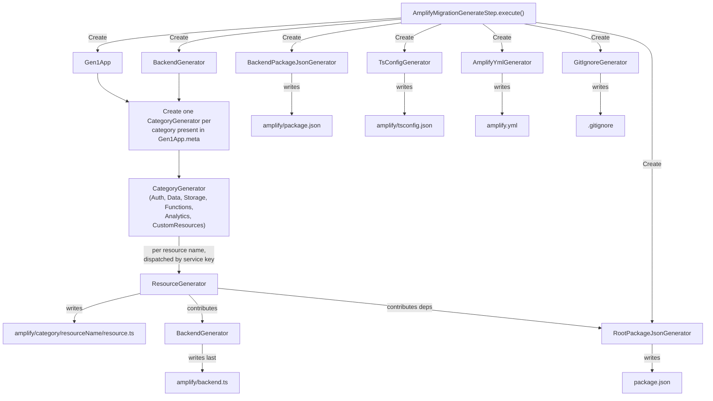

# Generate Command — Guideline Violations

This document maps issues in `packages/amplify-cli/src/commands/gen2-migration/generate`
to the guidelines in `CODING_GUIDELINES.md`.

## Architecture & Structure

### Point 1 — God modules

`command-handlers.ts` (~730 lines) is the primary offender. It handles AWS client instantiation, code generation orchestration, amplify.yml updates, .gitignore updates, custom resource migration, dependency extraction, file copying, and npm install. These are unrelated concerns in a single file.

`createGen2Renderer` in `migration-pipeline.ts` (~250 lines of function body) manually wires every category, builds cross-category data structures (`functionNamesAndCategory`, `functionsWithApiAccess`, `dynamoTriggers`), and populates `BackendRenderParameters` — acting as both orchestrator and implementor.

`BackendSynthesizer` (~750 lines) generates the entire `backend.ts` file including OAuth flows, user pool client overrides, environment variable logic, DynamoDB table mappings, and custom resource registration.

### Point 2 — Unjustified layer boundaries

Data flows through four or five reshaping layers: SDK response → adapter output (e.g., `AuthDefinition`) → `Gen2RenderingOptions` → `BackendRenderParameters` → TypeScript AST. Each boundary manually maps properties with different names. For example, auth data goes from Cognito SDK types → `getAuthDefinition()` → `AuthDefinition` → `Gen2RenderingOptions.auth` → `BackendRenderParameters.auth` (cherry-picked subset). Adding a new auth field requires changes in five places.

The adapter layer (`adapters/`) and the generator layer (`generators/`) could be collapsed — the adapter reshapes SDK data into a definition, then the generator reshapes the definition into AST nodes. Neither layer is expected to change independently.

### Point 3 — File size and focus

`command-handlers.ts`, `migration-pipeline.ts`, and `backend/synthesizer.ts` are all large files mixing multiple concerns. The auth generator (`generators/auth/index.ts`) is also large, handling login options, external providers, OIDC/SAML, user attributes, MFA, and secret generation in a single file.

### Point 4 — Naming

The `codegen-head/` folder name doesn't convey what it contains (definition fetchers, environment resolution, stack parsing, formatting utilities). The `renderers/` folder contains `EnsureDirectory`, `JsonRenderer`, and `TypescriptNodeArrayRenderer` — the first isn't a renderer in any meaningful sense.

### Point 5 — Scattered API calls

AWS SDK clients are instantiated in `prepare()` inside `command-handlers.ts` and passed to individual fetchers. However, each fetcher also independently calls `backendEnvironmentResolver.selectBackendEnvironment()` and `ccbFetcher.getCurrentCloudBackend()`. There's no centralized wrapper for Cognito, S3, Lambda, or CloudFormation calls — each fetcher makes its own SDK calls directly.

## Mutability & State Management

### Point 6 — Mutable state

`BackendRenderParameters` is built incrementally via mutation in `createGen2Renderer` — properties are conditionally assigned across ~200 lines of code. `Gen2RenderingOptions` has many optional mutable fields. Neither interface uses `readonly`.

### Point 7 — `let` over `const`

`createGen2Renderer` uses mutable variables like `functionNames`, `functionNamesAndCategory`, `functionsWithApiAccess`, `functionsWithDataModelAccess` that are populated inside loops and conditionals, then consumed later. The `updateAmplifyYmlFile` function uses `let amplifyYml: any` assigned across three branches.

## Interface Design

### Point 8 — Properties that don't belong

`StorageRenderParameters` contains `functionNamesAndCategories?: Map<string, string>` — function metadata that has nothing to do with storage. It's there because `renderStorage()` needs it for import path generation.

### Point 9 — Excessive optionality

`Gen2RenderingOptions` has 13 optional properties out of 15 total. `AuthDefinition` has 15 optional properties. `BackendRenderParameters` has all optional category blocks. Most of these are optional because not every Gen1 project has every category, but the optionality propagates through the entire pipeline rather than being resolved at the boundary.

### Point 10 — Same information twice

`functionNamesAndCategory` is derived from `functions` in `createGen2Renderer`, then passed separately to `StorageRenderParameters` and `BackendRenderParameters`. The same function-to-category mapping exists in three places. `backendEnvironmentName` is passed as a separate argument alongside objects that already contain it.

### Point 11 — Dead inputs

`command-handlers.ts` imports `UpdateAppCommand`, `AppContextLogger`, `AmplifyError`, `printer`, `format`, and `hasUncommentedDependency` — none of which are used. `getUsageDataMetric` is defined but never called. `Gen1ProjectConfig` in `types.ts` is an empty stub interface with `[key: string]: any`.

### Point 13 — Catch-all types file

`generate/types.ts` contains a single stub interface `Gen1ProjectConfig` with `[key: string]: any` — a dead, untyped placeholder that serves no purpose.

## Error Handling

### Point 16 — Fallbacks for invalid states

Several fetchers in the generate module return `undefined` when categories don't exist — this is valid. However, `extractGen1FunctionDependencies` silently returns `{}` on any error, including permission failures or corrupted JSON.

### Point 17 — `assert()` in production code

`command-handlers.ts` uses `assert` ~15 times for values that should be validated with user-facing errors (e.g., `assert(backendEnvironment)`, `assert(accountId)`, `assert(resourceName)`). `app_auth_definition_fetcher.ts` and `app_functions_definition_fetcher.ts` also use `assert` extensively.

## Control Flow & Logic

### Point 18 — Repeated branching

`createGen2Renderer` branches on category existence (`if (auth)`, `if (storage)`, `if (data)`, `if (functions)`, `if (analytics)`) in a long sequential block. Each block follows the same pattern (create directory, create renderer, populate `backendRenderOptions`) but the logic isn't consolidated.

### Point 19 — Repeated derived values

`amplify-meta.json` is independently read and parsed in `AppAuthDefinitionFetcher`, `AppStorageDefinitionFetcher`, `AppFunctionsDefinitionFetcher`, `AppAnalyticsDefinitionFetcher`, `DataDefinitionFetcher`, `AuthAccessAnalyzer`, and multiple times in `command-handlers.ts`. Each call site also independently resolves the backend environment via `backendEnvironmentResolver.selectBackendEnvironment()`.

The function-to-category mapping is derived three times: once in `AppFunctionsDefinitionFetcher`, once in `createGen2Renderer` for storage, and once in `createGen2Renderer` for auth.

## Function Design

### Point 21 — Positional arguments

`AppAuthDefinitionFetcher` constructor takes 6 positional arguments. `AppFunctionsDefinitionFetcher` takes 6. `getAuthDefinition()` adapter takes a single object (good), but `renderAuthNode()` takes `(auth, functions, functionCategories)` as separate positional arguments.

### Point 22 — High argument count

`prepare()` instantiates 8 AWS clients and passes a `CodegenCommandParameters` object with 14 fields to `generateGen2Code`. `CodegenCommandParameters` mixes infrastructure concerns (clients, environment) with domain concerns (fetchers, app ID).

## Code Hygiene

### Point 24 — Code duplication

`readJsonFile` is independently defined in `app_auth_definition_fetcher.ts`, `data_definition_fetcher.ts`, and `app_storage_definition_fetcher.ts` — identical implementations in three files. Each fetcher independently resolves the backend environment and downloads the current cloud backend with the same boilerplate.

### Point 25 — Duplicate constants

`GEN1_CONFIGURATION_FILES` is exported from `command-handlers.ts` but the same file names appear as string literals elsewhere.

### Point 27 — Dead code

Unused imports: `UpdateAppCommand`, `AppContextLogger`, `AmplifyError`, `printer`, `format`. Unused function: `getUsageDataMetric`, `hasUncommentedDependency`. Dead type: `Gen1ProjectConfig` in `types.ts`. Commented-out import: `SSMClient`.

---

## Refactoring Requirements

### R1. Generators have access to all Gen1 app information

Every generator must have access to all Gen1 app information through a single facade. The facade provides methods for querying any aspect of the Gen1 app (auth config, storage config, functions, metadata, etc.) but fetches data lazily — only when a generator actually requests it. Results are cached so that multiple generators querying the same data get the same cached result without duplicate API calls or file reads. This makes the facade easy to mock in tests: a test for the auth generator only needs to stub the auth-related methods without constructing the entire Gen1 app state.

### R2. Category generators can contribute to backend.ts

Each category generator (auth, storage, data, functions, etc.) must be able to add imports, statements, and overrides to the `backend.ts` file directly. This eliminates the need for a centralized synthesizer that has to know about every category and reshapes data through an intermediate interface. The generator that understands the category's needs is the one that writes the backend.ts contributions for that category.

### R3. Adding a new category doesn't require modifying existing code

A new category generator should be pluggable without touching other category generators. Adding a category requires only creating the new generator and adding one line to `AmplifyMigrationGenerateStep.execute()` to instantiate it.

### R4. Category generators are self-contained

All logic for generating a category's output — both its `resource.ts` file and its `backend.ts` contributions — lives in one module. No category-specific logic is scattered across shared orchestration code or other category generators.

### R5. Generators support dry run

Each generator must be able to report what it will do without doing it. The description and execution logic must be structurally tied together so they can't diverge.

---

## Refactoring Plan

### Target Directory Structure

```
generate/
  gen1-app/
    gen1-app.ts              # Facade — lazy-loading, caching access to all Gen1 app state
    aws-clients.ts           # Single instantiation point for all AWS SDK clients
    amplify-meta.ts          # Reads/caches amplify-meta.json with typed accessors
    backend-environment.ts   # Backend environment resolution and caching
    cloud-backend.ts         # Downloads/caches current cloud backend

  auth/
    auth.generator.ts        # Produces auth/resource.ts + backend.ts contributions
    auth-triggers.ts         # Auth trigger connection parsing

  storage/
    storage.generator.ts     # Produces storage/resource.ts + backend.ts contributions
    storage-access.ts        # S3/DynamoDB access pattern parsing

  data/
    data.generator.ts        # Produces data/resource.ts + backend.ts contributions
    schema-reader.ts         # GraphQL schema reading

  functions/
    functions.generator.ts   # Produces resource.ts per function + backend.ts contributions
    schedule-parser.ts       # CloudWatch schedule expression conversion
    trigger-detector.ts      # DynamoDB/API trigger detection

  analytics/
    analytics.generator.ts   # Produces analytics/resource.ts + backend.ts contributions
    cdk-from-cfn.ts          # Kinesis CFN-to-CDK conversion

  custom-resources/
    custom.generator.ts      # Copies/transforms custom CDK stacks
    amplify-helper-transformer.ts
    dependency-merger.ts
    file-converter.ts

  backend.generator.ts              # Generator that runs last — accumulates contributions, writes backend.ts
  root-package-json.generator.ts    # Writes root package.json, accumulates dependencies from category generators
  backend-package-json.generator.ts # Writes amplify/package.json (static { type: 'module' })
  tsconfig.generator.ts             # Writes amplify/tsconfig.json
  amplify-yml.generator.ts   # Writes/updates amplify.yml buildspec
  gitignore.generator.ts     # Writes/updates .gitignore
  generator.ts               # Generator interface
  ts-writer.ts               # TypeScript AST printing utility
```

### Key Abstractions

**Generator interface** — Every generator implements this. Returns `AmplifyMigrationOperation[]` from `plan()`, reusing the existing operation interface that co-locates `describe()` and `execute()`. `AmplifyMigrationGenerateStep.execute()` collects all operations and returns them to the gen2-migration dispatcher, which already handles the describe-then-execute flow.

```typescript
interface Generator {
  plan(): Promise<AmplifyMigrationOperation[]>;
}
```

**Gen1App** — Lazy-loading facade passed to every generator. Each `fetch*` method calls AWS on first invocation and caches the result. Properties are initialized synchronously from local files in the constructor. Returns raw SDK types or parsed file contents directly — no custom intermediate interfaces. Easy to mock: stub only the methods your test needs.

```typescript
class Gen1App {
  public readonly accountId: string;
  public readonly region: string;
  public readonly meta: Record<string, unknown>; // parsed amplify-meta.json
  public readonly graphQLSchema: string | undefined; // raw file content

  public fetchUserPool(): Promise<UserPoolType | undefined>; // raw SDK type
  public fetchIdentityPool(): Promise<IdentityPoolType | undefined>; // raw SDK type
  public fetchFunctionConfig(resourceName: string): Promise<FunctionConfiguration | undefined>; // raw SDK type
  // ... other raw Gen1 state as needed
}
```

**BackendGenerator** — Implements `Generator`. Other generators call `addImport()`, `addStatement()`, etc. during their execution. When run last, it writes `backend.ts` from the accumulated content.

```typescript
class BackendGenerator implements Generator {
  public addImport(source: string, identifiers: string[]): void;
  public addStatement(node: ts.Statement): void;
  public plan(): Promise<AmplifyMigrationOperation[]>;
}
```

**Category generators** — Each category has a generator that reads its entries from `Gen1App.meta`, and for each resource name dispatches to a resource-specific generator based on the `service` key. The category generators are:

- `AuthGenerator` → dispatches to resource generators by service (Cognito, Cognito-UserPool-Groups)
- `DataGenerator` → dispatches to resource generators by service (AppSync, API Gateway)
- `StorageGenerator` → dispatches by service (S3, DynamoDB)
- `FunctionsGenerator` → dispatches to `FunctionGenerator` per resource
- `AnalyticsGenerator` → dispatches to resource generators by service (e.g., Kinesis, Pinpoint)
- `CustomResourcesGenerator` → dispatches to `CustomResourceGenerator` per resource

Each resource generator receives `Gen1App`, `BackendGenerator`, `RootPackageJsonGenerator`, the output directory, and the resource name. It writes its `resource.ts` and contributes to `BackendGenerator` and `RootPackageJsonGenerator`.

**AmplifyMigrationGenerateStep.execute()** — The orchestration lives directly in the existing step class. Reads `Gen1App.meta` top-level keys to determine which categories exist. Creates one category generator per key. Collects all `AmplifyMigrationOperation[]` from generators and returns them to the parent dispatcher, which handles describe-then-execute.

```typescript
// Inside AmplifyMigrationGenerateStep
public async execute(): Promise<AmplifyMigrationOperation[]> {
  const gen1App = new Gen1App(/* aws clients, region, appId, etc. */);
  const backendGenerator = new BackendGenerator(this.outputDir);
  const rootPackageJsonGenerator = new RootPackageJsonGenerator(this.outputDir);
  const generators: Generator[] = [];

  if (gen1App.meta.auth) {
    generators.push(new AuthGenerator(gen1App, backendGenerator, packageJsonGenerator, this.outputDir));
  }
  // ... other categories follow the same pattern

  generators.push(backendGenerator);
  generators.push(rootPackageJsonGenerator);
  generators.push(new BackendPackageJsonGenerator(this.outputDir));
  generators.push(new TsConfigGenerator(this.outputDir));
  generators.push(new AmplifyYmlGenerator(this.outputDir));
  generators.push(new GitIgnoreGenerator(this.outputDir));

  const operations: AmplifyMigrationOperation[] = [];
  for (const generator of generators) {
    operations.push(...(await generator.plan()));
  }
  return operations;
}
```

### Execution Flow



### Phased Execution

**Execution notes:** Each phase should be delegated to a `general-task-execution` sub-agent with a prompt that references this document (`GENERATE_ISSUES.md`) and the specific phase. The sub-agent has access to all tools and can read this document for full context. Wait for each phase to complete and review its output before starting the next. Use `context-gatherer` at the start of each phase to re-orient on the current state of the codebase.

**Testing strategy:** The old code and its unit tests remain intact through Phases 1–2. In Phase 3, when the entry point switches to the new code, validate against e2e snapshot tests. In Phase 4, write unit tests for the new classes that cover the same ground as the old tests — don't port them mechanically, but ensure equivalent coverage. Delete the old tests along with the old code.

**Phase 1 — Foundation**
Create a new `generate-new/` directory alongside the existing `generate/` directory. Build the foundation: `Gen1App` facade, `BackendGenerator`, `RootPackageJsonGenerator`, and `Generator` interface. The old `generate/` directory remains intact as reference throughout. Stop for review.

**Phase 2 — Migrate categories**
One category at a time, create the new generator in `generate-new/` (e.g., `auth/auth.generator.ts`). Copy over and restructure the relevant logic from the old code. Each generator reads from `Gen1App`, writes its `resource.ts`, and contributes to `BackendGenerator` and `RootPackageJsonGenerator`. The old code stays untouched as reference. Stop for review after each generator. Code does not need to compile at this stage.

**Phase 3 — Switch over**
Once all generators are complete in `generate-new/`, update `generate.ts` (the `AmplifyMigrationGenerateStep` entry point) to use the new generator infrastructure instead of the old `prepare()` function. Run all existing tests against the new code and iterate until they pass.

**Phase 4 — Cleanup**
Once all tests pass, delete the old `generate/` directory and rename `generate-new/` to `generate/`.
