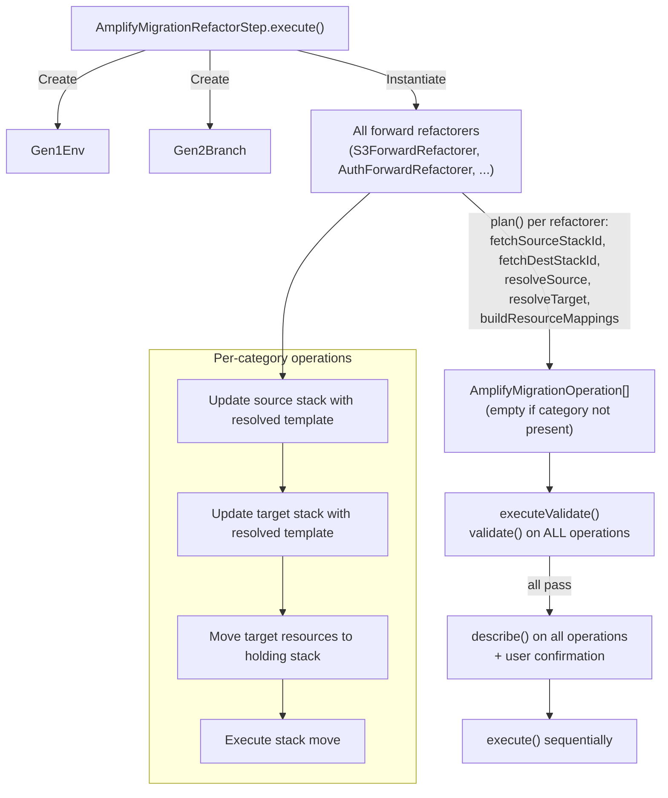
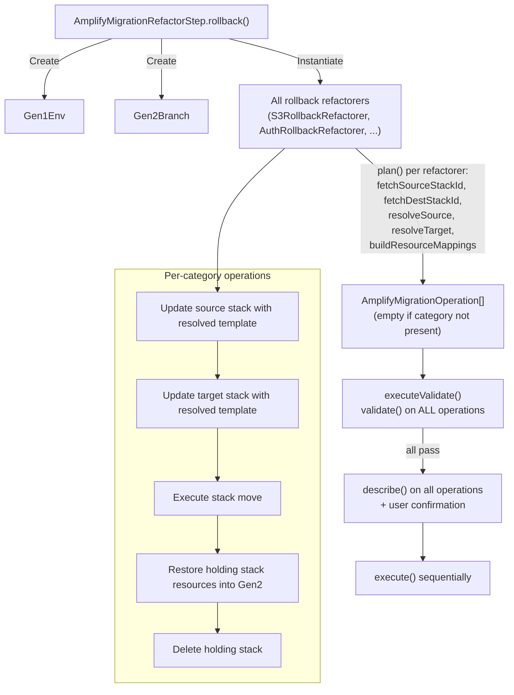

# Refactor Command — Guideline Violations

This document maps issues in `packages/amplify-cli/src/commands/gen2-migration/refactor`
to the guidelines in `CODING_GUIDELINES.md`.

## Architecture & Structure

### Point 1 — God modules

`TemplateGenerator` (~760 lines) is the primary offender. It discovers and maps category stacks between Gen1 and Gen2 (`parseCategoryStacks`), initializes category generators, orchestrates Gen1 and Gen2 stack pre-processing, manages the holding-stack lifecycle, executes CloudFormation stack refactors, generates rollback templates, builds rollback logical-ID mappings, and handles interactive assessment display. These are unrelated concerns in a single class.

`CategoryTemplateGenerator` (~530 lines) is the second offender. It reads and describes stacks, resolves Gen1 parameters/outputs/dependencies/conditions, resolves Gen2 outputs/dependencies, manages the holding-stack move-and-restore lifecycle, retrieves OAuth credentials from Cognito and SSM, builds Gen1-to-Gen2 logical-ID mappings, and generates the final refactor templates. Each of these is a distinct responsibility.

`AmplifyMigrationRefactorStep` in `refactor.ts` (~370 lines) mixes CLI parameter extraction, resource mapping file I/O and validation, interactive category assessment and selection UI, AWS client instantiation, template generator initialization (duplicated for forward and rollback), and usage analytics emission.

### Point 2 — Unjustified layer boundaries

`AmplifyMigrationRefactorStep` creates a `TemplateGenerator`, which creates `CategoryTemplateGenerator` instances, which in turn create resolver instances (`CfnParameterResolver`, `CfnOutputResolver`, `CfnDependencyResolver`, `CFNConditionResolver`). Each layer reads the same stack templates and stack descriptions independently. `TemplateGenerator.assessCategoryResources()` reads stack templates to count resources, then `generateCategoryTemplates()` reads the same templates again through `CategoryTemplateGenerator`. The `refactor.ts` file also independently calls `DescribeStacksCommand` in `assessCategoryResources` to check for OAuth, duplicating work that `CategoryTemplateGenerator.generateGen1PreProcessTemplate()` already does.

### Point 3 — File size and focus

`template-generator.ts` (759 lines) and `category-template-generator.ts` (~530 lines) are both large files mixing multiple concerns. `refactor.ts` (370 lines) mixes CLI concerns (parameter parsing, interactive prompts, file I/O) with orchestration logic. The resolver files are reasonably sized and focused.

### Point 4 — Naming

The `generators/` folder name is misleading. `TemplateGenerator` doesn't just generate templates — it orchestrates the entire multi-step CloudFormation refactor workflow including stack discovery, pre-processing, holding-stack management, refactoring, and rollback. `CategoryTemplateGenerator` similarly does far more than generate templates — it reads stacks, resolves references, manages holding stacks, retrieves OAuth secrets, and builds resource mappings. Neither class name reflects its actual scope.

The `resolvers/` folder is accurately named — each resolver has a clear, single responsibility.

### Point 5 — Scattered API calls

AWS SDK clients are instantiated in `initializeTemplateGenerator()` and `initializeTemplateGeneratorForRollback()` inside `refactor.ts`, then passed to `TemplateGenerator`, which passes them to `CategoryTemplateGenerator`. However, `refactor.ts` also makes its own direct `DescribeStacksCommand` call in `assessCategoryResources()` using `templateGenerator.cfnClient` — bypassing the generator's own methods. `CategoryTemplateGenerator` makes direct `cfnClient` calls in `readTemplate()`, `describeStack()`, `describeStackResources()`, and `moveGen2ResourcesToHoldingStack()`. `TemplateGenerator` also makes direct `cfnClient` calls in `getStackTemplate()`, `parseCate
alResourceId]` in `CategoryTemplateGenerator`, `resources[gen2ResourceLogicalId] = ...` in `addGen1ResourcesToGen2Stack`, and `resource.DependsOn = ...` in multiple places.

`TemplateGenerator` has mutable instance state: `_categoryStackMap` is reassigned via a setter in `generateSelectedCategories()` (swapped to a filtered version and then restored), and `categoryTemplateGenerators` is populated imperatively in `initializeCategoryGenerators()`.

`CategoryTemplateGenerator` has mutable public fields: `gen1ResourcesToMove`, `gen2ResourcesToRemove`, `gen2Template`, and `gen2StackParameters` are all assigned during method execution and read by the caller later. `gen1DescribeStacksResponse` and `gen2DescribeStacksResponse` are private mutable fields set as side effects of `generateGen1PreProcessTemplate()` and `generateGen2PreProcessTemplate()`.

`AmplifyMigrationRefactorStep` stores `toStack`, `resourceMappings`, and `parsedResourceMappings` as mutable optional instance fields that are populated by `extractParameters()` and `processResourceMappings()`, then read later by `executeStackRefactor()`.

### Point 7 — `let` over `const`

`generateCategoryTemplates()` in `template-generator.ts` declares six `let` variables as `undefined` at the top of the loop body (`newSourceTemplate`, `newDestinationTemplate`, `sourceStackParameters`, `sourceTemplateForRefactor`, `destinationTemplateForRefactor`, `logicalIdMappingForRefactor`), then assigns them inside three different branches (`customResourceMap`, `!isRollback`, `isRollback`). The reader must trace all three branches to know what state these variables hold after the branching. `hasOAuthEnabled` is declared as `let` but is only ever set to `true` inside one branch and never read afterward — it's both a `let` violation and dead code.

`parseCategoryStacks()` uses `let destinationPhysicalResourceId`, `let userPoolGroupDestinationPhysicalResourceId`, and `let isUserPoolGroupStack` assigned across multiple branches.

`resolveCondition()` in `cfn-condition-resolver.ts` declares `let resolvedLeftStatement` and `let resolvedRightStatement` as `undefined`, then assigns them across five separate conditional blocks.

## Interface Design

### Point 8 — Properties that don't belong

`CFNTemplate` includes `Description` and `AWSTemplateFormatVersion` as required properties, but several places construct `CFNTemplate` objects (e.g., the holding stack template in `moveGen2ResourcesToHoldingStack`) without a `Description` that matches the concept. More importantly, `CFNChangeTemplateWithParams` bundles `parameters` (stack parameters from `DescribeStacks`) with `oldTemplate`/`newTemplate` — the parameters are a property of the stack, not of the template change.

### Point 9 — Excessive optionality

`CFNTemplate` has `Conditions`, `Parameters`, and `Outputs` as optional, but downstream code universally asserts their existence (e.g., `assert(Parameters)`, `assert(Outputs)`) rather than handling the optionality at the boundary. The optionality propagates through the entire pipeline — every consumer must re-check.

`AmplifyMigrationRefactorStep` has `toStack?`, `resourceMappings?`, and `parsedResourceMappings?` as optional instance fields. `toStack` is validated in `extractParameters()` but remains typed as optional, forcing a non-null assertion (`this.toStack!`) at every subsequent use site.

### Point 10 — Same information twice

`TemplateGenerator` stores `_cfnClient` as a private field and exposes it via a public getter `cfnClient`. `refactor.ts` then uses `templateGenerator.cfnClient` directly to make its own `DescribeStacksCommand` calls in `assessCategoryResources()`, duplicating the stack-reading capability that `TemplateGenerator.getStackTemplate()` already provides.

The `ResourceMapping` interface is defined identically in both `types.ts` and as a local interface in `refactor.ts` (lines 18-27). The same shape exists in two places.

### Point 11 — Dead inputs

`hasOAuthEnabled` in `generateCategoryTemplates()` is set to `true` when OAuth is detected but is never read or returned — it's a dead variable. The `generate()` method on `TemplateGenerator` has a TODO comment saying "this function never gets used" — it's dead code that should be removed.

`AmplifyMigrationRefactorStep.assessAndSelectCategories()` contains dead code: `selectionChoice` is hardcoded to `'Migrate all categories'` and the `if` check always passes, making the entire individual-category-selection loop below it unreachable.

### Point 13 — Catch-all types file

`types.ts` contains 17 interfaces, enums, and type aliases covering CFN templates, resource types, OAuth clients, stack refactor status, pseudo parameters, and resource mappings. These represent at least four unrelated domains (CFN template structure, resource type enums, OAuth types, refactor status types) bundled into a single file. Every file in the module imports from it, creating artificial coupling.

### Point 14 — `type X = SomeEnum | string`

`CATEGORY` is defined as `NON_CUSTOM_RESOURCE_CATEGORY.AUTH | NON_CUSTOM_RESOURCE_CATEGORY.STORAGE | ... | string`. The `| string` escape hatch defeats the purpose of the enum — any string is valid, and the named members add no type safety. Similarly, `CFN_CATEGORY_TYPE` is `CFN_AUTH_TYPE | CFN_S3_TYPE | CFN_ANALYTICS_TYPE | CFN_IAM_TYPE | string`.

## Error Handling

### Point 16 — Fallbacks for invalid states

`getStackTemplate()` in `TemplateGenerator` catches all errors and returns `undefined` silently. If a stack template can't be fetched due to permissions, network issues, or corrupted state, the caller gets `undefined` and may silently skip the category rather than surfacing the real problem.

`getGen1AuthTypeStack()` catches JSON parse errors on the stack description and returns `null` silently. If the description is corrupted or in an unexpected format, the auth stack type detection silently fails, potentially causing incorrect category mapping.

`emitUsageAnalytics()` catches all errors silently — while acceptable for analytics, the empty catch body with no logging makes debugging impossible.

### Point 17 — `assert()` in production code

`assert` from `node:assert` is used extensively across the entire module:

- `template-generator.ts`: ~22 assert calls for stack resources, physical resource IDs, stack descriptions, parameters, outputs, regions, and stack update statuses.
- `category-template-generator.ts`: ~18 assert calls for stack descriptions, parameters, outputs, template bodies, resources, OAuth values, and refactor success.
- `cfn-stack-refactor-updater.ts`: ~8 assert calls for refactor IDs, statuses, stack names, and update results.
- `cfn-stack-updater.ts`: ~2 assert calls for stack existence and status.
- `oauth-values-retriever.ts`: ~8 assert calls for OAuth parameter values, provider details, client IDs, secrets, keys, and private keys.
- `cfn-condition-resolver.ts`: ~2 assert calls for condition existence and parameter values.
- `cfn-parameter-resolver.ts`: ~1 assert call for parameter keys.
- `cfn-output-resolver.ts`: ~6 assert calls for resources, outputs, and physical resource IDs.

All of these throw generic `AssertionError` with no user-facing context. For example, `assert(sourcePhysicalResourceId)` gives no indication of which stack or category failed, while `assert(destinationLogicalId)` during rollback gives no hint about which resource type couldn't be mapped.

## Control Flow & Logic

### Point 18 — Repeated branching

`generateCategoryTemplates()` branches on `customResourceMap && this.isCustomResource(category)` vs `!isRollback` vs `isRollback` in a long if/else-if/else block. Each branch follows a similar pattern (process Gen1 stack, process Gen2 stack, generate refactor templates) but with slight variations. The three branches share significant structure but aren't consolidated.

`parseCategoryStacks()` branches on `!isRollback && category === 'auth'` vs `isRollback && category === 'auth'` with complex nested logic in each branch. The auth-specific handling is interleaved with the general category-mapping logic rather than being extracted.

`buildGen1ToGen2ResourceLogicalIdMapping()` branches on resource type (`UserPoolClient`, `UserPoolGroup`, `Role`) with special-case matching logic for each. Adding a new resource type with multiple instances requires modifying this method.

### Point 19 — Repeated derived values

Stack templates are read multiple times for the same stack. `assessCategoryResources()` in `refactor.ts` calls `templateGenerator.getStackTemplate(sourceCategoryStackId)` for assessment, then `generateCategoryTemplates()` reads the same template again via `CategoryTemplateGenerator.readTemplate()` during execution. `DescribeStacksCommand` is called independently in `refactor.ts` (for OAuth detection), in `TemplateGenerator.parseCategoryStacks()` (for auth type detection via `getGen1AuthTypeStack`), and in `CategoryTemplateGenerator.generateGen1PreProcessTemplate()` / `generateGen2PreProcessTemplate()` (for parameters and outputs).

`DescribeStackResourcesCommand` is called independently in `TemplateGenerator.parseCategoryStacks()` and again in `CategoryTemplateGenerator.describeStackResources()` for the same stacks.

### Point 20 — Optional predicates

`CategoryTemplateGenerator` accepts an optional `resourcesToMovePredicate` callback that customizes which resources are selected for migration. When absent, it falls back to a default type-matching strategy. This creates two hidden modes: the standard category-based filtering and the custom-resource-map-based filtering. The predicate is constructed inline in `TemplateGenerator.createCategoryTemplateGenerator()` as a closure over `customResourceMap`, mixing the strategy (the predicate) with the data (the resource map) across two classes.

## Function Design

### Point 21 — Positional arguments

`TemplateGenerator` constructor takes 10 positional arguments: `fromStack`, `toStack`, `accountId`, `cfnClient`, `ssmClient`, `cognitoIdpClient`, `appId`, `environmentName`, `logger`, `region`.

`CategoryTemplateGenerator` constructor takes 12 positional arguments: `logger`, `gen1StackId`, `gen2StackId`, `region`, `accountId`, `cfnClient`, `ssmClient`, `cognitoIdpClient`, `appId`, `environmentName`, `resourcesToMove`, `resourcesToMovePredicate`.

`refactorResources()` in `TemplateGenerator` takes 7 positional arguments: `logicalIdMappingForRefactor`, `sourceCategoryStackId`, `destinationCategoryStackId`, `category`, `isRollback`, `sourceTemplateForRefactor`, `destinationTemplateForRefactor`.

### Point 22 — High argument count

Both constructors mentioned above exceed reasonable argument counts. The AWS clients (`cfnClient`, `ssmClient`, `cognitoIdpClient`) always travel together and could be a single context object. `appId`, `environmentName`, `region`, and `accountId` are environment context that could be grouped. `fromStack`/`toStack` are migration-specific parameters that could be a pair.

## Code Hygiene

### Point 24 — Code duplication

`initializeTemplateGenerator()` and `initializeTemplateGeneratorForRollback()` in `refactor.ts` are nearly identical — both call `GetCallerIdentityCommand`, check `accountId`, create the same three AWS clients, and construct a `TemplateGenerator`. The only difference is the order of `fromStack`/`toStack` arguments. ~30 lines of duplicated code.

The resource-filtering logic `Object.entries(template.Resources).filter(([logicalId, value]) => this.resourcesToMove.some(...))` appears in both `generateGen1PreProcessTemplate()` and `generateGen2PreProcessTemplate()` in `CategoryTemplateGenerator` — identical filtering with different variable names.

The resolver invocation chain (parameter resolution → output resolution → dependency resolution) is repeated in `generateGen1PreProcessTemplate()`, `generateGen2PreProcessTemplate()`, and `generateRefactorTemplatesForRollback()` with slight variations in which resolvers are called and in what order.

### Point 25 — Duplicate constants

`ResourceMapping` is defined as an interface in `types.ts` and again as a local interface in `refactor.ts` (lines 18-27) with the same structure. `GEN2_NATIVE_APP_CLIENT` is defined as a constant in both `template-generator.ts` (line 73) and `category-template-generator.ts` (line 18) with the same value `'UserPoolNativeAppClient'`.

`UPDATE_COMPLETE` is exported from both `cfn-stack-refactor-updater.ts` and `cfn-stack-updater.ts` with the same value `'UPDATE_COMPLETE'`, while `CFNStackStatus.UPDATE_COMPLETE` in `types.ts` represents the same concept as an enum member.

### Point 26 — String replacement on JSON

`CfnOutputResolver.resolve()` converts the template resources to a JSON string, runs regex replacements on it (`replaceAll` with patterns like `{"Ref":"${logicalResourceId}"}`), and parses it back. This is the exact anti-pattern described in the guideline — a value that happens to match the regex pattern as a literal string would be incorrectly replaced.

`CfnParameterResolver.resolve()` does the same: serializes the template to a string, runs `replaceAll` with `{"Ref":"${ParameterKey}"}` patterns, and parses back. Both resolvers should walk the parsed object tree directly instead.

### Point 27 — Dead code

`TemplateGenerator.generate()` has a TODO comment: "this function never gets used... I think its best to remove it." — confirmed dead code.

`hasOAuthEnabled` in `generateCategoryTemplates()` is assigned but never read.

The individual category selection loop in `assessAndSelectCategories()` (lines 283-296 of `refactor.ts`) is unreachable because `selectionChoice` is hardcoded to `'Migrate all categories'` and the `if` always passes.

The `eslint-disable @typescript-eslint/no-explicit-any` directive at the top of `refactor.ts` suggests `any` types were used at some point — the directive should be removed if no `any` types remain, or the `any` types should be eliminated.

### Point 28 — Unnecessary indirection

`TemplateGenerator` exposes `categoryStackMap` via a getter/setter pair, but the setter is private and the getter simply returns the private field. The `generateSelectedCategories()` method temporarily swaps `_categoryStackMap` with a filtered version and restores it in a `finally` block — this indirection exists only because the method mutates shared state instead of passing the filtered map as an argument to `generateCategoryTemplates()`.

`getStackCategoryName()` is a one-liner that returns `category` or `'custom'` — called 8 times but only for log messages. The indirection adds no value.

### Point 29 — Repeated null checks

`this.region` is a `readonly` constructor parameter in `TemplateGenerator`, yet `initializeCategoryGenerators()` asserts it (`assert(this.region)`) and `generateRefactorTemplatesForRollback()` asserts it again (`assert(this.region)`). Since it's set in the constructor and never reassigned, these checks are redundant noise.

`this.gen2DescribeStacksResponse?.Outputs` is checked via `assert(Outputs)` in `generateGen2PreProcessTemplate()`, then `this.gen2DescribeStacksResponse?.Outputs` is checked again via `assert(stackOutputs)` a few lines later in the same method — the same value validated twice.

---

## Refactoring Requirements

### R1. The refactor step must produce a granular, per-category operation plan

`AmplifyMigrationRefactorStep.execute()` must return one `AmplifyMigrationOperation` per meaningful unit of work — not a single monolithic operation that does everything. The `gen2-migration.ts` dispatcher already iterates the returned operations, calls `describe()` on each to display a summary, prompts the user for confirmation, and only then calls `execute()` sequentially. This is the built-in dry-run mechanism: the user sees exactly what will happen before anything changes.

Currently, the refactor step returns one operation with a hardcoded description string and an `execute()` that runs the entire multi-step workflow. The refactored code must break this down so each category's refactor work (pre-processing, holding-stack management, resource movement) is represented as separate operations with accurate descriptions derived from the actual plan — not static text.

### R2. Adding a new category or service must not require modifying existing ones

Adding refactor support for a new category, or a new service within an existing category (e.g., DynamoDB within storage, which requires different refactor logic than S3), must not require changes to existing category or service logic. Each unit of refactor logic must own its resource-type mapping independently.

### R3. Common refactor workflow must be shared, with well-defined extension points for category-specific logic

The core CloudFormation refactor workflow — resolving dynamic references, pre-processing source and destination stacks, managing holding stacks, executing the stack refactor, and handling failure recovery — is the same across all categories. This shared workflow must not be duplicated per category. Category- or service-specific logic (which resource types to move, how to map logical IDs between stacks, retrieving secrets like OAuth credentials) must plug into the shared workflow at well-defined points without affecting other categories.

### R4. Rollback must use the same workflow and extension points as forward execution

Rollback and forward execution differ in their inputs — which stack is source vs destination, how logical IDs map between them, and what pre-processing each stack needs — but they share the same phases (pre-process, refactor, clean up). Rollback must flow through the same shared workflow (R3) with direction-specific behavior provided through the same extension points. This ensures rollback automatically produces the same granular operation plan as forward execution, and that adding rollback support for a new category or service doesn't require a separate code path.

### R5. Operations must be naturally idempotent

If the refactor fails partway through and the user re-runs the command, already-completed operations must no-op without a separate "resume" code path. This must not be achieved by adding pre-flight state checks to each operation. Instead, the operations themselves must be designed so that applying them to an already-transformed state produces no change by construction — e.g., resolving already-resolved references yields the same template, updating a stack with an unchanged template is a no-op, and refactoring resources that are already in the destination stack has nothing to move.

### R6. Pre-processing stack updates must be validated against resource removal

Before the actual stack refactor, the workflow updates source and destination stacks to resolve dynamic references (parameters, outputs, conditions, dependencies). These pre-processing updates must not cause any resource removal. The existing `validateStatefulResources` infrastructure must be usable at this validation point. The workflow must be structured so that this validation is a natural part of the operation sequence, not an afterthought bolted on externally.

### R7. All validations must complete before any mutating operation begins

The refactor plan for all categories must be computed and validated before any mutating CloudFormation call is made. If any category's pre-processing would cause resource removal, the command must fail before any mutations occur. The workflow must not interleave validation and mutation across categories — a successful refactor of category 1 followed by a validation failure on category 2 is not acceptable.

### R8. Individual operations must not handle their own failure recovery

If an operation fails, it must propagate the failure. The dispatcher already handles transactionality: on failure, it calls `rollback()` to obtain and execute rollback operations. Individual operations must not contain try/catch-and-revert logic. This keeps each operation simple and ensures rollback behavior is testable as a first-class flow, not as hidden error-handling paths buried inside forward operations.

---

## Refactoring Plan

### Target Directory Structure

```
refactor-new/
  refactorer.ts                      # Refactorer interface: plan() → RefactorOperation[]
  aws-clients.ts                     # Single instantiation point for all AWS SDK clients
  stack-facade.ts                    # Lazy-loading, caching facade over CFN API calls (replaces gen1-env + gen2-branch)
  cfn-template.ts                    # CFNTemplate type and related interfaces
  utils.ts                           # extractStackNameFromId utility

  workflow/
    category-refactorer.ts           # Abstract base: shared workflow phases, ResourceMapping type
    forward-category-refactorer.ts   # Forward direction: Gen1→Gen2, holding stack management
    rollback-category-refactorer.ts  # Rollback direction: Gen2→Gen1, holding stack restore

  auth/
    auth-forward.ts                  # Auth forward: resource types, ID mapping, OAuth, UserPoolGroup handling
    auth-rollback.ts                 # Auth rollback (includes UserPoolGroup)
    auth-utils.ts                    # Shared auth helpers (stack type detection from description)

  storage/
    storage-forward.ts               # Storage forward: S3 + DynamoDB (shared workflow, no service-specific logic)
    storage-rollback.ts              # Storage rollback: S3 + DynamoDB

  analytics/
    analytics-forward.ts             # Analytics forward: Kinesis
    analytics-rollback.ts            # Analytics rollback: Kinesis

  resolvers/
    cfn-condition-resolver.ts        # Stateless, tree-walking
    cfn-dependency-resolver.ts       # Stateless
    cfn-output-resolver.ts           # Stateless, tree-walking (no JSON string replacement)
    cfn-parameter-resolver.ts        # Stateless, tree-walking (no JSON string replacement)
    cfn-tree-walker.ts               # Shared tree-walking utility used by parameter and output resolvers

  holding-stack.ts                   # Holding stack utilities
  cfn-stack-updater.ts               # Stack update + polling
  cfn-stack-refactor-updater.ts      # Stack refactor + polling
  oauth-values-retriever.ts          # OAuth credential retrieval from Cognito + SSM
  snap.ts                            # Template/mapping snapshot utilities for debugging

refactor/
  refactor.ts                        # AmplifyMigrationRefactorStep — imports from refactor-new/
  legacy-custom-resource.ts          # ⚠️ ACTIVE: Legacy code path for --resourceMappings flag (custom resources)
```

**Deviations from original plan:**
- `gen1-env.ts` / `gen2-branch.ts` → unified into `stack-facade.ts` (two instances, one class)
- `auth-user-pool-group-forward/rollback.ts` → folded into `auth-forward.ts` / `auth-rollback.ts`
- `s3-forward/rollback.ts` + `dynamodb-forward/rollback.ts` → consolidated into `storage-forward/rollback.ts` (S3 and DynamoDB share the same workflow)
- `kinesis-forward/rollback.ts` → renamed to `analytics-forward/rollback.ts`
- `custom/` directory → descoped; custom resources use `legacy-custom-resource.ts` until a proper refactorer is built
- Added: `cfn-tree-walker.ts`, `cfn-template.ts`, `oauth-values-retriever.ts`, `auth-utils.ts`, `snap.ts`, `utils.ts`

### Key Abstractions

**AmplifyMigrationOperation** — Extended with `validate()`. Every operation carries validation, description, and execution logic together. `executeValidate()` runs `validate()` on all operations upfront (R7). The dispatcher runs `describe()` for user confirmation, then `execute()` sequentially.

```typescript
interface AmplifyMigrationOperation {
  public validate(): Promise<void>;
  public describe(): Promise<string[]>;
  public execute(): Promise<void>;
}
```

**Refactorer interface** — Same pattern as the generate command's `Generator`. Returns operations from `plan()`.

```typescript
interface Refactorer {
  public plan(): Promise<AmplifyMigrationOperation[]>;
}
```

**Gen1Env / Gen2Branch** — Lazy-loading facades for the two conceptual inputs to the refactor command. Both share an `AwsClients` instance for actual SDK calls. Each provides typed accessors for its stack state (templates, parameters, outputs, nested stacks). Caches results on first fetch. Easy to mock independently.

```typescript
class Gen1Env {
  constructor(private readonly clients: AwsClients, private readonly rootStackName: string) {}

  public async fetchNestedStacks(): Promise<StackResource[]>;
  public async fetchTemplate(stackId: string): Promise<CFNTemplate>;
  public async fetchStackDescription(stackId: string): Promise<Stack>;
  public async fetchStackResources(stackId: string): Promise<StackResource[]>;
}

class Gen2Branch {
  constructor(private readonly clients: AwsClients, private readonly rootStackName: string) {}

  public async fetchNestedStacks(): Promise<StackResource[]>;
  public async fetchTemplate(stackId: string): Promise<CFNTemplate>;
  public async fetchStackDescription(stackId: string): Promise<Stack>;
  public async fetchStackResources(stackId: string): Promise<StackResource[]>;
}
```

**CategoryRefactorer (abstract base)** — Implements `Refactorer`. Enforces a rigid phase sequence via a concrete `plan()`. Shared phases are concrete on the base; direction- and stack-specific phases are abstract.

**ForwardCategoryRefactorer** — Extends `CategoryRefactorer`. Provides Gen1 source and Gen2 target resolution. `beforeMove()` moves Gen2's existing resources to a holding stack. `afterMove()` is empty — the holding stack survives for potential rollback.

**RollbackCategoryRefactorer** — Extends `CategoryRefactorer`. Provides Gen2 source and Gen1 target resolution. `beforeMove()` is empty. `afterMove()` restores holding stack resources into Gen2 and deletes the holding stack.

```typescript
abstract class CategoryRefactorer implements Refactorer {
  constructor(protected readonly gen1Env: Gen1Env, protected readonly gen2Branch: Gen2Branch) {}

  public async plan(): Promise<AmplifyMigrationOperation[]> {
    const sourceStackId = await this.fetchSourceStackId();
    const destStackId = await this.fetchDestStackId();
    // If both are undefined, this category doesn't exist — return empty.
    // If only one is undefined, that's an error — handle during implementation.
    const resolvedSource = await this.resolveSource(sourceStackId);
    const resolvedTarget = await this.resolveTarget(destStackId);
    const resourceMappings = this.buildResourceMappings(resolvedSource, resolvedTarget);
    return [
      ...this.updateSource(sourceStackId, resolvedSource),
      ...this.updateTarget(destStackId, resolvedTarget),
      ...this.beforeMove(sourceStackId, destStackId),
      ...this.move(sourceStackId, destStackId, resourceMappings, resolvedSource, resolvedTarget),
      ...this.afterMove(sourceStackId, destStackId),
    ];
  }

  // Category/service-specific — abstract
  protected abstract fetchSourceStackId(): Promise<string | undefined>;
  protected abstract fetchDestStackId(): Promise<string | undefined>;
  protected abstract buildResourceMappings(sourceTemplate: CFNTemplate, destTemplate: CFNTemplate): ResourceMapping[];

  // Direction/stack-specific — abstract
  protected abstract resolveSource(sourceStackId: string): Promise<CFNTemplate>;
  protected abstract resolveTarget(destStackId: string): Promise<CFNTemplate>;
  protected abstract beforeMove(sourceStackId: string, destStackId: string): AmplifyMigrationOperation[];
  protected abstract afterMove(sourceStackId: string, destStackId: string): AmplifyMigrationOperation[];

  // Shared — concrete on base class
  protected updateSource(sourceStackId: string, resolvedTemplate: CFNTemplate): AmplifyMigrationOperation[] {
    return [
      {
        validate: async () => {
          /* check resolvedTemplate for resource removal (R6) */
        },
        describe: async () => [`Update source stack '${sourceStackId}' with resolved template`],
        execute: async () => {
          await tryUpdateStack(sourceStackId, resolvedTemplate);
        },
      },
    ];
  }
  protected updateTarget(destStackId: string, resolvedTemplate: CFNTemplate): AmplifyMigrationOperation[] {
    return [
      {
        validate: async () => {
          /* check resolvedTemplate for resource removal (R6) */
        },
        describe: async () => [`Update target stack '${destStackId}' with resolved template`],
        execute: async () => {
          await tryUpdateStack(destStackId, resolvedTemplate);
        },
      },
    ];
  }
  protected move(
    sourceStackId: string,
    destStackId: string,
    resourceMappings: ResourceMapping[],
    sourceTemplate: CFNTemplate,
    destTemplate: CFNTemplate,
  ): AmplifyMigrationOperation[] {
    return [
      {
        validate: async () => {},
        describe: async () => [`Move ${resourceMappings.length} resource(s) from '${sourceStackId}' to '${destStackId}'`],
        execute: async () => {
          await tryRefactorStack(this.gen1Env.clients, {
            StackDefinitions: [
              { StackName: sourceStackId, TemplateBody: JSON.stringify(sourceTemplate) },
              { StackName: destStackId, TemplateBody: JSON.stringify(destTemplate) },
            ],
            ResourceMappings: resourceMappings,
          });
        },
      },
    ];
  }
}

abstract class ForwardCategoryRefactorer extends CategoryRefactorer {
  protected async resolveSource(sourceStackId: string): Promise<CFNTemplate> {
    /* Gen1: params → outputs → deps → conditions */
  }
  protected async resolveTarget(destStackId: string): Promise<CFNTemplate> {
    /* Gen2: deps → outputs */
  }
  protected beforeMove(sourceStackId: string, destStackId: string): AmplifyMigrationOperation[] {
    /* Move Gen2 resources to holding stack */
  }
  protected afterMove(sourceStackId: string, destStackId: string): AmplifyMigrationOperation[] {
    return [];
  }
}

abstract class RollbackCategoryRefactorer extends CategoryRefactorer {
  protected async resolveSource(sourceStackId: string): Promise<CFNTemplate> {
    /* Gen2 resolution */
  }
  protected async resolveTarget(destStackId: string): Promise<CFNTemplate> {
    /* Gen1 resolution */
  }
  protected beforeMove(sourceStackId: string, destStackId: string): AmplifyMigrationOperation[] {
    return [];
  }
  protected afterMove(sourceStackId: string, destStackId: string): AmplifyMigrationOperation[] {
    /* Restore from holding stack + delete holding stack */
  }
}
```

**Concrete example — S3 storage:**

```typescript
class S3ForwardRefactorer extends ForwardCategoryRefactorer {
  protected async fetchSourceStackId(): Promise<string | undefined> {
    /* Find Gen1 storage nested stack */
  }
  protected async fetchDestStackId(): Promise<string | undefined> {
    /* Find Gen2 storage nested stack */
  }
  protected buildResourceMappings(sourceTemplate: CFNTemplate, destTemplate: CFNTemplate): ResourceMapping[] {
    // Filter by AWS::S3::Bucket, single bucket — match by type
  }
}

class S3RollbackRefactorer extends RollbackCategoryRefactorer {
  protected async fetchSourceStackId(): Promise<string | undefined> {
    /* Find Gen2 storage nested stack */
  }
  protected async fetchDestStackId(): Promise<string | undefined> {
    /* Find Gen1 storage nested stack */
  }
  protected buildResourceMappings(sourceTemplate: CFNTemplate, destTemplate: CFNTemplate): ResourceMapping[] {
    // Filter by AWS::S3::Bucket, reverse: Gen2 logical ID → Gen1 logical ID ('S3Bucket')
  }
}
```

**AmplifyMigrationRefactorStep** — Orchestration only. Creates one refactorer per category/service, collects all operations, returns them to the dispatcher.

```typescript
// Inside AmplifyMigrationRefactorStep
public async execute(): Promise<AmplifyMigrationOperation[]> {
  const clients = new AwsClients(/* region */);
  const gen1Env = new Gen1Env(clients, this.rootStackName);
  const gen2Branch = new Gen2Branch(clients, this.toStack);

  const refactorers: Refactorer[] = [
    new S3ForwardRefactorer(gen1Env, gen2Branch),
    new AuthForwardRefactorer(gen1Env, gen2Branch),
    // ... other categories
  ];

  const operations: AmplifyMigrationOperation[] = [];
  for (const refactorer of refactorers) {
    operations.push(...(await refactorer.plan()));
  }
  return operations;
}

public async rollback(): Promise<AmplifyMigrationOperation[]> {
  // Same structure, uses rollback refactorers
}
```

### Execution Flow (Forward)



### Execution Flow (Rollback)



### Phased Execution

**Execution notes:** Each phase should be delegated to a `general-task-execution` sub-agent with a prompt that references this document (`REFACTORING_REFACTOR.md`) and the specific phase. The sub-agent has access to all tools and can read this document for full context. Wait for each phase to complete and review its output before starting the next. Use `context-gatherer` at the start of each phase to re-orient on the current state of the codebase.

**Work style:** Prefer large, cohesive refactoring changes over small incremental ones — don't waste time validating intermediate states you may end up discarding. Do not run `yarn test`, `jest`, or any test command for incremental validation during a phase. Commit freely as you work — no need to check in with the user before committing. Use your judgment on commit granularity.

**No imports from old code:** Code in `refactor-new/` must NOT import from the old `refactor/` directory. If you need a utility or class that exists in the old code, duplicate it into `refactor-new/`. This ensures `refactor-new/` is fully self-contained and the old `refactor/` directory can be cleanly deleted later without breaking anything.

**Exit criteria (all phases):** `yarn build && yarn test` in the `amplify-cli` package must pass before moving on to the next phase.

**Phase 1 — Foundation**
Create a new `refactor-new/` directory alongside the existing `refactor/` directory. Build the foundation: `AmplifyMigrationOperation` (with `validate()`), `Refactorer` interface, `AwsClients`, `Gen1Env`, `Gen2Branch`, abstract `CategoryRefactorer`, `ForwardCategoryRefactorer`, and `RollbackCategoryRefactorer`. Port the four resolvers, converting JSON string replacement to tree-walking and replacing `assert()` with `AmplifyError`. The old `refactor/` directory remains intact as reference throughout. Stop for review.

The old code and its unit tests remain intact and must continue to pass. No new tests are needed for this phase since the new code has no entry point yet.

**Phase 2 — Migrate category/service refactorers**
One category at a time, create the forward and rollback refactorer classes (e.g., `S3ForwardRefactorer`, `S3RollbackRefactorer`). Copy over and restructure the relevant logic from the old code — resource type lists, logical ID mapping, category-specific concerns like OAuth. The old code stays untouched as reference. Stop for review after each category. Code does not need to compile at this stage.

Same as Phase 1 — the old tests must still pass. No new tests yet since the new code is not wired in.

**Phase 3 — Switch over**
Once all refactorers are complete in `refactor-new/`, update `refactor.ts` (the `AmplifyMigrationRefactorStep` entry point) to use the new infrastructure. All existing tests must pass against the new code paths, including the e2e snapshot tests. Iterate until green.

**Phase 4 — Review & simplify**
All tests pass. Phase 3 was implementation-driven. This phase steps back and reviews the result against the coding guidelines, the design in this document, and the refactoring requirements (R1–R8). Audit for: coding guideline violations, design deviations, requirement compliance, unnecessary complexity, dead code, missing JSDoc. Simplify where constraints from the old code no longer apply.

Exit criteria: all tests still pass, the code is clean against coding guidelines, and the design matches the intent of this document. Stop for review.

**Phase 5 — Unit tests**
Write unit tests for the new classes in `refactor-new/`. Test individual components (refactorers, resolvers, Gen1Env, Gen2Branch) in isolation. Don't port old tests mechanically — write tests that cover the same ground with the new architecture. The old `refactor/` directory and its tests remain intact. The old code stays as reference for future refactoring passes.

Exit criteria: all existing tests still pass, new unit tests pass, old tests still pass.

**Phase 6 — Merge**
Merge the branch. The old `refactor/` directory stays in the codebase but is no longer wired (`refactor.ts` imports from `refactor-new/`). This keeps the PR focused on the new code.

**Phase 7 — Delete old code**
In a separate PR: delete the old `refactor/` directory and its tests. Rename `refactor-new/` to `refactor/`. Update all import paths. This is a clean deletion PR with no logic changes.

**⚠️ Phase 7 exception:** `refactor/legacy-custom-resource.ts` is still actively called by `refactor.ts` when the `--resourceMappings` flag is provided (custom resource migration). During Phase 7, this file must be relocated into `refactor-new/` (or its renamed successor) before the old `refactor/` directory is deleted. The import in `refactor.ts` (`from './legacy-custom-resource'`) must be updated accordingly.
