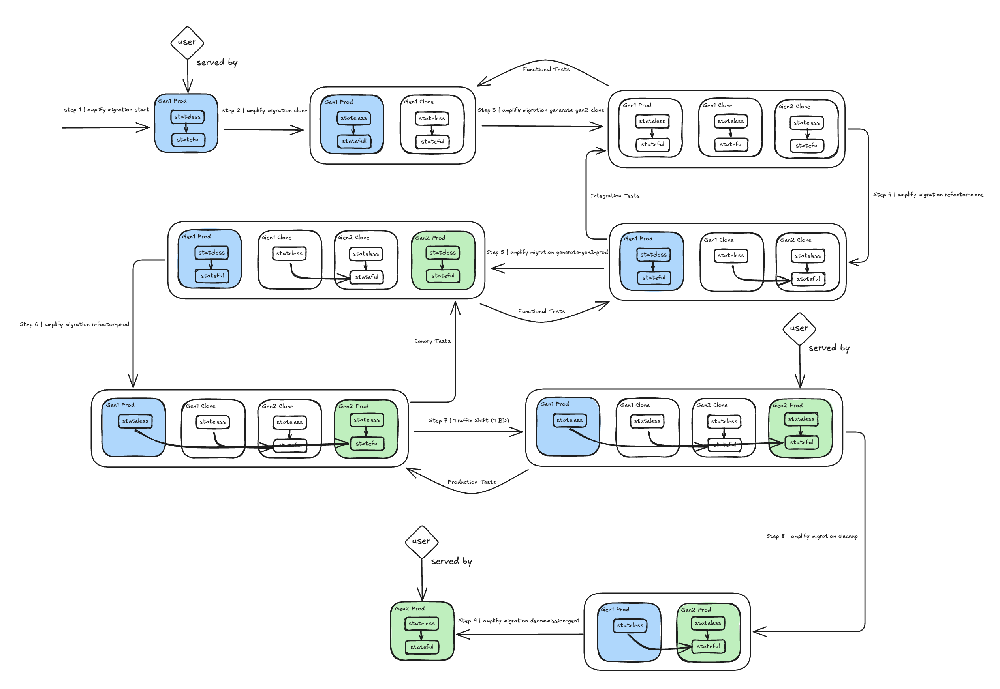

# 0002 Migrate Gen1 apps to Gen2

As we kick-off work on the migration project, define the overall flow our customers will follow.

> Note: This design is currently in development. Command names and specific implementation details 
are subject to change. We welcome feedback from the community to help shape the final implementation. 

## Key Points 

- Migration will be executed through a new amplify migration subcommand. 
- Code-generated Gen2 app can coexist alongside the Gen1 environment to support blue/green deployments. 
- Stateful resources (databases, etc.) are shared between environments.  
- The tool will not provide automation to perform data replication.  
- Guidance will be provided for customers who choose to perform data replication on their own.  
- Validation checks ensure a healthy state before critical operations. 
- Simulate cloned environment prior to executing on production. 
- All commands will be idempotent and support rollbacks. 

## Migration Flow 

The following is the entire migration flow, transitioning from a Gen1 (blue) environment to the Gen2 (green) app.  

### 1. Pre-Flight Phase 

> Command: `amplify migration start`

This phase ensures the Gen1 environment is in a healthy state prior to starting migration. It also locks the environment to prevent 
it from changing during the migration process. 

- Performs drift detection 
- Validates backend environment is in successful CloudFormation status. 
- Validates backend environment was deployed with the latest major version of the Gen1 CLI. 
- Apply stack policies on the Gen1 environment to prevent it from changing during migration. 

### 2. Simulation Phase 

This phase will execute all the migration commands on cloned environment, prior to executing them on production. It serves as a 
testing ground to increase confidence and clarify the migration process as a whole. 

> Command: `amplify migration clone`

Creates a Gen1 clone environment of the production environment. Internally it will: 

- amplify env add 
- amplify push 

> Command: `amplify migration generate-gen2-clone`

Code-generate a Gen2 app based on the Gen1 clone environment. 

- Auth, Data, Function, Storage will be code-generated to native Gen2 APIs. 
- Other categories that are not supported in Gen2 will be converted to CDK L1 code. 
- Custom resources copied over as is. 
- Overrides copied over as is. 
- GraphQL schemas copied as is and consumed as a string by the Gen2 app. 

> Command: amplify migration refactor-clone 

Redeploy the cloned environment such that the stateful resources can be accessed by both environments, 
but are managed only through the Gen2 app. 

- Preprocess template to resolve references to their concrete values. 
- Use CloudFormation stack refactoring APIs to move resources between stacks. 

### 3. Production Phase 

This phase begins exactly as the simulation phase but performed on the production environment.  

> Command: `amplify migration generate-gen2-prod`

Code-generate a Gen2 app based on the Gen1 prod environment. 

> Command: `amplify migration refactor-prod`

Redeploy the production environments such that the stateful resources can be accessed by both, 
but are managed only through the Gen2 app. 

After the stateful resources have moved, the Gen2 app can accept end-user traffic by performing DNS cutovers. Customers can switch 
back to the Gen1 environment if needed. 

- TBD on how DNS cutovers should be executed. 

### 4. Cleanup Phase 

This phase marks the end of the migration process. It can be executed at any time, 
according to the customer’s schedule.  

> Command: `amplify migration cleanup`

Deletes the 2 clone environments that were created during the simulation phase. 

Command: `amplify migration decommission-gen1`

Delete the Gen1 production environment. This command should be executed only when the Gen2 app has been verified to be fully 
functional and is already accepting end-user traffic. We will provide some validations to ensure this is safe: 

- No stateful resources are deleted. 
- Ensure Gen2 production environment exists and is in a healthy state. 
- Perform domain validations using the hosting APIs. 

## Migration Guide 

In addition to the migration tool, we will also provide a migration guide: 

- Step by step walkthrough of the migration process: What every command does exactly, why it is needed, and how to recover from failures. 
- Instructions on how to perform data replication if the customer so desires. (Note: not automation, just manual instructions). 
- Information about data seeding to test cloned environments. 
