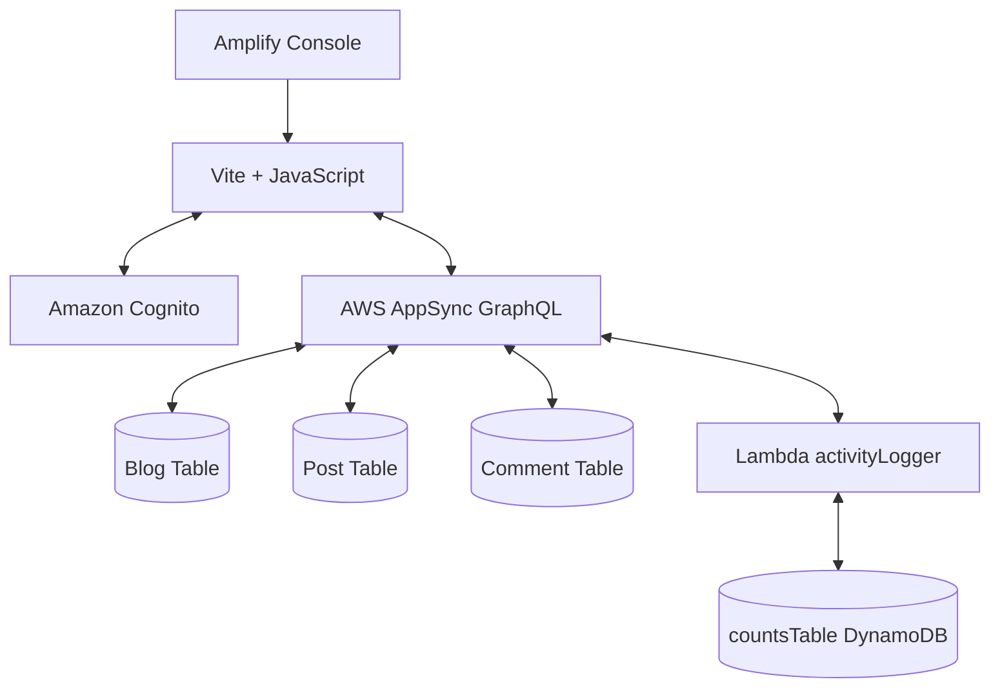

# Discus Project - Amplify Gen1 Setup Guide

A discussion application built with Amplify Gen1, featuring authentication, GraphQL API, Lambda functions, and DynamoDB storage.

## Categories

### api
GraphQL API with schema containing Blog, Post, and Comment models with one-to-many relationships. Includes custom queries and mutations for activity logging via Lambda function.

### auth
Cognito-based authentication using phone number.

### storage
DynamoDB table (countsTable) for storing user activity logs with partition key (postId), sort key (metricType), and global secondary index (metricIndex) for querying by activity type.

### function
Node.js Lambda function (activityLogger) that logs and retrieves user activity (login, post creation, views, comments) to/from DynamoDB countsTable.

### hosting
Amplify Console-managed hosting with automatic deployments from GitHub.

## Description

This is a simple discussion app that supports authentication. Each Blog can hold multiple Posts, and each Post can have multiple Comments in a nested relationship structure.

Users must sign up with phone number and email. Once authenticated, users can create Blogs, Posts, and Comments. The app tracks user activity including logins, post creation, views, and comments.

User activity is stored in a separate DynamoDB table (countsTable) and accessed via Lambda function through GraphQL queries/mutations. The Posts, Blogs, and Comments use DynamoDB tables auto-generated by Amplify's @model directive. CRUD operations are via GraphQL with AWS AppSync. Auth is managed through Cognito with IAM permissions auto-configured by Amplify CLI. Hosting is managed through Amplify Console.

---

### Step 0: Create Vite Project

```bash
npm create vite@latest
```

**Prompts:**
```
Project Name: discusapp
Framework: javascript
Use rolldown-vite (Experimental)?: No
Install with npm and start now? No
```

```bash
cd discus-project
npm install
```

### Step 1: Initialize Amplify

```bash
amplify init
```

**Prompts:**
```
Do you want to continue with Amplify Gen 1? (y/N) · yes
Why would you like to use Amplify Gen 1? · Prefer not to answer
Enter a name for the project: discusapp

The following configuration will be applied:
Project information
| Name: discusproject
| Environment: dev
| Default editor: Visual Studio Code
| App type: javascript
| Javascript framework: none
| Source Directory Path: src
| Distribution Directory Path: dist
| Build Command: npm run-script build
| Start Command: npm run-script start

? Initialize the project with the above configuration? Yes
Using default provider: awscloudformation
? Select the authentication method you want to use: AWS profile
```

### Step 2: Add Authentication

```bash
amplify add auth
```

**Prompts:**
```
Using service: Cognito, provided by: awscloudformation

The current configured provider is Amazon Cognito.

? Do you want to use the default authentication and security configuration? Manual configuration
? Select the authentication/authorization services that you want to use: User Sign-Up, Sign-In, connected with AWS IAM controls
? Provide a friendly name for your resource: discusAuth
? Enter a name for your identity pool: discusaIdentityPool
? Allow unauthenticated logins? No
? Do you want to enable 3rd party authentication providers in your identity pool? No
? Provide a name for your user pool: discusUserPool

Warning: you will not be able to edit these selections.

? How do you want users to be able to sign in? Phone Number
? Do you want to add User Pool Groups? No
? Do you want to add an admin queries API? No
? Multi-factor authentication (MFA) user login options: OFF
? Email based user registration/forgot password: Enabled (Requires per-user email entry at registration)
? Specify an email verification subject: Your verification code
? Specify an email verification message: Your verification code is {####}
? Do you want to override the default password policy for this User Pool? No

Warning: you will not be able to edit these selections.

? What attributes are required for signing up? Email
? Specify the app's refresh token expiration period (in days): 120
? Do you want to specify the user attributes this app can read and write? No
? Do you want to enable any of the following capabilities? (skip by pressing enter)
? Do you want to use an OAuth flow? No
? Do you want to configure Lambda Triggers for Cognito? No
```

### Step 3: Add GraphQL API

```bash
amplify add api
```

**Prompts:**
```
? Select from one of the below mentioned services: GraphQL
? Here is the GraphQL API that we will create. Select a setting to edit or continue: Continue
? Choose a schema template: One-to-many relationship (e.g., "Blogs" with "Posts" and "Comments")
? Do you want to edit the schema now? (Y/n): n
```

### Step 4: Add DynamoDB Storage

```bash
amplify add storage
```

**Prompts:**
```
? Select from one of the below mentioned services: NoSQL Database

Welcome to NoSQL DynamoDB database wizard.

✔ Provide a friendly name: countsTable
✔ Provide table name: countsTable

You can now add columns to the table.

✔ What would you like to name this column: postId
✔ Choose the data type: string
✔ Would you like to add another column? (Y/n): yes
✔ What would you like to name this column: metricType
✔ Choose the data type: string
✔ Would you like to add another column? (Y/n): yes
✔ What would you like to name this column: metadata
✔ Choose the data type: string
✔ Would you like to add another column? (Y/n): yes
✔ What would you like to name this column: updatedAt
✔ Choose the data type: string
✔ Would you like to add another column? (Y/n): no

Before you create the database, you must specify primary key.

✔ Choose partition key for the table: postId
✔ Do you want to add a sort key to your table? (Y/n): yes
✔ Choose sort key for the table: metricType

You can optionally add global secondary indexes.

✔ Do you want to add global secondary indexes to your table? (Y/n): yes
✔ Provide the GSI name: metricIndex
✔ Choose partition key for the GSI: metricType
✔ Do you want to add a sort key to your global secondary index? (Y/n): yes
✔ Choose sort key for the GSI: updatedAt
✔ Do you want to add more global secondary indexes to your table? (Y/n): no
✔ Do you want to add a Lambda Trigger for your Table? (y/N): no
```

### Step 5: Add Lambda Function

```bash
amplify add function
```

**Prompts:**
```
? Select which capability you want to add: Lambda function (serverless function)
? Provide an AWS Lambda function name: activityLogger
? Choose the runtime that you want to use: NodeJS
? Choose the function template that you want to use: Hello World
? Do you want to configure advanced settings? Yes
? Do you want to access other resources in this project from your Lambda function? Yes
? Select categories: storage (press spacebar to select)
? Select storage resource: countsTable (press spacebar to select)
? Select the operations you want to permit on countsTable: create, read, update, delete
? Do you want to invoke this function on a recurring schedule? No
? Do you want to enable Lambda layers for this function? No
? Do you want to configure environment variables for this function? No
? Do you want to configure secret values this function can access? No
? Choose the package manager that you want to use: NPM
? Do you want to edit the local lambda function now? No
```

### Step 6: Edit Lambda Code

Edit `amplify/backend/function/activityLogger/src/index.js`:

```javascript
const { DynamoDBClient } = require('@aws-sdk/client-dynamodb');
const { DynamoDBDocumentClient, PutCommand, QueryCommand } = require('@aws-sdk/lib-dynamodb');

const dynamoDB = DynamoDBDocumentClient.from(new DynamoDBClient({}));
const TABLE_NAME = process.env.STORAGE_COUNTSTABLE_NAME;

exports.handler = async (event) => {
  console.log(`EVENT: ${JSON.stringify(event)}`);
  
  const fieldName = event.info?.fieldName || (event.arguments.activityType ? 'logActivity' : 'getUserActivity');
  
  if (fieldName === 'logActivity') {
    const { userId, activityType, metadata } = event.arguments;
    const timestamp = new Date().toISOString();
    
    await dynamoDB.send(new PutCommand({
      TableName: TABLE_NAME,
      Item: {
        postId: `user-${userId}`,
        metricType: `${activityType}#${timestamp}`,
        updatedAt: timestamp,
        metadata: metadata || ''
      }
    }));
    
    return {
      userId,
      timestamp,
      activityType,
      metadata: metadata || ''
    };
  }
  
  if (fieldName === 'getUserActivity') {
    const { userId } = event.arguments;
    
    const result = await dynamoDB.send(new QueryCommand({
      TableName: TABLE_NAME,
      KeyConditionExpression: 'postId = :userId',
      ExpressionAttributeValues: { ':userId': `user-${userId}` },
      ScanIndexForward: false,
      Limit: 50
    }));
    
    return (result.Items || []).map(item => ({
      userId,
      timestamp: item.updatedAt,
      activityType: item.metricType.split('#')[0],
      metadata: item.metadata || ''
    }));
  }
};
```

> **Note:** Lambda handles both logging and fetching user activity.

### Step 7: Update GraphQL Schema

Replace `amplify/backend/api/YOUR_API_NAME/schema.graphql` with:

```graphql
# This "input" configures a global authorization rule to enable public access to
# all models in this schema. Learn more about authorization rules here: https://docs.amplify.aws/cli/graphql/authorization-rules
input AMPLIFY { globalAuthRule: AuthRule = { allow: public } } # FOR TESTING ONLY!

type Blog @model {
  id: ID!
  name: String!
  posts: [Post] @hasMany
}

type Post @model {
  id: ID!
  title: String!
  content: String
  blog: Blog @belongsTo
  comments: [Comment] @hasMany
}

type Comment @model {
  id: ID!
  post: Post @belongsTo
  content: String!
}

type Query {
  getUserActivity(userId: ID!): [ActivityLog] @function(name: "activityLogger-${env}")
}

type Mutation {
  logActivity(userId: ID!, activityType: String!, metadata: String): ActivityLog @function(name: "activityLogger-${env}")
}

type ActivityLog {
  userId: ID!
  timestamp: String!
  activityType: String!
  metadata: String
}
```

### Step 8: Deploy Backend

```bash
amplify push
```

**Prompts:**
```
✔ Are you sure you want to continue? (Y/n): yes

⚠️ WARNING: Edit your schema at /path.

? Do you want to generate code for your newly created GraphQL API: Yes
? Choose the code generation language target: typescript
? Enter the file name pattern of graphql queries, mutations and subscriptions: src/graphql/**/*.ts
? Do you want to generate/update all possible GraphQL operations - queries, mutations and subscriptions: Yes
? Enter maximum statement depth [increase from default if your schema is deeply nested]: 2
? Enter the file name for the generated code: src/API.ts
```

### Step 9: Install Frontend Dependencies

```bash
npm install aws-amplify
```

### Step 10: Add Application Files

The `index.html` and `main.js` files are included in the repository.

### Step 11: Push to GitHub

```bash
git add .
git commit -m "Initial commit"
git push origin main
```

### Step 12: Set Up Amplify Console Hosting

1. Go to [AWS Amplify Console](https://console.aws.amazon.com/amplify/)
2. Click **"New app"** → **"Host web app"**
3. Select **"GitHub"** as repository service
4. Authorize AWS Amplify to access your GitHub account
5. Select repository: `your-username/discus-project`
6. Select branch: `main`
7. In **"App settings"**:
   - App name: `discusproject`
   - Environment: `dev`
   - Select **"Connecting to existing backend"**
   - Choose your existing backend environment
8. Review build settings (auto-detected for Vite):
   - Build command: `npm run build`
   - Output directory: `dist`
9. Click **"Save and deploy"**
10. Wait for deployment to complete
11. Access your app via the provided Amplify domain URL

> **Note:** Every push to main branch will trigger automatic deployment.

### Step 13: Run Locally

```bash
npm run dev
```

---

## First Time User Setup

### 1. Sign Up in App

- **Phone number format:** `+1234567890` (include country code)
- **Email format:** `user@example.com`
- **Password:** (your secure password)
- Click **Sign Up**

### 2. Confirm User (AWS Console)

You'll be redirected to the SMS confirmation page. Manually confirm the user:

1. Go to **AWS Console** → **Cognito** → **User Pools**
2. Click on your user pool: `discusUserPool`
3. Find your user (shows up with the email)
4. Click on the user
5. Click **Actions** (Top-right) → **Confirm account**

Status changes from "UNCONFIRMED" to "CONFIRMED" ✅

### 3. Sign In

1. Go back to the app
2. Click **"Back to sign in"**
3. Enter your phone number and password
4. Click **Sign In**

---

## Architecture

- **Frontend:** Vite + JavaScript
- **Authentication:** Amazon Cognito (Phone Number + Email)
- **API:** AWS AppSync (GraphQL)
  - DynamoDB Tables: Blog, Post, Comment (auto-created by @model directive)
- **Functions:** AWS Lambda (activityLogger)
- **Storage:** Amazon DynamoDB (countsTable)
- **Hosting:** AWS Amplify Console


