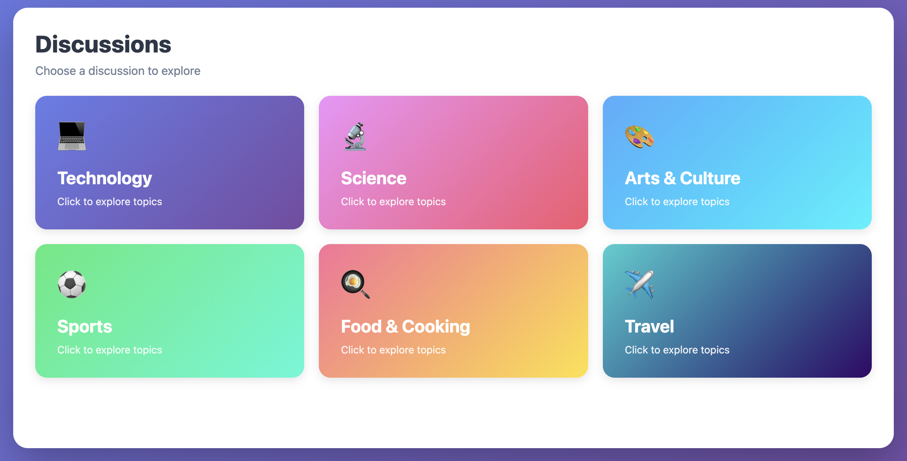

# Discussions (Amplify Gen1)



A discussion application built featuring authentication, GraphQL API, Lambda functions, and DynamoDB storage.

## Install Dependencies

```console
npm install
```

## Initialize Environment

```console
amplify init
````

```console
⚠️ For new projects, we recommend starting with AWS Amplify Gen 2, our new code-first developer experience. Get started at https://docs.amplify.aws/react/start/quickstart/
✔ Do you want to continue with Amplify Gen 1? (y/N) · yes
✔ Why would you like to use Amplify Gen 1? · Prefer not to answer
Note: It is recommended to run this command from the root of your app directory
? Enter a name for the project discussions
The following configuration will be applied:

Project information
| Name: discussions
| Environment: dev
| Default editor: Visual Studio Code
| App type: javascript
| Javascript framework: none
| Source Directory Path: src
| Distribution Directory Path: dist
| Build Command: npm run-script build
| Start Command: npm run-script start

? Initialize the project with the above configuration? No
? Enter a name for the environment main
? Choose your default editor: Visual Studio Code
✔ Choose the type of app that you're building · javascript
Please tell us about your project
? What javascript framework are you using none
? Source Directory Path:  src
? Distribution Directory Path: dist
? Build Command:  npm run-script build
? Start Command: npm run-script start
Using default provider  awscloudformation
? Select the authentication method you want to use: AWS profile

For more information on AWS Profiles, see:
https://docs.aws.amazon.com/cli/latest/userguide/cli-configure-profiles.html

? Please choose the profile you want to use default
```

## Add Categories

### Auth

Cognito-based authentication using phone number.

```console
amplify add auth
```

```console
? Do you want to use the default authentication and security configuration? Manual configuration
? Select the authentication/authorization services that you want to use: User Sign-Up, Sign-In, connected with AWS IAM controls (Enables per-user Storage features for image
s or other content, Analytics, and more)
? Provide a friendly name for your resource that will be used to label this category in the project: (accept default value)
? Enter a name for your identity pool. (accept default value)
? Allow unauthenticated logins? (Provides scoped down permissions that you can control via AWS IAM) No
? Do you want to enable 3rd party authentication providers in your identity pool? No
? Provide a name for your user pool: (accept default value)
? How do you want users to be able to sign in? Phone Number
? Do you want to add User Pool Groups? No
? Do you want to add an admin queries API? No
? Multifactor authentication (MFA) user login options: OFF
? Email based user registration/forgot password: Enabled (Requires per-user email entry at registration)
? Specify an email verification subject: Verification
? Specify an email verification message: Here is your verification code {####}
? Do you want to override the default password policy for this User Pool? No
? What attributes are required for signing up? Email, Phone Number (This attribute is not supported by Facebook, Login With Amazon, Sign in with Apple.)
? Specify the app's refresh token expiration period (in days): 120
? Do you want to specify the user attributes this app can read and write? No
? Do you want to enable any of the following capabilities? (enter)
? Do you want to use an OAuth flow? No
? Do you want to configure Lambda Triggers for Cognito? No
```

### Api

GraphQL API with schema containing:

- _Comment_ model with a `@belongsTo` relationship to the `_Post_` model.
- _Post_ model with a `@hasMany` relationship to the _Comment_ model and a `@belongsTo` relationship to the `_Topic_` model.
- _Topic_ model with a `@hasMany` relationship to the _Post_ model.
- _getUserActivity_ query that returns per user activity by invoking a lambda function using the `@function` directive.
- _logUserActivity_ mutation that records an activity for a user by invoking a lambda function using the `@function` directive.

```console
amplify add api
```

```console
? Select from one of the below mentioned services: GraphQL
? Here is the GraphQL API that we will create. Select a setting to edit or continue: Continue
? Choose a schema template: One-to-many relationship (e.g., "Blogs" with "Posts" and "Comments")
? Do you want to edit the schema now? (Y/n): no
```

### Storage

DynamoDB table for storing user activity logs with partition key, sort key, 
and global secondary index for querying by activity type.

```console
amplify add storage
```

```console
? Select from one of the below mentioned services: NoSQL Database

Welcome to the NoSQL DynamoDB database wizard
This wizard asks you a series of questions to help determine how to set up your NoSQL database table.

✔ Provide a friendly name · activity
✔ Provide table name · activity

You can now add columns to the table.

✔ What would you like to name this column · id
✔ Choose the data type · string
✔ Would you like to add another column? (Y/n) · yes
✔ What would you like to name this column · userId
✔ Choose the data type · string
✔ Would you like to add another column? (Y/n) · yes
✔ What would you like to name this column · activityType
✔ Choose the data type · string
✔ Would you like to add another column? (Y/n) · yes
✔ What would you like to name this column · timestamp
✔ Choose the data type · string
✔ Would you like to add another column? (Y/n) · no

Before you create the database, you must specify how items in your table are uniquely organized. You do this by specifying a primary key. The primary key uniquely identifies each item in the table so that no two items can have the same key. This can be an individual column, or a combination that includes a primary key and a sort key.

To learn more about primary keys, see:
https://docs.aws.amazon.com/amazondynamodb/latest/developerguide/HowItWorks.CoreComponents.html#HowItWorks.CoreComponents.PrimaryKey

✔ Choose partition key for the table · id
✔ Do you want to add a sort key to your table? (Y/n) · yes
✔ Choose sort key for the table · userId

You can optionally add global secondary indexes for this table. These are useful when you run queries defined in a different column than the primary key.
To learn more about indexes, see:
https://docs.aws.amazon.com/amazondynamodb/latest/developerguide/HowItWorks.CoreComponents.html#HowItWorks.CoreComponents.SecondaryIndexes

✔ Do you want to add global secondary indexes to your table? (Y/n) · yes
✔ Provide the GSI name · byUserId
✔ Choose partition key for the GSI · userId
✔ Do you want to add a sort key to your global secondary index? (Y/n) · yes
✔ Choose sort key for the GSI · timestamp
✔ Do you want to add more global secondary indexes to your table? (Y/n) · no
✔ Do you want to add a Lambda Trigger for your Table? (y/N) · no
```

### Function

**Node.js Lambda function that retrieves user activity from DynamoDB storage.**

```console
amplify add function
```

```console
? Select which capability you want to add: Lambda function (serverless function)
? Provide an AWS Lambda function name: fetchuseractivity
? Choose the runtime that you want to use: NodeJS
? Choose the function template that you want to use: Hello World

✅ Available advanced settings:
- Resource access permissions
- Scheduled recurring invocation
- Lambda layers configuration
- Environment variables configuration
- Secret values configuration

? Do you want to configure advanced settings? Yes
? Do you want to access other resources in this project from your Lambda function? Yes
? Select the categories you want this function to have access to. storage
? Storage has 4 resources in this project. Select the one you would like your Lambda to access activity
? Select the operations you want to permit on activity read

You can access the following resource attributes as environment variables from your Lambda function
        ENV
        REGION
        STORAGE_ACTIVITY_ARN
        STORAGE_ACTIVITY_NAME
        STORAGE_ACTIVITY_STREAMARN
? Do you want to invoke this function on a recurring schedule? No
? Do you want to enable Lambda layers for this function? No
? Do you want to configure environment variables for this function? No
? Do you want to configure secret values this function can access? No
✔ Choose the package manager that you want to use: · NPM
? Do you want to edit the local lambda function now? No
```

**Node.js Lambda function that records user activity to DynamoDB storage based on API triggers.**

First we need to copy over the schema so that the CLI correctly detects the available models.

```console
npm run configure-schema
```

```console
amplify add function
```

```console
? Select which capability you want to add: Lambda function (serverless function)
? Provide an AWS Lambda function name: recorduseractivity
? Choose the runtime that you want to use: NodeJS
? Choose the function template that you want to use: Lambda trigger
? What event source do you want to associate with Lambda trigger? Amazon DynamoDB Stream
? Choose a DynamoDB event source option Use API category graphql @model backed DynamoDB table(s) in the current Amplify project
? Choose the graphql @model(s) Topic, Post, Comment

✅ Available advanced settings:
- Resource access permissions
- Scheduled recurring invocation
- Lambda layers configuration
- Environment variables configuration
- Secret values configuration

? Do you want to configure advanced settings? Yes
? Do you want to access other resources in this project from your Lambda function? Yes
? Select the categories you want this function to have access to. storage
? Storage has 4 resources in this project. Select the one you would like your Lambda to access activity
? Select the operations you want to permit on activity create, read, update, delete

You can access the following resource attributes as environment variables from your Lambda function
        ENV
        REGION
        STORAGE_ACTIVITY_ARN
        STORAGE_ACTIVITY_NAME
        STORAGE_ACTIVITY_STREAMARN
? Do you want to invoke this function on a recurring schedule? No
? Do you want to enable Lambda layers for this function? No
? Do you want to configure environment variables for this function? No
? Do you want to configure secret values this function can access? No
✔ Choose the package manager that you want to use: · NPM
? Do you want to edit the local lambda function now? No
```

## Configure

```console
npm run configure
```

## Deploy Backend

```console
amplify push
```

```console
┌──────────┬─────────────────────────────┬───────────┬───────────────────┐
│ Category │ Resource name               │ Operation │ Provider plugin   │
├──────────┼─────────────────────────────┼───────────┼───────────────────┤
│ Auth     │ discussions8b7110c78b7110c7 │ Create    │ awscloudformation │
├──────────┼─────────────────────────────┼───────────┼───────────────────┤
│ Api      │ discussions                 │ Create    │ awscloudformation │
├──────────┼─────────────────────────────┼───────────┼───────────────────┤
│ Storage  │ activity                    │ Create    │ awscloudformation │
├──────────┼─────────────────────────────┼───────────┼───────────────────┤
│ Function │ fetchuseractivity           │ Create    │ awscloudformation │
├──────────┼─────────────────────────────┼───────────┼───────────────────┤
│ Function │ recorduseractivity          │ Create    │ awscloudformation │
└──────────┴─────────────────────────────┴───────────┴───────────────────┘

✔ Are you sure you want to continue? (Y/n) · yes
? Do you want to generate code for your newly created GraphQL API No
```

## Publish Frontend

To publish the frontend, we leverage the Amplify hosting console. First push everything to the `main` branch:

```console
git add .
git commit -m "feat: gen1"
git push origin main
```

Next, accept all default values and follow the getting started wizard to connect your repo and branch.


Wait for the deployment to finish successfully.

### Create A User

Since our AWS accounts are not configured to send SMS messages, we must confirm user creation 
directly via the cognito user pool.

First, login to the app itself and click *Sign Up*, fill the form and click *Sign Up* again. Normally you 
would get a SMS message with a confirmation code; to bypass that:

1. Go to *AWS Console* → *Cognito* → *User Pools*
2. Click on your user pool: `discussions<hash>_userpool_<hash>-main`
3. Click on your user (shows up with the email)
4. Click *Actions* → *Confirm account*
5. Go to *User Attributes* → *Edit*.
6. Check *Mark phone number as verified* and *Mark email address as verified*
7. Click *Save changes*


Then, reload the app and sign in with the details you provided. You can repeat 
this process for any number of users.

## Migrating to Gen2

> Based on https://github.com/aws-amplify/amplify-cli/blob/gen2-migration/GEN2_MIGRATION_GUIDE.md

> [!NOTE]
> Migration is not fully supported for this app yet due to a missing feature for refactoring DynamoDB storage tables.
> This guide ends at the `generate` step.

First add the experimental amplify CLI package that provides the migration commands to your `devDependencies`.

**Edit in `package.json`:**

```diff
+ "@aws-amplify/cli-internal-gen2-migration-experimental-alpha": "^0.4.0"
```

```console
npm install
```

Now run them:

```console
npx amplify gen2-migration lock
```

```console
git checkout -b gen2-main
npx amplify gen2-migration generate
```

**Edit in `./amplify/backend/data/resource.ts`:**

```diff
- branchName: "main"
+ branchName: "gen2-main"
```

**Edit in `./amplify/backend.ts`:**

```diff
+ import { DynamoEventSource } from 'aws-cdk-lib/aws-lambda-event-sources';
+ import { StartingPosition } from 'aws-cdk-lib/aws-lambda';
```

```diff
+ backend.fetchuseractivity.addEnvironment('STORAGE_ACTIVITY_ARN', activity.tableArn);
+ backend.fetchuseractivity.addEnvironment('STORAGE_ACTIVITY_NAME', activity.tableName);
+ backend.fetchuseractivity.addEnvironment('STORAGE_ACTIVITY_STREAMARN', activity.tableStreamArn!);
+ activity.grantReadData(backend.fetchuseractivity.resources.lambda);

+ backend.recorduseractivity.addEnvironment('STORAGE_ACTIVITY_ARN', activity.tableArn);
+ backend.recorduseractivity.addEnvironment('STORAGE_ACTIVITY_NAME', activity.tableName);
+ backend.recorduseractivity.addEnvironment('STORAGE_ACTIVITY_STREAMARN', activity.tableStreamArn!);
+ activity.grantReadWriteData(backend.recorduseractivity.resources.lambda);

+ for (const model of ['Comment', 'Post', 'Topic']) {
+   const table = backend.data.resources.tables[model];
+   backend.recorduseractivity.resources.lambda.addEventSource(new DynamoEventSource(table, { startingPosition: StartingPosition.LATEST }));
+   table.grantStreamRead(backend.recorduseractivity.resources.lambda.role!);
+   table.grantTableListStreams(backend.recorduseractivity.resources.lambda.role!);
+ }
```

**Edit in `./amplify/backend/storage/fetchuseractivity/index.js`:**

```diff
- exports.handler = async (event) => {
+ export async function handler(event) {
```

**Edit in `./amplify/backend/storage/recorduseractivity/index.js`:**

```diff
- exports.handler = async (event) => {
+ export async function handler(event) {
```

**Edit in `./src/main.js`:**

```diff
- import awsconfig from './aws-exports';
+ import awsconfig from '../amplify_outputs.json';
```

```console
git add .
git commit -m "feat: migrate to gen2"
git push origin gen2-main
```

Now connect the `gen2-main` branch to the hosting service:


Wait for the deployment to finish successfully.
