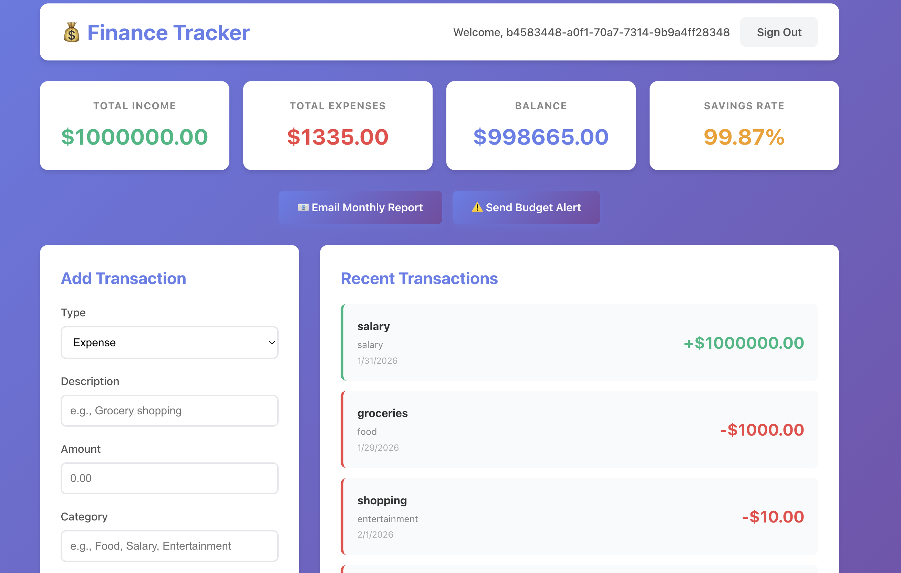
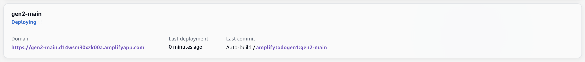

# Finance Tracker (Amplify Gen1)



A personal finance tracking application built with Amplify Gen1, featuring authentication,
GraphQL API, Lambda functions, S3 storage, DynamoDB, and CDK custom resources.

## Install Dependencies

```console
npm install
```

## Initialize Environment

```console
amplify init
```

```console
⚠️ For new projects, we recommend starting with AWS Amplify Gen 2, our new code-first developer experience. Get started at https://docs.amplify.aws/react/start/quickstart/
✔ Do you want to continue with Amplify Gen 1? (y/N) · yes
✔ Why would you like to use Amplify Gen 1? · Prefer not to answer
Note: It is recommended to run this command from the root of your app directory
? Enter a name for the project financetracker
The following configuration will be applied:

Project information
| Name: financetracker
| Environment: dev
| Default editor: Visual Studio Code
| App type: javascript
| Javascript framework: react
| Source Directory Path: src
| Distribution Directory Path: build
| Build Command: npm run-script build
| Start Command: npm run-script start

? Initialize the project with the above configuration? No
? Enter a name for the environment main
? Choose your default editor: Visual Studio Code
✔ Choose the type of app that you're building · javascript
Please tell us about your project
? What javascript framework are you using react
? Source Directory Path:  src
? Distribution Directory Path: dist
? Build Command:  npm run-script build
? Start Command: npm run-script start
Using default provider  awscloudformation
? Select the authentication method you want to use: AWS profile

For more information on AWS Profiles, see:
https://docs.aws.amazon.com/cli/latest/userguide/cli-configure-profiles.html

? Please choose the profile you want to use default
```

## Add Categories

### Api

GraphQL API with schema containing:

- _Transaction_ model for tracking income and expenses with category, amount, date, and optional receipt URL.
- _Budget_ model for setting monthly spending limits per category.
- _FinancialSummary_ model for storing monthly income, expense, and balance totals.
- _calculateFinancialSummary_ query that computes financial metrics by invoking a Lambda function using the `@function` directive.
- _sendMonthlyReport_ and _sendBudgetAlert_ mutations that trigger notifications via a Lambda function using the `@function` directive.

Uses Amazon Cognito User Pools for default authorization, with API key as an additional auth type.

```console
amplify add api
```

```console
? Select from one of the below mentioned services: GraphQL
? Here is the GraphQL API that we will create. Select a setting to edit or continue Continue
? Choose a schema template: One-to-many relationship (e.g., "Blogs" with "Posts" and "Comments")
✔ Do you want to edit the schema now? (Y/n) · no
```

### Auth

Cognito-based authentication using email with default configuration.

```console
amplify add auth
```

```console
Using service: Cognito, provided by: awscloudformation
 The current configured provider is Amazon Cognito.
 Do you want to use the default authentication and security configuration? Default configuration
 Warning: you will not be able to edit these selections.
 How do you want users to be able to sign in? Email
 Do you want to configure advanced settings? No, I am done.
```

### Storage

S3 bucket for storing receipt images and financial documents. Authenticated users have full access; guest users have read-only access.

```console
amplify add storage
```

```console
? Select from one of the below mentioned services: Content (Images, audio, video, etc.)
✔ Provide a friendly name for your resource that will be used to label this category in the project: · s3c787456e
✔ Provide bucket name: · financetracker1c469bed6bfe46528cbd48078b7b0c03
✔ Who should have access: · Auth and guest users
✔ What kind of access do you want for Authenticated users? · create/update, read, delete
✔ What kind of access do you want for Guest users? · read
✔ Do you want to add a Lambda Trigger for your S3 Bucket? (y/N) · no
```

### Custom: SNS Topics (`customfinance`)

CDK custom resource that creates two SNS topics for budget alerts and monthly reports,
with email subscriptions managed at the infrastructure level.

```console
amplify add custom
```

```console
✔ How do you want to define this custom resource? · AWS CDK
✔ Provide a name for your custom resource · customfinance
✔ Do you want to edit the CDK stack now? (Y/n) · no
```

### Custom: VTL Resolver (`customresolver`)

A second CDK custom resource that creates an AppSync VTL resolver for querying transactions
by category. This depends on the GraphQL API and tests the migration of custom resolvers
with API dependencies.

```console
amplify add custom
```

```console
✔ How do you want to define this custom resource? · AWS CDK
✔ Provide a name for your custom resource · customresolver
✔ Do you want to edit the CDK stack now? (Y/n) · no
```

After creation, register the API dependency by editing `amplify/backend/backend-config.json`
to add `customresolver` with `dependsOn` on `api/financetracker`:

```json
"customresolver": {
  "dependsOn": [
    {
      "attributes": ["GraphQLAPIIdOutput", "GraphQLAPIEndpointOutput", "GraphQLAPIKeyOutput"],
      "category": "api",
      "resourceName": "financetracker"
    }
  ],
  "providerPlugin": "awscloudformation",
  "service": "customCDK"
}
```

### Function

Node.js Lambda function for computing financial summaries and sending budget notifications, with access to the CDK custom resource.

```console
amplify add function
```

```console
? Select which capability you want to add: Lambda function (serverless function)
? Provide an AWS Lambda function name: financetracker7f7c2ad7
? Choose the runtime that you want to use: NodeJS
? Choose the function template that you want to use: Hello World

✅ Available advanced settings:
- Resource access permissions
- Scheduled recurring invocation
- Lambda layers configuration
- Environment variables configuration
- Secret values configuration

? Do you want to configure advanced settings? Yes
? Do you want to access other resources in this project from your Lambda function? Yes
? Select the categories you want this function to have access to. custom
? Custom has 2 resources in this project. Select the one you would like your Lambda to access customfinance
? Select the operations you want to permit on customfinance create, read, update, delete

⚠️ custom category does not support resource policies yet.

You can access the following resource attributes as environment variables from your Lambda function
        ENV
        REGION
? Do you want to invoke this function on a recurring schedule? No
? Do you want to enable Lambda layers for this function? No
? Do you want to configure environment variables for this function? No
? Do you want to configure secret values this function can access? No
✔ Choose the package manager that you want to use: · NPM
? Do you want to edit the local lambda function now? No
```

The CLI only handles basic resource access permissions. The custom IAM policies and environment variables are already included in the repo and will be copied into the function directory by `npm run configure`. However, the dependency configuration needs to be added manually. The CLI does not provide a way to specify which custom resource output attributes (`BudgetAlertTopicArn`, `MonthlyReportTopicArn`) the function depends on — this must be configured by editing the file directly.


**Add to `./amplify/backend/backend-config.json`** under the function's `dependsOn` array:

```json
{
  "category": "custom",
  "resourceName": "customfinance",
  "attributes": ["BudgetAlertTopicArn", "MonthlyReportTopicArn"]
}
```

Next, update the function to grant it access to the DynamoDB Transaction table:

```console
amplify update function
```

```console
? Select the Lambda function you want to update financetracker7f7c2ad7
General information
- Name: financetracker7f7c2ad7
- Runtime: nodejs

Resource access permission
- Not configured

Scheduled recurring invocation
- Not configured

Lambda layers
- Not configured

Environment variables:
- Not configured

Secrets configuration
- Not configured

? Which setting do you want to update? Resource access permissions
? Select the categories you want this function to have access to. storage
? Storage has 4 resources in this project. Select the one you would like your Lambda to access Transaction:@model(appsync)
? Select the operations you want to permit on Transaction:@model(appsync) create, read, update, delete

You can access the following resource attributes as environment variables from your Lambda function
        API_FINANCETRACKER_GRAPHQLAPIIDOUTPUT
        API_FINANCETRACKER_TRANSACTIONTABLE_ARN
        API_FINANCETRACKER_TRANSACTIONTABLE_NAME
? Do you want to edit the local lambda function now? No
```

## Configure

```console
npm run configure
```
## Deploy Backend

```console
amplify push
```

```console
┌──────────┬──────────────────────────┬───────────┬───────────────────┐
│ Category │ Resource name            │ Operation │ Provider plugin   │
├──────────┼──────────────────────────┼───────────┼───────────────────┤
│ Auth     │ financetracker96b98779   │ Create    │ awscloudformation │
├──────────┼──────────────────────────┼───────────┼───────────────────┤
│ Api      │ financetracker           │ Create    │ awscloudformation │
├──────────┼──────────────────────────┼───────────┼───────────────────┤
│ Storage  │ s3c787456e               │ Create    │ awscloudformation │
├──────────┼──────────────────────────┼───────────┼───────────────────┤
│ Custom   │ customfinance            │ Create    │ awscloudformation │
├──────────┼──────────────────────────┼───────────┼───────────────────┤
│ Custom   │ customresolver           │ Create    │ awscloudformation │
├──────────┼──────────────────────────┼───────────┼───────────────────┤
│ Function │ financetracker7f7c2ad7   │ Create    │ awscloudformation │
└──────────┴──────────────────────────┴───────────┴───────────────────┘

✔ Are you sure you want to continue? (Y/n) · yes
```

## Publish Frontend

To publish the frontend, we leverage the Amplify hosting console. First push everything to the `main` branch:

```console
git add .
git commit -m "feat: gen1"
git push origin main
```

Next, accept all default values and follow the getting started wizard to connect your repo and branch. Wait for the deployment to finish successfully.


## Migrating to Gen2

> Based on https://github.com/aws-amplify/amplify-cli/blob/gen2-migration/GEN2_MIGRATION_GUIDE.md

First install the experimental CLI package that provides the new commands:

```console
npm install --no-save @aws-amplify/cli-internal-gen2-migration-experimental-alpha
```

Now run them:

```console
npx amplify gen2-migration lock
```

```console
git checkout -b gen2-main
npx amplify gen2-migration generate
```

### Post-Generate Changes

After running `gen2-migration generate`, the following manual changes are needed to get the Gen2 branch to deploy successfully.

#### 1. Lambda Handler: Convert to ESM

In `amplify/function/financetrackerc3d67c94/index.js`, convert CommonJS to ESM syntax:

- Change `require()` calls to `import` statements:

```diff
-const { DynamoDBClient, ListTablesCommand } = require('@aws-sdk/client-dynamodb');
-const { DynamoDBDocumentClient, ScanCommand } = require('@aws-sdk/lib-dynamodb');
-const { SNSClient, PublishCommand } = require('@aws-sdk/client-sns');
+import { DynamoDBClient, ListTablesCommand } from '@aws-sdk/client-dynamodb';
+import { DynamoDBDocumentClient, ScanCommand } from '@aws-sdk/lib-dynamodb';
+import { SNSClient, PublishCommand } from '@aws-sdk/client-sns';
```

- Change `exports.handler` to `export const handler`:

```diff
-exports.handler = async (event) => {
+export const handler = async (event) => {
```

#### 2. Update Frontend Config Import

In `src/main.tsx`, update the Amplify config import to use the Gen2 outputs file:

```diff
-import amplifyconfig from './amplifyconfiguration.json';
+import amplifyconfig from '../amplify_outputs.json';
```

#### 3. Root `package.json`: Install AWS SDK and Upgrade TypeScript

Amplify Gen 2 uses esbuild to bundle Lambda functions. esbuild couldn't resolve
`@aws-sdk/client-dynamodb`, `@aws-sdk/lib-dynamodb`, and `@aws-sdk/client-sns` because
they weren't installed. The Gen 2 `defineFunction()` API's `FunctionBundlingOptions` only
supports `minify` — there is no `externalPackages` or `nodeModules` option to mark them
as external.

Install the SDK packages as dependencies so esbuild can resolve and bundle them:

```bash
npm install @aws-sdk/client-dynamodb @aws-sdk/lib-dynamodb @aws-sdk/client-sns
```

Also upgrade TypeScript. The tsconfig uses `erasableSyntaxOnly` which requires TS 5.8+:

```diff
-  "typescript": "^4.9.5",
+  "typescript": "~5.8.0",
```

Then run `npm install` to update `package-lock.json`.

#### 4. Grant Lambda SNS Publish Permission

In `amplify/backend.ts`, the Gen 2 Lambda doesn't have IAM permission to publish to SNS
topics. In Gen 1 this was handled by `custom-policies.json`, which doesn't apply in Gen 2.

Add the SNS publish policy to the Lambda role:

```ts
import { PolicyStatement } from 'aws-cdk-lib/aws-iam';

backend.financetrackere30b1453.resources.lambda.addToRolePolicy(
  new PolicyStatement({
    actions: ['sns:Publish'],
    resources: ['*'],
  })
);
```

---

Commit and push the changes:

```console
git add .
git commit -m "feat: migrate to gen2"
git push origin gen2-main
```

Now connect the `gen2-main` branch to the hosting service and wait for the deployment to finish successfully.




> **Note:** The `gen2-migration refactor` command is not currently supported for this app.
