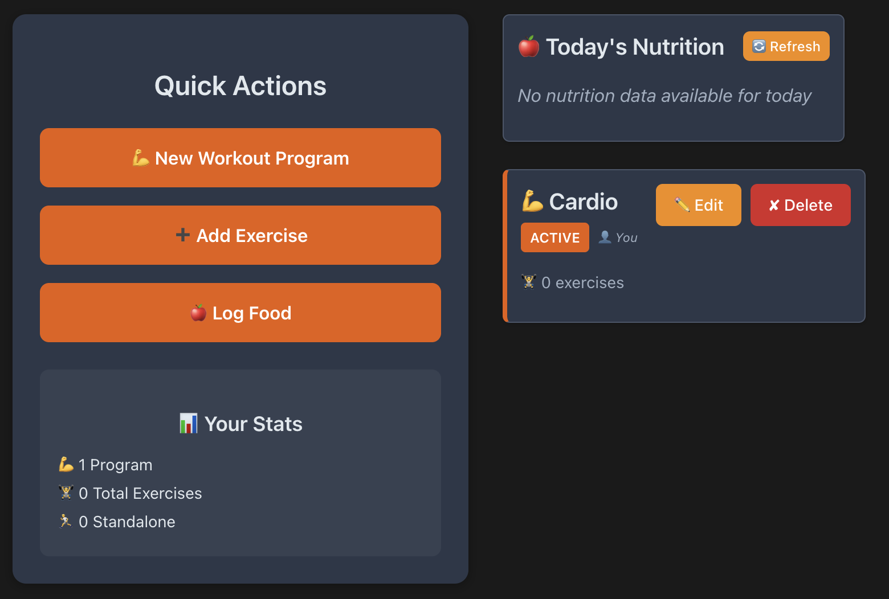
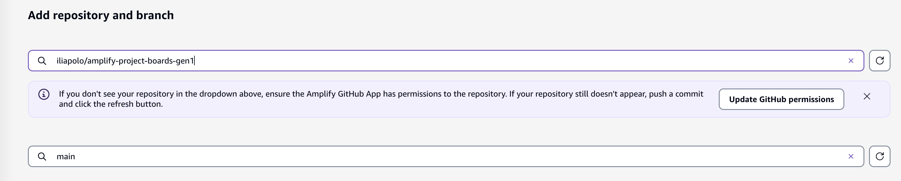
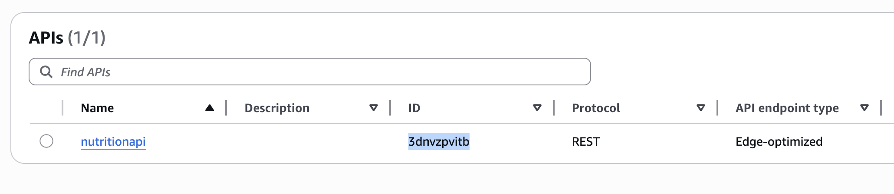
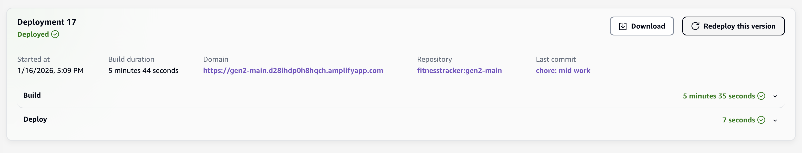

# Fitness Tracker (Amplify Gen1)



A fitness tracking application built. Log your meals, track your workout programs and exercises done.

## Install Dependencies

```console
npm install
```

## Initialize Environment

```console
amplify init
````

```console
⚠️ For new projects, we recommend starting with AWS Amplify Gen 2, our new code-first developer experience. Get started at https://docs.amplify.aws/react/start/quickstart/
✔ Do you want to continue with Amplify Gen 1? (y/N) · yes
✔ Why would you like to use Amplify Gen 1? · Prefer not to answer
Note: It is recommended to run this command from the root of your app directory
? Enter a name for the project fitnesstracker
The following configuration will be applied:

Project information
| Name: fitnesstracker
| Environment: dev
| Default editor: Visual Studio Code
| App type: javascript
| Javascript framework: none
| Source Directory Path: src
| Distribution Directory Path: dist
| Build Command: npm run-script build
| Start Command: npm run-script start

? Initialize the project with the above configuration? No
? Enter a name for the environment main
? Choose your default editor: Visual Studio Code
✔ Choose the type of app that you're building · javascript
Please tell us about your project
? What javascript framework are you using react
? Source Directory Path:  src
? Distribution Directory Path: dist
? Build Command:  npm run-script build
? Start Command: npm run-script start
Using default provider  awscloudformation
? Select the authentication method you want to use: AWS profile

For more information on AWS Profiles, see:
https://docs.aws.amazon.com/cli/latest/userguide/cli-configure-profiles.html

? Please choose the profile you want to use default
```

## Add Categories

### Auth

```console
amplify add auth
```

```console
? Do you want to use the default authentication and security configuration? Manual configuration
? Select the authentication/authorization services that you want to use: User Sign-Up, Sign-In, connected with AWS IAM controls (Enables per-user Storage features for i
mages or other content, Analytics, and more)
? Provide a friendly name for your resource that will be used to label this category in the project: (accept default value)
? Enter a name for your identity pool. (accept default value)
? Allow unauthenticated logins? (Provides scoped down permissions that you can control via AWS IAM) No
? Do you want to enable 3rd party authentication providers in your identity pool? No
? Provide a name for your user pool: (accept default value)
? How do you want users to be able to sign in? Username
? Do you want to add User Pool Groups? No
? Do you want to add an admin queries API? No
? Multifactor authentication (MFA) user login options: OFF
? Email based user registration/forgot password: Enabled (Requires per-user email entry at registration)
? Specify an email verification subject: Your verification code
? Specify an email verification message: Your verification code is {####}
? Do you want to override the default password policy for this User Pool? No
? What attributes are required for signing up? Email
? Specify the app's refresh token expiration period (in days): 30
? Do you want to specify the user attributes this app can read and write? No
? Do you want to enable any of the following capabilities? (enter)
? Do you want to use an OAuth flow? No
? Do you want to configure Lambda Triggers for Cognito? Yes
? Which triggers do you want to enable for Cognito Pre Sign-up
? What functionality do you want to use for Pre Sign-up Sign-Up email filtering (allowlist)
✔ Enter a comma-delimited list of allowed email domains (example: 'mydomain.com, myotherdomain.com'). · amazon.com
? Do you want to edit your custom function now? No
```

### Api

```console
amplify add api
```

```console
? Select from one of the below mentioned services: GraphQL
? Here is the GraphQL API that we will create. Select a setting to edit or continue Authorization modes: API key (default, expiration time: 7 days from now)
? Choose the default authorization type for the API Amazon Cognito User Pool
? Configure additional auth types? Yes
? Choose the additional authorization types you want to configure for the API API key
✔ Enter a description for the API key: · graphql
✔ After how many days from now the API key should expire (1-365): · 7
? Here is the GraphQL API that we will create. Select a setting to edit or continue Continue
? Choose a schema template: One-to-many relationship (e.g., “Blogs” with “Posts” and “Comments”)
✔ Do you want to edit the schema now? (Y/n) · no
```

```console
npm run configure-schema
```

```console
amplify add api
```

```console
? Select from one of the below mentioned services: REST
✔ Provide a friendly name for your resource to be used as a label for this category in the project: · nutritionapi
✔ Provide a path (e.g., /book/{isbn}): · /nutrition/log
✔ Choose a Lambda source · Create a new Lambda function
? Provide an AWS Lambda function name: lognutrition
? Choose the runtime that you want to use: NodeJS
? Choose the function template that you want to use: Serverless ExpressJS function (Integration with API Gateway)

✅ Available advanced settings:
- Resource access permissions
- Scheduled recurring invocation
- Lambda layers configuration
- Environment variables configuration
- Secret values configuration

? Do you want to configure advanced settings? Yes
? Do you want to access other resources in this project from your Lambda function? Yes
? Select the categories you want this function to have access to. storage
? Storage has 4 resources in this project. Select the one you would like your Lambda to access Meal:@model(appsync)
? Select the operations you want to permit on Meal:@model(appsync) create, read, update, delete

You can access the following resource attributes as environment variables from your Lambda function
        API_FITNESSTRACKER_GRAPHQLAPIIDOUTPUT
        API_FITNESSTRACKER_MEALTABLE_ARN
        API_FITNESSTRACKER_MEALTABLE_NAME
        ENV
        REGION
? Do you want to invoke this function on a recurring schedule? No
? Do you want to enable Lambda layers for this function? No
? Do you want to configure environment variables for this function? No
? Do you want to configure secret values this function can access? No
✔ Choose the package manager that you want to use: · NPM
? Do you want to edit the local lambda function now? No
✔ Restrict API access? (Y/n) · yes
✔ Who should have access? · Authenticated users only
✔ What permissions do you want to grant to Authenticated users? · create, read, update, delete
✔ Do you want to add another path? (y/N) · no
```

## Configure

```console
npm run configure
```

## Deploy Backend

```console
amplify push
```

```console
┌──────────┬─────────────────────────────────────────┬───────────┬───────────────────┐
│ Category │ Resource name                           │ Operation │ Provider plugin   │
├──────────┼─────────────────────────────────────────┼───────────┼───────────────────┤
│ Function │ fitnesstracker6d664d176d664d17PreSignup │ Create    │ awscloudformation │
├──────────┼─────────────────────────────────────────┼───────────┼───────────────────┤
│ Function │ lognutrition                            │ Create    │ awscloudformation │
├──────────┼─────────────────────────────────────────┼───────────┼───────────────────┤
│ Auth     │ fitnesstracker6d664d176d664d17          │ Create    │ awscloudformation │
├──────────┼─────────────────────────────────────────┼───────────┼───────────────────┤
│ Api      │ fitnesstracker                          │ Create    │ awscloudformation │
├──────────┼─────────────────────────────────────────┼───────────┼───────────────────┤
│ Api      │ nutritionapi                            │ Create    │ awscloudformation │
└──────────┴─────────────────────────────────────────┴───────────┴───────────────────┘

? Are you sure you want to continue? (Y/n) › 
```

## Publish Frontend

To publish the frontend, we leverage the Amplify hosting console. First push everything to the `main` branch:

```console
git add .
git commit -m "feat: gen1"
git push origin main
```

Next, accept all default values and follow the getting started wizard to connect your repo and branch.





Wait for the deployment to finish successfully.

## Migrating to Gen2

> Based on https://github.com/aws-amplify/amplify-cli/blob/gen2-migration/GEN2_MIGRATION_GUIDE.md

First and install the experimental CLI package the provides the new commands:

```console
npm install --no-save @aws-amplify/cli-internal-gen2-migration-experimental-alpha
```

Now run them:

```console
npx amplify gen2-migration lock
```

```console
git checkout -b gen2-main
npx amplify gen2-migration generate
```

**Edit in `./amplify/data/resource.ts`:**

```diff
- branchName: "main"
+ branchName: "gen2-main"
```

```diff
- defaultAuthorizationMode: "userPool",
+ defaultAuthorizationMode: "userPool",
+ apiKeyAuthorizationMode: { expiresInDays: 7 }
```

**Edit in `./amplify/backend.ts`:**

```diff
+ import { RestApi, LambdaIntegration, AuthorizationType, Cors } from "aws-cdk-lib/aws-apigateway";
+ import { Policy, PolicyStatement } from "aws-cdk-lib/aws-iam";
+ import { Stack } from "aws-cdk-lib";
```

```diff
+ const restApiStack = backend.createStack("rest-api-stack");
+ const restApi = new RestApi(restApiStack, "RestApi", {
+     restApiName: `nutritionapi-${branchName}`,
+     defaultCorsPreflightOptions: {
+         allowMethods: Cors.ALL_METHODS,
+         allowOrigins: Cors.ALL_ORIGINS,
+         allowHeaders: Cors.DEFAULT_HEADERS
+     },
+ });
+ 
+ const lambdaIntegration = new LambdaIntegration(backend.lognutrition.resources.lambda);
+ 
+ const nutritionlog = restApi.root.addResource('nutrition').addResource('log', { defaultMethodOptions: { authorizationType: AuthorizationType.IAM } });
+ nutritionlog.addMethod('GET', lambdaIntegration);
+ nutritionlog.addMethod('POST', lambdaIntegration);
+ nutritionlog.addMethod('DELETE', lambdaIntegration);
+ nutritionlog.addMethod('PUT', lambdaIntegration);
+ 
+ nutritionlog.addProxy({ anyMethod: true, defaultIntegration: lambdaIntegration });
+ 
+ const apiPolicy = new Policy(restApiStack, "ApiPolicy", { statements: [new PolicyStatement({ actions: ["execute-api:Invoke"], resources: [`${restApi.arnForExecuteApi("*", "/*")}`] })] });
+ backend.auth.resources.authenticatedUserIamRole.attachInlinePolicy(apiPolicy);
+ backend.addOutput({
+     custom: {
+         API: {
+             [restApi.restApiName]: {
+                 endpoint: restApi.url,
+                 region: Stack.of(restApi).region,
+                 apiName: restApi.restApiName,
+             }
+         }
+     },
+ });
```

Navigate to the Amplify Console to find the `<gen1-rest-api-id>` and `<gen1-root-resource-id>` on the ApiGateway AWS Console. For example:




```diff
+ const gen1RestApi = RestApi.fromRestApiAttributes(restApiStack, "Gen1RestApi", {
+     restApiId: '<gen1-rest-api-id>',
+     rootResourceId: '<gen1-root-resource-id>',
+ })
+ const gen1RestApiPolicy = new Policy(restApiStack, "Gen1RestApiPolicy", {
+     statements: [
+         new PolicyStatement({
+             actions: ["execute-api:Invoke"],
+             resources: [`${gen1RestApi.arnForExecuteApi("*", "/*")}`]
+         })
+     ]
+ });
+ backend.auth.resources.authenticatedUserIamRole.attachInlinePolicy(gen1RestApiPolicy);
```

**Edit in `./amplify/auth/fitnesstrackerd21d4fcdd21d4fcdPreSignup/resource.ts`:**

> Note: The hash value after `fitnesstracker` changes for each app; you will have a different one.

```diff
- entry: "./index.js",
+ entry: "./index.js",
+ resourceGroupName: 'auth',
```

**Edit in `./amplify/function/lognutrition/resource.ts`:**

```diff
- entry: "./index.js",
+ entry: "./index.js",
+ resourceGroupName: 'data',
```

**Edit in `./amplify/function/lognutrition/index.js`:**

```diff
- exports.handler = (event, context) => {
+ export async function handler(event, context) {
```

**Edit in `./amplify/function/fitnesstrackerd21d4fcdd21d4fcdPreSignup/src/index.js`:**

> Note: The hash value after `fitnesstracker` changes for each app; you will have a different one.

```diff
- const modules = moduleNames.map((name) => require(`./${name}`));
+ const modules = [require('./email-filter-allowlist')]
```

```diff
- exports.handler = (event, context) => {
+ export async function handler(event, context) {
```

**Edit in `./amplify/function/fitnesstrackerd21d4fcdd21d4fcdPreSignup/src/email-filter-allowlist.js`:**

> Note: The hash value after `fitnesstracker` changes for each app; you will have a different one.

```diff
- exports.handler = (event) => {
+ export async function handler(event) {
```

**Edit in `./src/App.tx`:**

```diff
- apiName: 'nutritionapi',
+ apiName: 'nutritionapi-gen2-main',
```

**Edit in `./src/main.tsx`:**

```diff
- import amplifyconfig from './amplifyconfiguration.json';
+ import outputs from '../amplify_outputs.json';
+ import { parseAmplifyConfig } from "aws-amplify/utils";
```

```diff
- Amplify.configure(amplifyconfig);
+ const amplifyConfig = parseAmplifyConfig(outputs);
+ 
+ Amplify.configure(
+   {
+     ...amplifyConfig,
+     API: {
+       ...amplifyConfig.API,
+       REST: outputs.custom.API,
+     },
+   },
+ );
```

```console
git add .
git commit -m "feat: migrate to gen2"
git push origin gen2-main
```

Now connect the `gen2-main` branch to the hosting service:


> Note: REST API currently cannot be accessed via the Gen2 app due to some CORS misconfiguration that is 
unrelated to the automatic migration process. It is likely a problem with the manually written REST API definitions 
and needs to be addressed for the app to fully work.

Wait for the deployment to finish successfully. Next, locate the root stack of the Gen2 branch:


```console
git checkout main
npx amplify gen2-migration refactor --to <gen2-stack-name>
```

Redeploy the gen2 environment to regenerate the outputs file:



Wait for the deployment to finish successfully
