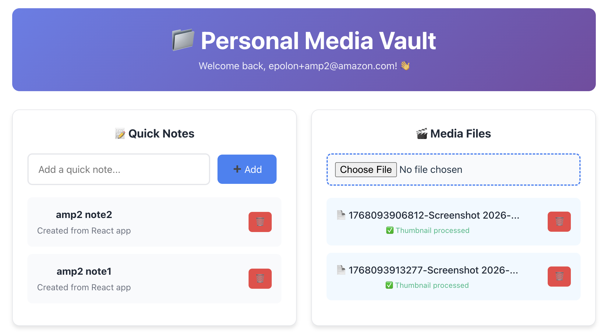
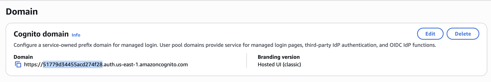
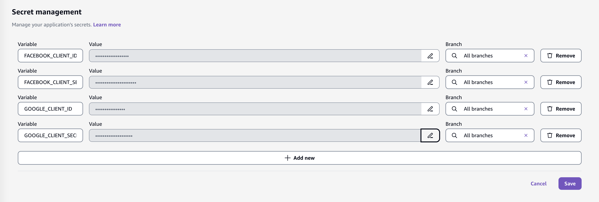

# Media Vault (Amplify Gen1)



A personal media management application featuring social authentication, GraphQL API, Lambda functions, S3 storage, and DynamoDB. 
Users sign up with email/phone or social login (Facebook/Google)

> [!NOTICE]
> Since amplify operations add files to your local directory, its better not to operate within this repo.
> Instead, create your own private GitHub repository and copy the app over.

## Install Dependencies

```console
npm install
```

## Initialize Environment

```console
amplify init
````

```console
⚠️ For new projects, we recommend starting with AWS Amplify Gen 2, our new code-first developer experience. Get started at https://docs.amplify.aws/react/start/quickstart/
✔ Do you want to continue with Amplify Gen 1? (y/N) · yes
✔ Why would you like to use Amplify Gen 1? · Prefer not to answer
Note: It is recommended to run this command from the root of your app directory
? Enter a name for the project mediavault
The following configuration will be applied:

Project information
| Name: mediavault
| Environment: dev
| Default editor: Visual Studio Code
| App type: javascript
| Javascript framework: react
| Source Directory Path: src
| Distribution Directory Path: build
| Build Command: npm run-script build
| Start Command: npm run-script start

? Initialize the project with the above configuration? No
? Enter a name for the environment main
? Choose your default editor: Visual Studio Code
✔ Choose the type of app that you're building · javascript
Please tell us about your project
? What javascript framework are you using react
? Source Directory Path:  src
? Distribution Directory Path: dist
? Build Command:  npm run-script build
? Start Command: npm run-script start
Using default provider  awscloudformation
? Select the authentication method you want to use: AWS profile

For more information on AWS Profiles, see:
https://docs.aws.amazon.com/cli/latest/userguide/cli-configure-profiles.html

? Please choose the profile you want to use default
```

## Add Categories

### Auth

Cognito-based authentication using email/phone with social providers (Facebook, Google). Includes user groups: Admin and Basic (manually assigned).

```console
amplify add auth
```

```console
Do you want to use the default authentication and security configuration? Default configuration with Social Provider (Federation)
Warning: you will not be able to edit these selections. 
How do you want users to be able to sign in? Email or Phone Number
Do you want to configure advanced settings? No, I am done.
What domain name prefix do you want to use? (accept default value)
Enter your redirect signin URI: https://main.<appId>.amplifyapp.com/ (replace <appId> with the actual value)
? Do you want to add another redirect signin URI No
Enter your redirect signout URI: https://main.<appId>.amplifyapp.com/ (replace <appId> with the actual value)
? Do you want to add another redirect signout URI No
Select the social providers you want to configure for your user pool: Facebook, Google
  
You've opted to allow users to authenticate via Facebook.  If you haven't already, you'll need to go to https://developers.facebook.com and create an App ID. 
 
Enter your Facebook App ID for your OAuth flow:  (secret)
Enter your Facebook App Secret for your OAuth flow:  (secret)
  
You've opted to allow users to authenticate via Google.  If you haven't already, you'll need to go to https://developers.google.com/identity and create an App ID. 
 
Enter your Google Web Client ID for your OAuth flow:  (secret)
Enter your Google Web Client Secret for your OAuth flow:  (secret)
```

> [!NOTE]
> Publishing SMS messages to US numbers requires AWS account configuration not covered by this guide. If you happen to 
> own a foreign phone number you can configure it directly via the [SNS text messaging console](https://console.aws.amazon.com/sns/v3/home#/mobile/text-messaging). 
> Otherwise use email to sign up for the deployed app.

```console
amplify update auth
```

```console
What do you want to do? Create or update Cognito user pool groups
? Provide a name for your user pool group: Admin
? Do you want to add another User Pool Group Yes
? Provide a name for your user pool group: Basic
? Do you want to add another User Pool Group No
✔ Sort the user pool groups in order of preference · Admin, Basic
```

### Api

GraphQL API with schema containing:

- _Note_ model.

Uses Cognito User Pool for default auth with API key as additional auth type.

```console
amplify add api
```

```console
? Select from one of the below mentioned services: GraphQL
? Here is the GraphQL API that we will create. Select a setting to edit or continue Authorization modes: API key (default, expiration time: 7 days from now)
? Choose the default authorization type for the API Amazon Cognito User Pool
Use a Cognito user pool configured as a part of this project.
? Configure additional auth types? Yes
? Choose the additional authorization types you want to configure for the API API key
API key configuration
✔ Enter a description for the API key: · graphql
✔ After how many days from now the API key should expire (1-365): · 100
? Here is the GraphQL API that we will create. Select a setting to edit or continue Continue
? Choose a schema template: Single object with fields (e.g., “Todo” with ID, name, description)
✔ Do you want to edit the schema now? (Y/n) · no
```

### Storage

S3 bucket for authenticated users to create/update, read, and delete media files; guest users have read access.

```console
amplify add storage
```

```console
? Select from one of the below mentioned services: Content (Images, audio, video, etc.)
✔ Provide a friendly name for your resource that will be used to label this category in the project: · mediavault
✔ Provide bucket name: · (accept default value)
✔ Restrict access by? · Both
✔ Who should have access: · Auth and guest users
✔ What kind of access do you want for Authenticated users? · create/update, read, delete
✔ What kind of access do you want for Guest users? · read
✔ Select groups: · Admin, Basic
✔ What kind of access do you want for Admin users? · create/update, read, delete
✔ What kind of access do you want for Basic users? · read
✔ Do you want to add a Lambda Trigger for your S3 Bucket? (y/N) · no
```

### Function

**Node.js Lambda function for generating thumbnails for images.**

```console
amplify add function
```

```console
? Select which capability you want to add: Lambda function (serverless function)
? Provide an AWS Lambda function name: thumbnailgen
? Choose the runtime that you want to use: NodeJS
? Choose the function template that you want to use: Hello World

✅ Available advanced settings:
- Resource access permissions
- Scheduled recurring invocation
- Lambda layers configuration
- Environment variables configuration
- Secret values configuration

? Do you want to configure advanced settings? Yes
? Do you want to access other resources in this project from your Lambda function? Yes
? Select the categories you want this function to have access to. storage
? Storage has 2 resources in this project. Select the one you would like your Lambda to access mediavault
? Select the operations you want to permit on mediavault create, read, update, delete

You can access the following resource attributes as environment variables from your Lambda function
        ENV
        REGION
        STORAGE_MEDIAVAULT_BUCKETNAME
? Do you want to invoke this function on a recurring schedule? No
? Do you want to enable Lambda layers for this function? No
? Do you want to configure environment variables for this function? No
? Do you want to configure secret values this function can access? No
✔ Choose the package manager that you want to use: · NPM
? Do you want to edit the local lambda function now? No
```

**Node.js Lambda function for adding users to groups.**

```console
amplify add function
```

```console
? Select which capability you want to add: Lambda function (serverless function)
? Provide an AWS Lambda function name: addusertogroup
? Choose the runtime that you want to use: NodeJS
? Choose the function template that you want to use: Hello World

✅ Available advanced settings:
- Resource access permissions
- Scheduled recurring invocation
- Lambda layers configuration
- Environment variables configuration
- Secret values configuration

? Do you want to configure advanced settings? Yes
? Do you want to access other resources in this project from your Lambda function? Yes
? Select the categories you want this function to have access to. auth
? Auth has 2 resources in this project. Select the one you would like your Lambda to access mediavaulte622646d
? Select the operations you want to permit on mediavaulte622646d create, read, update, delete

You can access the following resource attributes as environment variables from your Lambda function
        AUTH_MEDIAVAULTE622646D_USERPOOLID
        ENV
        REGION
? Do you want to invoke this function on a recurring schedule? No
? Do you want to enable Lambda layers for this function? No
? Do you want to configure environment variables for this function? No
? Do you want to configure secret values this function can access? No
✔ Choose the package manager that you want to use: · NPM
? Do you want to edit the local lambda function now? No
```

**Node.js Lambda function for removing users from groups.**

```console
amplify add function
```

```console
? Select which capability you want to add: Lambda function (serverless function)
? Provide an AWS Lambda function name: removeuserfromgroup
? Choose the runtime that you want to use: NodeJS
? Choose the function template that you want to use: Hello World

✅ Available advanced settings:
- Resource access permissions
- Scheduled recurring invocation
- Lambda layers configuration
- Environment variables configuration
- Secret values configuration

? Do you want to configure advanced settings? Yes
? Do you want to access other resources in this project from your Lambda function? Yes
? Select the categories you want this function to have access to. auth
? Auth has 2 resources in this project. Select the one you would like your Lambda to access mediavaulte622646d
? Select the operations you want to permit on mediavaulte622646d create, read, update, delete

You can access the following resource attributes as environment variables from your Lambda function
        AUTH_MEDIAVAULTE622646D_USERPOOLID
        ENV
        REGION
? Do you want to invoke this function on a recurring schedule? No
? Do you want to enable Lambda layers for this function? No
? Do you want to configure environment variables for this function? No
? Do you want to configure secret values this function can access? No
✔ Choose the package manager that you want to use: · NPM
? Do you want to edit the local lambda function now? No
```

## Configure

```console
npm run configure
```

### Deploy Backend

```console
amplify push
```

```console
┌──────────┬─────────────────────┬───────────┬───────────────────┐
│ Category │ Resource name       │ Operation │ Provider plugin   │
├──────────┼─────────────────────┼───────────┼───────────────────┤
│ Auth     │ mediavaulte622646d  │ Create    │ awscloudformation │
├──────────┼─────────────────────┼───────────┼───────────────────┤
│ Auth     │ userPoolGroups      │ Create    │ awscloudformation │
├──────────┼─────────────────────┼───────────┼───────────────────┤
│ Api      │ mediavault          │ Create    │ awscloudformation │
├──────────┼─────────────────────┼───────────┼───────────────────┤
│ Storage  │ mediavault          │ Create    │ awscloudformation │
├──────────┼─────────────────────┼───────────┼───────────────────┤
│ Function │ thumbnailgen        │ Create    │ awscloudformation │
├──────────┼─────────────────────┼───────────┼───────────────────┤
│ Function │ addusertogroup      │ Create    │ awscloudformation │
├──────────┼─────────────────────┼───────────┼───────────────────┤
│ Function │ removeuserfromgroup │ Create    │ awscloudformation │
└──────────┴─────────────────────┴───────────┴───────────────────┘

✔ Are you sure you want to continue? (Y/n) · yes
? Do you want to generate code for your newly created GraphQL API No
```

## Publish Frontend

To publish the frontend, we leverage the Amplify hosting console. First push everything to the `main` branch:

```console
git add .
git commit -m "feat: gen1"
git push origin main
```

Next, accept all default values and follow the getting started wizard to connect your repo and branch.


Wait for the deployment to finish successfully. Now you need to setup social provider identities for the Cognito user pool. 
Grab the App ID from the Amplify Console and the Cognito domain prefix from the Cognito Console.



**Facebook**

1. Follow the [instructions](https://docs.amplify.aws/gen1/javascript/build-a-backend/auth/add-social-provider/#set-up-your-social-auth-provider) 
in the Facebook Login_ tab. 

   - Set application name to `amplify-media-vault-gen1`.
   - Note the `App ID` and `App Secret` values, they will be needed later on.

2. In [facebook dev console](https://developers.facebook.com/apps/), locate your app and navigate to _App Settings_ → _Basic_  → _App domains_.

    - `https://main.<appId>.amplifyapp.com`
    - `https://<cognito-prefix>.auth.us-east-1.amazoncognito.com/`

3. In [facebook dev console](https://developers.facebook.com/apps/), locate your app and navigate to _Use Cases_ → _Authenticate and request data from users with Facebook Login → Settings → _Valid OAuth Redirect URIs_.

    - `https://main.<appId>.amplifyapp.com/oauth2/idpresponse/`
    - `https://<cognito-prefix>.auth.us-east-1.amazoncognito.com/oauth2/idpresponse/`

4. In [facebook dev console](https://developers.facebook.com/apps/), locate your app and navigate to _Use Cases_ → _Authenticate and request data from users with Facebook Login → Permissions and features → _email_ → _Add_.

    

**Google**

1. Follow the [instructions](https://docs.amplify.aws/gen1/javascript/build-a-backend/auth/add-social-provider/#set-up-your-social-auth-provider) 
in the _Google Sign-In_ tab. 

   - Set application name to `amplify-media-vault-gen1`.
   - Set client name to `GoogleWebClient1`.
   - Note the `Client ID` and `Client Secret` values, they will be needed later on.

2. Navigate to _Clients_ → _GoogleWebClient1_ → _Authorized JavaScript origins_.

    - `https://main.<appId>.amplifyapp.com`
    - `https://<cognito-prefix>.auth.us-east-1.amazoncognito.com/`

3. Navigate to _Clients_ → _GoogleWebClient1_ → _Authorized redirect URIs_.

    - `https://main.<appId>.amplifyapp.com/oauth2/idpresponse/`
    - `https://<cognito-prefix>.auth.us-east-1.amazoncognito.com/oauth2/idpresponse/`

## Migrating to Gen2

> Based on https://github.com/aws-amplify/amplify-cli/blob/gen2-migration/GEN2_MIGRATION_GUIDE.md

> [!WARNING]
> Migration is not fully supported for this app yet due to a bug in refactoring the social provider
> configuration. This guide ends at the `generate` step.

First and install the experimental CLI package the provides the new commands:

```console
npm install --no-save @aws-amplify/cli-internal-gen2-migration-experimental-alpha
```

Now run them:

```console
npx amplify gen2-migration lock
```

```console
git checkout -b gen2-main
npx amplify gen2-migration generate
```

**Edit in `./amplify/backend/data/resource.ts`:**

```diff
- branchName: "main"
+ branchName: "gen2-main"
```

```diff
- defaultAuthorizationMode: "userPool"
+ defaultAuthorizationMode: "userPool",
+ apiKeyAuthorizationMode: { expiresInDays: 100 }
```

**Edit in `./amplify/auth/resource.ts`:**

```diff
+ import { addusertogroup } from '../function/addusertogroup/resource';
+ import { removeuserfromgroup } from '../function/removeuserfromgroup/resource';
```

```diff
+ const branchName = process.env.AWS_BRANCH ?? "sandbox";
```

```diff
- callbackUrls: ["https://main.d1086iitvfyy6.amplifyapp.com/"],
+ callbackUrls: ["https://main.d1086iitvfyy6.amplifyapp.com/", `https://${branchName}.d1086iitvfyy6.amplifyapp.com/`],

- logoutUrls: ["https://main.d1086iitvfyy6.amplifyapp.com/"],
+ logoutUrls: ["https://main.d1086iitvfyy6.amplifyapp.com/", `https://${branchName}.d1086iitvfyy6.amplifyapp.com/`],
```

```diff
+ access: (allow) => [
+     allow.resource(addusertogroup).to(["addUserToGroup"]),
+     allow.resource(removeuserfromgroup).to(["removeUserFromGroup"])
+ ],
```

**Edit in `./amplify/storage/resource.ts`:**

```diff
+ import { thumbnailgen } from './thumbnailgen/resource';
```

Add this to every configured prefix:

```diff
+ allow.resource(thumbnailgen).to(["write", "read", "delete"])
```

**Edit in `./amplify/storage/thumbnailgen/resource.ts`:**

```diff
- entry: "./index.js",
+ entry: "./index.js",
+ resourceGroupName: 'storage',
```

**Edit in `./amplify/function/addusertogroup/resource.ts`:**

```diff
- entry: "./index.js",
+ entry: "./index.js",
+ resourceGroupName: 'auth',
```

**Edit in `./amplify/function/removeuserfromgroup/resource.ts`:**

```diff
- entry: "./index.js",
+ entry: "./index.js",
+ resourceGroupName: 'auth',
```

**Edit in `./amplify/backend.ts`:**

```diff
- (L88) const branchName = process.env.AWS_BRANCH ?? "sandbox";
+ (L11) const branchName = process.env.AWS_BRANCH ?? "sandbox";
```

```diff
- callbackUrls: ["https://main.d1086iitvfyy6.amplifyapp.com/"],
+ callbackUrls: ["https://main.d1086iitvfyy6.amplifyapp.com/", `https://${branchName}.d1086iitvfyy6.amplifyapp.com/`],

- logoutUrls: ["https://main.d1086iitvfyy6.amplifyapp.com/"],
+ logoutUrls: ["https://main.d1086iitvfyy6.amplifyapp.com/", `https://${branchName}.d1086iitvfyy6.amplifyapp.com/`],
```

```diff
- flows: ["code"],
```

```diff
+ backend.thumbnailgen.addEnvironment('STORAGE_MEDIAVAULT_BUCKETNAME', backend.storage.resources.bucket.bucketName);
+ backend.addusertogroup.addEnvironment('AUTH_MEDIAVAULT_USERPOOLID', backend.auth.resources.userPool.userPoolId);
+ backend.removeuserfromgroup.addEnvironment('AUTH_MEDIAVAULT_USERPOOLID', backend.auth.resources.userPool.userPoolId);
```

**Edit in `./amplify/backend/function/addusertogroup/index.js`:**

```diff
- exports.handler = async (event) => {
+ export async function handler(event) {
```

**Edit in `./amplify/backend/function/removeuserfromgroup/index.js`:**

```diff
- exports.handler = async (event) => {
+ export async function handler(event) {
```

**Edit in `./amplify/backend/storage/thumbnailgen/index.js`:**

```diff
- exports.handler = async (event) => {
+ export async function handler(event) {
```

**Edit in `./src/main.tsx`:**

```diff
- import amplifyconfig from './amplifyconfiguration.json';
+ import amplifyconfig from '../amplify_outputs.json';
```

In the AWS Amplify console, navigate to _Hosting_ → _Secrets_ → _Manage secrets_ → _Add new_ and add the following secrets:

- `FACEBOOK_CLIENT_ID`
- `FACEBOOK_CLIENT_SECRET`
- `GOOGLE_CLIENT_ID`
- `GOOGLE_CLIENT_SECRET`



```console
git add .
git commit -m "feat: migrate to gen2"
git push origin gen2-main
```

Now connect the `gen2-main` branch to the hosting service:


Wait for the deployment to finish successfully. Next, locate the root stack of the Gen2 branch:


```console
npm install --no-save @aws-amplify/cli-internal-gen2-migration-experimental-alpha
```

```console
git checkout main
npx amplify gen2-migration refactor --to <gen2-stack-name>
```

```console
git checkout gen2-main
```

**Edit in `./amplify/backend.ts`:**

```diff
- // s3Bucket.bucketName = '...';
+ s3Bucket.bucketName = '...';
```

```console
git add .
git commit -m "chore: post refactor"
git push origin gen2-main
```

Wait for the deployment to finish successfully.
