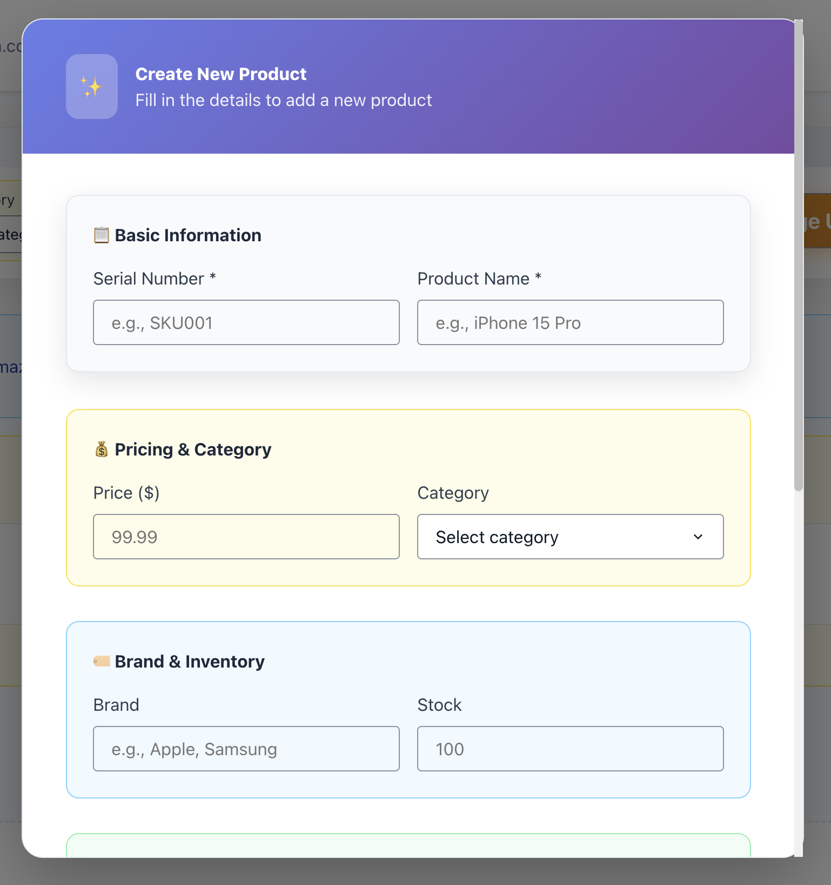
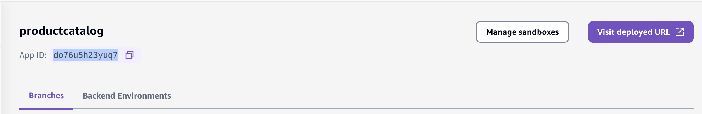
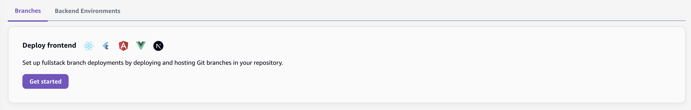
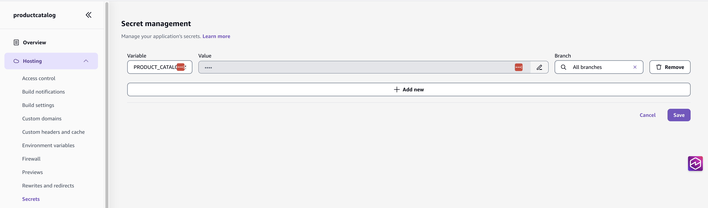
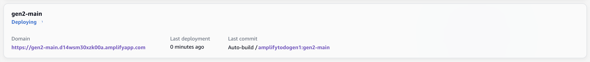

# Product Catalog (Amplify Gen1)



An inventory management application built with Amplify Gen1, featuring role-based authentication, 
GraphQL API, Lambda functions, S3 storage, and DynamoDB.

## Install Dependencies

```console
npm install
```

## Initialize Environment

```console
amplify init
````

```console
⚠️ For new projects, we recommend starting with AWS Amplify Gen 2, our new code-first developer experience. Get started at https://docs.amplify.aws/react/start/quickstart/
✔ Do you want to continue with Amplify Gen 1? (y/N) · yes
✔ Why would you like to use Amplify Gen 1? · Prefer not to answer
Note: It is recommended to run this command from the root of your app directory
? Enter a name for the project productcatalog
The following configuration will be applied:

Project information
| Name: projectboards
| Environment: dev
| Default editor: Visual Studio Code
| App type: javascript
| Javascript framework: none
| Source Directory Path: src
| Distribution Directory Path: dist
| Build Command: npm run-script build
| Start Command: npm run-script start

? Initialize the project with the above configuration? No
? Enter a name for the environment main
? Choose your default editor: Visual Studio Code
✔ Choose the type of app that you're building · javascript
Please tell us about your project
? What javascript framework are you using react
? Source Directory Path:  src
? Distribution Directory Path: dist
? Build Command:  npm run-script build
? Start Command: npm run-script start
Using default provider  awscloudformation
? Select the authentication method you want to use: AWS profile

For more information on AWS Profiles, see:
https://docs.aws.amazon.com/cli/latest/userguide/cli-configure-profiles.html

? Please choose the profile you want to use default
```

## Add Categories

### Api

GraphQL API with schema containing 

- _Comment_ model.
- _Product_ model with a `@hasMany` relationship to the _Comment_ model.
- _User_ model to manage different user roles (ADMIN, MANAGER, VIEWER).
- _checkLowStock_ query that returns low stock products by invoking a lambda function using the `@function` directive.

Uses IAM for default auth with API key and Cognito as additional auth types.

```console
amplify add api
```

```console
? Select from one of the below mentioned services: GraphQL
? Here is the GraphQL API that we will create. Select a setting to edit or continue Authorization modes: API key (default, expiration time: 7 days from now)
? Choose the default authorization type for the API IAM
? Configure additional auth types? Yes
? Choose the additional authorization types you want to configure for the API API key, Amazon Cognito User Pool
API key configuration
✔ Enter a description for the API key: · graphqlapi
✔ After how many days from now the API key should expire (1-365): · 7
Cognito UserPool configuration
Using service: Cognito, provided by: awscloudformation
 
 The current configured provider is Amazon Cognito. 
 
 Do you want to use the default authentication and security configuration? Default configuration
 Warning: you will not be able to edit these selections. 
 How do you want users to be able to sign in? Email
 Do you want to configure advanced settings? No, I am done.
✅ Successfully added auth resource productcatalog3766b428 locally

✅ Some next steps:
"amplify push" will build all your local backend resources and provision it in the cloud
"amplify publish" will build all your local backend and frontend resources (if you have hosting category added) and provision it in the cloud

? Here is the GraphQL API that we will create. Select a setting to edit or continue Continue
? Choose a schema template: One-to-many relationship (e.g., “Blogs” with “Posts” and “Comments”)

⚠️  WARNING: your GraphQL API currently allows public create, read, update, and delete access to all models via an API Key. To configure PRODUCTION-READY authorization rules, review: https://docs.amplify.aws/cli/graphql/authorization-rules

✅ GraphQL schema compiled successfully.

Edit your schema at /Users/epolon/dev/src/github.com/iliapolo/amplify-product-catalog-gen1/amplify/backend/api/productcatalog/schema.graphql or place .graphql files in a directory at /Users/epolon/dev/src/github.com/iliapolo/amplify-product-catalog-gen1/amplify/backend/api/productcatalog/schema

✔ Do you want to edit the schema now? (Y/n) · no
```

### Auth

Cognito-based authentication using email. Auto-configured during API setup.

### Storage

S3 bucket to manage product images with a trigger function that updates the _Product_ model.

```console
amplify add storage
```

```console
? Select from one of the below mentioned services: Content (Images, audio, video, etc.)
✔ Provide a friendly name for your resource that will be used to label this category in the project: · (accept default value)
✔ Provide bucket name: · (accept default value)
✔ Who should have access: · Auth users only
✔ What kind of access do you want for Authenticated users? · create/update, read, delete
✔ Do you want to add a Lambda Trigger for your S3 Bucket? (y/N) · yes
✔ Do you want to edit the local S3Triggera48a234d lambda function now? (y/N) · no
```

```console
amplify update function
```

```console
? Select the Lambda function you want to update S3Triggera48a234d
? Which setting do you want to update? Resource access permissions
? Select the categories you want this function to have access to. api
? Select the operations you want to permit on productcatalog Mutation

You can access the following resource attributes as environment variables from your Lambda function
        API_PRODUCTCATALOG_GRAPHQLAPIENDPOINTOUTPUT
        API_PRODUCTCATALOG_GRAPHQLAPIIDOUTPUT
        API_PRODUCTCATALOG_GRAPHQLAPIKEYOUTPUT

? Do you want to edit the local lambda function now? No
```

### Function

Node.js Lambda function that queries products via GraphQL API and returns list of products with stock below threshold (default: 5 units).

```console
amplify add function
```

```console
? Select which capability you want to add: Lambda function (serverless function)
? Provide an AWS Lambda function name: lowstockproducts
? Choose the runtime that you want to use: NodeJS
? Choose the function template that you want to use: Hello World

✅ Available advanced settings:
- Resource access permissions
- Scheduled recurring invocation
- Lambda layers configuration
- Environment variables configuration
- Secret values configuration

? Do you want to configure advanced settings? Yes
? Do you want to access other resources in this project from your Lambda function? Yes
? Select the categories you want this function to have access to. api
? Select the operations you want to permit on productcatalog Query

You can access the following resource attributes as environment variables from your Lambda function
        API_PRODUCTCATALOG_GRAPHQLAPIENDPOINTOUTPUT
        API_PRODUCTCATALOG_GRAPHQLAPIIDOUTPUT
        API_PRODUCTCATALOG_GRAPHQLAPIKEYOUTPUT
        ENV
        REGION
? Do you want to invoke this function on a recurring schedule? No
? Do you want to enable Lambda layers for this function? No
? Do you want to configure environment variables for this function? Yes
? Enter the environment variable name: LOW_STOCK_THRESHOLD
? Enter the environment variable value: 5
? Select what you want to do with environment variables: I'm done
? Do you want to configure secret values this function can access? Yes
? Enter a secret name (this is the key used to look up the secret value): PRODUCT_CATALOG_SECRET
? Enter the value for PRODUCT_CATALOG_SECRET: shhh
? What do you want to do? I'm done
✔ Choose the package manager that you want to use: · NPM
? Do you want to edit the local lambda function now? No
```

## Configure

```console
npm run configure
```

On the AWS Amplify console, locate the application id.



**Edit in `./amplify/backend/api/productcatalog/custom-roles.json`:**

```diff
- "amplify-${appId}"
+ "amplify-<app-id>"
```

## Deploy Backend

```console
amplify push
```

```console
┌──────────┬────────────────────────┬───────────┬───────────────────┐
│ Category │ Resource name          │ Operation │ Provider plugin   │
├──────────┼────────────────────────┼───────────┼───────────────────┤
│ Auth     │ productcatalog80b6eb59 │ Create    │ awscloudformation │
├──────────┼────────────────────────┼───────────┼───────────────────┤
│ Api      │ productcatalog         │ Create    │ awscloudformation │
├──────────┼────────────────────────┼───────────┼───────────────────┤
│ Function │ S3Triggera48a234d      │ Create    │ awscloudformation │
├──────────┼────────────────────────┼───────────┼───────────────────┤
│ Function │ lowstockproducts       │ Create    │ awscloudformation │
├──────────┼────────────────────────┼───────────┼───────────────────┤
│ Storage  │ s3df09eabf             │ Create    │ awscloudformation │
└──────────┴────────────────────────┴───────────┴───────────────────┘

✔ Are you sure you want to continue? (Y/n) · yes
? Do you want to generate code for your newly created GraphQL API No
```

## Publish Frontend

To publish the frontend, we leverage the Amplify hosting console. First push everything to the `main` branch:

```console
git add .
git commit -m "feat: gen1"
git push origin main
```

Next, accept all default values and follow the getting started wizard to connect your repo and branch.




Wait for the deployment to finish successfully.

## Migrating to Gen2

> Based on https://github.com/aws-amplify/amplify-cli/blob/gen2-migration/GEN2_MIGRATION_GUIDE.md

First install the experimental amplify CLI package that provides the migration commands.

```console
npm install @aws-amplify/cli-internal-gen2-migration-experimental-alpha
```

Now run them:

```console
npx amplify gen2-migration lock
```

```console
git checkout -b gen2-main
npx amplify gen2-migration generate
```

**Edit in `./amplify/backend/data/resource.ts`:**

```diff
- branchName: "main"
+ branchName: "gen2-main"
```

```diff
-    defaultAuthorizationMode: "iam",
+    defaultAuthorizationMode: "iam",
+    apiKeyAuthorizationMode: { expiresInDays: 7 }
```

**Edit in `./amplify/backend.ts`:**

```diff
- import { Duration } from "aws-cdk-lib";
+ import { Duration, aws_iam } from "aws-cdk-lib";
```

```diff
- awsRegion: "us-east-1"
+ awsRegion: backend.auth.resources.userPool.stack.region
```

```diff
+ backend.lowstockproducts.addEnvironment('API_PRODUCTCATALOG_GRAPHQLAPIKEYOUTPUT', backend.data.apiKey!)
+ backend.lowstockproducts.addEnvironment('API_PRODUCTCATALOG_GRAPHQLAPIENDPOINTOUTPUT', backend.data.graphqlUrl)
+ backend.lowstockproducts.addEnvironment('API_PRODUCTCATALOG_GRAPHQLAPIIDOUTPUT', backend.data.apiId)

+ backend.lowstockproducts.resources.lambda.addToRolePolicy(new aws_iam.PolicyStatement({
+     effect: aws_iam.Effect.ALLOW,
+     actions: ['appsync:GraphQL'],
+     resources: [`arn:aws:appsync:${backend.data.stack.region}:${backend.data.stack.account}:apis/${backend.data.apiId}/types/Query/*`]
+ }))

+ backend.S3Trigger<suffix>.addEnvironment('API_PRODUCTCATALOG_GRAPHQLAPIKEYOUTPUT', backend.data.apiKey!)
+ backend.S3Trigger<suffix>.addEnvironment('API_PRODUCTCATALOG_GRAPHQLAPIENDPOINTOUTPUT', backend.data.graphqlUrl)
+ backend.S3Trigger<suffix>.addEnvironment('API_PRODUCTCATALOG_GRAPHQLAPIIDOUTPUT', backend.data.apiId)

+ backend.S3Trigger<suffix>.resources.lambda.addToRolePolicy(new aws_iam.PolicyStatement({
+     effect: aws_iam.Effect.ALLOW,
+     actions: ['appsync:GraphQL'],
+     resources: [`arn:aws:appsync:${backend.data.stack.region}:${backend.data.stack.account}:apis/${backend.data.apiId}/types/Mutation/*`]
+ }))
``` 

On the AppSync AWS Console, locate the ID of Gen1 API, it will be named `productcatalog-main`.


**Edit in `./amplify/backend.ts`:**

```diff
+ backend.auth.resources.authenticatedUserIamRole.addToPrincipalPolicy(new aws_iam.PolicyStatement({
+     effect: aws_iam.Effect.ALLOW,
+     actions: ['appsync:GraphQL'],
+     resources: [`arn:aws:appsync:${backend.data.stack.region}:${backend.data.stack.account}:apis/<gen1-appsync-api-id>/*`]
+ }))
```


**Edit in `./amplify/backend/function/lowstockproducts/index.js`:**

```diff
- exports.handler = async (event) => {
+ export async function handler(event) {
```

```diff
- const secretValue = await fetchSecret();
+ const secretValue = process.env['PRODUCT_CATALOG_SECRET'];
```

**Edit in `./amplify/backend/function/lowstockproducts/resource.ts`:**

```diff
- import { defineFunction } from "@aws-amplify/backend";
+ import { defineFunction, secret } from "@aws-amplify/backend";

- PRODUCT_CATALOG_SECRET: "/amplify/d3ttwn44fldtgx/main/AMPLIFY_lowstockproducts_PRODUCT_CATALOG_SECRET"
+ PRODUCT_CATALOG_SECRET: secret("PRODUCT_CATALOG_SECRET")
```

**Edit in `./amplify/backend/storage/S3Trigger<suffix>/index.js`:**

```diff
- exports.handler = async (event) => {
+ export async function handler(event) {
```

**Edit in `./src/main.tsx`:**

```diff
- import amplifyconfig from './amplifyconfiguration.json';
+ import amplifyconfig from '../amplify_outputs.json';
```

In the Amplify console, recreate the `PRODUCT_CATALOG_SECRET` secret:



```console
git add .
git commit -m "feat: migrate to gen2"
git push origin gen2-main
```

Now connect the `gen2-main` branch to the hosting service:





Wait for the deployment to finish successfully. Next, locate the root stack of the Gen2 branch:


```console
git checkout main
npx amplify gen2-migration refactor --to <gen2-stack-name>
```

```console
git checkout gen2-main
```

**Edit in `./amplify/backend.ts`:**

```diff
- // s3Bucket.bucketName = '...';
+ s3Bucket.bucketName = '...';
```

```console
git add .
git commit -m "chore: post refactor"
git push origin gen2-main
```

Wait for the deployment to finish successfully.
