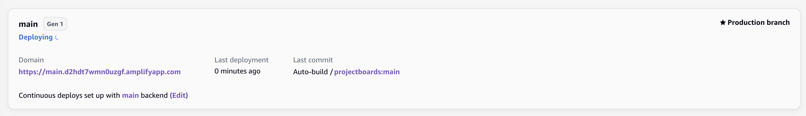

# Project Boards (Amplify Gen1)


This is a project board app that supports authentication. Each Project board can hold multiple Todo items, 
each of which has a title, description, and optionally, images. Todos do not need to be in a Project 
and can exist unassigned. 

- Unauthenticated users can only view Projects and Todos, and cannot modify or delete them.
- Authenticated users can create Projects and Todos, and modify/delete their own. They may add 
Todos to Projects that are not their own, but cannot change the Project settings.

## Install Dependencies

```console
npm install
```

## Initialize Environment

```console
amplify init
````

```console
⚠️ For new projects, we recommend starting with AWS Amplify Gen 2, our new code-first developer experience. Get started at https://docs.amplify.aws/react/start/quickstart/
✔ Do you want to continue with Amplify Gen 1? (y/N) · yes
✔ Why would you like to use Amplify Gen 1? · Prefer not to answer
Note: It is recommended to run this command from the root of your app directory
? Enter a name for the project projectboards
The following configuration will be applied:

Project information
| Name: projectboards
| Environment: dev
| Default editor: Visual Studio Code
| App type: javascript
| Javascript framework: none
| Source Directory Path: src
| Distribution Directory Path: dist
| Build Command: npm run-script build
| Start Command: npm run-script start

? Initialize the project with the above configuration? No
? Enter a name for the environment main
? Choose your default editor: Visual Studio Code
✔ Choose the type of app that you're building · javascript
Please tell us about your project
? What javascript framework are you using react
? Source Directory Path:  src
? Distribution Directory Path: dist
? Build Command:  npm run-script build
? Start Command: npm run-script start
Using default provider  awscloudformation
? Select the authentication method you want to use: AWS profile

For more information on AWS Profiles, see:
https://docs.aws.amazon.com/cli/latest/userguide/cli-configure-profiles.html

? Please choose the profile you want to use default
```

## Add Categories

### Auth 

Cognito-based auth using email.

```console
amplify add auth
```

```console
 Do you want to use the default authentication and security configuration? Default configuration
 Warning: you will not be able to edit these selections. 
 How do you want users to be able to sign in? Email
 Do you want to configure advanced settings? No, I am done.
```

### Api

GraphQL API with schema containing:

- _Todo_ model.
- _Project_ model with a `@hasMany` relationship to the _Todo_ model.
- _getRandomQuote_ query that returns inspirational quotes by invoking a 
lambda function using the `@function` directive.

```console
amplify add api
```

```console
? Select from one of the below mentioned services: GraphQL
? Here is the GraphQL API that we will create. Select a setting to edit or continue Continue
? Choose a schema template: Single object with fields (e.g., “Todo” with ID, name, description)
✔ Do you want to edit the schema now? (Y/n) · no
```

### Storage

S3-based storage for images of the _Todo_ model. Authenticated users can perform all operations, 
unauthenticated users can only read.

```console
amplify add storage
```

```console
? Select from one of the below mentioned services: Content (Images, audio, video, etc.)
✔ Provide a friendly name for your resource that will be used to label this category in the project: · (accept default value)
✔ Provide bucket name: · (accept default value)
✔ Who should have access: · Auth and guest users
✔ What kind of access do you want for Authenticated users? · create/update, read, delete
✔ What kind of access do you want for Guest users? · read
✔ Do you want to add a Lambda Trigger for your S3 Bucket? (y/N) · no
```

### Function

Node.js lambda function that generates inspirational quotes.

```console
amplify add function
```

```console
? Select which capability you want to add: Lambda function (serverless function)
? Provide an AWS Lambda function name: quotegenerator
? Choose the runtime that you want to use: NodeJS
? Choose the function template that you want to use: Hello World

✅ Available advanced settings:
- Resource access permissions
- Scheduled recurring invocation
- Lambda layers configuration
- Environment variables configuration
- Secret values configuration

? Do you want to configure advanced settings? No
? Do you want to edit the local lambda function now? No
```

## Configure

```console
npm run configure
```

## Deploy Backend

```console
amplify push
```

```console
┌──────────┬───────────────────────┬───────────┬───────────────────┐
│ Category │ Resource name         │ Operation │ Provider plugin   │
├──────────┼───────────────────────┼───────────┼───────────────────┤
│ Api      │ projectboards         │ Create    │ awscloudformation │
├──────────┼───────────────────────┼───────────┼───────────────────┤
│ Auth     │ projectboardsea1b8c4c │ Create    │ awscloudformation │
├──────────┼───────────────────────┼───────────┼───────────────────┤
│ Storage  │ s3742db757            │ Create    │ awscloudformation │
├──────────┼───────────────────────┼───────────┼───────────────────┤
│ Function │ quotegenerator        │ Create    │ awscloudformation │
└──────────┴───────────────────────┴───────────┴───────────────────┘

✔ Are you sure you want to continue? (Y/n) · yes
? Do you want to generate code for your newly created GraphQL API No
```

## Publish Frontend

To publish the frontend, we leverage the Amplify hosting console. First push everything to the `main` branch:

```console
git add .
git commit -m "feat: gen1"
git push origin main
```

Next, accept all the default values and follow the getting started wizard to connect your repo and branch.





Wait for the deployment to finish successfully.

## Migrating to Gen2

> Based on https://github.com/aws-amplify/amplify-cli/blob/gen2-migration/GEN2_MIGRATION_GUIDE.md

First add the experimental amplify CLI package that provides the migration commands to your `devDependencies`.

**Edit in `package.json`:**

```diff
+ "@aws-amplify/cli-internal-gen2-migration-experimental-alpha": "^0.4.0"
```

```console
npm install
```

Now run them:

```console
npx amplify gen2-migration lock
```

```console
git checkout -b gen2-main
npx amplify gen2-migration generate
```

**Edit in `./amplify/backend/data/resource.ts`:**

```diff
- branchName: "main"
+ branchName: "gen2-main"
```

**Edit in `./amplify/backend/function/quotegenerator/index.js`:**

```diff
- exports.handler = async (event) => {
+ export async function handler(event) {
```

**Edit in `./src/main.tsx`:**

```diff
- import amplifyconfig from './amplifyconfiguration.json';
+ import amplifyconfig from '../amplify_outputs.json';
```

```console
git add .
git commit -m "feat: migrate to gen2"
git push origin gen2-main
```

Now connect the `gen2-main` branch to the hosting service:


Wait for the deployment to finish successfully. Next, locate the root stack of the Gen2 branch:


```console
git checkout main
npx amplify gen2-migration refactor --to <gen2-stack-name>
```

```console
git checkout gen2-main
```

**Edit in `./amplify/backend.ts`:**

```diff
- // s3Bucket.bucketName = '...';
+ s3Bucket.bucketName = '...';
```

```console
git add .
git commit -m "fix: reuse gen1 storage bucket"
git push origin gen2-main
```

Wait for the deployment to finish successfully.

