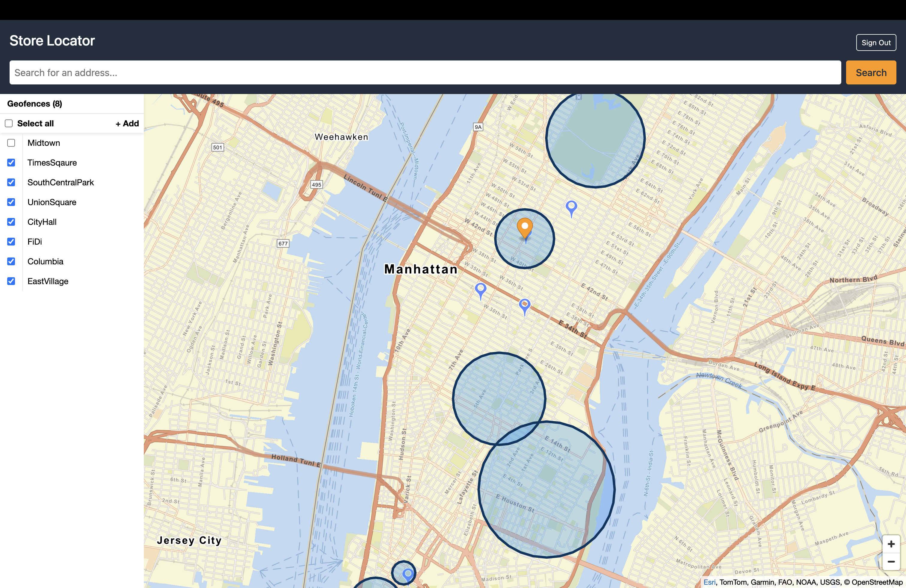
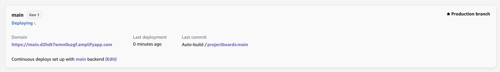
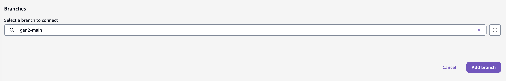
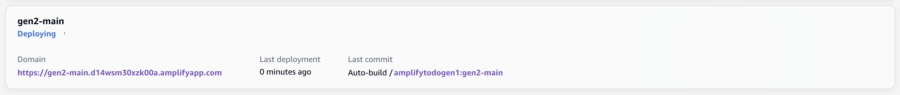

# Store Locator (Amplify Gen1)



A store locator app that displays store locations on an interactive map powered by AWS Amplify Geo and Amazon Location Service. It uses Maps for rendering store locations, Place Index (Location Search) for address search, and Geofence Collections for users to define virtual perimeters around store areas.

## Install Dependencies

```console
npm install
```

## Initialize Environment

```console
amplify init
```

```console
⚠️ For new projects, we recommend starting with AWS Amplify Gen 2, our new code-first developer experience. Get started at https://docs.amplify.aws/react/start/quickstart/
✔ Do you want to continue with Amplify Gen 1? (y/N) · yes
✔ Why would you like to use Amplify Gen 1? · Prefer not to answer
Note: It is recommended to run this command from the root of your app directory
? Enter a name for the project storeLocator
The following configuration will be applied:

Project information
| Name: storeLocator
| Environment: main
| Default editor: Visual Studio Code
| App type: javascript
| Javascript framework: react
| Source Directory Path: src
| Distribution Directory Path: dist
| Build Command: npm run-script build
| Start Command: npm run-script start

? Initialize the project with the above configuration? No
? Enter a name for the environment main
? Choose your default editor: Visual Studio Code
✔ Choose the type of app that you're building · javascript
Please tell us about your project
? What javascript framework are you using react
? Source Directory Path:  src
? Distribution Directory Path: dist
? Build Command:  npm run-script build
? Start Command: npm run-script start
Using default provider  awscloudformation
? Select the authentication method you want to use: AWS profile

For more information on AWS Profiles, see:
https://docs.aws.amazon.com/cli/latest/userguide/cli-configure-profiles.html

? Please choose the profile you want to use default
```

## Add Categories

### Auth

Cognito-based auth using email. Create Cognito user pool groups for Geofences and add post confirmation lambda trigger to add users to the group.

```console
amplify add auth
```

```console
? Do you want to use the default authentication and security configuration? Manual configuration
? Select the authentication/authorization services that you want to use: User Sign-Up, Sign-In, connected with AWS IAM controls (Enables per-user Storage features for i
mages or other content, Analytics, and more)
? Provide a friendly name for your resource that will be used to label this category in the project: (accept default value)
? Enter a name for your identity pool. (accept default value)
? Allow unauthenticated logins? (Provides scoped down permissions that you can control via AWS IAM) No
? Do you want to enable 3rd party authentication providers in your identity pool? No
? Provide a name for your user pool: (accept default value)
? How do you want users to be able to sign in? Email
? Do you want to add User Pool Groups? Yes
? Provide a name for your user pool group: storeLocatorAdmin
? Do you want to add another User Pool Group No
? Sort the user pool groups in order of preference · storeLocatorAdmin
? Do you want to add an admin queries API? No
? Multifactor authentication (MFA) user login options: OFF
? Email based user registration/forgot password: Enabled (Requires per-user email entry at registration)
? Specify an email verification subject: Your verification code
? Specify an email verification message: Your verification code is {####}
? Do you want to override the default password policy for this User Pool? No
? What attributes are required for signing up? Email
? Specify the app's refresh token expiration period (in days): 100
? Do you want to specify the user attributes this app can read and write? No
? Do you want to enable any of the following capabilities? Add User to Group
? Do you want to use an OAuth flow? No
? Do you want to configure Lambda Triggers for Cognito? Yes
? Which triggers do you want to enable for Cognito Post Confirmation
? What functionality do you want to use for Post Confirmation Add User To Group
? Enter the name of the group to which users will be added. · storeLocatorAdmin
```

### Geo - Map

Map resource for displaying store locations using Amazon Location Service.

```console
amplify add geo
```

```console
? Select which capability you want to add: Map (visualize the geospatial data)
✔ Provide a name for the Map: · storeLocatorMap
✔ Restrict access by? · Both
✔ Who can access this Map? · Authorized and Guest users
Must pick at least 1 of 1 options. Selecting all options [storeLocatorAdmin]
Available advanced settings:
- Map style & Map data provider (default: Streets provided by Esri)

✔ Do you want to configure advanced settings? (y/N) · no
```

### Geo - Location Search

Search index for searching places and addresses.

```console
amplify add geo
```

```console
? Select which capability you want to add: Location search (search by places, addresses, coordinates)
✔ Provide a name for the location search index (place index): · storeLocatorSearch
✔ Restrict access by? · Both
✔ Who can access this search index? · Authorized and Guest users
Must pick at least 1 of 1 options. Selecting all options [storeLocatorAdmin]
Available advanced settings:
- Search data provider (default: HERE)
- Search result storage location (default: no result storage)

✔ Do you want to configure advanced settings? (y/N) · no
```

### Geo - Geofence

```console
amplify add geo
```

```console
? Select which capability you want to add: Geofencing (visualize virtual perimeters)
✔ Provide a name for the Geofence Collection: · storeLocatorGeofence
Must pick at least 1 of 1 options. Selecting all options [storeLocatorAdmin]
✔ What kind of access do you want for storeLocatorAdmin users? Select ALL that apply: · Read geofence, Create/Update geofence, Delete geofence, List geofences
```

```console
amplify push
```

```console
    Current Environment: main
    
┌──────────┬──────────────────────────────────────────┬───────────┬───────────────────┐
│ Category │ Resource name                            │ Operation │ Provider plugin   │
├──────────┼──────────────────────────────────────────┼───────────┼───────────────────┤
│ Auth     │ storelocatorcff4360f                     │ Create    │ awscloudformation │
├──────────┼──────────────────────────────────────────┼───────────┼───────────────────┤
│ Geo      │ storeLocatorMap                          │ Create    │ awscloudformation │
├──────────┼──────────────────────────────────────────┼───────────┼───────────────────┤
│ Auth     │ userPoolGroups                           │ Create    │ awscloudformation │
├──────────┼──────────────────────────────────────────┼───────────┼───────────────────┤
│ Function │ storelocatorcff4360fPostConfirmation     │ Create    │ awscloudformation │
├──────────┼──────────────────────────────────────────┼───────────┼───────────────────┤
│ Geo      │ storeLocatorGeofence                     │ Create    │ awscloudformation │
├──────────┼──────────────────────────────────────────┼───────────┼───────────────────┤
│ Geo      │ storeLocatorSearch                       │ Create    │ awscloudformation │
└──────────┴──────────────────────────────────────────┴───────────┴───────────────────┘

✔ Are you sure you want to continue? (Y/n) · yes
```

## Publish Frontend

To publish the frontend, leverage the Amplify hosting console. First push everything to the `main` branch:

```console
git add .
git commit -m "feat: gen1"
git push origin main
```

Next, accept all the default values and follow the getting started wizard to connect your repo and branch. Wait for the deployment to finish successfully.




Wait for the deployment to finish successfully.

## Migrating to Gen2

> Based on https://github.com/aws-amplify/amplify-cli/blob/gen2-migration/GEN2_MIGRATION_GUIDE.md

> [!WARNING]
> Migration is not fully supported for this app because the geo category doesn't support refactoring yet.
> This guide ends at the `generate` step.

First install the experimental amplify CLI package that provides the migration commands.

```console
npm install @aws-amplify/cli-internal-gen2-migration-experimental-alpha
```

Now run them:

```console
npx amplify gen2-migration lock
```

```console
git checkout -b gen2-main
npx amplify gen2-migration generate
```

**Edit in `./src/main.tsx`:**

```diff
- import amplifyconfig from './amplifyconfiguration.json';
+ import amplifyconfig from '../amplify_outputs.json';
```

```console
git add .
git commit -m "feat: migrate to gen2"
git push origin gen2-main
```

**Edit in `./amplify/auth/storelocatorcff4360fPostConfirmation/resource.ts`:**

```diff
- memoryMB: 128,
- runtime: 22
+ memoryMB: 512,
+ runtime: 22,
+ resourceGroupName: 'auth'
```

**Edit in `./amplify/auth/storelocatorcff4360fPostConfirmation/index.js`:**

The Gen1 dynamic `require(`./${name}`)` doesn't work with esbuild bundling in the Amplify build pipeline (`Module not found in bundle: ./add-to-group`). Replace with a static import:

```diff
- const moduleNames = process.env.MODULES.split(',');
- /**
-  * The array of imported modules.
-  */
- const modules = moduleNames.map((name) => require(`./${name}`));
+ import * as addToGroup from './add-to-group';
+
+ const modules = [addToGroup];
```

```diff
- exports.handler = async (event, context) => {
+ export async function handler(event, context) {
```

**Edit in `./amplify/auth/storelocatorcff4360fPostConfirmation/add-to-group.js`:**

```diff
- const {
-   CognitoIdentityProviderClient,
-   AdminAddUserToGroupCommand,
-   GetGroupCommand,
-   CreateGroupCommand,
- } = require('@aws-sdk/client-cognito-identity-provider');
+ import {
+   CognitoIdentityProviderClient,
+   AdminAddUserToGroupCommand,
+   GetGroupCommand,
+   CreateGroupCommand,
+ } from '@aws-sdk/client-cognito-identity-provider';
```

```diff
- exports.handler = async (event) => {
+ export const handler = async (event) => {
```

**Edit in `./amplify/auth/resource.ts`:**

```diff
-  triggers: {
-      postConfirmation: storelocatorcff4360fPostConfirmation
-  },
+ triggers: {
+      postConfirmation: storelocatorcff4360fPostConfirmation
+  },
+ access: (allow) => [
+     allow.resource(storelocatorcff4360fPostConfirmation).to([
+         "addUserToGroup",
+         "manageGroups",
+     ]),
+ ],
```

Now connect the `gen2-main` branch to the hosting service:




Wait for the deployment to finish successfully.

**The guide ends here because the geo category doesn't support refactoring yet.**
