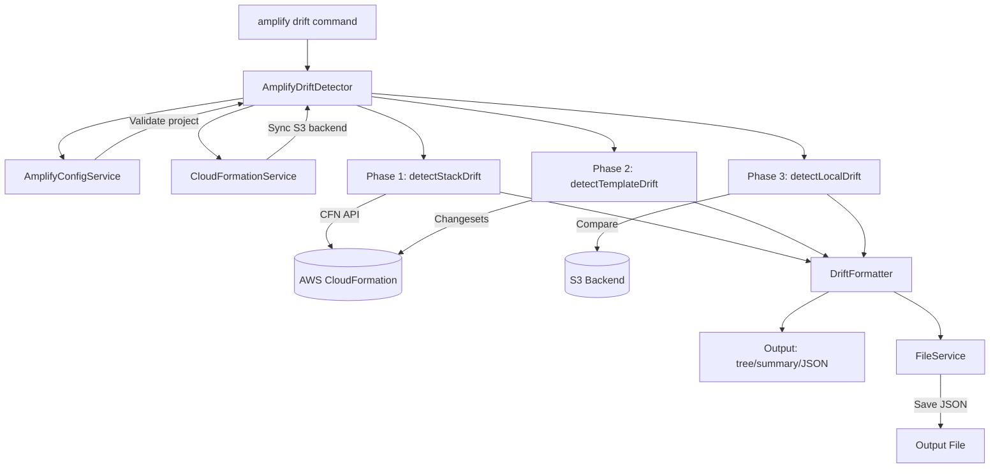
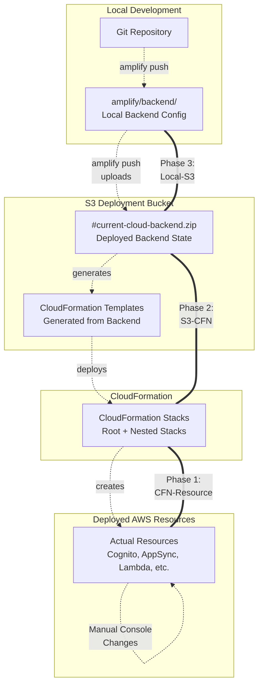

# Amplify Drift Detection

Detects discrepancies between deployed AWS resources and expected state across three phases for Amplify Gen 1 projects.

## Quick Reference

```bash
amplify drift                           # Run all phases (default: summary format)
amplify drift --format json             # Machine-readable output
amplify drift --format tree             # Hierarchical view
amplify drift --output-file report.json # Save results
amplify drift --debug                   # Verbose logging
```

| Option | Description |
|--------|-------------|
| `--debug` | Enable debug output |
| `--format <type>` | Output format: `tree`, `summary` (default), or `json` |
| `--output-file <path>` | Save JSON results to file |

**Exit codes:** `0` = no drift, `1` = drift detected OR any phase skipped/failed (fail-safe principle: uncertainty returns 1)

## Problem Statement

Customers frequently make manual changes directly in AWS service consoles (e.g., modifying Cognito token expirations, enabling DynamoDB PITR, adding Lambda environment variables) that Amplify doesn't track. These manual changes create drift between what Amplify expects and what's actually deployed, which can cause:
- Unexpected behavior during deployments
- Loss of manual configurations during `amplify push`
- Confusion about the actual state of infrastructure

Amplify Drift Detection helps identify these discrepancies before they cause problems.

## Amplify Gen 1 Architecture & Drift Points
This diagram shows the command architecture.


This diagram shows the deployment flow and where drift can occur between different layers of infrastructure state.




**Critical:** S3 sync happens BEFORE all phases. If sync fails, Phase 2 & 3 are skipped (not failed).

## Three Phases

### Phase 1: CloudFormation Stack Drift

**What it detects:** Manual changes to AWS resources via console or direct API calls

**How it works:**
1. Syncs `#current-cloud-backend` from S3 deployment bucket
2. Enumerates all Amplify stacks (root + nested stacks recursively)
3. Calls AWS `DetectStackDrift` API for each stack
4. Polls for completion (5-minute timeout, 2-second intervals)
5. Retrieves detailed drift information for all resources
6. Filters out known false positives (e.g., Auth role Deny→Allow changes)
7. Reports resources with MODIFIED or DELETED status

**Example drift detected:**
- Tags added manually to S3 buckets or DynamoDB tables
- IAM policy changes made outside CloudFormation
- Resource property modifications via console

### Phase 2: Template Drift Detection (Changeset-Based)

**What it detects:** Differences between deployed CloudFormation templates and what's in the deployment bucket

**How it works:**
1. Reads cached template from `#current-cloud-backend/awscloudformation/build/`
2. Creates a CloudFormation changeset with `IncludeNestedStacks: true`
3. Waits for changeset creation to complete
4. Analyzes what changes CloudFormation would make
5. Filters false positives
6. Deletes changeset after analysis
7. Reports actual template differences

**Example drift detected:**
- Manual CloudFormation template edits
- Resources removed outside Amplify
- Parameter value changes

### Phase 3: Local vs S3 Backend Drift

**What it detects:** Unpushed local changes in Amplify backend configuration

**How it works:**
1. Checks if `#current-cloud-backend` directory exists
2. Uses Amplify's existing `getResourceStatus()` function
3. Compares hash of local files vs cloud backend state
4. Categorizes changes as created/updated/deleted/synced
5. Reports resources with local modifications

**Example drift detected:**
- Modified auth/parameters.json not yet pushed
- New API resources added locally
- Deleted resources not yet removed from cloud


### File Structure

```
packages/amplify-cli/src/commands/
├── drift.ts                           # Command entry point (AmplifyDriftDetector)
└── drift-detection/
    ├── index.ts                       # Module exports
    ├── detect-stack-drift.ts          # Phase 1: CloudFormation drift
    ├── detect-template-drift.ts       # Phase 2: Template changeset
    ├── detect-local-drift.ts          # Phase 3: Local vs S3
    └── services/
        ├── index.ts                   # Service exports
        ├── amplify-config-service.ts  # Config utilities
        ├── cloudformation-service.ts  # AWS API wrapper, S3 sync
        ├── drift-formatter.ts         # Output formatting
        └── file-service.ts            # File operations
```

### Components

| Component | File | Purpose |
|-----------|------|---------|
| AmplifyDriftDetector | `drift.ts` | Coordinator that orchestrates the three-phase detection process |
| detectStackDrift | `detect-stack-drift.ts` | Phase 1 - CloudFormation drift detection using AWS API |
| detectTemplateDrift | `detect-template-drift.ts` | Phase 2 - Template drift detection using changesets |
| detectLocalDrift | `detect-local-drift.ts` | Phase 3 - Local files vs S3 backend comparison |
| CloudFormationService | `services/cloudformation-service.ts` | CloudFormation API interactions and S3 backend sync |
| AmplifyConfigService | `services/amplify-config-service.ts` | Amplify project configuration and validation |
| DriftFormatter | `services/drift-formatter.ts` | Processes and formats drift results for display |
| FileService | `services/file-service.ts` | File I/O operations for saving results |

### Configuration Discovery

The drift detection tool discovers which CloudFormation stack to check through local configuration files:

1. **local-env-info.json**: User-specific pointer to current environment (e.g., "dev")
2. **team-provider-info.json**: Maps environment names to CloudFormation stack names

## Exported Functions

```typescript
// Phase 1: Single stack drift detection
async function detectStackDrift(
  cfn: CloudFormationClient, 
  stackName: string, 
  print: Print
): Promise<DescribeStackResourceDriftsCommandOutput>

// Phase 1: Recursive drift detection for nested stacks
async function detectStackDriftRecursive(
  cfn: CloudFormationClient, 
  stackName: string, 
  print: Print, 
  level?: number
): Promise<CombinedDriftResults>

// Phase 3: Local vs cloud drift detection
async function detectLocalDrift(
  context: $TSContext
): Promise<Phase3Results>
```

## Key Types

```typescript
interface CloudFormationDriftResults {
  totalDrifted: number;
  rootStackDrifts: DescribeStackResourceDriftsCommandOutput;
  nestedStackDrifts: Map<string, DescribeStackResourceDriftsCommandOutput>;
  nestedStackPhysicalIds: Map<string, string>;
  skippedNestedStacks?: string[];
}

interface TemplateDriftResults {
  totalDrifted: number;
  changes: ChangeSetChange[];
  skipped: boolean;
  skipReason?: string;
}

interface LocalDriftResults {
  totalDrifted: number;
  resourcesToBeCreated?: ResourceInfo[];
  resourcesToBeUpdated?: ResourceInfo[];
  resourcesToBeDeleted?: ResourceInfo[];
  resourcesToBeSynced?: ResourceInfo[];
  skipped: boolean;
  skipReason?: string;
}

type DriftDisplayFormat = 'tree' | 'summary' | 'json';
```

## Output Sample


```
Drift detection completed

┌─────────────────────────────────────────────────────────────┐
│                   DRIFT DETECTION SUMMARY                   │
├─────────────────────────────────────────────────────────────┤
│ Project: myproject                                          │
│ Total Stacks Checked: 4                                     │
│ Resources with Drift: 2                                     │
│ Resources in Sync: 22                                       │
│ Unchecked Resources: 9                                      │
└─────────────────────────────────────────────────────────────┘

AMPLIFY CATEGORIES:
├── [CORE] Core Infrastructure
│   └── Status: DRIFT DETECTED: 1 resource
└── [API] API
    └── Status: DRIFT DETECTED: 1 resource


TEMPLATE CHANGES:
└── Status: NO DRIFT DETECTED

LOCAL CHANGES:
└── [API] API
    └── Status: NO DRIFT DETECTED
```


## Code Patterns

### Service-Oriented Architecture

The module separates concerns into specialized services coordinated by a central detector:

```typescript
// From src/commands/drift.ts
this.cfnService = new CloudFormationService(this.printer);
this.configService = new AmplifyConfigService();
this.fileService = new FileService();
this.formatter = new DriftFormatter(this.cfnService);
```


### Auth Role Filtering (False Positive)

Amplify Auth intentionally changes IAM `AssumeRolePolicyDocument` from Deny→Allow. The module filters this out:

```typescript
// From detect-stack-drift.ts
function isAmplifyAuthRoleDenyToAllowChange(propDiff, print): boolean {
  // Returns true if this is the intentional Cognito IdP Deny→Allow change
  // These should NOT be reported as drift
  if (expectedStmt.Effect === 'Deny' && 
      actualStmt.Effect === 'Allow' && 
      expectedStmt.Principal?.Federated === 'cognito-identity.amazonaws.com') {
    return true;
  }
}
```

### Graceful Degradation

Phases can be skipped without failing the entire operation, with results including skip reasons:

```typescript
return { 
  totalDrifted: 0,
  skipped: true, 
  skipReason: 'No cloud backend found - project may not be deployed yet' 
};
```

## Dependencies

**Internal:**
- `amplify-helpers/resource-status-data` - Used by detectLocalDrift to compare local vs cloud backend state

**External:**

| Package | Purpose |
|---------|---------|
| `@aws-sdk/client-cloudformation` | CloudFormation API operations (DetectStackDrift, DescribeStackResourceDrifts, CreateChangeSet) |
| `@aws-amplify/amplify-cli-core` | Core utilities (AmplifyError, pathManager, stateManager, parseArn) |
| `@aws-amplify/amplify-prompts` | CLI output printing |
| `@aws-amplify/amplify-provider-awscloudformation` | CloudFormation client initialization, S3 utilities for backend sync |
| `chalk` | Terminal output colorization |
| `fs-extra` | File system operations |


## Critical Constraints & Known Limitations

1. **CloudFormation Drift Gaps:** CloudFormation only tracks properties defined in templates. Properties added manually (tags, PITR, versioning) that were never in the template are invisible to drift detection.

2. **Sequential Processing:** Nested stacks are processed one at a time for simpler error handling and to avoid API throttling.

3. **Changeset Cleanup:** Phase 2 creates then deletes changesets. Deletion failures are logged but don't fail detection.


## Troubleshooting

### S3 Bucket Access Denied

Ensure your AWS credentials have permission to:
- Read from the Amplify deployment bucket
- Access `#current-cloud-backend.zip`

### Credentials Issues

Drift detection uses the same credentials as `amplify push`. Ensure you have:
- Valid AWS credentials configured
- Permission to call CloudFormation APIs (DetectStackDrift, DescribeStackDriftDetectionStatus, DescribeStackResourceDrifts)
- Permission to create/delete changesets


## AI Development Notes


### Why Sequential Nested Stack Processing?

Nested stacks are processed sequentially rather than in parallel because:

1. **Simpler Error Handling:** Easier to track which stack failed
2. **API Rate Limits:** Avoids CloudFormation throttling
3. **Good Enough Performance:** Detection completes in seconds for typical projects


