# Command | `gen2-migration` 

The `gen2-migration` command is a parent command that dispatches individual subcommands that facilitate the 
the migration of Gen1 applications to Gen2. It exposes a step-based CLI workflow that guides users 
through the complete migration process: 

1. Locking the Gen1 environment 
2. Generating Gen2 code, 
3. Refactoring CloudFormation stacks to move stateful resources, 
4. Decommissioning the Gen1 environment. 

Each step follows a consistent `validate → execute → rollback` lifecycle pattern with user confirmation and safety checks.

## Key Responsibilities

### Argument Parsing

Parses CLI flags to control execution flow—whether to skip validations, run validations only, execute rollback operations, or 
disable automatic rollback on failure. Validates flag combinations to prevent conflicting options.

```ts
const skipValidations = (context.input.options ?? {})['skip-validations'] ?? false;
const rollingBack = (context.input.options ?? {})['rollback'] ?? false;
```

### Common Gen1 Configuration Extraction

Extracts shared Gen1 configuration (`appId`, `appName`, `envName`, `stackName`, `region`) once from state manager and Amplify service, 
then passes these values to step constructors. This establishes a single source of truth; subcommands should use the injected values 
rather than re-extracting them independently.

**For example:**

```ts
const appId = (Object.values(stateManager.getTeamProviderInfo())[0] as any).awscloudformation.AmplifyAppId;
const envName = localEnvName ?? migratingEnvName;
// ... extract other config values
const implementation: AmplifyMigrationStep = new step.class(logger, envName, appName, appId, stackName, region, context);
```

### Subcommand Dispatching

Maps the subcommand name to its implementation class via the `STEPS` registry, then instantiates the step with extracted configuration. 
This allows adding new migration steps by simply registering them in the `STEPS` object.

```ts
const stepName = (context.input.subCommands ?? [])[0];
const step = STEPS[stepName];
const implementation: AmplifyMigrationStep = new step.class(logger, envName, appName, appId, stackName, region, context);
```

### Operations Reporting

Displays a summary of what will happen before execution by calling `describe()` on each operation. This gives users visibility 
into the specific actions that will be performed, enabling informed decision-making before confirming.

```ts
for (const operation of rollingBack ? await implementation.rollback() : await implementation.execute()) {
  for (const description of await operation.describe()) {
    printer.info(`• ${description}`);
  }
}
```

### Implications Reporting

Displays the broader implications and side effects of the operation by calling the step's implications methods. 
This helps users understand the impact beyond the immediate operations, such as downtime, 
resource state changes, or irreversible actions.

```ts
for (const implication of rollingBack ? await implementation.rollbackImplications() : await implementation.executeImplications()) {
  printer.info(`• ${implication}`);
}
```

### User Confirmation

Prompts the user to confirm before executing operations, providing a safety gate after displaying the operations summary 
and implications. Exits gracefully if the user declines.

```ts
if (!(await prompter.confirmContinue())) {
  return;
}
```

### Operation-Based Execution

Executes operations sequentially by iterating through the array and calling `execute()` on each. This sequential 
execution ensures operations complete in the correct order and allows for proper error handling at the operation level.

```ts
async function runOperations(operations: AmplifyMigrationOperation[]) {
  for (const operation of operations) {
    await operation.execute();
  }
}
```

### Automatic Rollback on Failure

Catches execution failures and automatically triggers rollback operations to restore the previous state, unless disabled 
with `--no-rollback`. This provides a safety net for partial failures during migration steps.

```ts
try {
  await runExecute(implementation, logger);
} catch (error: unknown) {
  if (!disableAutoRollback) {
    await runRollback(implementation, logger);
  }
  throw error;
}
```

## Extended Documentation

Detailed documentation for subcommands is available in:

- [codegen-generate.md](gen2-migration/codegen-generate.md) - Code generation pipeline for transforming Gen1 configs to Gen2 TypeScript
- [codegen-custom-resources.md](gen2-migration/codegen-custom-resources.md) - Custom CDK resource scanner and transformer
- [refactor.md](gen2-migration/refactor.md) - CloudFormation stack refactoring for moving stateful resources

## Architecture

The command forces a step-based architecture with a central orchestrator (`run` function) that dispatches to step implementations. 
Each step extends the abstract `AmplifyMigrationStep` class and implements separate validation and execution methods for both 
forward and rollback execution modes. Steps return `AmplifyMigrationOperation` arrays that describe and execute atomic operations.

```mermaid
flowchart LR
    CLI[amplify gen2-migration 'subcommand'] --> RUN[run dispatcher]
    RUN --> EXTRACT[Extract Common Gen1 Config: 'appId', 'envName', 'rootStackName', etc...]
    EXTRACT --> PARSE[Parse subcommand & flags]
    
    PARSE --> STEP[Instantiate Step Class]
    
    STEP --> VALONLY{Validations Only?}
    
    VALONLY -->|yes| VALBRANCH{Rollback Flag?}
    VALBRANCH -->|no| VALEXEC[Validate Execute]
    VALBRANCH -->|yes| VALROLL[Validate Rollback]
    VALEXEC --> VALDONE[Complete]
    VALROLL --> VALDONE
    
    VALONLY -->|no| BRANCH{Rollback Flag?}
    
    BRANCH -->|no| FSUM[Display Execute Operations Summary]
    FSUM --> FIMP[Display Execute Implications]
    FIMP --> FCONF[User Confirmation]
    FCONF --> FV[Validate Execution]
    FV --> FEX[Run Execute operations]
    FEX --> FERR{Failure?}
    FERR -->|yes & auto-rollback| REX
    FERR -->|no| FDONE[Complete]
    
    BRANCH -->|yes| RSUM[Display Rollback Operations Summary]
    RSUM --> RIMP[Display Rollback Implications]
    RIMP --> RCONF[User Confirmation]
    RCONF --> RV[Validate Rollback]
    RV --> REX[Run rollback operations]
    REX --> RDONE[Complete]
```



### AmplifyMigrationStep

> **File:** `src/commands/gen2-migration/_step.ts`<br>
> **Type:** _AbstractClass_

```ts
/**
 * Abstract base class that defines the lifecycle contract for all migration steps. 
 * Subcommands must extend this base class.
 */
export abstract class AmplifyMigrationStep {...}
```

```ts
/**
 * Validates prerequisites before executing forward operations.
 * Should check environment state, resource availability, and any step-specific requirements.
 * Throws errors if validation fails.
 */
public abstract executeValidate(): Promise<void>;
```

```ts
/**
 * Validates prerequisites before executing rollback operations.
 * Ensures the environment is in a state where rollback can proceed safely.
 * Throws errors if validation fails.
 */
public abstract rollbackValidate(): Promise<void>;
```

```ts
/**
 * Returns an array of operations to perform for forward execution.
 * Each operation describes what it will do and contains the logic to execute it.
 * Operations are executed sequentially after user confirmation.
 */
public abstract execute(): Promise<AmplifyMigrationOperation[]>;
```

```ts
/**
 * Returns an array of operations to perform for rollback.
 * Reverses the changes made by execute().
 * Operations are executed sequentially after user confirmation.
 */
public abstract rollback(): Promise<AmplifyMigrationOperation[]>;
```

```ts
/**
 * Returns human-readable strings describing the implications and side effects of executing forward operations.
 * Displayed to users before confirmation prompt to help them understand the impact of the migration step.
 */
public abstract executeImplications(): Promise<string[]>;
```

```ts
/**
 * Returns human-readable strings describing the implications and side effects of executing rollback operations.
 * Displayed to users before confirmation prompt to help them understand the impact of reverting the migration step.
 */
public abstract rollbackImplications(): Promise<string[]>;
```

### AmplifyMigrationOperation

> **File:** `src/commands/gen2-migration/_step.ts`<br>
> **Type:** _Interface_

Interface for atomic operations that can be executed as part of a migration step.

```ts
/**
 * Returns human-readable strings describing what the operation will do.
 * Used to display an operations summary to users before execution.
 * Each string should be a concise, actionable description (e.g., "Enable deletion protection for table 'MyTable'").
 */
describe(): Promise<string[]>;
```

```ts
/**
 * Executes the operation.
 * Should be idempotent where possible and throw descriptive errors on failure.
 * Called sequentially for each operation after user confirmation.
 */
execute(): Promise<void>;
```

### Logger

> **File:** `src/commands/gen2-migration.ts`<br>
> **Type:** _Class_

Logging utility that wraps the standard printer with additional gen2-migration specific context.

```ts
/**
 * Logs a message with a visual envelope border for major section headers
 */
public envelope(message: string) {...}
```

```ts
/**
 * Logs informational messages that are always displayed to the user.
 */
public info(message: string): void {...}
```

```ts
/**
 * Logs debug-level messages that are shown only if the command is executed with --debug.
 */
public debug(message: string): void {...}
```

```ts
/**
 * Logs warning messages that are always displayed to the user.
 */
public warn(message: string): void {...}
```

```ts
/**
 * Alias to `warn`.
 */
public warning(message: string): void {...}
```

## CLI Interface

```bash
amplify gen2-migration <step> [options]
```

### Subcommands

| Subcommand | Description | Implementation | Status |
|------------|-------------|----------------|--------|
| `clone` | Clone environment for migration | `clone.ts` → `AmplifyMigrationCloneStep` | NOT IMPLEMENTED |
| `lock` | Lock environment and enable deletion protection on stateful resources | `lock.ts` → `AmplifyMigrationLockStep` | Implemented |
| `generate` | Generate Gen2 backend code from Gen1 configuration | `generate.ts` → `AmplifyMigrationGenerateStep` | Implemented |
| `refactor` | Move stateful resources from Gen1 to Gen2 stacks | `refactor/refactor.ts` → `AmplifyMigrationRefactorStep` | Implemented |
| `shift` | Shift traffic to Gen2 | `shift.ts` → `AmplifyMigrationShiftStep` | NOT IMPLEMENTED |
| `decommission` | Delete Gen1 environment after migration | `decommission.ts` → `AmplifyMigrationDecommissionStep` | Implemented |
| `cleanup` | Clean up migration artifacts | `cleanup.ts` → `AmplifyMigrationCleanupStep` | NOT IMPLEMENTED |

### Global Options

| Option | Description |
|--------|-------------|
| `--skip-validations` | Skip pre-execution validations |
| `--validations-only` | Run validations without executing |
| `--rollback` | Execute rollback operations for the step |
| `--no-rollback` | Disable automatic rollback on execution failure |

## AI Development Notes

**Important considerations:**
- The step execution order matters: lock → generate → refactor → decommission. Each step validates prerequisites from previous steps.
- The `clone`, `shift`, and `cleanup` steps are NOT IMPLEMENTED—they throw 'Method not implemented' errors.
- The `GEN2_MIGRATION_ENVIRONMENT_NAME` environment variable on the Amplify app tracks which environment is being migrated and prevents concurrent migrations.
- Stateful resources (defined in `STATEFUL_RESOURCES` set) require special handling—the module prevents their deletion and enables deletion protection.
- The refactor step uses interactive prompts to let users select which categories to migrate.
- Steps now return arrays of `AmplifyMigrationOperation` objects that describe and execute atomic operations, enabling better visibility and control.
- The orchestrator displays an operations summary and implications before prompting for user confirmation.
- Automatic rollback is enabled by default but can be disabled with `--no-rollback`.
- The `--rollback` flag explicitly executes rollback operations for a step.

**Common pitfalls:**
- Don't skip the lock step—subsequent steps validate that the stack is locked before proceeding.
- The `--skip-validations` flag bypasses safety checks—use with extreme caution in production.
- Environment mismatch between local and migration target will throw an error—ensure consistency.
- Rollback implementations are incomplete for most steps (throw 'Not Implemented' errors)—manual intervention may be needed on failure.
- The decommission step creates a changeset to analyze resources—this can timeout for large stacks.
- Cannot specify both `--rollback` and `--no-rollback` flags simultaneously.
- The lock step's rollback does not disable deletion protection on DynamoDB tables (preserves safety).
