# Command | `gen2-migration` 

The `gen2-migration` command is a parent command that dispatches individual subcommands that facilitate the 
the migration of Gen1 applications to Gen2. It implements a step-based CLI workflow that guides users 
through the complete migration process: 

1. Locking the Gen1 environment 
2. Generating Gen2 code, 
3. Refactoring CloudFormation stacks to move stateful resources, 
4. Decommissioning the Gen1 environment. 

Each step follows a consistent `validate → execute → rollback` lifecycle pattern with user confirmation and safety checks.

## Extended Documentation

Detailed documentation for subcommands is available in:

- [codegen-generate.md](gen2-migration/codegen-generate.md) - Code generation pipeline for transforming Gen1 configs to Gen2 TypeScript
- [codegen-custom-resources.md](gen2-migration/codegen-custom-resources.md) - Custom CDK resource scanner and transformer
- [refactor.md](gen2-migration/refactor.md) - CloudFormation stack refactoring for moving stateful resources

## Architecture

The command forces a step-based architecture with a central orchestrator (`run` function) that dispatches to step implementations. 
Each step extends the abstract `AmplifyMigrationStep` class and implements separate validation and execution methods for both 
forward and rollback execution modes. Steps return `AmplifyMigrationOperation` arrays that describe and execute atomic operations.

```mermaid
flowchart LR
    CLI[amplify gen2-migration 'subcommand'] --> RUN[run dispatcher]
    RUN --> EXTRACT[Extract Common Gen1 Config: 'appId', 'envName', 'rootStackName', etc...]
    EXTRACT --> PARSE[Parse subcommand & flags]
    
    PARSE --> STEP[Instantiate Step Class]
    
    STEP --> VALONLY{Validations Only?}
    
    VALONLY -->|yes| VALBRANCH{Rollback Flag?}
    VALBRANCH -->|no| VALEXEC[Validate Execute]
    VALBRANCH -->|yes| VALROLL[Validate Rollback]
    VALEXEC --> VALDONE[Complete]
    VALROLL --> VALDONE
    
    VALONLY -->|no| BRANCH{Rollback Flag?}
    
    BRANCH -->|no| FSUM[Display Execute Operations Summary]
    FSUM --> FIMP[Display Execute Implications]
    FIMP --> FCONF[User Confirmation]
    FCONF --> FV[Validate Execution]
    FV --> FEX[Run Execute operations]
    FEX --> FERR{Failure?}
    FERR -->|yes & auto-rollback| REX
    FERR -->|no| FDONE[Complete]
    
    BRANCH -->|yes| RSUM[Display Rollback Operations Summary]
    RSUM --> RIMP[Display Rollback Implications]
    RIMP --> RCONF[User Confirmation]
    RCONF --> RV[Validate Rollback]
    RV --> REX[Run rollback operations]
    REX --> RDONE[Complete]
```



### Components

| Component | File | Purpose |
|-----------|------|---------|
| run (dispatcher) | `src/commands/gen2-migration.ts` | Main entry point that parses CLI input, validates environment, displays operation summaries, and dispatches to step implementations |
| Logger | `src/commands/gen2-migration.ts` | Structured logging with timestamps, step names, and app/env context |
| AmplifyMigrationStep | `_step.ts` | Abstract base class defining the step lifecycle contract with separate execute/rollback validation and operation methods |
| AmplifyMigrationOperation | `_step.ts` | Interface for atomic operations that can describe themselves and execute |

## Interface

### CLI Command

```bash
amplify gen2-migration <step> [options]
```

**Subcommands:**

| Subcommand | Description |
|------------|-------------|
| `clone` | Clone environment for migration [NOT IMPLEMENTED] |
| `lock` | Lock environment and enable deletion protection on stateful resources |
| `generate` | Generate Gen2 backend code from Gen1 configuration |
| `refactor` | Move stateful resources from Gen1 to Gen2 stacks |
| `shift` | Shift traffic to Gen2 [NOT IMPLEMENTED] |
| `decommission` | Delete Gen1 environment after migration |
| `cleanup` | Clean up migration artifacts [NOT IMPLEMENTED] |

**Options:**

| Option | Description |
|--------|-------------|
| `--skip-validations` | Skip pre-execution validations |
| `--validations-only` | Run validations without executing |
| `--rollback` | Execute rollback operations for the step |
| `--no-rollback` | Disable automatic rollback on execution failure |

### Exported Classes and Functions

```typescript
// Main entry point
async function run(context: $TSContext): Promise<void>

// Structured logging utility
class Logger {
  envelope(message: string): void;
  info(message: string): void;
  debug(message: string): void;
  warn(message: string): void;
  warning(message: string): void;
}

// Step lifecycle contract
abstract class AmplifyMigrationStep {
  abstract executeValidate(): Promise<void>;
  abstract rollbackValidate(): Promise<void>;
  abstract execute(): Promise<AmplifyMigrationOperation[]>;
  abstract rollback(): Promise<AmplifyMigrationOperation[]>;
  abstract executeImplications(): Promise<string[]>;
  abstract rollbackImplications(): Promise<string[]>;
}

// Operation interface for atomic operations
interface AmplifyMigrationOperation {
  describe(): Promise<string[]>;
  execute(): Promise<void>;
}

// Shared validation utilities
class AmplifyGen2MigrationValidations {
  validateDrift(): Promise<void>;
  validateWorkingDirectory(): Promise<void>;
  validateDeploymentStatus(): Promise<void>;
  validateStatefulResources(): Promise<void>;
  validateLockStatus(): Promise<void>;
}

// Stateful resource types
const STATEFUL_RESOURCES: Set<string>;
```

### Step Classes

```typescript
class AmplifyMigrationLockStep extends AmplifyMigrationStep
class AmplifyMigrationGenerateStep extends AmplifyMigrationStep
class AmplifyMigrationRefactorStep extends AmplifyMigrationStep
class AmplifyMigrationDecommissionStep extends AmplifyMigrationStep
```

## Dependencies

**Internal:**
| Module | Usage |
|--------|-------|
| drift-detection | `AmplifyDriftDetector` used by `validateDrift()` to ensure no infrastructure drift before migration |
| codegen-generate | `prepare()` function called by GenerateStep to create Gen2 backend code |
| refactor | `TemplateGenerator` used by RefactorStep to move resources between stacks |
| amplify-helpers | `removeEnvFromCloud` and `invokeDeleteEnvParamsFromService` for decommission |

**External:**
| Package | Purpose |
|---------|---------|
| `@aws-sdk/client-cloudformation` | Stack operations (DescribeStacks, SetStackPolicy, CreateChangeSet, ListStackResources) |
| `@aws-sdk/client-amplify` | App operations (GetApp, UpdateApp for migration environment variable) |
| `@aws-sdk/client-dynamodb` | Enable deletion protection on model tables (UpdateTable, ListTables) |
| `@aws-sdk/client-appsync` | Find GraphQL API for the environment (ListGraphqlApis) |
| `@aws-sdk/client-cognito-identity-provider` | Cognito operations during refactor |
| `@aws-sdk/client-ssm` | SSM parameter operations during refactor |
| `@aws-sdk/client-sts` | Get AWS account ID (GetCallerIdentity) |
| `@aws-amplify/amplify-cli-core` | Core utilities (AmplifyError, stateManager, $TSContext) |
| `@aws-amplify/amplify-prompts` | CLI output (printer) and user prompts (prompter) |
| `bottleneck` | Rate limiting for concurrent AWS API calls in validations |
| `chalk` | Terminal output colorization |
| `cli-table3` | Table formatting for stateful resource display |
| `execa` | Git command execution for working directory validation |
| `fs-extra` | File system operations for resource mappings |

## Code Patterns

### Step Lifecycle Pattern

Each migration step implements a consistent lifecycle with separate validation and execution methods for both forward execution and rollback:

```typescript
// From src/commands/gen2-migration/_step.ts
public abstract executeValidate(): Promise<void>;
public abstract rollbackValidate(): Promise<void>;
public abstract execute(): Promise<AmplifyMigrationOperation[]>;
public abstract rollback(): Promise<AmplifyMigrationOperation[]>;
public abstract executeImplications(): Promise<string[]>;
public abstract rollbackImplications(): Promise<string[]>;
```

### Operation-Based Execution

Steps return arrays of `AmplifyMigrationOperation` objects that describe and execute atomic operations:

```typescript
// From src/commands/gen2-migration/lock.ts
public async execute(): Promise<AmplifyMigrationOperation[]> {
  const operations: AmplifyMigrationOperation[] = [];
  
  operations.push({
    describe: async () => {
      return [`Enable deletion protection for table '${tableName}'`];
    },
    execute: async () => {
      await this.ddbClient().send(
        new UpdateTableCommand({
          TableName: tableName,
          DeletionProtectionEnabled: true,
        }),
      );
    },
  });
  
  return operations;
}
```

### User Confirmation with Operations Summary

Before executing operations, the orchestrator displays a summary of all operations and their implications:

```typescript
// From src/commands/gen2-migration.ts
printer.info(chalk.bold(chalk.underline('Operations Summary')));
for (const operation of await implementation.execute()) {
  for (const description of await operation.describe()) {
    printer.info(`• ${description}`);
  }
}

printer.info(chalk.bold(chalk.underline('Implications')));
for (const implication of await implementation.executeImplications()) {
  printer.info(`• ${implication}`);
}

if (!(await prompter.confirmContinue())) {
  return;
}
```

### Automatic Rollback on Failure

The orchestrator automatically executes rollback operations when execution fails, unless disabled:

```typescript
// From src/commands/gen2-migration.ts
try {
  await runExecute(implementation, logger);
} catch (error: unknown) {
  if (!disableAutoRollback) {
    printer.error(`Execution failed: ${error}`);
    await runRollback(implementation, logger);
  }
  throw error;
}
```

### Validation Composition

Steps compose validations from the shared `AmplifyGen2MigrationValidations` class based on their requirements, with separate methods for execute and rollback validations:

```typescript
// From src/commands/gen2-migration/generate.ts
public async executeValidate(): Promise<void> {
  const validations = new AmplifyGen2MigrationValidations(
    this.logger, 
    this.rootStackName, 
    this.currentEnvName, 
    this.context
  );
  await validations.validateLockStatus();
  await validations.validateWorkingDirectory();
}

public async rollbackValidate(): Promise<void> {
  // Rollback-specific validations
}
```

### Rate-Limited AWS API Calls

Uses Bottleneck to limit concurrent API calls when scanning nested stacks for stateful resources:

```typescript
// From src/commands/gen2-migration/_validations.ts
private limiter = new Bottleneck({
  maxConcurrent: 3,
  minTime: 50,
});
// ...
this.limiter.schedule(() => this.getStatefulResources(task.physicalId, ...))
```

### Stateful Resource Protection

Identifies and protects stateful AWS resources from accidental deletion during migration:

```typescript
// From src/commands/gen2-migration/_validations.ts
if (STATEFUL_RESOURCES.has(change.ResourceChange.ResourceType)) {
  statefulRemoves.push({ category, resourceType, physicalId });
}
```

### Environment Locking via Stack Policy and Environment Variable

Prevents accidental updates to Gen1 stack during migration by setting a deny-all stack policy and tracking the migration with an environment variable:

```typescript
// From src/commands/gen2-migration/lock.ts
const stackPolicy = JSON.stringify({
  Statement: [{
    Effect: 'Deny',
    Action: 'Update:*',
    Principal: '*',
    Resource: '*',
  }],
});
await cfnClient.send(new SetStackPolicyCommand({ 
  StackName, 
  StackPolicyBody: stackPolicy 
}));

// Track which environment is being migrated
const app = await amplifyClient.send(new GetAppCommand({ appId }));
const environmentVariables = { 
  ...(app.app.environmentVariables ?? {}), 
  GEN2_MIGRATION_ENVIRONMENT_NAME: currentEnvName 
};
await amplifyClient.send(new UpdateAppCommand({ appId, environmentVariables }));
```

## AI Development Notes

**Important considerations:**
- The step execution order matters: lock → generate → refactor → decommission. Each step validates prerequisites from previous steps.
- The `clone`, `shift`, and `cleanup` steps are NOT IMPLEMENTED—they throw 'Method not implemented' errors.
- The `GEN2_MIGRATION_ENVIRONMENT_NAME` environment variable on the Amplify app tracks which environment is being migrated and prevents concurrent migrations.
- Stateful resources (defined in `STATEFUL_RESOURCES` set) require special handling—the module prevents their deletion and enables deletion protection.
- The refactor step uses interactive prompts to let users select which categories to migrate.
- Steps now return arrays of `AmplifyMigrationOperation` objects that describe and execute atomic operations, enabling better visibility and control.
- The orchestrator displays an operations summary and implications before prompting for user confirmation.
- Automatic rollback is enabled by default but can be disabled with `--no-rollback`.
- The `--rollback` flag explicitly executes rollback operations for a step.

**Common pitfalls:**
- Don't skip the lock step—subsequent steps validate that the stack is locked before proceeding.
- The `--skip-validations` flag bypasses safety checks—use with extreme caution in production.
- Environment mismatch between local and migration target will throw an error—ensure consistency.
- Rollback implementations are incomplete for most steps (throw 'Not Implemented' errors)—manual intervention may be needed on failure.
- The decommission step creates a changeset to analyze resources—this can timeout for large stacks.
- Cannot specify both `--rollback` and `--no-rollback` flags simultaneously.
- The lock step's rollback does not disable deletion protection on DynamoDB tables (preserves safety).
