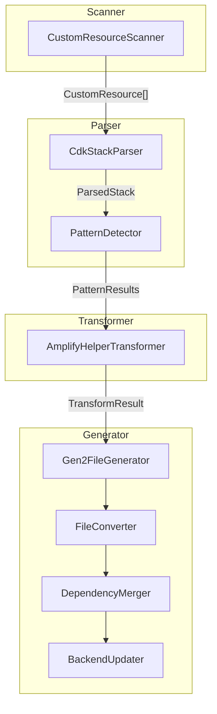

# codegen-custom-resources

The codegen-custom-resources module is a scanner and transformer for migrating custom CDK resources from AWS Amplify Gen1 to Gen2 format. It scans the Gen1 `amplify/backend/custom/` directory for custom CDK stacks, parses them using TypeScript AST, transforms Gen1-specific patterns to Gen2 equivalents, and generates Gen2-compatible `resource.ts` files that integrate with `backend.createStack()`.

Custom CDK resources in Gen1 projects use patterns that are incompatible with Gen2's architecture. Without automated transformation, developers would need to manually rewrite each custom resource, understanding both Gen1 and Gen2 patterns. This module automates the conversion by detecting Gen1-specific patterns—such as `cdk.Fn.ref('env')`, `AmplifyHelpers.getProjectInfo()`, and `cdk.CfnParameter`—and transforming them to Gen2 equivalents while preserving the resource's functionality.

Primary consumers include the `codegen-generate` module (via `command-handlers.ts`), the `AmplifyMigrationGenerateStep` in gen2-migration-core, and Amplify CLI users with custom CDK resources in their Gen1 projects.

## Key Responsibilities

- Scan `amplify/backend/custom/` directory to discover all custom CDK resources with `cdk-stack.ts` files
- Parse CDK stack files using TypeScript AST to extract class names, imports, constructor bodies, and detect Gen1 patterns
- Transform Gen1 patterns to Gen2 equivalents: `cdk.Fn.ref('env')` → `branchName`, `AmplifyHelpers.getProjectInfo()` → environment variables, `cdk.Stack` → `Construct`
- Merge dependencies from custom resource `package.json` files into the Gen2 `amplify/package.json`
- Update `backend.ts` to register custom resources using `backend.createStack()` pattern with proper imports

## Architecture

The module uses a pipeline-based architecture with four stages: Scanner discovers custom resources, Parser extracts AST information, Transformer converts Gen1 patterns to Gen2, and Generator produces output files. Each stage is implemented as a separate class with a single responsibility. The module is consumed by `command-handlers.ts` in codegen-generate which orchestrates the full migration flow.



| Component | File | Purpose |
|-----------|------|---------|
| `CustomResourceScanner` | `scanner/custom-resource-scanner.ts` | Entry point that discovers all custom resources by scanning `amplify/backend/custom/` for directories containing `cdk-stack.ts` files |
| `CdkStackParser` | `parser/cdk-stack-parser.ts` | Parses CDK stack files using TypeScript AST to extract class declarations, imports, constructor body, and detect AmplifyHelpers usage |
| `PatternDetector` | `parser/pattern-detector.ts` | Regex-based detection of Gen1 patterns in constructor body: CfnParameter for env, `cdk.Fn.ref('env')`, `getProjectInfo()`, `addResourceDependency`, CfnOutput |
| `AmplifyHelperTransformer` | `transformer/amplify-helper-transformer.ts` | Core AST transformer that converts Gen1 patterns to Gen2 using TypeScript compiler API transformations |
| `BackendUpdater` | `generator/backend-updater.ts` | Updates `backend.ts` to import custom resource classes and instantiate them using `backend.createStack()` |
| `DependencyMerger` | `generator/dependency-merger.ts` | Collects dependencies from all custom resource `package.json` files and merges them into the Gen2 `package.json`, preferring newer versions |
| `FileConverter` | `generator/file-converter.ts` | File system operations: renames `cdk-stack.ts` to `resource.ts` and removes Gen1 build artifacts |
| `Gen2FileGenerator` | `generator/gen2-file-generator.ts` | Generates Gen2 `resource.ts` file content from TransformResult, ensuring Construct import and proper class structure |

## Interface

### Exports

| Export | Type | Signature | Description |
|--------|------|-----------|-------------|
| `CustomResourceScanner` | class | `scanCustomResources(projectRoot: string): Promise<CustomResource[]>` | Scans `amplify/backend/custom/` directory for all custom resources with `cdk-stack.ts` files |
| `CdkStackParser` | class | `parseStack(filePath: string): Promise<ParsedStack>` | Parses a Gen1 CDK stack file using TypeScript AST to extract class name, imports, constructor body, outputs, and detect AmplifyHelpers usage |
| `PatternDetector` | class | `detectPatterns(constructorBody: string): PatternResults` | Detects Gen1 patterns (CfnParameter, `cdk.Fn.ref`, `getProjectInfo`, `addResourceDependency`, CfnOutput) in constructor body using regex |
| `AmplifyHelperTransformer` | class | `static transform(sourceFile: ts.SourceFile, projectName?: string): ts.SourceFile` | AST-based transformer that converts Gen1 AmplifyHelpers patterns to Gen2 equivalents using TypeScript compiler API |
| `BackendUpdater` | class | `updateBackendFile(backendFilePath: string, customResources: Map<string, string>): Promise<void>` | Updates `backend.ts` to import and instantiate custom resources using `backend.createStack()` pattern |
| `DependencyMerger` | class | `mergeDependencies(customResourcesPath: string, targetPackageJsonPath: string): Promise<void>` | Merges dependencies from custom resource `package.json` files into the Gen2 `amplify/package.json`, preferring newer versions |
| `FileConverter` | class | `convertCdkStackToResource(customResourcesPath: string): Promise<void>` | Renames `cdk-stack.ts` to `resource.ts` and removes build artifacts |
| `Gen2FileGenerator` | class | `generateResourceFile(transform: TransformResult): string` | Generates Gen2 `resource.ts` file content from transformed AST results |

### Key Interfaces

```typescript
interface CustomResource {
  name: string;
  path: string;
  cdkStackPath: string;
}

interface ParsedStack {
  className: string;
  imports: string[];
  constructorBody: string;
  outputs: CfnOutput[];
  hasAmplifyHelpers: boolean;
  hasResourceDependency: boolean;
}

interface TransformResult {
  className: string;
  imports: string[];
  constructorBody: string;
  publicProperties: string[];
  outputs: CfnOutput[];
}

interface CfnOutput {
  id: string;
  value: string;
  description?: string;
  exportName?: string;
}
```

## Dependencies

**Internal:** None (this module is consumed by codegen-generate but has no internal dependencies)

**External:**
| Package | Purpose |
|---------|---------|
| `typescript` | TypeScript compiler API (`ts.createSourceFile`, `ts.transform`, `ts.factory`) for AST parsing and transformation |
| `fs-extra` | File system operations for reading CDK stack files and writing transformed output |
| `fs` | Native `fs.promises` for async file operations (readdir, stat, rename, rm, writeFile) |
| `path` | Path manipulation for constructing file paths to custom resources |

## Code Patterns

### TypeScript AST Transformation

Uses TypeScript compiler API to parse source files into AST, apply transformations via visitor pattern, and print back to source code. This ensures syntactically correct output.

```typescript
const sourceFile = ts.createSourceFile(filePath, sourceCode, ts.ScriptTarget.Latest, true);
const result = ts.transform(sourceFile, [transformer]);
const printer = ts.createPrinter();
const output = printer.printFile(result.transformed[0]);
```

### Visitor Pattern for AST Traversal

Recursively visits all AST nodes to find and transform specific patterns. Uses `ts.visitEachChild` for recursive traversal and returns `undefined` to remove nodes.

```typescript
function visit(node: ts.Node): ts.Node {
  if (ts.isImportDeclaration(node)) {
    // Remove AmplifyHelpers import
    if (moduleSpecifier.text === '@aws-amplify/cli-extensibility-helper') {
      return undefined;
    }
  }
  return ts.visitEachChild(node, visit, context);
}
```

### Regex-Based Pattern Detection

Uses regex patterns to quickly detect Gen1-specific code patterns in constructor body before applying AST transformations.

```typescript
hasCfnParameter: /new\s+cdk\.CfnParameter\s*\(\s*this\s*,\s*['"]env['"]/i.test(constructorBody),
hasCdkFnRef: /cdk\.Fn\.ref\s*\(\s*['"]env['"]\s*\)/i.test(constructorBody),
```

### Variable Tracking for Indirect References

Tracks variable names assigned from `AmplifyHelpers.getProjectInfo()` to transform indirect property accesses like `amplifyProjectInfo.envName`.

```typescript
const projectInfoVariables = new Set<string>();
// When finding: const amplifyProjectInfo = AmplifyHelpers.getProjectInfo();
projectInfoVariables.add(declaration.name.text);
// Later transform: amplifyProjectInfo.envName → branchName
```

### Semver-Aware Dependency Merging

When merging dependencies, compares version numbers to prefer newer versions, handling caret (`^`) and tilde (`~`) prefixes.

```typescript
private isNewerVersion(v1: string, v2: string): boolean {
  const clean1 = v1.replace(/^[\^~]/, '');
  const clean2 = v2.replace(/^[\^~]/, '');
  const parts1 = clean1.split('.').map(Number);
  // Compare major.minor.patch
}
```

### Graceful Error Handling

File operations use try-catch with empty catch blocks to gracefully handle missing files or directories without failing the entire migration.

```typescript
try {
  await fs.access(cdkStackPath);
  await fs.rename(cdkStackPath, resourceFilePath);
} catch {
  // cdk-stack.ts doesn't exist, skip
}
```

## Transformation Example

### Gen1 Input

```typescript
export class cdkStack extends cdk.Stack {
  constructor(scope: Construct, id: string, props?: cdk.StackProps, amplifyResourceProps?: AmplifyHelpers.AmplifyResourceProps) {
    super(scope, id, props);
    
    new cdk.CfnParameter(this, 'env', { type: 'String' });
    const name = `topic-${cdk.Fn.ref('env')}`;
    const topic = new sns.Topic(this, 'Topic', { topicName: name });
    new cdk.CfnOutput(this, 'topicArn', { value: topic.topicArn });
  }
}
```

### Gen2 Output

```typescript
export class NotificationsStack extends Construct {
  public readonly topic: any;

  constructor(scope: Construct, id: string) {
    super(scope, id);
    
    const branchName = process.env.AWS_BRANCH ?? "sandbox";
    const name = `topic-${branchName}`;
    const topic = new sns.Topic(this, 'Topic', { topicName: name });
  }
}
```

## AI Development Notes

**Important considerations:**
- The `AmplifyHelperTransformer` is the core component—it uses TypeScript compiler API for AST transformations which ensures syntactically correct output
- The module is consumed by `command-handlers.ts` in codegen-generate, not used directly—understand the integration flow before modifying
- Custom resources with `AmplifyHelpers.addResourceDependency()` are intentionally flagged with a throw statement directing users to manual migration—this is by design
- The transformer tracks variables assigned from `getProjectInfo()` to handle indirect property accesses—this state is maintained during the transformation pass
- Constructor parameters are trimmed to just `(scope, id)` and `super()` calls are updated accordingly—this is the Gen2 Construct pattern
- The `branchName` variable uses `process.env.AWS_BRANCH` with `'sandbox'` fallback—this is the Gen2 convention for environment-aware resources

**Common pitfalls:**
- Don't assume all custom resources have `package.json` files—the `DependencyMerger` handles missing files gracefully
- The `PatternDetector` uses regex which may miss edge cases—the AST transformer is the authoritative transformation
- The `Gen2FileGenerator` is not currently used in the main flow—`command-handlers.ts` uses `AmplifyHelperTransformer` directly with in-place file modification
- Build artifacts list is hardcoded (`build`, `node_modules`, `.npmrc`, `yarn.lock`, `tsconfig.json`)—new artifacts may need to be added
- The `isNewerVersion` comparison doesn't handle pre-release versions (alpha, beta, rc)—it only compares numeric parts
- The README.md mentions an `index.ts` orchestrator that doesn't exist—the actual orchestration is in `command-handlers.ts`

**Testing guidance:**
Test with Gen1 projects that have custom CDK resources using various patterns: `cdk.Fn.ref('env')`, `AmplifyHelpers.getProjectInfo()`, CfnParameter, CfnOutput. Verify transformed code compiles and the `branchName` variable is correctly injected. Test dependency merging with conflicting versions. Test with custom resources that have `addResourceDependency` to verify the error is thrown correctly.
