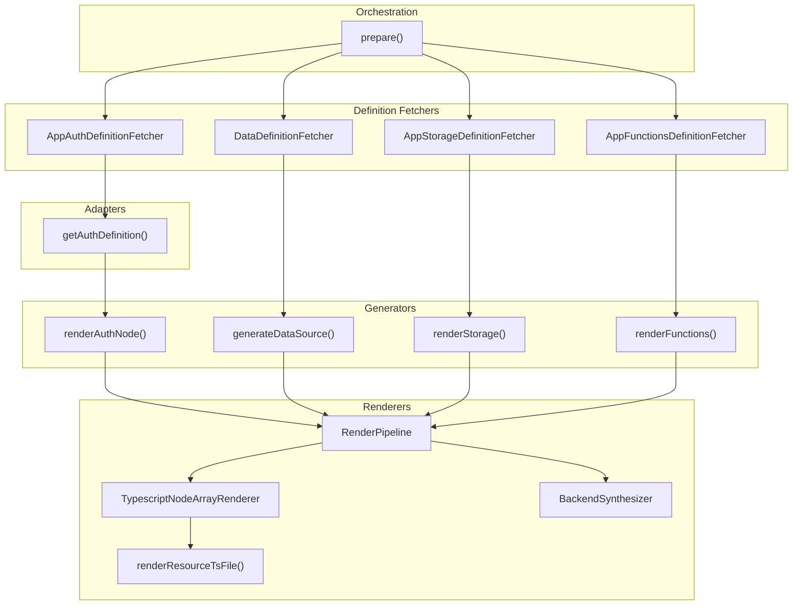

# codegen-generate

The codegen-generate module is the code generation pipeline for transforming AWS Amplify Gen1 project configurations into Gen2 TypeScript resource definitions. It fetches live AWS resource configurations from deployed Gen1 backends—including Cognito User Pools, S3 buckets, Lambda functions, and AppSync APIs—and generates idiomatic Gen2 TypeScript code using the `@aws-amplify/backend` SDK patterns.

This module solves the critical challenge of automating Gen1 to Gen2 migrations. Without this automation, developers would need to manually recreate all backend resources in Gen2 format, risking configuration drift and data loss. The module ensures DynamoDB table mappings are preserved via `migratedAmplifyGen1DynamoDbTableMappings` to prevent data migration issues. It produces a complete `amplify/` directory structure with `resource.ts` files for auth, data, storage, and functions categories.

Primary consumers include the `AmplifyMigrationGenerateStep` in gen2-migration-core, Amplify CLI users running the generate migration step, and CI/CD pipelines automating Gen1 to Gen2 migrations.

## Key Responsibilities

- Fetch live AWS resource configurations from deployed Gen1 backends using AWS SDK clients (Cognito, S3, Lambda, AppSync, CloudWatch Events)
- Transform Gen1 resource configurations into Gen2 TypeScript AST nodes using the TypeScript compiler API
- Generate complete `amplify/` directory structure with `resource.ts` files for each category (auth, data, storage, functions)
- Preserve DynamoDB table mappings via `migratedAmplifyGen1DynamoDbTableMappings` to prevent data loss during migration
- Handle custom CDK resources by copying, transforming, and integrating them into the Gen2 `backend.ts`

## Architecture

The module uses a pipeline-based architecture with three layers: Definition Fetchers (adapters) that extract configurations from AWS, Generators that transform definitions into TypeScript AST nodes, and Renderers that write the AST to files. The `BackendSynthesizer` coordinates the generation of the main `backend.ts` file that imports all resources.



| Component | File | Purpose |
|-----------|------|---------|
| `prepare` | `src/codegen-head/command-handlers.ts` | Main entry point that initializes AWS clients, fetches all definitions, runs the render pipeline, and handles post-generation tasks |
| `createGen2Renderer` | `src/core/migration-pipeline.ts` | Factory function that assembles the render pipeline with directory creation, JSON config files, and TypeScript resource files |
| `BackendSynthesizer` | `src/backend/synthesizer.ts` | Generates the main `backend.ts` file with imports, user pool client configuration, OAuth flows, and environment variable setup |
| `AppAuthDefinitionFetcher` | `src/codegen-head/app_auth_definition_fetcher.ts` | Fetches Cognito User Pool, Identity Pool, identity providers, groups, MFA config, and Lambda triggers from AWS |
| `DataDefinitionFetcher` | `src/codegen-head/data_definition_fetcher.ts` | Extracts GraphQL schema from Gen1 project structure (single file or schema folder) and API authorization modes |
| `AppStorageDefinitionFetcher` | `src/codegen-head/app_storage_definition_fetcher.ts` | Fetches S3 bucket configuration including triggers, acceleration, versioning, and encryption settings |
| `AppFunctionsDefinitionFetcher` | `src/codegen-head/app_functions_definition_fetcher.ts` | Fetches Lambda function configurations and CloudWatch Events schedules, maps functions to trigger categories |
| `renderAuthNode` | `src/generators/auth/index.ts` | Generates TypeScript AST for `defineAuth()` or `referenceAuth()` calls |
| `generateDataSource` | `src/generators/data/index.ts` | Generates TypeScript AST for `defineData()` with schema, table mappings, and authorization modes |
| `renderStorage` | `src/generators/storage/index.ts` | Generates TypeScript AST for `defineStorage()` with access patterns and triggers |
| `renderFunctions` | `src/generators/functions/index.ts` | Generates TypeScript AST for `defineFunction()` with runtime conversion and schedule format transformation |
| `TypescriptNodeArrayRenderer` | `src/renderers/typescript_block_node.ts` | Renders TypeScript AST nodes to source code strings using the TypeScript printer API |

## Interface

### Exports

| Export | Type | Description |
|--------|------|-------------|
| `prepare` | `async function(logger: Logger): Promise<void>` | Main entry point that orchestrates the entire code generation process |
| `createGen2Renderer` | `function(options: Gen2RenderingOptions): Renderer` | Creates a render pipeline that generates all Gen2 files from provided resource definitions |
| `Gen2RenderingOptions` | interface | Configuration options for the Gen2 rendering pipeline including all category definitions |
| `AuthDefinition` | interface | Complete authentication configuration for Gen2 code generation |
| `DataDefinition` | interface | GraphQL/DynamoDB data configuration including schema and table mappings |
| `StorageRenderParameters` | interface | S3 storage configuration including access patterns and triggers |
| `FunctionDefinition` | interface | Lambda function configuration extracted from Gen1 project |
| `Renderer` | interface | Base interface for all renderers in the pipeline |
| `RenderPipeline` | class | Executes a sequence of renderers in order |

### Key Interfaces

```typescript
interface Gen2RenderingOptions {
  outputDir: string;
  appId?: string;
  backendEnvironmentName?: string;
  auth?: AuthDefinition;
  storage?: StorageRenderParameters;
  data?: DataDefinition;
  functions?: FunctionDefinition[];
  customResources?: Map<string, string>;
  unsupportedCategories?: Map<string, string>;
  fileWriter?: (content: string, path: string) => Promise<void>;
}

interface AuthDefinition {
  loginOptions?: LoginOptions;
  groups?: Group[];
  mfa?: MultifactorOptions;
  standardUserAttributes?: StandardAttributes;
  customUserAttributes?: CustomAttributes;
  userPoolOverrides?: PolicyOverrides;
  lambdaTriggers?: Partial<AuthLambdaTriggers>;
  guestLogin?: boolean;
  identityPoolName?: string;
  oAuthFlows?: string[];
  readAttributes?: string[];
  writeAttributes?: string[];
  referenceAuth?: ReferenceAuth;
  userPoolClient?: UserPoolClientType;
}

interface DataDefinition {
  tableMappings?: DataTableMapping;
  schema: string;
  authorizationModes?: AuthorizationModes;
  functions?: Record<string, ConstructFactory<AmplifyFunction>>;
  logging?: DataLoggingOptions;
}
```

## Dependencies

**Internal:**
- `codegen-custom-resources` — AmplifyHelperTransformer, DependencyMerger, FileConverter, BackendUpdater for migrating custom CDK resources
- `gen2-migration-core` — Logger class for structured logging output

**External:**
| Package | Purpose |
|---------|---------|
| `@aws-sdk/client-amplify` | AmplifyClient for GetApp, UpdateApp to read/update amplify.yml buildSpec |
| `@aws-sdk/client-cloudformation` | CloudFormationClient for parsing Amplify stack resources |
| `@aws-sdk/client-cognito-identity-provider` | DescribeUserPool, DescribeUserPoolClient, ListIdentityProviders, ListGroups, GetUserPoolMfaConfig |
| `@aws-sdk/client-cognito-identity` | DescribeIdentityPool, GetIdentityPoolRoles for identity pool configuration |
| `@aws-sdk/client-s3` | GetBucketNotificationConfiguration, GetBucketAccelerateConfiguration, GetBucketVersioning, GetBucketEncryption |
| `@aws-sdk/client-lambda` | GetFunction, GetPolicy for Lambda configuration and schedule rule discovery |
| `@aws-sdk/client-cloudwatch-events` | DescribeRule for extracting CloudWatch Events schedule expressions |
| `@aws-sdk/client-sts` | GetCallerIdentity for AWS account ID |
| `typescript` | TypeScript compiler API (ts.factory) for programmatic AST generation |
| `@aws-amplify/amplify-cli-core` | stateManager for reading amplify-meta.json, pathManager for project paths |
| `glob` | Finding multiple .graphql schema files in schema folder |
| `ora` | Spinner for progress indication during custom resource migration |
| `execa` | Running npm install after code generation |

## Code Patterns

### Pipeline Pattern

The module uses a `RenderPipeline` that executes an array of `Renderer` implementations in sequence. Each renderer is responsible for a single output (directory, JSON file, or TypeScript file).

```typescript
const renderers: Renderer[] = [
  ensureOutputDir,
  ensureAmplifyDirectory,
  amplifyPackageJson,
  amplifyTsConfigJson,
  jsonRenderer
];
return new RenderPipeline(renderers);
```

### TypeScript AST Generation

Uses the TypeScript compiler API (`ts.factory`) to programmatically generate TypeScript code as AST nodes, then prints to source code. This ensures syntactically correct output.

```typescript
const factory = ts.factory;
factory.createPropertyAssignment(
  factory.createIdentifier('email'),
  factory.createTrue()
);
```

### Adapter Pattern

Definition fetchers query AWS APIs and adapters transform raw SDK responses into normalized definition interfaces (`AuthDefinition`, `DataDefinition`, etc.) that generators consume.

```typescript
const { UserPool: userPool } = await this.cognitoIdentityProviderClient.send(
  new DescribeUserPoolCommand({...})
);
return getAuthDefinition({ userPool, identityPoolName, identityProviders, ... });
```

### Table Mapping Preservation

Preserves DynamoDB table names via `migratedAmplifyGen1DynamoDbTableMappings` to ensure Gen2 deployment uses existing tables instead of creating new ones.

```typescript
dataRenderProperties.push(
  factory.createPropertyAssignment(
    migratedAmplifyGen1DynamoDbTableMappingsKeyName,
    factory.createArrayLiteralExpression([tableMappingForEnvironment])
  )
);
```

### Secret Reference Pattern

Social provider credentials are generated as `secret()` function calls that reference Amplify secrets, requiring users to set them via `npx ampx sandbox secret set`.

```typescript
factory.createPropertyAssignment(
  factory.createIdentifier('clientId'),
  factory.createCallExpression(
    secretIdentifier,
    undefined,
    [factory.createStringLiteral('GOOGLE_CLIENT_ID')]
  )
)
```

### Runtime Conversion

Converts AWS Lambda runtime strings (e.g., `nodejs18.x`) to Gen2 numeric format (e.g., `18`) for the `defineFunction()` runtime parameter.

```typescript
switch (runtime) {
  case Runtime.nodejs18x:
    nodeRuntime = 18;
    break;
  case Runtime.nodejs20x:
    nodeRuntime = 20;
    break;
}
```

## AI Development Notes

**Important considerations:**
- The module uses TypeScript compiler API (`ts.factory`) extensively—understand AST node creation patterns before modifying generators
- Definition fetchers make live AWS API calls—ensure proper error handling and consider rate limiting for large projects
- The `BackendSynthesizer` generates complex `backend.ts` with user pool client overrides, OAuth configuration, and environment variable logic—changes here affect all migrations
- Table mappings (`migratedAmplifyGen1DynamoDbTableMappings`) are critical for data preservation—never remove or modify this pattern without understanding implications
- Custom resource migration involves AST transformation via `AmplifyHelperTransformer`—this handles `AmplifyHelpers.getProjectInfo()` and `addResourceDependency()` patterns
- The `prepare()` function runs `npm install` twice intentionally to sync the lock file—this is a known workaround

**Common pitfalls:**
- Don't assume all categories exist—each definition fetcher returns `undefined` if the category is not present in the Gen1 project
- Social provider secrets (`GOOGLE_CLIENT_ID`, etc.) are placeholders—users must set actual values via `npx ampx sandbox secret set` before deployment
- The `referenceAuth` path (for imported Cognito resources) skips most auth generation—ensure this early return is preserved
- Schema folder support (multiple `.graphql` files) uses glob—ensure glob patterns work correctly on all platforms
- CloudWatch schedule expressions are converted from `rate(5 minutes)` to `every 5m` format—verify conversion logic for edge cases
- The `project-analyzer.ts` and project adapter are stub implementations—they return empty objects and are not used in the current flow
- Custom resources with `AmplifyHelpers.addResourceDependency()` throw an error directing users to manual migration—this is intentional

**Testing guidance:**
Test with deployed Amplify Gen1 projects that have all categories (auth, data, storage, functions). Verify generated TypeScript compiles without errors. Test with social login providers to ensure `secret()` calls are generated correctly. Test with scheduled Lambda functions to verify schedule expression conversion. Test custom resource migration with CDK stacks that use AmplifyHelpers. Verify DynamoDB table mappings are preserved in generated `data/resource.ts`.
