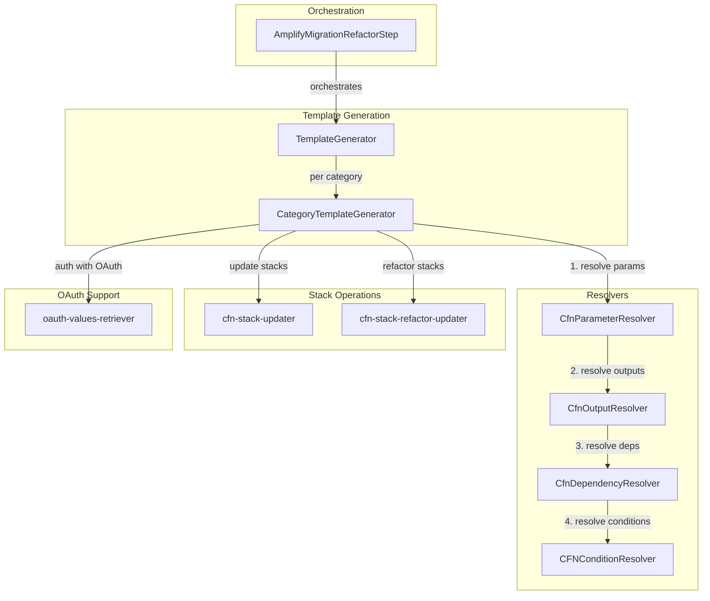

# refactor

The refactor module is a CloudFormation stack refactoring utility for moving stateful resources from AWS Amplify Gen1 stacks to Gen2 stacks. It uses the CloudFormation StackRefactor API to atomically transfer resource ownership between stacks without recreating resources, preserving data and avoiding service disruption during migration.

During Amplify Gen1 to Gen2 migration, stateful resources like Cognito User Pools and S3 buckets cannot simply be deleted and recreated—this would result in data loss (user accounts, stored files). The refactor module solves this by using CloudFormation's stack refactor capability to transfer resource ownership between stacks while keeping the physical resources intact. The module provides an interactive workflow that assesses available resources, allows selective category migration, and generates the necessary CloudFormation templates.

Primary consumers include the `AmplifyMigrationRefactorStep` in gen2-migration-core, Amplify CLI users running the refactor migration step, and DevOps engineers managing Amplify infrastructure transitions.

## Key Responsibilities

- Parse and validate Gen1 and Gen2 CloudFormation stack structures to identify category stacks (auth, storage) and their resources
- Assess available resources for migration with interactive category selection, displaying resource counts and types per category
- Generate pre-processed CloudFormation templates by resolving parameters, conditions, outputs, and dependencies for both source and destination stacks
- Execute CloudFormation stack refactor operations to atomically move resources between Gen1 and Gen2 stacks using resource mappings
- Handle OAuth provider credentials retrieval from SSM and Cognito for auth category migrations with social login providers

## Architecture

The module uses a layered architecture with orchestration, template generation, and resolution layers. `AmplifyMigrationRefactorStep` orchestrates the workflow, `TemplateGenerator` manages category-level operations, `CategoryTemplateGenerator` handles resource-level transformations, and four resolver classes (Parameter, Condition, Dependency, Output) transform CloudFormation templates for refactoring. The module uses CloudFormation's `CreateStackRefactor` and `ExecuteStackRefactor` APIs for atomic resource transfers.



| Component | File | Purpose |
|-----------|------|---------|
| `AmplifyMigrationRefactorStep` | `refactor.ts` | Main orchestrator implementing `AmplifyMigrationStep` interface. Handles parameter extraction, resource mapping validation, interactive category selection, and delegates to TemplateGenerator for execution. |
| `TemplateGenerator` (internal) | `generators/template-generator.ts` | Core engine that parses category stacks from Gen1/Gen2 root stacks, initializes CategoryTemplateGenerators for each category, and coordinates the refactor process across categories. |
| `CategoryTemplateGenerator` (internal) | `generators/category-template-generator.ts` | Category-specific template processor that generates pre-processed templates for Gen1 and Gen2 stacks, builds logical ID mappings between stacks, and produces final refactor templates. |
| `CfnParameterResolver` (internal) | `resolvers/cfn-parameter-resolver.ts` | Resolves CloudFormation `Ref` expressions for parameters by substituting actual values. Handles `CommaDelimitedList` and `List<Number>` types, and `AWS::StackName` pseudo-parameter. |
| `CFNConditionResolver` | `resolvers/cfn-condition-resolver.ts` | Evaluates CloudFormation conditions (`Fn::Equals`, `Fn::Not`, `Fn::Or`, `Fn::And`) and resolves `Fn::If` expressions in resource properties. Removes resources with unmet conditions. |
| `CfnDependencyResolver` | `resolvers/cfn-dependency-resolver.ts` | Adjusts `DependsOn` relationships for resources being refactored. Ensures resources moving to Gen2 only depend on other moving resources. |
| `CfnOutputResolver` | `resolvers/cfn-output-resolver.ts` | Resolves `Ref` and `Fn::GetAtt` expressions using stack outputs and physical resource IDs. Constructs ARNs for S3, Cognito, IAM, SQS, and Lambda resources. |
| `cfn-stack-updater` | `cfn-stack-updater.ts` | CloudFormation stack update utilities with polling for completion state. Handles 'no updates' scenarios gracefully. |
| `cfn-stack-refactor-updater` | `cfn-stack-refactor-updater.ts` | CloudFormation stack refactor execution using `CreateStackRefactor` and `ExecuteStackRefactor` APIs. Polls for completion and validates both source and destination stack states. |
| `oauth-values-retriever` | `oauth-values-retriever.ts` | Retrieves OAuth provider credentials from Cognito (client_id, client_secret) and SSM (Sign In With Apple private key) for auth migrations with social login. |

## Interface

### CLI Command

The refactor step is invoked as part of the gen2-migration workflow:

```bash
amplify gen2-migration refactor --to <gen2-stack-name> [--resourceMappings file:///path/to/mappings.json]
```

| Option | Description |
|--------|-------------|
| `--to <stack>` | Required. Target Gen2 stack name for resource migration. |
| `--resourceMappings <file>` | Optional. Custom resource mappings file with `file://` protocol prefix. |

### Exports

| Export | Type | Signature | Description |
|--------|------|-----------|-------------|
| `AmplifyMigrationRefactorStep` | class | `validate(): Promise<void>; execute(): Promise<void>; rollback(): Promise<void>; implications(): string[]` | Main entry point implementing the `AmplifyMigrationStep` interface. |
| `TemplateGenerator` | class | `initializeForAssessment(): Promise<void>; getStackTemplate(stackId): Promise<CFNTemplate>; getResourcesToMigrate(template, category): string[]; generateSelectedCategories(categories, resourceMap?): Promise<boolean>` | Core template generation engine. |
| `CategoryTemplateGenerator` | class | `generateGen1PreProcessTemplate(): Promise<CFNChangeTemplateWithParams>; generateGen2ResourceRemovalTemplate(): Promise<CFNChangeTemplateWithParams>; generateRefactorTemplates(...): CFNStackRefactorTemplates` | Category-specific template generator. |
| `tryRefactorStack` | function | `async (cfnClient, input, attempts?): Promise<[boolean, FailedRefactorResponse \| undefined]>` | Executes CloudFormation stack refactor operation with polling. |
| `tryUpdateStack` | function | `async (cfnClient, stackName, parameters, templateBody, attempts?): Promise<string>` | Updates a CloudFormation stack with given template. |
| `CfnParameterResolver` | class | `resolve(parameters: Parameter[]): CFNTemplate` | Resolves CloudFormation parameter references. |
| `CFNConditionResolver` | class | `resolve(parameters: Parameter[]): CFNTemplate` | Resolves CloudFormation conditions. |
| `CfnDependencyResolver` | class | `resolve(resourcesToRefactor: string[]): CFNTemplate` | Resolves DependsOn relationships. |
| `CfnOutputResolver` | class | `resolve(logicalResourceIds, stackOutputs, stackResources): CFNTemplate` | Resolves Ref and Fn::GetAtt references. |
| `retrieveOAuthValues` | function | `async (params: RetrieveOAuthValuesParameters): Promise<OAuthClient[]>` | Retrieves OAuth provider credentials from Cognito and SSM. |

### Supported Resource Types

The module supports migrating the following CloudFormation resource types:

| Category | Resource Types |
|----------|---------------|
| `auth` | `AWS::Cognito::UserPool`, `AWS::Cognito::UserPoolClient`, `AWS::Cognito::IdentityPool`, `AWS::Cognito::IdentityPoolRoleAttachment`, `AWS::Cognito::UserPoolDomain` |
| `auth-user-pool-group` | `AWS::Cognito::UserPoolGroup` |
| `storage` | `AWS::S3::Bucket` |

## Dependencies

**Internal:**
- `gen2-migration-core` — `AmplifyMigrationStep` base class, `Logger` class, `AmplifyGen2MigrationValidations` for lock status validation

**External:**
| Package | Purpose |
|---------|---------|
| `@aws-sdk/client-cloudformation` | CloudFormation operations: DescribeStacks, DescribeStackResources, GetTemplate, UpdateStack, CreateStackRefactor, ExecuteStackRefactor, DescribeStackRefactor |
| `@aws-sdk/client-ssm` | SSM GetParameter for retrieving Sign In With Apple private key during OAuth migrations |
| `@aws-sdk/client-cognito-identity-provider` | DescribeIdentityProvider for retrieving OAuth provider details (client_id, client_secret) |
| `@aws-sdk/client-sts` | GetCallerIdentity for AWS account ID used in ARN construction |
| `@aws-amplify/amplify-cli-core` | AmplifyError for structured error handling, stateManager for project state |
| `@aws-amplify/amplify-prompts` | prompter for interactive category selection (yesOrNo) |
| `fs-extra` | File system operations for reading resource mappings JSON files |
| `node:fs/promises` | Creating templates output directory |
| `node:assert` | Runtime assertions for validation throughout the codebase |

## Code Patterns

### Resolver Chain Pattern

Four resolver classes are applied sequentially to transform CloudFormation templates. Each resolver handles a specific aspect of template resolution, producing a fully resolved template ready for refactoring. The order matters because each resolver depends on previous transformations.

```typescript
// Order: Parameter → Output → Dependency → Condition
const gen1ParametersResolvedTemplate = new CfnParameterResolver(oldGen1Template, stackName)
  .resolve(Parameters);
const gen1TemplateWithOutputsResolved = new CfnOutputResolver(gen1ParametersResolvedTemplate, region, accountId)
  .resolve(logicalResourceIds, Outputs, stackResources);
const gen1TemplateWithDepsResolved = new CfnDependencyResolver(gen1TemplateWithOutputsResolved)
  .resolve(logicalResourceIds);
const gen1TemplateWithConditionsResolved = new CFNConditionResolver(gen1TemplateWithDepsResolved)
  .resolve(Parameters);
```

### Logical ID Mapping

Maps Gen1 resource logical IDs to Gen2 equivalents based on resource type. Handles special cases like UserPoolClient (Web vs Native) and UserPoolGroup naming conventions.

```typescript
const GEN1_RESOURCE_TYPE_TO_LOGICAL_RESOURCE_IDS_MAP = new Map<string, string>([
  [CFN_AUTH_TYPE.UserPool.valueOf(), 'UserPool'],
  [CFN_AUTH_TYPE.UserPoolClient.valueOf(), 'UserPoolClientWeb'],
  [CFN_AUTH_TYPE.IdentityPool.valueOf(), 'IdentityPool'],
]);
```

### Polling with Timeout

CloudFormation operations are asynchronous. The module polls for completion state with configurable attempts and intervals. Stack updates poll every 1.5s for 60 attempts (90s), refactor operations poll every 12s for 300 attempts (60min).

```typescript
const POLL_ATTEMPTS = 300;
const POLL_INTERVAL_MS = 12000;
do {
  const response = await cfnClient.send(new DescribeStackRefactorCommand({ StackRefactorId }));
  if (exitCondition(response)) return response;
  await new Promise((res) => setTimeout(() => res(''), POLL_INTERVAL_MS));
  attempts--;
} while (attempts > 0);
```

### Category Configuration Map

Uses a configuration object to define which CloudFormation resource types can be migrated for each category. This enables extensibility for new categories.

```typescript
private readonly categoryGeneratorConfig = {
  auth: { resourcesToRefactor: AUTH_RESOURCES_TO_REFACTOR },
  'auth-user-pool-group': { resourcesToRefactor: AUTH_USER_POOL_GROUP_RESOURCES_TO_REFACTOR },
  storage: { resourcesToRefactor: STORAGE_RESOURCES_TO_REFACTOR },
} as const;
```

### ARN Construction

Constructs ARNs for various AWS resource types when resolving `Fn::GetAtt` references. Uses region and account ID from AWS context.

```typescript
case 'AWS::Cognito::UserPool':
  return { Arn: `arn:aws:cognito-idp:${this.region}:${this.accountId}:userpool/${resourceIdentifier}` };
case 'AWS::S3::Bucket':
  return { Arn: `arn:aws:s3:::${resourceIdentifier}` };
```

### Graceful No-Op Handling

Stack update operations handle 'No updates are to be performed' responses gracefully, returning `UPDATE_COMPLETE` instead of throwing errors.

```typescript
try {
  await cfnClient.send(new UpdateStackCommand({ ... }));
  return pollStackForCompletionState(cfnClient, stackName, attempts);
} catch (e) {
  if (e.message.includes('No updates are to be performed')) {
    return UPDATE_COMPLETE;
  }
  throw e;
}
```

### Resource Mapping File Protocol

Custom resource mappings must use `file://` protocol prefix for security and clarity. The module validates this prefix before reading the JSON file.

```typescript
if (!this.resourceMappings.startsWith(FILE_PROTOCOL_PREFIX)) {
  throw new Error(`Resource mappings path must start with ${FILE_PROTOCOL_PREFIX}. Example: file:///path/to/mappings.json`);
}
const resourceMapPath = this.resourceMappings.split(FILE_PROTOCOL_PREFIX)[1];
```

## Known Limitations

- Storage refactor only supports S3 buckets, not DynamoDB tables—DynamoDB is handled in the 'generate' step via table mappings
- Auth with OAuth providers is known to be broken—fails on deployment after refactor when trying to replace IdP that already exists
- The `rollback()` method is not implemented—it only logs 'Not implemented'. Manual intervention required on failure
- The refactor operation has a 60-minute timeout (300 attempts × 12s)—very large stacks may timeout

## AI Development Notes

**Important considerations:**
- The module uses CloudFormation's StackRefactor API which atomically moves resources between stacks—this is a relatively new AWS feature and may have limitations not documented here
- Four resolver classes must be applied in the correct order: Parameter → Output → Dependency → Condition. The order matters because each resolver depends on previous transformations
- The logical ID mapping between Gen1 and Gen2 is critical—UserPoolClient has special handling (Web vs Native) and UserPoolGroup uses CDK hash suffixes that must be stripped
- OAuth migrations require credentials from both Cognito (client_id, client_secret) and SSM (Sign In With Apple private key)—ensure proper IAM permissions
- The module supports both forward migration (Gen1→Gen2) and revert (Gen2→Gen1) operations, but revert has different logical ID mapping logic
- Category stacks are identified by parsing the root stack's nested stacks and matching logical resource IDs that start with category names (auth, storage)

**Common pitfalls:**
- The `--to` parameter is required and must point to a valid Gen2 stack name—`InputValidationError` is thrown if missing
- Resource mappings file must use `file://` protocol prefix (e.g., `file:///path/to/mappings.json`)—relative paths without protocol will fail
- User pool groups and auth resources are in the same stack in Gen2 but different stacks in Gen1—the module handles this with 'auth-user-pool-group' category
- Don't assume rollback works—the `rollback()` method is not implemented and only logs a message

**Testing guidance:**
Test with deployed Amplify Gen1 projects that have auth and storage categories. Verify the assessment correctly identifies resources to migrate. Test with `--resourceMappings` to verify custom mapping support. Test OAuth migrations with social login providers (Google, Facebook, Sign In With Apple). Verify rollback behavior when refactor fails mid-operation. Test revert operation (Gen2→Gen1) to ensure bidirectional support works.
