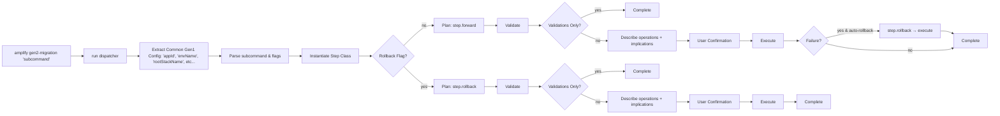

# Command | `gen2-migration`

The `gen2-migration` command is a parent command that dispatches individual subcommands that facilitate the
the migration of Gen1 applications to Gen2. It exposes a step-based CLI workflow that guides users
through the complete migration process:

1. Assessing migration readiness,
2. Locking the Gen1 environment,
3. Generating Gen2 code,
4. Refactoring CloudFormation stacks to move stateful resources,
5. Decommissioning the Gen1 environment.

The `assess` subcommand is handled separately from the step lifecycle — it is read-only and does not follow the `validate → execute → rollback` pattern. All other steps return a `Plan` object that drives a unified `describe → validate → execute` lifecycle. The `Plan` encapsulates operations and renders validation reports, operations summaries, and implications — the top-level dispatcher orchestrates all steps uniformly without knowing their internals.

## Key Responsibilities

### Argument Parsing

Parses CLI flags to control execution flow—whether to skip validations, run validations only, execute rollback operations, or
disable automatic rollback on failure. Validates flag combinations to prevent conflicting options.

```ts
const skipValidations = (context.input.options ?? {})['skip-validations'] ?? false;
const rollingBack = (context.input.options ?? {})['rollback'] ?? false;
```

### Common Gen1 Configuration Extraction

Extracts shared Gen1 configuration (`appId`, `appName`, `envName`, `stackName`, `region`) once from state manager and Amplify service,
then passes these values to step constructors. This establishes a single source of truth; subcommands should use the injected values
rather than re-extracting them independently.

### Subcommand Dispatching

Maps the subcommand name to its implementation class via the `STEPS` registry, then instantiates the step with extracted configuration.
The `assess` subcommand is intercepted before the `STEPS` lookup — it creates an `AmplifyMigrationAssessor` instead of a step,
calls `assess()` on the generate and refactor steps, and renders the result.

### Plan-Based Execution

Each step's `forward()` or `rollback()` method returns a `Plan`. The dispatcher calls `plan.validate()` first (rendering a "Failed Validations Report" with details when checks fail), then `plan.describe()` to show the operations summary and implications, then prompts for user confirmation, and finally `plan.execute()` to run the operations. If `--validations-only` is set, the dispatcher stops after validation.

### Automatic Rollback on Failure

Catches execution failures and automatically triggers rollback operations to restore the previous state, unless disabled
with `--no-rollback`.

## Extended Documentation

Detailed documentation for subcommands is available in:

- [assess.md](./gen2-migration/assess.md) - Migration readiness assessment
- [generate.md](./gen2-migration/generate.md) - Code generation pipeline for transforming Gen1 configs to Gen2 TypeScript
- [refactor.md](./gen2-migration/refactor.md) - CloudFormation stack refactoring for moving stateful resources

## Architecture

Each step extends `AmplifyMigrationStep` and returns a `Plan` from `forward()` or `rollback()`. The `Plan` owns the full lifecycle: it collects operations, runs validations (rendering a "Failed Validations Report" with per-validation details when checks fail, followed by a pass/fail summary table), displays the operations summary and implications, and executes operations sequentially. The dispatcher calls `plan.validate()` → `plan.describe()` → user confirmation → `plan.execute()`.

### `Plan`

[`src/commands/gen2-migration/_plan.ts`](../../../packages/amplify-cli/src/commands/gen2-migration/_plan.ts)

Encapsulates a list of `AmplifyMigrationOperation` objects and drives the describe/validate/execute lifecycle. Constructed with `PlanProps`: operations, a logger, a title, and optional implications.

- `validate()` — runs each operation's validation with spinner context, renders a "Failed Validations Report" (description in red + report text) for any failures, then renders a pass/fail summary table. Returns `boolean` (`true` if all passed).
- `describe()` — renders the operations summary and implications
- `execute()` — logs the title, runs all operations sequentially, prints "Done"



### `AmplifyMigrationStep`

[`src/commands/gen2-migration/_step.ts`](../../../packages/amplify-cli/src/commands/gen2-migration/_step.ts)

Abstract base class that defines the lifecycle contract for all migration steps. Each step returns a `Plan` from `forward()` and `rollback()`.

### `AmplifyMigrationOperation`

[`src/commands/gen2-migration/_operation.ts`](../../../packages/amplify-cli/src/commands/gen2-migration/_operation.ts)

Atomic operation with `describe()`, `validate()`, and `execute()` methods. The `validate()` method returns a `Validation` object (with a `description` string and a `run()` callback that produces a `ValidationResult`) or `undefined` if the operation has no validation. The `ValidationResult` includes a `valid` boolean and an optional `report` string — when validation fails, the report is displayed to the user as part of the "Failed Validations Report" section.

### `SpinningLogger`

[`src/commands/gen2-migration/_spinning-logger.ts`](../../../packages/amplify-cli/src/commands/gen2-migration/_spinning-logger.ts)

Logger that manages a spinner in normal mode and falls back to plain text output in debug mode. Consumers use `info`/`debug`/`warn` for messages and `push`/`pop` to manage hierarchical spinner context. Used by `Plan` to show progress during validation and execution.

## CLI Interface

```bash
amplify gen2-migration <step> [options]
```

### Subcommands

| Subcommand     | Description                                                           | Implementation                                          | Status          |
| -------------- | --------------------------------------------------------------------- | ------------------------------------------------------- | --------------- |
| `assess`       | Assess migration readiness for the Gen1 environment                   | `assess.ts` → `AmplifyMigrationAssessor`                | Implemented     |
| `clone`        | Clone environment for migration                                       | `clone.ts` → `AmplifyMigrationCloneStep`                | NOT IMPLEMENTED |
| `lock`         | Lock environment and enable deletion protection on stateful resources | `lock.ts` → `AmplifyMigrationLockStep`                  | Implemented     |
| `generate`     | Generate Gen2 backend code from Gen1 configuration                    | `generate.ts` → `AmplifyMigrationGenerateStep`          | Implemented     |
| `refactor`     | Move stateful resources from Gen1 to Gen2 stacks                      | `refactor/refactor.ts` → `AmplifyMigrationRefactorStep` | Implemented     |
| `shift`        | Shift traffic to Gen2                                                 | `shift.ts` → `AmplifyMigrationShiftStep`                | NOT IMPLEMENTED |
| `decommission` | Delete Gen1 environment after migration                               | `decommission.ts` → `AmplifyMigrationDecommissionStep`  | Implemented     |
| `cleanup`      | Clean up migration artifacts                                          | `cleanup.ts` → `AmplifyMigrationCleanupStep`            | NOT IMPLEMENTED |

### Global Options

| Option               | Description                                     |
| -------------------- | ----------------------------------------------- |
| `--skip-validations` | Skip pre-execution validations                  |
| `--validations-only` | Run validations without executing               |
| `--rollback`         | Execute rollback operations for the step        |
| `--no-rollback`      | Disable automatic rollback on execution failure |

## AI Development Notes

**Important considerations:**

- The step execution order matters: lock → generate → refactor → decommission. Each step validates prerequisites from previous steps.
- The `clone`, `shift`, and `cleanup` steps are NOT IMPLEMENTED—they throw 'Method not implemented' errors.
- The `GEN2_MIGRATION_ENVIRONMENT_NAME` environment variable on the Amplify app tracks which environment is being migrated and prevents concurrent migrations.
- Stateful resources (defined in `STATEFUL_RESOURCES` set) require special handling—the module prevents their deletion and enables deletion protection.
- The refactor step uses interactive prompts to let users select which categories to migrate.
- Because rollback functionality is still in development, it is recommended to run refactor with `--no-rollback` to prevent automatic rollbacks if refactor fails.
- Steps now return a `Plan` from `forward()` and `rollback()`. The `Plan` drives the full describe/validate/execute lifecycle — the dispatcher doesn't manage operations directly.
- Validations are embedded in operations via `validate()`. When a validation fails, its `report` field is displayed in a "Failed Validations Report" section before the summary table.
- `SpinningLogger` is the only logger class — the deprecated `Logger` subclass has been removed. Import directly from `_spinning-logger.ts`.
- Automatic rollback is enabled by default but can be disabled with `--no-rollback`.
- The `--rollback` flag explicitly executes rollback operations for a step.

**Common pitfalls:**

- Don't skip the lock step—subsequent steps validate that the stack is locked before proceeding.
- The `--skip-validations` flag bypasses safety checks—use with extreme caution in production.
- Environment mismatch between local and migration target will throw an error—ensure consistency.
- Rollback implementations are incomplete for most steps (throw 'Not Implemented' errors)—manual intervention may be needed on failure.
- The decommission step creates a changeset to analyze resources—this can timeout for large stacks.
- Cannot specify both `--rollback` and `--no-rollback` flags simultaneously.
- The lock step's rollback does not disable deletion protection on DynamoDB tables (preserves safety).
