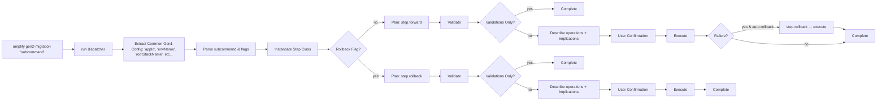

# Command | `gen2-migration`

The `gen2-migration` command is a parent command that dispatches individual subcommands that facilitate the
the migration of Gen1 applications to Gen2. It exposes a step-based CLI workflow that guides users
through the complete migration process:

1. Assessing migration readiness,
2. Locking the Gen1 environment (retains every resource in every Gen1 stack as part of this step),
3. Generating Gen2 code,
4. Refactoring CloudFormation stacks to move stateful resources,
5. Retaining every resource below root so the user can safely delete the Gen1 root stack.

The `assess` subcommand is handled separately from the step lifecycle — it is read-only and does not follow the `validate → execute → rollback` pattern. All other steps return a `Plan` object that drives a unified `validate → describe → execute` lifecycle. The `Plan` encapsulates operations and renders validation reports, operations summaries, and implications — the top-level dispatcher orchestrates all steps uniformly without knowing their internals.

## Key Responsibilities

### Argument Parsing

Parses CLI flags to control execution flow—whether to skip validations, run validations only, execute rollback operations, or
disable automatic rollback on failure. Validates flag combinations to prevent conflicting options.

```ts
const skipValidations = (context.input.options ?? {})['skip-validations'] ?? false;
const rollingBack = (context.input.options ?? {})['rollback'] ?? false;
```

### Common Gen1 Configuration Extraction

Creates a `Gen1App` facade that encapsulates all Gen1 app state — AWS clients, environment config, and the cloud backend snapshot. `Gen1App.create(context)` reads `team-provider-info.json`, fetches the app from the Amplify service, downloads the cloud backend from S3, and reads `amplify-meta.json`. The resulting instance is passed to all step constructors.

```ts
const gen1App = await Gen1App.create(context);
const implementation: AmplifyMigrationStep = new step.class(logger, gen1App, context, validations);
```

### Subcommand Dispatching

Maps the subcommand name to its implementation class via the `STEPS` registry, then instantiates the step with extracted configuration.
The `assess` subcommand is intercepted before the `STEPS` lookup — it creates an `AmplifyMigrationAssessor` with the `Gen1App` instance, calls `assess()` to collect resource and feature support levels, and prints the report.

### Plan-Based Execution

Each step's `forward()` or `rollback()` method returns a `Plan`. The dispatcher calls `plan.validate()` first (rendering a "Failed Validations Report" with details when checks fail), then `plan.describe()` to show the operations summary and implications, then prompts for user confirmation, and finally `plan.execute()` to run the operations. If `--validations-only` is set, the dispatcher stops after validation.

### Automatic Rollback on Failure

Catches execution failures and automatically triggers rollback operations to restore the previous state, unless disabled
with `--no-rollback`.

## Extended Documentation

Detailed documentation for subcommands is available in:

- [assess.md](./gen2-migration/assess.md) - Migration readiness assessment
- [lock.md](./gen2-migration/lock.md) - Environment locking and deletion protection
- [generate.md](./gen2-migration/generate.md) - Code generation pipeline for transforming Gen1 configs to Gen2 TypeScript
- [refactor.md](./gen2-migration/refactor.md) - CloudFormation stack refactoring for moving stateful resources
- [retain.md](./gen2-migration/retain.md) - Apply retain policies below root so Gen1 can be deleted safely

## Architecture

Each step extends `AmplifyMigrationStep` and returns a `Plan` from `forward()` or `rollback()`. The `Plan` owns the full lifecycle: it collects operations, runs validations (rendering a "Failed Validations Report" with per-validation details when checks fail, followed by a pass/fail summary table), displays the operations summary and implications, and executes operations sequentially. The dispatcher calls `plan.validate()` → `plan.describe()` → user confirmation → `plan.execute()`.

### `Plan`

[`src/commands/gen2-migration/_common/plan.ts`](../../../packages/amplify-cli/src/commands/gen2-migration/_common/plan.ts)

Encapsulates a list of `AmplifyMigrationOperation` objects and drives the validate/describe/execute lifecycle. Constructed with `PlanProps`: operations, a logger, a title, and optional implications.

- `validate()` — runs each operation's validation with spinner context, renders a "Failed Validations Report" (description in red + report text) for any failures, then renders a pass/fail summary table. Returns `boolean` (`true` if all passed).
- `describe()` — renders the operations summary and implications
- `execute()` — logs the title, runs all operations sequentially, prints "Done"


```mermaid
flowchart LR
    CLI[amplify gen2-migration 'subcommand'] --> RUN[run dispatcher]
    RUN --> EXTRACT[Extract Common Gen1 Config: 'appId', 'envName', 'rootStackName', etc...]
    EXTRACT --> PARSE[Parse subcommand & flags]

    PARSE --> STEP[Instantiate Step Class]

    STEP --> PLAN{Rollback Flag?}
    PLAN -->|no| FPLAN[Plan: step.forward]
    PLAN -->|yes| RPLAN[Plan: step.rollback]

    FPLAN --> FVAL[Validate]
    RPLAN --> RVAL[Validate]

    FVAL --> FVALONLY{Validations Only?}
    RVAL --> RVALONLY{Validations Only?}

    FVALONLY -->|yes| FDONE[Complete]
    RVALONLY -->|yes| RDONE[Complete]

    FVALONLY -->|no| FDESC[Describe operations + implications]
    RVALONLY -->|no| RDESC[Describe operations + implications]

    FDESC --> FCONF[User Confirmation]
    RDESC --> RCONF[User Confirmation]

    FCONF --> FEX[Execute]
    RCONF --> REX[Execute]

    FEX --> FERR{Failure?}
    FERR -->|yes & auto-rollback| AUTOROLL[step.rollback → execute]
    FERR -->|no| FDONE2[Complete]
    AUTOROLL --> FDONE2

    REX --> RDONE2[Complete]
```

### `AmplifyMigrationStep`

[`src/commands/gen2-migration/_common/step.ts`](../../../packages/amplify-cli/src/commands/gen2-migration/_common/step.ts)

Abstract base class that defines the lifecycle contract for all migration steps. Constructor takes `(logger, gen1App, context, validations)` — the `Gen1App` facade provides all app state, and `AmplifyGen2MigrationValidations` provides shared validation logic. Each step returns a `Plan` from `forward()` and `rollback()`.

### `AmplifyMigrationOperation`

[`src/commands/gen2-migration/_common/operation.ts`](../../../packages/amplify-cli/src/commands/gen2-migration/_common/operation.ts)

Atomic operation with `describe()`, `validate()`, and `execute()` methods. The `validate()` method returns a `Validation` object (with a `description` string and a `run()` callback that produces a `ValidationResult`) or `undefined` if the operation has no validation. The `ValidationResult` includes a `valid` boolean and an optional `report` string — when validation fails, the report is displayed to the user as part of the "Failed Validations Report" section.

### `SpinningLogger`

[`src/commands/gen2-migration/_common/spinning-logger.ts`](../../../packages/amplify-cli/src/commands/gen2-migration/_common/spinning-logger.ts)

Logger that manages a spinner in normal mode and falls back to plain text output in debug mode. Consumers use `info`/`debug`/`warn` for messages and `push`/`pop` to manage hierarchical spinner context. Used by `Plan` to show progress during validation and execution.

## CLI Interface

```bash
amplify gen2-migration <step> [options]
```

### Subcommands

| Subcommand | Description                                                                                                                     | Implementation                                 | Status      |
| ---------- | ------------------------------------------------------------------------------------------------------------------------------- | ---------------------------------------------- | ----------- |
| `assess`   | Assess migration readiness for the Gen1 environment                                                                             | `assess.ts` → `AmplifyMigrationAssessor`       | Implemented |
| `lock`     | Lock environment, apply `DeletionPolicy: Retain` to every resource in every Gen1 stack, and enable DynamoDB deletion protection | `lock.ts` → `AmplifyMigrationLockStep`         | Implemented |
| `generate` | Generate Gen2 backend code from Gen1 configuration                                                                              | `generate.ts` → `AmplifyMigrationGenerateStep` | Implemented |
| `refactor` | Move stateful resources from Gen1 to Gen2 stacks                                                                                | `refactor.ts` → `AmplifyMigrationRefactorStep` | Implemented |
| `retain`   | Apply retain policies to every resource in every Gen1 stack below root                                                          | `retain.ts` → `AmplifyMigrationRetainStep`     | Implemented |

### Global Options

| Option               | Description                                     |
| -------------------- | ----------------------------------------------- |
| `--skip-validations` | Skip pre-execution validations                  |
| `--validations-only` | Run validations without executing               |
| `--rollback`         | Execute rollback operations for the step        |
| `--no-rollback`      | Disable automatic rollback on execution failure |

## AI Development Notes

**Important considerations:**

- The step execution order matters: lock → generate → refactor → retain. Each step validates prerequisites from previous steps.
- The `GEN2_MIGRATION_ENVIRONMENT_NAME` environment variable on the Amplify app tracks which environment is being migrated and prevents concurrent migrations.
- Stateful resources (defined in the `DEFAULT_STATEFUL_RESOURCES` set in `_common/resource-types.ts`, exposed via `Gen1App.statefulResourceTypes`) require special handling — the lock step applies `DeletionPolicy: Retain` and `UpdateReplacePolicy: Retain` to them.
- Because rollback functionality is still in development for refactor, it is recommended to run refactor with `--no-rollback` to prevent automatic rollbacks if refactor fails.
- Steps now return a `Plan` from `forward()` and `rollback()`. The `Plan` drives the full validate/describe/execute lifecycle — the dispatcher doesn't manage operations directly.
- Validations are embedded in operations via `validate()`. When a validation fails, its `report` field is displayed in a "Failed Validations Report" section before the summary table.
- `SpinningLogger` is the only logger class — the deprecated `Logger` subclass has been removed. Import directly from `_common/spinning-logger.ts`.
- Automatic rollback is enabled by default but can be disabled with `--no-rollback`.
- The `--rollback` flag explicitly executes rollback operations for a step.
- `Gen1App` is the single facade for all Gen1 app state. It is created once in the dispatcher via `Gen1App.create(context)` and passed to all steps. Steps access `gen1App.appId`, `gen1App.region`, `gen1App.envName`, etc. instead of individual constructor params.
- `AwsClients` has a private constructor — use `AwsClients.create(context)` in production. Tests bypass this with `new (AwsClients as any)(...)`.
- Assessment uses a `Support` type with `level` and `note` fields. Each assessor provides its own note for unsupported entries. Use the `supported()`, `unsupported(note)`, `notApplicable()` helpers. The standard unsupported note is `'requires adding code after generate'`.
- `KNOWN_RESOURCE_KEYS` (in `gen1-app.ts`) defines all supported category:service pairs. Unknown resources get the `'UNKNOWN'` key.
- The lock step has a full rollback implementation (removes stack policy, removes environment variable). Before rollback, it validates that any prior `refactor` has been rolled back so that stateful resources are present in Gen1 before retain policies are removed.
- The generate step does not support rollback — it throws an error directing the user to use git to restore their local directory.
- The refactor step has a complete rollback implementation that moves resources back from Gen2 to Gen1 stacks.

**Common pitfalls:**

- Don't skip the lock step—subsequent steps validate that the stack is locked before proceeding.
- The `--skip-validations` flag bypasses safety checks—use with extreme caution in production.
- Environment mismatch between local and migration target will throw an error—ensure consistency.
- Cannot specify both `--rollback` and `--no-rollback` flags simultaneously.
- The lock step's rollback removes the deny stack policy but does not undo retain policies or DynamoDB deletion protection (preserves safety).
