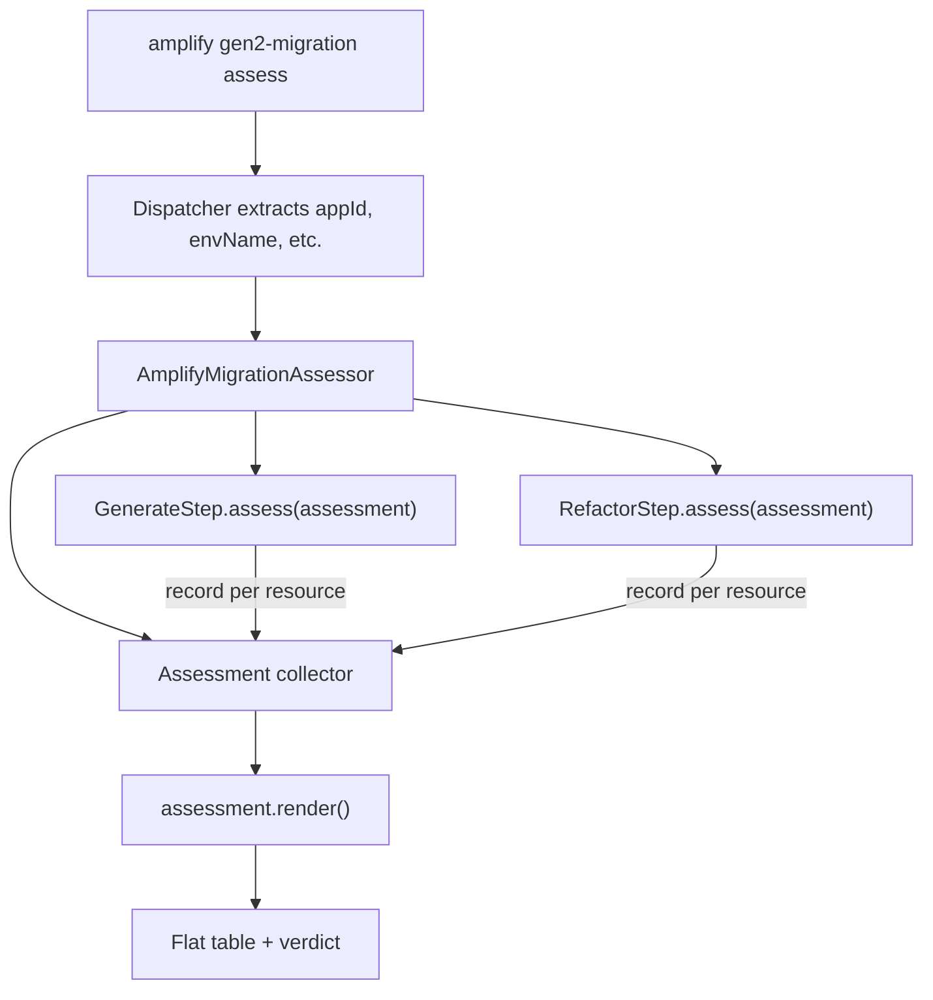

# assess

The assess subcommand evaluates migration readiness for a Gen1 application. It reads the user's `amplify-meta.json`, queries the generate and refactor steps for each discovered resource, and renders a flat table showing support status per resource.

Unlike other gen2-migration subcommands, assess does not follow the `AmplifyMigrationStep` lifecycle (`validate → execute → rollback`). It is read-only and has no side effects.

## Key Responsibilities

- Discovers all resources from `amplify-meta.json` via `Gen1App.discover()`
- Creates an `Assessment` collector and passes it to the generate and refactor steps' `assess()` methods
- Each step iterates the discovered resources and records support via `assessment.record()`
- Renders a single flat table with Category, Resource, Service, Generate, and Refactor columns
- Displays a verdict: `✔ Migration can proceed.` or `✘ Migration blocked.`

## Architecture

The assess command is handled as a special case in the gen2-migration dispatcher, intercepted after the shared config extraction but before the step lifecycle:



### `AmplifyMigrationAssessor`

[`src/commands/gen2-migration/assess.ts`](../../../../packages/amplify-cli/src/commands/gen2-migration/assess.ts)

Standalone class (not a step) that orchestrates the assessment. Creates generate and refactor step instances, calls `assess()` on each, then renders the result.

### `Assessment`

[`src/commands/gen2-migration/_assessment.ts`](../../../../packages/amplify-cli/src/commands/gen2-migration/_assessment.ts)

Collector that steps contribute to during `assess()`. Each step calls `record('generate' | 'refactor', resource, response)` for every discovered resource. The `render()` method produces the terminal output.

### `SupportResponse`

```typescript
interface SupportResponse {
  readonly supported: boolean;
  readonly notes: readonly string[];
}
```

- `supported: true`, empty notes → `✔`
- `supported: true`, non-empty notes → `⚠` with notes
- `supported: false` → `✘` with status label

### `DiscoveredResource`

```typescript
interface DiscoveredResource {
  readonly category: string;
  readonly resourceName: string;
  readonly service: string;
}
```

Produced by `Gen1App.discover()`, which iterates all categories in `amplify-meta.json` and extracts `(category, resourceName, service)` tuples.

## Blocker Condition

Migration is blocked if any resource has `refactor.supported === false`. Missing generate support is not a blocker — the user can write Gen2 code manually.

## Supported Resources

The same switch cases in each step's `assess()` and `execute()` methods define what's supported:

| Category  | Service                 | Generate | Refactor  |
| --------- | ----------------------- | -------- | --------- |
| auth      | Cognito                 | ✔        | ✔         |
| auth      | Cognito-UserPool-Groups | ✔        | ✔         |
| storage   | S3                      | ✔        | ✔         |
| storage   | DynamoDB                | ✔        | ✔         |
| api       | AppSync                 | ✔        | ✔ (no-op) |
| api       | API Gateway             | ✔        | ✔ (no-op) |
| analytics | Kinesis                 | ✔        | ✔         |
| function  | Lambda                  | ✔        | ✔ (no-op) |

Any other `(category, service)` pair is unsupported.

## AI Development Notes

- The assess command reuses the same config extraction as other steps (appId, envName, stackName, region, logger) — no duplication.
- Adding support for a new resource type requires adding a case to both `assess()` and `execute()` in the relevant step. The switch cases are the single source of truth.
- The `Assessment` class owns rendering — it produces a flat table with dynamic column widths and status text baked into the Generate/Refactor cells.
- `Gen1App.discover()` skips internal categories (`providers`, `hosting`) and resources without a `service` field.
