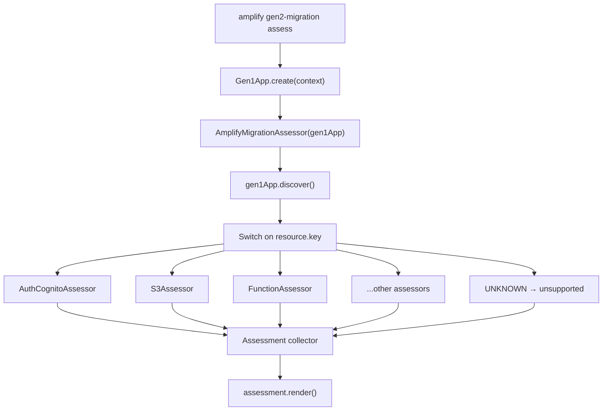

# assess

The assess subcommand evaluates migration readiness for a Gen1 application. It discovers all resources from `amplify-meta.json`, delegates to per-category assessors, and renders a table showing support status per resource and feature.

Unlike other gen2-migration subcommands, assess does not follow the `AmplifyMigrationStep` lifecycle. It is read-only and has no side effects.

## Key Responsibilities

- Discovers all resources from `amplify-meta.json` via `Gen1App.discover()`
- Delegates to per-category `Assessor` implementations that record resource-level and feature-level support
- Each assessor calls `assessment.recordResource()` and optionally `assessment.recordFeature()` for detected sub-features (overrides, custom policies)
- Renders a table with Category, Service, Resource, Generate, and Refactor columns
- The generate and refactor steps also use `Assessment.validFor(step)` during their validation phase

## Architecture

The assess command is handled as a special case in the gen2-migration dispatcher:


```mermaid
flowchart TD
    CLI["amplify gen2-migration assess"] --> GEN1APP["Gen1App.create(context)"]
    GEN1APP --> ASSESSOR["AmplifyMigrationAssessor(gen1App)"]
    ASSESSOR --> DISCOVER["gen1App.discover()"]
    DISCOVER --> SWITCH["Switch on resource.key"]
    SWITCH --> AUTH["AuthCognitoAssessor"]
    SWITCH --> S3["S3Assessor"]
    SWITCH --> FUNC["FunctionAssessor"]
    SWITCH --> OTHER["...other assessors"]
    SWITCH --> UNKNOWN["UNKNOWN → unsupported"]
    AUTH --> ASSESSMENT["Assessment collector"]
    S3 --> ASSESSMENT
    FUNC --> ASSESSMENT
    OTHER --> ASSESSMENT
    UNKNOWN --> ASSESSMENT
    ASSESSMENT --> RENDER["assessment.render()"]
```

### `AmplifyMigrationAssessor`

[`src/commands/gen2-migration/assess.ts`](../../../../packages/amplify-cli/src/commands/gen2-migration/assess.ts)

Standalone class (not a step). `assess()` returns an `Assessment` instance. `run()` calls `assess()` and prints the report.

### `Assessment`

[`src/commands/gen2-migration/assess/assessment.ts`](../../../../packages/amplify-cli/src/commands/gen2-migration/assess/assessment.ts)

Collector that assessors contribute to. Exposes `validFor('generate' | 'refactor')` for step validation, `of(resource, step)` for per-resource support lookup, and `render()` for terminal output. Renders a "Resources" table and an "Advanced Features" table (for detected sub-features like overrides and custom policies), followed by a link to the migration guide's feature coverage section. Each entry uses the `Support` type with `level` and optional `note`.

### `Support`

```typescript
interface Support {
  readonly level: SupportLevel; // 'supported' | 'unsupported' | 'not-applicable'
  readonly note?: string; // displayed in the table for unsupported entries
}
```

Helper functions: `supported()`, `unsupported(note)`, `notApplicable()`.

### `Assessor`

[`src/commands/gen2-migration/assess/assessor.ts`](../../../../packages/amplify-cli/src/commands/gen2-migration/assess/assessor.ts)

Interface with a single `record(assessment)` method. Each category has its own implementation.

### `DiscoveredResource`

Produced by `Gen1App.discover()`. The `key` field is a typed `category:service` pair from `KNOWN_RESOURCE_KEYS`, or `'UNKNOWN'` for unrecognized pairs.

## Supported Resources

| Category  | Service                 | Generate         | Refactor    |
| --------- | ----------------------- | ---------------- | ----------- |
| auth      | Cognito                 | ✔                | ✔           |
| auth      | Cognito-UserPool-Groups | ✔                | ✔           |
| storage   | S3                      | ✔                | ✔           |
| storage   | DynamoDB                | ✔                | ✔           |
| api       | AppSync                 | ✔ (V2 only)      | n/a         |
| api       | API Gateway             | ✔                | n/a         |
| analytics | Kinesis                 | ✔                | ✔           |
| function  | Lambda                  | ✔ (Node.js only) | n/a         |
| geo       | Map                     | ✔                | ✔           |
| geo       | PlaceIndex              | ✔                | ✔           |
| geo       | GeofenceCollection      | ✔                | unsupported |

## AI Development Notes

- Adding a new resource type: add the pair to `KNOWN_RESOURCE_KEYS` in `gen1-app.ts`, create an assessor, handle the case in `assess.ts`, and in the generate/refactor steps. The compiler enforces exhaustiveness.
- The `Assessment` is also used by generate and refactor steps for validation — `validFor(step)` returns false if any resource or feature is unsupported for that step. The `of(resource, step)` method returns the `Support` for a specific resource, used by the generate orchestrator to skip unsupported resources before instantiating generators.
- Feature detection (overrides, custom policies, conflict resolution) is assessor-specific. Each assessor checks for files in the cloud backend directory via `gen1App.fileExists()` or reads `cli-inputs.json` via `gen1App.cliInputs()`.
- `DataAssessor` checks the GraphQL transformer version via `FeatureFlags.getNumber('graphQLTransformer.transformerVersion')`. If the version is not 2 (i.e., Transformer V1), the resource is marked unsupported for generate. It also detects conflict resolution (DataStore) by reading `cli-inputs.json` for the API resource. If `serviceConfiguration.conflictResolution` is present and non-empty, both generate and refactor are marked unsupported because Gen2 does not support DataStore conflict resolution.
- `FunctionAssessor` reads the Lambda runtime from the local CloudFormation template (`function/<name>/<name>-cloudformation-template.json`). Non-Node.js runtimes are marked as unsupported for generate. Function refactor is always not-applicable since functions are stateless.
