# generate-new — Overview

Code generation pipeline that transforms Gen1 Amplify projects into Gen2 TypeScript resource definitions. Fetches live AWS resource configurations and local project files, then generates a complete `amplify/` directory with `resource.ts` files, `backend.ts`, and supporting config files.

## Architecture

The pipeline has three layers:

- **Input** (`input/`) — `Gen1App` facade provides lazy-loading, cached access to all Gen1 state (AWS resources via `AwsFetcher`, local files via `BackendDownloader`). Every generator receives `Gen1App` and queries what it needs.

- **Output** (`output/`) — Per-resource generators produce `AmplifyMigrationOperation[]`. Each generator has a renderer (pure AST construction) and a generator (orchestration + backend.ts contributions). Generators contribute imports, statements, and properties to `BackendGenerator`, which assembles `backend.ts` last.

- **Orchestrator** (`prepare.ts`) — Reads `amplify-meta.json` category keys and service types, instantiates one generator per resource, collects all operations, and appends a final operation for folder replacement + npm install. Returns operations to the parent dispatcher for user confirmation.

## Key Abstractions

**Generator interface** — Every generator implements this. Returns `AmplifyMigrationOperation[]` from `plan()`, reusing the existing operation interface that co-locates `describe()` and `execute()`.

```typescript
interface Generator {
  plan(): Promise<AmplifyMigrationOperation[]>;
}
```

**Gen1App** — Lazy-loading facade passed to every generator. Each `fetch*` method calls AWS on first invocation and caches the result. AWS SDK calls are delegated to `AwsFetcher`. Local file reads are handled directly. Easy to mock: stub only the methods your test needs.

```typescript
class Gen1App {
  public readonly appId: string;
  public readonly region: string;
  public readonly envName: string;
  public readonly clients: AwsClients;
  public readonly aws: AwsFetcher;

  public fetchMeta(): Promise<$TSMeta>;
  public fetchMetaCategory(category: string): Promise<Record<string, unknown> | undefined>;
  public fetchFunctionNames(): Promise<ReadonlySet<string>>;
  public fetchFunctionCategoryMap(): Promise<ReadonlyMap<string, string>>;
  public fetchGraphQLSchema(apiName: string): Promise<string>;
  public fetchRestApiConfigs(apiCategory: Record<string, unknown>): Promise<RestApiDefinition[]>;
  // ... other lazy-loading, cached methods
}
```

**BackendGenerator** — Implements `Generator`. Other generators call `addImport()`, `addStatement()`, etc. during their execution. When run last, it writes `backend.ts` from the accumulated content.

```typescript
class BackendGenerator implements Generator {
  public addImport(source: string, identifiers: string[]): void;
  public addDefineBackendProperty(property: ts.ObjectLiteralElementLike): void;
  public addStatement(statement: ts.Statement): void;
  public addEarlyStatement(statement: ts.Statement): void;
  public ensureBranchName(): void;
  public ensureStorageStack(hasS3Bucket: boolean): void;
  public plan(): Promise<AmplifyMigrationOperation[]>;
}
```

**Per-resource generators** — The orchestrator reads `amplify-meta.json` and creates one concrete generator per resource, dispatched by service type:

| Category  | Service     | Generator                         |
| --------- | ----------- | --------------------------------- |
| auth      | Cognito     | `AuthGenerator` (one per project) |
| storage   | S3          | `S3Generator`                     |
| storage   | DynamoDB    | `DynamoDBGenerator`               |
| api       | AppSync     | `DataGenerator`                   |
| api       | API Gateway | `RestApiGenerator`                |
| analytics | Kinesis     | `AnalyticsKinesisGenerator`       |
| custom    | any         | `CustomResourceGenerator`         |
| function  | any         | `FunctionGenerator`               |

Each generator receives `Gen1App`, `BackendGenerator`, the output directory, and a resource name. It writes its `resource.ts` and contributes to `BackendGenerator` and `RootPackageJsonGenerator`.

## Design Rules

1. **Generators are per-resource** — one generator per resource entry in `amplify-meta.json`
2. **Orchestrator does zero data derivation** — reads meta keys/service types, delegates everything else to generators via `Gen1App`
3. **BackendGenerator accumulates** — category generators contribute; `BackendGenerator` assembles `backend.ts` when its own `plan()` runs last
4. **Operations are returned, not executed** — `prepareNew()` returns `AmplifyMigrationOperation[]` to the parent dispatcher for describe → confirm → execute
5. **No imports from old code** — `generate-new/` is fully self-contained
6. **Renderers are pure** — no AWS calls, no side effects, no `Gen1App` dependency

## Execution Flow

```mermaid
flowchart TD
    STEP["generate.ts - prepareNew()"] -->|Create| G1[Gen1App]
    STEP -->|Create| BG[BackendGenerator]
    STEP -->|Create| PKG[RootPackageJsonGenerator]

    STEP -->|Read meta, dispatch by service| GENS["Per-resource generators"]

    GENS --> AUTH["AuthGenerator"]
    GENS --> S3["S3Generator"]
    GENS --> DYNAMO["DynamoDBGenerator xN"]
    GENS --> DATA["DataGenerator"]
    GENS --> REST["RestApiGenerator xN"]
    GENS --> KINESIS["AnalyticsKinesisGenerator xN"]
    GENS --> CUSTOM["CustomResourceGenerator xN"]
    GENS --> FUNC["FunctionGenerator xN"]

    AUTH -->|writes| AUTH_F["amplify/auth/resource.ts"]
    S3 -->|writes| S3_F["amplify/storage/resource.ts"]
    DATA -->|writes| DATA_F["amplify/data/resource.ts"]
    FUNC -->|writes| FUNC_F["amplify/category/name/resource.ts"]
    KINESIS -->|writes| KIN_F["amplify/analytics/resource.ts"]
    CUSTOM -->|writes| CUST_F["amplify/custom/name/resource.ts"]

    AUTH -->|contribute| BG
    S3 -->|contribute| BG
    DYNAMO -->|contribute| BG
    DATA -->|contribute| BG
    REST -->|contribute| BG
    KINESIS -->|contribute| BG
    CUSTOM -->|contribute| BG
    FUNC -->|contribute| BG

    FUNC -->|contribute deps| PKG
    CUSTOM -->|contribute deps| PKG

    BG -->|writes last| BACK_F["amplify/backend.ts"]
    PKG -->|writes| PKG_F["package.json"]

    STEP -->|Create| INFRA["Infrastructure generators"]
    INFRA --> BPKG["BackendPackageJsonGenerator"]
    INFRA --> TSC["TsConfigGenerator"]
    INFRA --> YML["AmplifyYmlGenerator"]
    INFRA --> GIT["GitIgnoreGenerator"]

    STEP -->|append| FINAL["Final operation: replace amplify/ + npm install"]
    STEP -->|return| OPS["AmplifyMigrationOperation array"]
    OPS -->|to| DISP["Parent dispatcher: describe, confirm, execute"]
```



## Refactoring Requirements

These requirements drove the design. See `REFACTORING_GENERATE.md` for full details.

- **R1** — All generators access Gen1 app info through `Gen1App` facade (lazy, cached, mockable)
- **R2** — Category generators contribute to `backend.ts` through `BackendGenerator`
- **R3** — Adding a new category requires only creating the generator + one line in the orchestrator
- **R4** — Each generator is self-contained — no cross-category logic in the orchestrator
- **R5** — Generators support dry run via `plan()` returning describable operations

## File Map

| File                    | Role                                                                                        |
| ----------------------- | ------------------------------------------------------------------------------------------- |
| `prepare.ts`            | Orchestrator — instantiates generators, returns operations                                  |
| `generator.ts`          | `Generator` interface — `plan(): Promise<AmplifyMigrationOperation[]>`                      |
| `ts-factory-utils.ts`   | Shared AST builders: `constDecl`, `propAccess`, `constFromBackend`, `assignProp`, `jsValue` |
| `ts-writer.ts`          | Prints AST nodes to formatted TypeScript strings via prettier                               |
| `resource.ts`           | Shared `renderResourceTsFile()` for generating `resource.ts` files with imports + export    |
| `package-json-patch.ts` | Patches package.json with Gen2 dev dependencies                                             |
