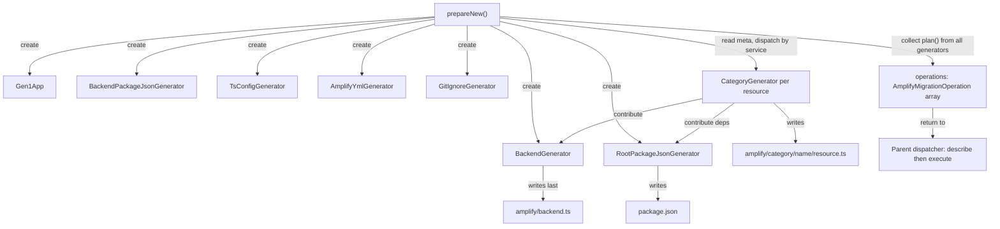

# generate-new — Overview

Code generation pipeline that transforms Gen1 Amplify projects into Gen2 TypeScript resource definitions. Fetches live AWS resource configurations and local project files, then generates a complete `amplify/` directory with `resource.ts` files, `backend.ts`, and supporting config files.

## Directory Structure

```
generate-new/
├── input/                              Gen1 app state (AWS + local files)
│   ├── gen1-app.ts                     Facade — lazy-loading, caching access
│   ├── aws-fetcher.ts                  All AWS SDK calls, cached
│   ├── aws-clients.ts                  Client factory interface
│   ├── backend-downloader.ts           S3 zip download + extraction
│   ├── auth-access-analyzer.ts         CFN policy parser for Cognito permissions
│   └── file-exists.ts                  File existence utility
├── output/                             Generators and renderers
│   ├── auth/                           Auth category
│   ├── data/                           AppSync/GraphQL category
│   ├── storage/                        S3 + DynamoDB category
│   ├── functions/                      Lambda category
│   ├── analytics/                      Kinesis category
│   ├── rest-api/                       API Gateway category
│   ├── custom-resources/               Custom CDK stacks
│   ├── backend.generator.ts            Accumulates backend.ts contributions
│   ├── root-package-json.generator.ts
│   ├── backend-package-json.generator.ts
│   ├── tsconfig.generator.ts
│   ├── amplify-yml.generator.ts
│   └── gitignore.generator.ts
├── prepare.ts                          Orchestrator entry point
├── generator.ts                        Generator interface
├── resource.ts                         Shared resource.ts renderer
├── ts-writer.ts                        AST printer (prettier)
├── ts-factory-utils.ts                 Shared AST builder helpers
└── package-json-patch.ts               Gen2 dev dependency patching
```

### `generate-new/` (root)

The root contains the orchestrator (`prepare.ts`), the `Generator` interface, and shared utilities used across both input and output layers. `prepare.ts` is the entry point — it reads `amplify-meta.json`, instantiates generators, collects their operations, and returns them. The utilities (`ts-writer.ts`, `ts-factory-utils.ts`, `resource.ts`) provide common AST construction and printing that all renderers share.

### `input/`

Everything needed to read Gen1 app state. `Gen1App` is the facade that generators interact with — it delegates AWS SDK calls to `AwsFetcher` and local file reads to `BackendDownloader`. Each fetch method caches its result so multiple generators querying the same data don't duplicate work. `auth-access-analyzer.ts` is a specialized parser that extracts Cognito permissions from CloudFormation templates for the function generator.

### `output/`

All generators and renderers. Each category subdirectory (`auth/`, `data/`, `storage/`, etc.) contains a generator (orchestration, `Gen1App` queries, `BackendGenerator` contributions) and a renderer (pure AST construction from typed options). The root of `output/` holds infrastructure generators that don't have renderers — they write simple config files directly (`backend.ts`, `package.json`, `tsconfig.json`, `amplify.yml`, `.gitignore`).

## Architecture

The pipeline has three layers:

- **Input** (`input/`) — `Gen1App` facade provides lazy-loading, cached access to all Gen1 state (AWS resources via `AwsFetcher`, local files via `BackendDownloader`). Every generator receives `Gen1App` and queries what it needs.

- **Output** (`output/`) — Per-resource generators produce `AmplifyMigrationOperation[]`. Each generator has a renderer (pure AST construction) and a generator (orchestration + backend.ts contributions). Generators contribute imports, statements, and properties to `BackendGenerator`, which assembles `backend.ts` last.

- **Orchestrator** (`prepare.ts`) — Reads `amplify-meta.json` category keys and service types, instantiates one generator per resource, collects all operations, and appends a final operation for folder replacement + npm install. Returns operations to the parent dispatcher for user confirmation.

## Key Abstractions

**Generator interface** — Every generator implements this. Returns `AmplifyMigrationOperation[]` from `plan()`, reusing the existing operation interface that co-locates `describe()` and `execute()`.

```typescript
interface Generator {
  plan(): Promise<AmplifyMigrationOperation[]>;
}
```

**Gen1App** — Lazy-loading facade passed to every generator. Each `fetch*` method calls AWS on first invocation and caches the result. AWS SDK calls are delegated to `AwsFetcher`. Local file reads are handled directly. Easy to mock: stub only the methods your test needs.

```typescript
class Gen1App {
  public readonly appId: string;
  public readonly region: string;
  public readonly envName: string;
  public readonly clients: AwsClients;
  public readonly aws: AwsFetcher;

  public fetchMeta(): Promise<$TSMeta>;
  public fetchMetaCategory(category: string): Promise<Record<string, unknown> | undefined>;
  public fetchFunctionNames(): Promise<ReadonlySet<string>>;
  public fetchFunctionCategoryMap(): Promise<ReadonlyMap<string, string>>;
  public fetchGraphQLSchema(apiName: string): Promise<string>;
  public fetchRestApiConfigs(apiCategory: Record<string, unknown>): Promise<RestApiDefinition[]>;
  // ... other lazy-loading, cached methods
}
```

**BackendGenerator** — Implements `Generator`. Other generators call `addImport()`, `addStatement()`, etc. during their execution. When run last, it writes `backend.ts` from the accumulated content.

```typescript
class BackendGenerator implements Generator {
  public addImport(source: string, identifiers: string[]): void;
  public addDefineBackendProperty(property: ts.ObjectLiteralElementLike): void;
  public addStatement(statement: ts.Statement): void;
  public addEarlyStatement(statement: ts.Statement): void;
  public ensureBranchName(): void;
  public ensureStorageStack(hasS3Bucket: boolean): void;
  public plan(): Promise<AmplifyMigrationOperation[]>;
}
```

**Per-resource generators** — The orchestrator reads `amplify-meta.json` and creates one concrete generator per resource, dispatched by service type:

| Category  | Service     | Generator                         |
| --------- | ----------- | --------------------------------- |
| auth      | Cognito     | `AuthGenerator` (one per project) |
| storage   | S3          | `S3Generator`                     |
| storage   | DynamoDB    | `DynamoDBGenerator`               |
| api       | AppSync     | `DataGenerator`                   |
| api       | API Gateway | `RestApiGenerator`                |
| analytics | Kinesis     | `AnalyticsKinesisGenerator`       |
| custom    | any         | `CustomResourceGenerator`         |
| function  | any         | `FunctionGenerator`               |

Each generator receives `Gen1App`, `BackendGenerator`, the output directory, and a resource name. It writes its `resource.ts` and contributes to `BackendGenerator` and `RootPackageJsonGenerator`.

## Design Principles

### Generators are per-resource

Each resource entry in `amplify-meta.json` gets its own generator instance. The orchestrator iterates category keys and service types, creating one concrete generator per resource (e.g., one `S3Generator` for the S3 bucket, one `FunctionGenerator` per Lambda). This keeps each generator focused on a single resource and avoids shared mutable state between resources in the same category.

### Orchestrator does zero data derivation

`prepareNew()` reads `amplify-meta.json` top-level keys and dispatches by service type — that's it. All data fetching, transformation, and rendering logic lives in the generators themselves, accessed through `Gen1App`. The orchestrator is a thin loop that creates generators and collects their operations.

### All generators access Gen1 state through Gen1App

`Gen1App` is a lazy-loading, caching facade over AWS SDK calls and local file reads. Every generator receives it and queries only what it needs. Results are cached so multiple generators reading the same data (e.g., `amplify-meta.json`) don't duplicate API calls. In tests, stub only the methods your generator actually calls.

### Category generators contribute to backend.ts through BackendGenerator

No centralized synthesizer knows about every category. Instead, each category generator calls `addImport()`, `addStatement()`, and `addDefineBackendProperty()` on `BackendGenerator` during its own `plan()` execution. `BackendGenerator` runs last and assembles the accumulated contributions into a single `backend.ts` file with sorted imports and properties.

### Each generator is self-contained

A generator owns all logic for its category — both the `resource.ts` file and its `backend.ts` contributions. No cross-category logic lives in the orchestrator or in other generators. For example, the auth generator handles user pool overrides, identity pool config, and provider setup without any help from the storage or data generators.

### Adding a new category requires only creating the generator

A new category generator plugs in with one line in `prepareNew()` to instantiate it. No existing generators need modification, no shared interfaces need extending, no central switch statement needs a new case.

### Operations are returned, not executed

`prepareNew()` returns `AmplifyMigrationOperation[]` to the parent dispatcher. Each operation co-locates a `describe()` (what it will do) and an `execute()` (how to do it). The dispatcher shows all descriptions to the user, prompts for confirmation, then executes sequentially. This enables dry-run support without any generator-level changes.

### Renderers are pure

Renderer classes (`AuthRenderer`, `DataRenderer`, `S3Renderer`, etc.) produce TypeScript AST nodes from typed input — no AWS calls, no file I/O, no `Gen1App` dependency. This makes them trivially testable: pass in options, get back AST nodes, print and assert.

## Execution Flow



## File Map

| File                    | Role                                                                                        |
| ----------------------- | ------------------------------------------------------------------------------------------- |
| `prepare.ts`            | Orchestrator — instantiates generators, returns operations                                  |
| `generator.ts`          | `Generator` interface — `plan(): Promise<AmplifyMigrationOperation[]>`                      |
| `ts-factory-utils.ts`   | Shared AST builders: `constDecl`, `propAccess`, `constFromBackend`, `assignProp`, `jsValue` |
| `ts-writer.ts`          | Prints AST nodes to formatted TypeScript strings via prettier                               |
| `resource.ts`           | Shared `renderResourceTsFile()` for generating `resource.ts` files with imports + export    |
| `package-json-patch.ts` | Patches package.json with Gen2 dev dependencies                                             |
