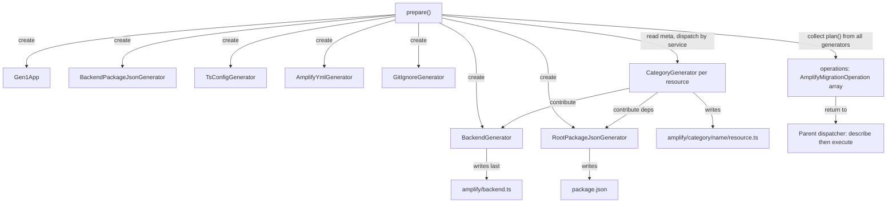

# generate-new — Overview

Code generation pipeline that transforms Gen1 Amplify projects into Gen2 TypeScript resource definitions. Fetches live AWS resource configurations and local project files, then generates a complete `amplify/` directory with `resource.ts` files, `backend.ts`, and supporting config files.

## Directory Structure

```
generate-new/
├── _infra/                             Shared infrastructure
│   ├── gen1-app.ts                     Facade — lazy-loading, caching access
│   ├── aws-fetcher.ts                  All AWS SDK calls, cached
│   ├── aws-clients.ts                  Client factory interface
│   ├── files.ts                        File existence utility
│   ├── generator.ts                    Generator interface
│   └── ts.ts                           TS class — AST builders, printer, resource renderer
├── amplify/                            Generators for the amplify/ output directory
│   ├── auth/                           Auth category (Cognito)
│   ├── data/                           AppSync/GraphQL category
│   ├── storage/                        S3 + DynamoDB category
│   ├── function/                       Lambda category
│   ├── analytics/                      Kinesis category
│   ├── rest-api/                       API Gateway category
│   ├── custom-resources/               Custom CDK stacks
│   ├── backend.generator.ts            Accumulates backend.ts contributions
│   ├── package.json.generator.ts       amplify/package.json (backend deps)
│   └── tsconfig.generator.ts           amplify/tsconfig.json
├── package.json.generator.ts           Root package.json (Gen2 dev deps)
├── amplify.yml.generator.ts            CI/CD buildspec
└── gitignore.generator.ts              .gitignore entries
```

### `_infra/`

Shared infrastructure used across all generators. `Gen1App` is the facade
that generators interact with — it delegates AWS SDK calls to `AwsFetcher`
and local file reads to its own methods. The `TS` utility class provides
AST node construction, printing (via prettier), and the shared
`renderResourceTsFile()` method that all category renderers use to produce
`resource.ts` files.

### `amplify/`

All generators and renderers that produce files inside the `amplify/`
output directory. Each category subdirectory contains a generator
(orchestration, `Gen1App` queries, `BackendGenerator` contributions) and a
renderer (pure AST construction from typed options). The root of `amplify/`
holds `backend.generator.ts` (assembles `backend.ts`),
`package.json.generator.ts` (backend package.json), and
`tsconfig.generator.ts`.

### Top-level generators

`package.json.generator.ts` writes the root `package.json` with Gen2 dev
dependencies. `amplify.yml.generator.ts` repurposes or creates the CI/CD
buildspec. `gitignore.generator.ts` appends Gen2 entries to `.gitignore`.

## Architecture

The pipeline has two layers plus an orchestrator:

- **Infrastructure** (`_infra/`) — `Gen1App` facade provides cached access
  to all Gen1 state (AWS resources via `AwsFetcher`, local files). `TS`
  provides all TypeScript AST utilities. `Generator` defines the interface.

- **Generators** (`amplify/` + top-level) — Per-resource generators produce
  `AmplifyMigrationOperation[]`. Each category has a renderer (pure AST
  construction) and a generator (orchestration + backend.ts contributions).

- **Orchestrator** (`generate.ts`) — Uses `Gen1App.discover()` to iterate
  all resources from `amplify-meta.json`, dispatches by `category:service`
  via a switch statement, and instantiates one generator per resource.
  Collects all operations and appends final operations for folder
  replacement + npm install. The same switch is used by the `assess()`
  method to record support into an `Assessment` collector.

## Key Abstractions

**Generator interface** — Every generator implements this. Returns
`AmplifyMigrationOperation[]` from `plan()`.

```typescript
interface Generator {
  plan(): Promise<AmplifyMigrationOperation[]>;
}
```

**Gen1App** — Category-agnostic facade constructed via `Gen1App.create()`.
Downloads the cloud backend from S3 and reads `amplify-meta.json`. After
construction, local state is available synchronously. AWS SDK calls are
delegated to `AwsFetcher`. The `discover()` method iterates all categories
and returns `DiscoveredResource[]` — a flat list of `(category, resourceName, service)` tuples.

**TS** — Static utility class combining AST node builders (`constDecl`,
`propAccess`, `assignProp`, `jsValue`), printing (`printNodes`,
`printNode`), and the shared `renderResourceTsFile()` method. All
renderers use `TS` instead of importing scattered utility functions.

**BackendGenerator** — Implements `Generator`. Other generators call
`addImport()`, `addStatement()`, `addDefineBackendProperty()` during their
execution. Runs last and writes `backend.ts` from accumulated content.

**Per-resource generators** — The orchestrator creates one per resource:

| Category  | Service                 | Generator                   |
| --------- | ----------------------- | --------------------------- |
| auth      | Cognito                 | `AuthGenerator`             |
| auth      | Cognito-UserPool-Groups | (handled by AuthGenerator)  |
| storage   | S3                      | `S3Generator`               |
| storage   | DynamoDB                | `DynamoDBGenerator`         |
| api       | AppSync                 | `DataGenerator`             |
| api       | API Gateway             | `RestApiGenerator`          |
| analytics | Kinesis                 | `AnalyticsKinesisGenerator` |
| function  | Lambda                  | `FunctionGenerator`         |

## Design Principles

- **Generators are per-resource.** Each `amplify-meta.json` entry gets its
  own generator instance. No shared mutable state between resources.

- **Orchestrator is a thin loop.** It uses `discover()` to iterate
  resources, dispatches by `category:service` via a switch, and collects
  operations. All data fetching and rendering lives in the generators.
  Cross-category dependencies (FunctionGenerator needing AuthGenerator
  and S3Generator) are wired via setters after the discovery loop,
  making the iteration order-agnostic.

- **All generators access Gen1 state through Gen1App.** Cached facade over
  AWS SDK calls and local files. Stub only what your test needs.

- **Category generators contribute to backend.ts through
  BackendGenerator.** No centralized synthesizer. Each generator adds its
  own imports, statements, and properties.

- **Each generator is self-contained.** Owns both its `resource.ts` and
  its `backend.ts` contributions. Cross-category data flows use the
  contribution pattern (e.g., `FunctionGenerator` contributes auth access
  to `AuthGenerator`).

- **Operations are returned, not executed.** Enables dry-run and user
  confirmation without generator-level changes.

- **Renderers are pure.** No AWS calls, no file I/O, no `Gen1App`
  dependency. Pass options, get AST nodes.

## Execution Flow


