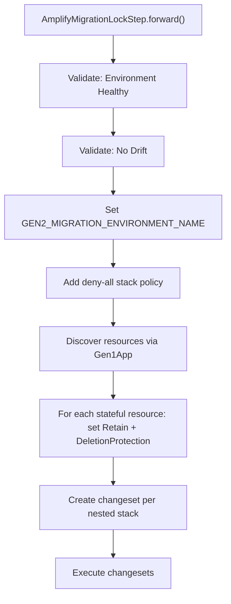

# lock

The lock subcommand prevents accidental modifications to the Gen1 environment during migration. It applies a deny-all stack policy, sets a migration environment variable on the Amplify app, and enables deletion protection on stateful resources.

## Key Responsibilities

- Validates the environment is healthy (deployment status check) and has no drift before locking
- Sets `GEN2_MIGRATION_ENVIRONMENT_NAME` environment variable on the Amplify app to track the active migration
- Applies a deny-all stack policy (`Deny Update:* on *`) to the Gen1 root stack
- Sets `DeletionPolicy: Retain` and `UpdateReplacePolicy: Retain` on all stateful resources
- Enables `DeletionProtectionEnabled` on DynamoDB tables
- Discovers AppSync model tables via the GraphQL API ID and applies retention to their nested stacks

## Architecture



## Validations

| Validation          | Description                                                                                        |
| ------------------- | -------------------------------------------------------------------------------------------------- |
| Environment Healthy | Verifies the Gen1 stack is in a deployable state via `validateDeploymentStatus()`                  |
| Drift               | Runs template drift detection to ensure no out-of-band changes exist before locking                |
| Stack Unchanged     | Per nested stack — validates the changeset only contains DeletionPolicy/DeletionProtection changes |

## Rollback

The lock rollback:

1. Validates drift — filters out expected DeletionPolicy changes from the lock step and only blocks rollback if real drift exists
2. Removes the `GEN2_MIGRATION_ENVIRONMENT_NAME` environment variable from the Amplify app
3. Removes the deny-all statement from the stack policy (restores allow-all if no other statements remain)

The rollback does NOT revert DeletionPolicy/DeletionProtection changes on resources — this is intentional to preserve data safety.

### Drift Filtering for Rollback

The `validateLockRollbackDrift()` method uses `detectTemplateDrift()` and filters results through `isExpectedLockDrift()`:

- Direct `DeletionPolicy` changes (Modify with Scope `['DeletionPolicy']`) are expected
- Cascading IAM Policy changes caused by DynamoDB table attribute re-evaluations are expected
- Any other changes indicate real drift and block the rollback

## Resource Discovery

The lock step discovers resources via `Gen1App.discover()` and handles them by category:

| Resource Key                   | Action                                                                   |
| ------------------------------ | ------------------------------------------------------------------------ |
| `api:AppSync`                  | Finds model DynamoDB tables via GraphQL API ID, retains each table stack |
| `auth:Cognito`                 | Retains the auth nested stack                                            |
| `auth:Cognito-UserPool-Groups` | Retains the user pool groups nested stack                                |
| `storage:S3`                   | Retains the storage nested stack                                         |
| `storage:DynamoDB`             | Retains the storage nested stack                                         |
| `analytics:Kinesis`            | Retains the analytics nested stack                                       |
| `api:API Gateway`              | Skipped (stateless)                                                      |
| `geo:*`                        | Skipped (stateless)                                                      |
| `function:Lambda`              | Skipped (stateless)                                                      |

## Changeset Validation

For each nested stack, the lock step:

1. Fetches the current template via `Cfn.fetchTemplate()`
2. Modifies it to add `DeletionPolicy: Retain`, `UpdateReplacePolicy: Retain`, and `DeletionProtectionEnabled: true`
3. Creates a changeset to preview the changes
4. Validates the changeset only contains expected modifications (DeletionPolicy, UpdateReplacePolicy, DeletionProtectionEnabled)
5. If validation passes, executes the changeset

## CLI

```bash
amplify gen2-migration lock [options]
```

### Options

| Option               | Description                           |
| -------------------- | ------------------------------------- |
| `--skip-validations` | Skip drift and health validations     |
| `--validations-only` | Run validations without executing     |
| `--rollback`         | Remove the lock                       |
| `--no-rollback`      | Disable automatic rollback on failure |

## AI Development Notes

- The lock step uses `RESOURCES_TO_RETAIN` (from `_common/resource-types.ts`) to determine which CloudFormation resource types get `DeletionPolicy: Retain`.
- DynamoDB tables get both `DeletionPolicy: Retain` AND `DeletionProtectionEnabled: true` — the property-level protection is an additional safety net.
- The `dynamoTableNames()` method discovers AppSync model tables by listing all DynamoDB tables and filtering by the GraphQL API ID and environment name.
- The changeset validation (`validateRetainChangeset`) is strict — any change that isn't a DeletionPolicy/UpdateReplacePolicy/DeletionProtectionEnabled modification causes validation failure.
- The lock step imports `detectTemplateDrift` from the `drift` command module for rollback validation.
