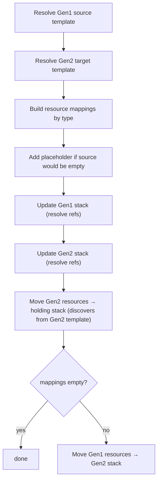
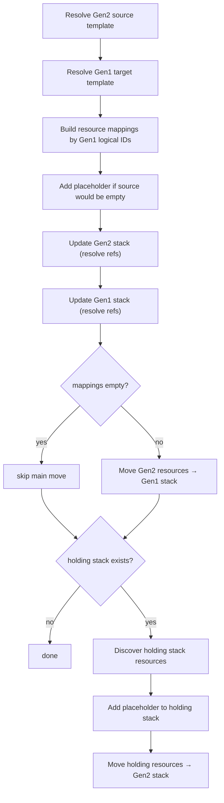

# refactor

The refactor module moves stateful CloudFormation resources between Amplify Gen1 and Gen2 stacks using the CloudFormation StackRefactor API. Resources are transferred atomically without recreation, preserving data (user accounts, stored files, etc.) during migration.

## Architecture

The module follows a plan-then-execute model. Each category (auth, storage, analytics) gets a `CategoryRefactorer` that produces a list of `AmplifyMigrationOperation`s during planning. Operations are collected into a `Plan`, presented to the user for confirmation, then executed sequentially.

```
AmplifyMigrationRefactorStep (refactor.ts)
  ├── discovers resources via Gen1App
  ├── creates shared Cfn instance + StackFacade per root stack
  └── instantiates CategoryRefactorers per discovered resource
        │
        ├── ForwardCategoryRefactorer (Gen1 → Gen2)
        │     ├── auth/auth-cognito-forward.ts
        │     ├── auth/auth-user-pool-groups-forward.ts
        │     ├── storage/storage-forward.ts
        │     ├── storage/storage-dynamo-forward.ts
        │     └── analytics/analytics-forward.ts
        │
        └── RollbackCategoryRefactorer (Gen2 → Gen1)
              ├── auth/auth-cognito-rollback.ts
              ├── auth/auth-user-pool-groups-rollback.ts
              ├── storage/storage-rollback.ts
              ├── storage/storage-dynamo-rollback.ts
              └── analytics/analytics-rollback.ts
```

### Key Components

| Component                      | File                                       | Purpose                                                                                                                                                                                                                                                                                                                             |
| ------------------------------ | ------------------------------------------ | ----------------------------------------------------------------------------------------------------------------------------------------------------------------------------------------------------------------------------------------------------------------------------------------------------------------------------------- |
| `AmplifyMigrationRefactorStep` | `refactor.ts`                              | Orchestrator. Creates infrastructure, discovers resources, instantiates refactorers, builds the plan. After building the plan, appends a final operation that prints a post-refactor warning linking to the migration guide's post-refactor manual steps (S3 bucket name sync, DynamoDB table name sync, Kinesis stream name sync). |
| `CategoryRefactorer`           | `workflow/category-refactorer.ts`          | Abstract base class. Implements the shared plan() workflow: resolve → build mappings → update → beforeMove → move → afterMove.                                                                                                                                                                                                      |
| `ForwardCategoryRefactorer`    | `workflow/forward-category-refactorer.ts`  | Forward direction base. Resolves Gen1 source and Gen2 target templates. Moves Gen2 resources to a holding stack before the main refactor.                                                                                                                                                                                           |
| `RollbackCategoryRefactorer`   | `workflow/rollback-category-refactorer.ts` | Rollback direction base. Resolves Gen2 source and Gen1 target. Restores holding stack resources back to Gen2 after the main refactor.                                                                                                                                                                                               |
| `Cfn`                          | `_common/cfn.ts`                           | Shared CloudFormation client wrapper. Handles update, refactor, changeset, delete, describe, and template fetch operations. Tracks update claims to prevent duplicate stack updates across refactorers. Writes operation snapshots with hashed filenames to avoid Windows MAX_PATH limits.                                          |
| `StackFacade`                  | `stack-facade.ts`                          | Read-only facade over a CloudFormation stack hierarchy. Fetches nested stacks, templates, stack descriptions, and resources.                                                                                                                                                                                                        |
| Resolvers                      | `resolvers/`                               | Pure functions that transform CloudFormation templates: parameter substitution, output resolution, dependency stripping, condition evaluation.                                                                                                                                                                                      |
| `oauth-values-retriever`       | `oauth-values-retriever.ts`                | Retrieves OAuth provider credentials from Cognito and SSM for auth migrations with social login.                                                                                                                                                                                                                                    |

## Workflow

### Forward (Gen1 → Gen2)



The forward workflow resolves both stack templates to replace `Ref`/`Fn::GetAtt` with literal values, then pushes those resolved templates via UpdateStack. This ensures no dangling references when resources are later removed. `beforeMove` independently fetches the Gen2 template and discovers which resources to move to the holding stack (preserving test data). The main move then transfers Gen1 resources into the Gen2 stack.

### Rollback (Gen2 → Gen1)



The rollback workflow mirrors forward but in reverse. It resolves and updates both stacks (necessary if the Gen2 app was redeployed after forward, which introduces fresh `Fn::GetAtt` references). After moving resources back to Gen1, `afterMove` independently fetches the holding stack template and discovers which resources to restore back to Gen2. Once the last refactorer has moved its resources out of the holding stack, the rollback deletes the holding stack (it contains only the placeholder resource at that point).

### plan() Lifecycle

Each `CategoryRefactorer.plan()` follows this sequence:

1. **Discover stacks**: `fetchSourceStackId()` / `fetchDestStackId()` find the nested stacks by logical ID prefix.
2. **Validate stack status**: Two no-op operations are created (one per stack) whose `validate()` checks the stack is in `CREATE_COMPLETE` or `UPDATE_COMPLETE` via `Cfn.describeStack()`. These are prepended to the operations array.
3. **Resolve templates**: `resolveSource()` / `resolveTarget()` fetch templates from CloudFormation and run the resolver chain to replace intrinsic functions with actual values.
4. **Build mappings**: `buildResourceMappings()` matches source resources to target resources by type (forward) or by known Gen1 logical IDs (rollback). Returns `ResourceMapping[]` (SDK type).
5. **Add placeholder**: If removing all mapped resources would leave the source stack empty, a `WaitConditionHandle` placeholder is added to the resolved template.
6. **Update stacks**: `updateSource()` / `updateTarget()` push the resolved templates to CloudFormation via `Cfn.update()`. This replaces `Ref`/`Fn::GetAtt` with literal values so resources can be safely removed later. Dedup: if a stack was already claimed by a previous refactorer, the update is skipped.
7. **Before move** (forward only): Independently fetches the Gen2 template, discovers matching resources, and moves them to a temporary holding stack via `Cfn.refactor()`.
8. **Move**: The main refactor — moves resources from source to target via `Cfn.refactor()`. Skipped if mappings are empty.
9. **After move** (rollback only): Independently fetches the holding stack template, discovers matching resources, and restores them back to Gen2.

### Resource Mapping

Resource mappings determine which source resources move to which target logical IDs. The mapping strategy differs between forward and rollback.

**Forward** uses type-based matching. For each source resource, it scans the target stack for resources of the same CloudFormation type. Each target can only be matched once (tracked via a `usedTargetIds` set to prevent two source resources from claiming the same target).

Happy paths:

- One source resource of type X, one target resource of type X → maps 1:1
- Multiple source resources of different types, each with one target match → maps independently
- Source has no resources of the declared types → empty mappings, move is skipped

Unhappy paths:

- Source resource has zero matching targets → throws "has no corresponding target resource"
- Source resource has multiple matching targets → throws "has multiple corresponding target resources"
- Two source resources of the same type, one target → first claims the target, second throws "has no corresponding target resource"

Categories with multiple resources of the same type (e.g., auth with two `UserPoolClient` resources) must override `match()` to disambiguate. Auth Cognito uses the logical ID pattern (Web vs Native), and UserPoolGroups matches by `GroupName` property.

**Rollback** uses `targetLogicalId()` — each subclass maps Gen2 resource types to known Gen1 logical IDs (e.g., `AWS::Cognito::UserPool` → `UserPool`). Resources whose Gen1 logical ID already exists in the target stack are skipped (they were never moved, or were already rolled back).

### Template Resolution

Templates are resolved to replace CloudFormation intrinsic functions with literal values. This is necessary because the StackRefactor API submits new template bodies for both stacks, and any `Ref`/`Fn::GetAtt` pointing to a resource being moved would become a dangling reference.

**Forward (Gen1 source):** parameters → outputs → dependencies → conditions
**Forward (Gen2 target):** parameters → dependencies → outputs
**Rollback (Gen2 source):** parameters → outputs → dependencies
**Rollback (Gen1 target):** no resolution (template used as-is)

The dependency resolver unconditionally strips all `DependsOn` from templates. `DependsOn` only controls deployment ordering, which is irrelevant during refactor since all resources already exist.

### Deferred Template Fetching

The `RefactorBlueprint` carries only mappings and stack IDs — no templates. Templates are fetched fresh at execution time inside each operation's `execute()` closure. This ensures that when multiple refactorers target the same stack (e.g., auth Cognito and auth UserPoolGroups both target the Gen2 auth stack), the second refactorer sees the stack as it actually is after the first refactorer has already modified it.

`updateSource`/`updateTarget` are the exception — they use plan-time resolved templates because they run before any moves and the templates are still fresh.

### Update Deduplication

When two refactorers share a stack (e.g., both auth refactorers target the same Gen2 auth stack), only the first one should update it. The shared `Cfn` instance tracks "update claims" — the first refactorer claims the stack at plan time, and the second sees it's already claimed and returns no update operations.

`Cfn.update()` also tracks completed updates so that the `isUpdateClaimed()` check reflects both plan-time claims and execution-time completions.

### Cfn.refactor() Internals

`Cfn.refactor()` accepts `ResourceMapping[]` and handles all template manipulation internally:

1. Checks if the target stack exists (only holding stacks may be absent — they're created by `EnableStackCreation`).
2. Fetches both stack templates (or uses an empty template for absent holding stacks).
3. Moves resources between templates based on the mappings.
4. Submits the refactor via `CreateStackRefactor` + `ExecuteStackRefactor`.
5. Waits for both stacks to reach their final state (update or create complete).

## Holding Stack

During forward migration, Gen2 resources are moved to a temporary holding stack before Gen1 resources are moved into the Gen2 stack. This preserves Gen2 test data and enables rollback.

**Naming:** `{gen2CategoryStackPrefix}-{cfnHashSuffix}-holding` (truncated to 128 chars).

**Forward:** Gen2 resources → holding stack → Gen1 resources → Gen2 stack.
**Rollback:** Gen2 resources → Gen1 stack → holding resources → Gen2 stack → delete holding stack.

## Supported Categories

| Category               | Resource Types                                                                     | Forward Refactorer                    | Rollback Refactorer                    |
| ---------------------- | ---------------------------------------------------------------------------------- | ------------------------------------- | -------------------------------------- |
| auth (Cognito)         | UserPool, UserPoolClient, IdentityPool, IdentityPoolRoleAttachment, UserPoolDomain | `AuthCognitoForwardRefactorer`        | `AuthCognitoRollbackRefactorer`        |
| auth (UserPool Groups) | UserPoolGroup                                                                      | `AuthUserPoolGroupsForwardRefactorer` | `AuthUserPoolGroupsRollbackRefactorer` |
| storage (S3)           | S3::Bucket                                                                         | `StorageS3ForwardRefactorer`          | `StorageS3RollbackRefactorer`          |
| storage (DynamoDB)     | DynamoDB::Table                                                                    | `StorageDynamoForwardRefactorer`      | `StorageDynamoRollbackRefactorer`      |
| analytics (Kinesis)    | Kinesis::Stream                                                                    | `AnalyticsKinesisForwardRefactorer`   | `AnalyticsKinesisRollbackRefactorer`   |

Auth Cognito and UserPoolGroups are separate refactorers because they come from different Gen1 stacks but map to the same Gen2 auth stack.

## Stateless Resources (No Refactor)

The following resources are stateless and do not require refactoring — they are recreated in the Gen2 stack by the generate step:

| Category | Service            | Reason                                         |
| -------- | ------------------ | ---------------------------------------------- |
| function | Lambda             | Stateless — code is redeployed                 |
| api      | AppSync            | Stateless — schema is redeployed               |
| api      | API Gateway        | Stateless — API is redeployed                  |
| geo      | Map                | Stateless — recreated in Gen2                  |
| geo      | PlaceIndex         | Stateless — recreated in Gen2                  |
| geo      | GeofenceCollection | Unsupported for refactor (assessment marks it) |

## Validations

Before execution, the `Plan` runs a validation pass over all operations. Each operation can optionally return a validation check that runs before the user is asked to confirm.

| Validation             | When                         | What it checks                                                                                                                                                                                                                                                                                                                                                                                                                               |
| ---------------------- | ---------------------------- | -------------------------------------------------------------------------------------------------------------------------------------------------------------------------------------------------------------------------------------------------------------------------------------------------------------------------------------------------------------------------------------------------------------------------------------------- |
| Lock status            | Before all operations        | Fetches the Gen1 root stack's CloudFormation stack policy via `GetStackPolicy` and verifies it matches the expected deny-all policy (`Deny Update:* on *`). This confirms the stack was locked by `amplify gen2-migration lock`, which prevents accidental `amplify push` operations from modifying the Gen1 stack during migration. Fails if no policy exists or if the policy doesn't match exactly.                                       |
| Stack status           | Per category (source + dest) | Describes both the source and destination stacks via `Cfn.describeStack()` and verifies each is in `CREATE_COMPLETE` or `UPDATE_COMPLETE`. One validation operation per stack, prepended to the category's operations array. Prevents refactor operations from running against stacks that are mid-update, rolled back, or otherwise in a transient state.                                                                                   |
| Source stack changeset | Per updateSource operation   | Creates a CloudFormation changeset with the resolved template and checks that it produces no unexpected changes. The resolved template should only differ from the deployed template in that intrinsic functions (`Ref`, `Fn::GetAtt`) are replaced with literal values — no resource additions, deletions, or property changes should appear. A non-empty changeset is flagged as a validation failure and the report is shown to the user. |
| Target stack changeset | Per updateTarget operation   | Same as source — verifies the resolved target template introduces no unexpected changes.                                                                                                                                                                                                                                                                                                                                                     |

Validations that fail are reported in a summary table. The user can choose to proceed despite failures, but the report gives visibility into what will change.

## CLI

```bash
amplify gen2-migration refactor --to <gen2-stack-name>
```

## Dependencies

| Package                                     | Purpose                                                                       |
| ------------------------------------------- | ----------------------------------------------------------------------------- |
| `@aws-sdk/client-cloudformation`            | Stack operations: describe, update, refactor, changeset, delete, get template |
| `@aws-sdk/client-ssm`                       | Sign In With Apple private key retrieval                                      |
| `@aws-sdk/client-cognito-identity-provider` | OAuth provider credential retrieval                                           |
| `@aws-sdk/client-sts`                       | Account ID for ARN construction                                               |
