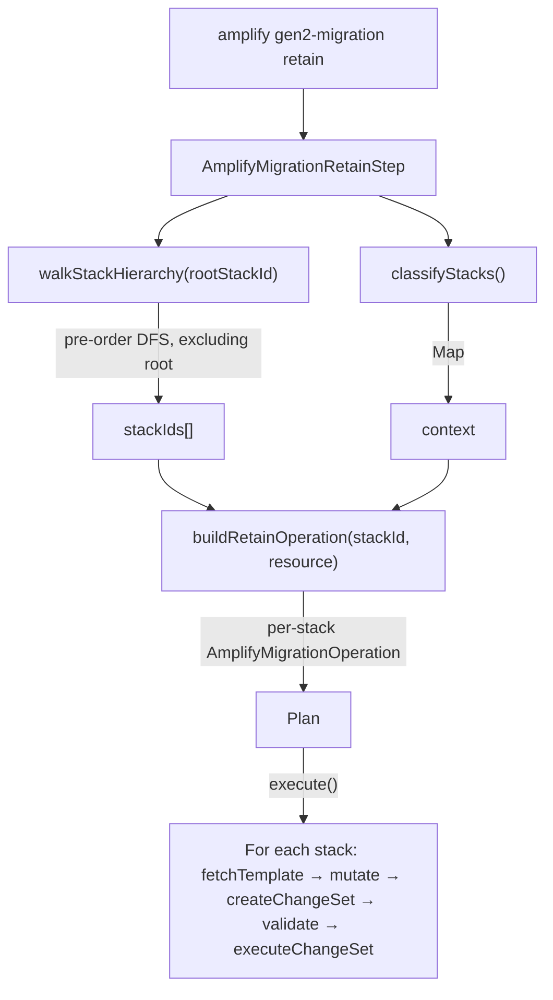

# retain

The retain subcommand applies `DeletionPolicy: Retain` and `UpdateReplacePolicy: Retain` to every resource in every Gen1 CloudFormation stack below the root. Once applied, the user can manually delete the Gen1 root stack and every underlying AWS resource (DynamoDB tables, S3 buckets, Cognito pools, AppSync APIs, Lambdas) survives as an orphan.

## Key Responsibilities

- Walks the Gen1 stack hierarchy pre-order (parent before children) starting from the root's children; root is excluded.
- For each stack, fetches the template lazily at execute time (not at plan time) and skips the CFN round-trip entirely when every resource already has retain.
- Applies retain to every resource **except** `AWS::CloudFormation::Stack` references. Leaving nested-stack references untouched keeps the parent changeset strictly additive on non-stack attributes and avoids forcing CFN to rewrite child `Properties`.
- Creates a CloudFormation changeset per stack and validates it against an allow list before executing.
- Rollback is not supported (`NotImplementedFault`). To undo, edit the CloudFormation templates directly.

## Architecture

### `AmplifyMigrationRetainStep`

[`src/commands/gen2-migration/retain.ts`](../../../../packages/amplify-cli/src/commands/gen2-migration/retain.ts)

Implements the standard step lifecycle. `forward()` builds a `Plan` of per-stack operations. `rollback()` throws `NotImplementedFault`.

### `walkStackHierarchy`

Recursive pre-order DFS over `AWS::CloudFormation::Stack` resource entries. Returns every stack in the tree except the root. Pre-order is required so parents are processed before children — any parent update triggers CFN's Automatic/Dynamic re-evaluation of nested stack references, which is benign when no `Properties` actually changed but clobbers children if retain is applied in a different order.

### `classifyStacks`

Builds `Map<stackId, DiscoveredResource>` that associates each nested stack with its Amplify `DiscoveredResource`. Used purely for UX: `Plan.describe` groups operations under `Resource: <category>/<name> (<service>)` headers, and the execute-time spinner carries matching labels.

For AppSync, the api-stack and every one of its nested children (per-model stacks, ConnectionStack, FunctionDirectiveStack, CustomResourcesjson) share the same api resource.

Stacks not classified fall through to the default `Project` group with stack-name-only labels.

### `buildRetainOperation`

Returns one `AmplifyMigrationOperation` per stack. The operation's `execute()` is lazy — it fetches the template, filters to non-`AWS::CloudFormation::Stack` resources, mutates their `DeletionPolicy` / `UpdateReplacePolicy` to `Retain`, creates the changeset, validates it via `isAllowedRetainChangeset`, and executes it.

Idempotent on reruns: if every target resource already has retain, the whole CFN round-trip is skipped. A second short-circuit handles the case where CFN's own "no changes" detection elides an edit (`Custom::*` resources with empty Properties — see [cloudformation-coverage-roadmap#1543](https://github.com/aws-cloudformation/cloudformation-coverage-roadmap/issues/1543)).

### `isAllowedRetainChangeset`

Allow-lists a retain-only changeset. Accepts two kinds of changes:

- Direct `DeletionPolicy` or `UpdateReplacePolicy` edits targeting `Retain`.
- CFN's own no-op Automatic/Dynamic re-evaluations on `AWS::CloudFormation::Stack` references, emitted on every parent update. These are bookkeeping — they don't trigger child reconciliation because no `Properties` value actually changed.

Any other change (Properties edits on non-stack resources, Add, Remove, Replacement=True) throws `MigrationError`.

## Design Notes

### Why skip the root stack

Updating root post-refactor risks cascading TemplateURL reconciliation through the entire tree. The root is left alone; the user manually deletes it after retain completes, and CFN cascades through the already-retained children.

### Why skip `AWS::CloudFormation::Stack` entries

Adding retain to a nested stack reference would be a no-op for child protection — the child's own retain state is what matters when the cascade delete hits it. Leaving the reference entry untouched keeps the parent changeset narrow (only non-stack attributes change) and keeps Plan output readable.

### Why lazy over eager

**Eager:** create all N changesets up front during `forward()` / plan time, then execute them sequentially. The problem — when any parent's changeset is executed, every child stack's pre-created changeset goes `OBSOLETE` because CFN marks pending changesets stale on any stack update. You end up re-creating most of the changesets anyway.

**Lazy:** defer changeset creation until each operation's `execute()` runs. Each stack's round-trip is `fetchTemplate → createChangeSet → executeChangeSet`, back-to-back, with no gap for the changeset to go stale. The template and parameters reflect the current deployed state at the moment we create the changeset.

Lazy wins because it avoids the OBSOLETE churn and keeps each operation self-contained.

### Why pre-order

Parent update must land before child update. If a child is retained first and the parent is updated next, CFN emits an Automatic/Dynamic re-evaluation on that child's reference. The re-evaluation is structurally benign (Target.Attribute=Properties, no actual value diff) but ordering matters for operator confidence — pre-order ensures the changeset inventory at each step is understandable.

## AI Development Notes

- The step runs after `lock`, `generate`, `refactor`, and user-side Gen2 sandbox validation in the e2e flow. At that point Gen1 stacks have drifted from their S3 `TemplateURL` (refactor moved resources without re-uploading child templates). Updating intermediates or root post-refactor is unsafe — the "skip `AWS::CloudFormation::Stack` entries in parent templates" rule is what makes updating intermediates safe here.
- Resources gated by a false `Condition` (for example the AppSync-generated `CustomResourcesjson` stack's `EmptyResource`, which has `Condition: AlwaysFalse`) are never deployed. A retain-only edit on such a resource produces an empty changeset — CFN returns "didn't contain changes" and the `!changeset` branch treats it as a no-op. The resource doesn't actually exist in the running stack, so there's nothing to retain. Purely cosmetic.
- To undo retain, run the retain templates through CloudFormation manually without the `DeletionPolicy`/`UpdateReplacePolicy` attributes. The step itself has no rollback path.
- When adding a new resource type to `KNOWN_RESOURCE_KEYS`, update `classifyStacks` — the exhaustive switch will force the compiler to flag it.
