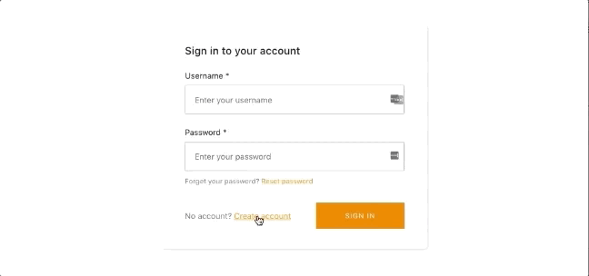
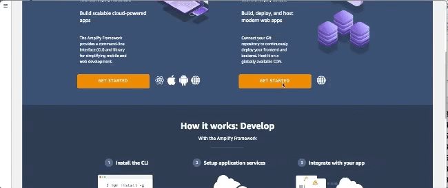

# Create-react-app with AWS Amplify Auth 

This auth starter implements withAuthenticator HOC to provide a basic authentication flow for signing up signing in users as well as protected client side routing using AWS Amplify. Auth features: User sign up, User sign in, Multi-factor Authentication, User sign-out.

[View Demo](https://master.d2ka7y7551sk8n.amplifyapp.com/)



## Getting started

1. <a class="github-button" href="https://github.com/aws-samples/create-react-app-auth-amplify/fork" data-icon="octicon-repo-forked" aria-label="Fork repo">Fork repo</a>


2. Clone locally 
```
git clone git@github.com:<your-username>/create-react-app-auth-amplify.git
```

2. Change into the new directory

```sh
cd create-react-app-auth-amplify
```

3. Install dependencies

```sh
yarn
# or
npm install
```

4. Install & configure the AWS Amplify CLI.

```sh
npm install -g @aws-amplify/cli

amplify configure
```

> To see a video of how to configure the CLI, click [here](https://www.youtube.com/watch?v=fWbM5DLh25U)

5. Create a new AWS Amplify Project

```
amplify init
```

> Here, walk through the following steps. At the end of the `init` command a project will be initialized in the cloud for you.

- Enter a name for the environment __master__
- Choose your default editor: __Sublime Text__ (or your editor of choice)
- Do you want to use an AWS profile? __y__ (choose default)

6. Run `amplify status`. The status should reflect as below. This indicates that an `Auth` resource is configured and ready to be created.

```
| Category | Resource name   | Operation | Provider plugin   |
| -------- | --------------- | --------- | ----------------- |
| Auth     | cognito2140b2f3 | Create    | awscloudformation |
```

6. Push the updated project configuration to AWS. It will deploy a CloudFormation template that has an Amazon Cognito resource that enables user authentication.

```sh
amplify push
```

7. Then you can run it by:
```sh
npm start
```

## Hosting with the AWS Amplify Console

The AWS Amplify Console provides continuous deployment and hosting for modern web apps (single page apps and static site generators). Continuous deployment allows developers to deploy updates to their frontend and backend on every code commit to their Git repository. If the build succeeds, the app is deployed and hosted on a global CDN with an *amplifyapp.com* domain. The Amplify Console offers globally available CDNs, easy custom domain setup, feature branch deployments, and password protection.

1. Push your code to Git.
1. Login to the [AWS Amplify Console](https://console.aws.amazon.com/amplify/home) and choose **Connect app**
1. Connect repository and select `master` branch.
1. Accept the default build settings.
1. Give the Amplify Console permission to deploy backend resources with your frontend. This will allow the Console to detect changes to your backend on every code commit. If you do not have a service role, follow the prompts to create one.
1. Review your changes and then choose **Save and deploy**. You app will now be available in a few minutes at `https://master.unique-id.amplifyapp.com`.

The Amplify Console will first check for changes to your backend, and then build and deploy your frontend to a managed hosting environment. You can now continuously deploy changes to your frontend or backend and Amplify will automatically deploy those changes. Learn how to customize the sign-in UI [here](https://aws-amplify.github.io/docs/js/authentication#customize-ui).

<!--  -->


